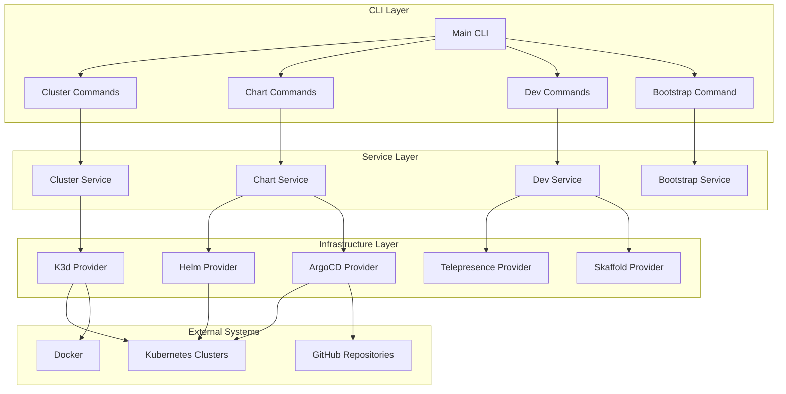
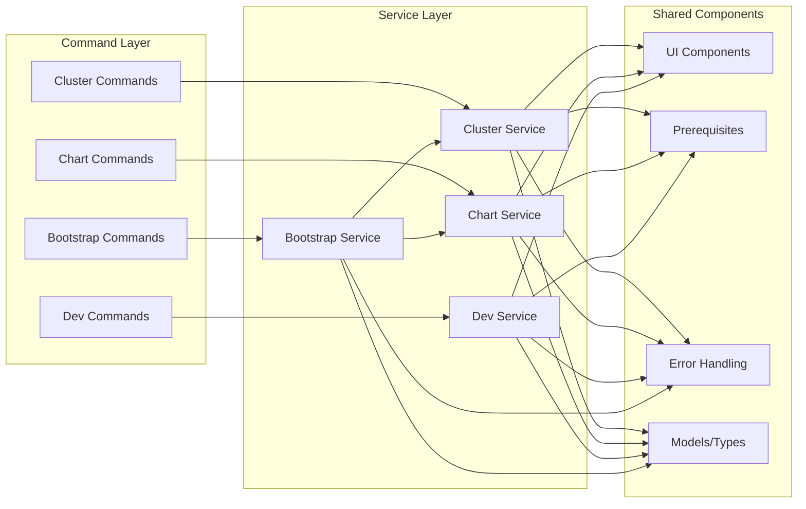
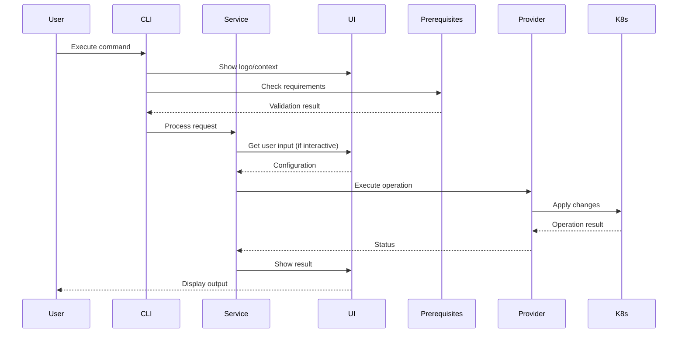

# openframe-cli Module Documentation

# OpenFrame CLI Architecture Documentation

## Overview

OpenFrame CLI is a modern command-line tool for managing OpenFrame Kubernetes clusters and development workflows. It provides a comprehensive set of commands for cluster lifecycle management, chart installation (ArgoCD), and developer tools including traffic interception and scaffolding.

## Architecture



## Core Components

| Component | Package | Responsibilities |
|-----------|---------|------------------|
| **Cluster Commands** | `cmd/cluster/` | CLI interface for cluster operations (create, delete, list, status, cleanup) |
| **Chart Commands** | `cmd/chart/` | CLI interface for ArgoCD and Helm chart management |
| **Dev Commands** | `cmd/dev/` | CLI interface for development tools (intercept, scaffold) |
| **Bootstrap Commands** | `cmd/bootstrap/` | CLI interface for complete OpenFrame environment setup |
| **Cluster Service** | `internal/cluster/` | Business logic for K3d cluster lifecycle management |
| **Chart Service** | `internal/chart/` | Business logic for ArgoCD and chart installation |
| **Dev Service** | `internal/dev/` | Business logic for development workflows |
| **Bootstrap Service** | `internal/bootstrap/` | Orchestrates cluster creation and chart installation |
| **UI Components** | `internal/*/ui/` | User interface and interaction logic |
| **Prerequisites** | `internal/*/prerequisites/` | System requirements validation and tool installation |

## Component Relationships



## Data Flow



## Key Files

| File | Purpose |
|------|---------|
| **cmd/cluster/cluster.go** | Main cluster command definition and subcommand registration |
| **cmd/cluster/create.go** | Cluster creation command with interactive wizard |
| **cmd/bootstrap/bootstrap.go** | Complete OpenFrame environment setup command |
| **cmd/chart/install.go** | ArgoCD and chart installation command |
| **cmd/dev/dev.go** | Development tools command group |
| **internal/cluster/services/** | Core cluster management business logic |
| **internal/chart/services/** | Chart installation and ArgoCD management logic |
| **internal/bootstrap/** | Bootstrap orchestration service |
| **internal/shared/ui/** | Shared UI components and logo display |
| **internal/shared/errors/** | Global error handling utilities |

## Dependencies

The OpenFrame CLI integrates with several external tools and systems:

- **K3d**: For local Kubernetes cluster management
- **Helm**: For chart installation and package management
- **ArgoCD**: For GitOps-based application deployment
- **Telepresence**: For traffic interception during development
- **Skaffold**: For continuous development workflows
- **Docker**: For container management
- **kubectl**: For Kubernetes cluster interaction

## CLI Commands

### Cluster Management
```bash
openframe cluster create [NAME]        # Create new K3d cluster
openframe cluster delete [NAME]        # Delete cluster
openframe cluster list                 # List all clusters
openframe cluster status [NAME]        # Show cluster status
openframe cluster cleanup [NAME]       # Clean up cluster resources
```

### Chart Management
```bash
openframe chart install [CLUSTER]      # Install ArgoCD and charts
```

### Development Tools
```bash
openframe dev intercept [SERVICE]      # Intercept service traffic
openframe dev scaffold [CLUSTER]       # Run Skaffold development
```

### Bootstrap
```bash
openframe bootstrap [CLUSTER]          # Complete OpenFrame setup
```

### Global Options
- `--verbose, -v`: Enable detailed logging
- `--force`: Skip confirmations
- `--dry-run`: Show what would be done without executing
- `--non-interactive`: Skip interactive prompts
- `--deployment-mode`: Specify deployment mode (oss-tenant, saas-tenant, saas-shared)
