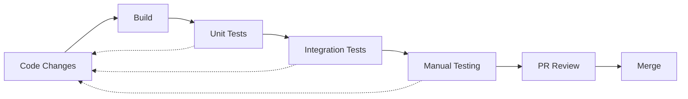
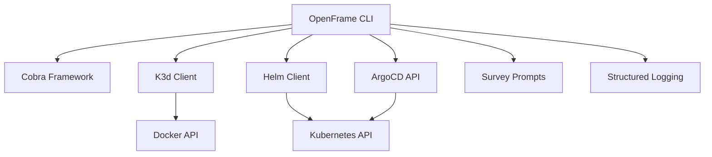

# Development Documentation

Welcome to the OpenFrame CLI development documentation. This section provides comprehensive guidance for developers working on the OpenFrame CLI project, contributing to the codebase, and building applications using the OpenFrame ecosystem.

## 🎯 Quick Navigation

### For New Contributors
- **[Environment Setup](./setup/environment.md)** - Configure your development environment
- **[Local Development](./setup/local-development.md)** - Clone, build, and run locally  
- **[Contributing Guidelines](./contributing/guidelines.md)** - Code style and contribution process

### For Understanding the System
- **[Architecture Overview](./architecture/overview.md)** - High-level system design and components
- **[Testing Overview](./testing/overview.md)** - Test structure and running tests

## 📚 Documentation Sections

### Setup & Environment
Get your development environment ready for OpenFrame CLI development.

| Document | Purpose | Audience |
|----------|---------|----------|
| [Environment Setup](./setup/environment.md) | IDE configuration, tools, extensions | New contributors |
| [Local Development](./setup/local-development.md) | Clone, build, debug OpenFrame CLI | Active developers |

### Architecture & Design  
Understand how OpenFrame CLI is built and why design decisions were made.

| Document | Purpose | Audience |
|----------|---------|----------|
| [Architecture Overview](./architecture/overview.md) | System components, data flow, design patterns | All developers |

### Testing & Quality
Ensure code quality and reliability through comprehensive testing.

| Document | Purpose | Audience |
|----------|---------|----------|
| [Testing Overview](./testing/overview.md) | Test types, running tests, writing new tests | Contributors |

### Contributing & Collaboration
Guidelines for contributing to the OpenFrame CLI project.

| Document | Purpose | Audience |
|----------|---------|----------|
| [Contributing Guidelines](./contributing/guidelines.md) | Code style, PR process, review checklist | Contributors |

## 🚀 Getting Started with Development

### Prerequisites for Development

Before diving into OpenFrame CLI development, ensure you have:

```bash
# Core development tools
go version          # Go 1.19+ required
git --version       # Git for version control
make --version      # Make for build automation

# OpenFrame CLI dependencies (for testing)
docker --version    # Docker for integration tests
k3d version         # K3d for cluster testing
kubectl version     # kubectl for Kubernetes interaction
```

### Quick Development Setup

```bash
# 1. Clone the repository
git clone https://github.com/flamingo-stack/openframe-cli.git
cd openframe-cli

# 2. Install dependencies
go mod download

# 3. Build the project
make build

# 4. Run tests
make test

# 5. Run locally
./bin/openframe --help
```

## 🏗️ Project Structure Overview

```
openframe-cli/
├── cmd/                    # CLI command definitions (Cobra)
│   ├── bootstrap/          # Bootstrap command
│   ├── cluster/            # Cluster management commands  
│   ├── chart/              # Chart installation commands
│   └── dev/                # Development workflow commands
├── internal/               # Internal packages (business logic)
│   ├── bootstrap/          # Bootstrap service implementation
│   ├── cluster/            # Cluster management services
│   ├── chart/              # Chart management services
│   ├── dev/                # Development tools integration
│   └── shared/             # Shared utilities and UI components
├── docs/                   # Documentation
├── scripts/                # Build and automation scripts
├── tests/                  # Integration and e2e tests
└── Makefile               # Build automation
```

## 🛠️ Development Workflows

### Core Development Loop



### Common Development Tasks

| Task | Command | Purpose |
|------|---------|---------|
| **Build** | `make build` | Compile OpenFrame CLI binary |
| **Test** | `make test` | Run unit and integration tests |
| **Lint** | `make lint` | Check code quality and style |
| **Format** | `make format` | Auto-format Go code |
| **Clean** | `make clean` | Remove build artifacts |

### Testing Your Changes

```bash
# Run unit tests
go test ./...

# Run integration tests (requires Docker)
make test-integration

# Test specific command manually
./bin/openframe cluster create test-cluster
./bin/openframe cluster delete test-cluster
```

## 📖 Key Concepts for Developers

### CLI Architecture Layers

| Layer | Purpose | Examples |
|-------|---------|----------|
| **CLI Layer** | Command definitions, flag parsing | `cmd/cluster/create.go` |
| **Service Layer** | Business logic, orchestration | `internal/cluster/services/` |
| **External Integration** | Tool integration, API calls | K3d, Helm, ArgoCD clients |

### Go Patterns Used

- **Cobra Framework**: Command-line interface structure
- **Service Pattern**: Business logic separation
- **Interface Abstraction**: Testable external dependencies
- **Error Wrapping**: Contextual error information

### External Dependencies



## 🎯 Focus Areas for Contributors

### High-Impact Areas
- **Command UX**: Improving CLI usability and error messages
- **Integration Testing**: Expanding test coverage for real-world scenarios  
- **Documentation**: Keeping docs current with code changes
- **Performance**: Optimizing startup time and resource usage

### Advanced Topics
- **Plugin Architecture**: Extending OpenFrame CLI with custom commands
- **Multi-Platform Builds**: Supporting additional operating systems
- **CI/CD Integration**: Improving automation and release processes

## 📞 Getting Help

### Development Questions
- **Architecture Questions**: Read [Architecture Overview](./architecture/overview.md)
- **Setup Issues**: Check [Environment Setup](./setup/environment.md)
- **Testing Problems**: Review [Testing Overview](./testing/overview.md)

### Community Support
- **GitHub Issues**: Report bugs and request features
- **Discussions**: Ask questions and share ideas
- **Code Review**: Get feedback on pull requests

## 🎉 Contributing

Ready to contribute? Follow this path:

1. **Read [Contributing Guidelines](./contributing/guidelines.md)** - Understand the process
2. **Set up your environment** with [Environment Setup](./setup/environment.md)
3. **Clone and build** following [Local Development](./setup/local-development.md)
4. **Pick an issue** from GitHub or propose a feature
5. **Write tests** and ensure they pass
6. **Submit a pull request** following the guidelines

---

**Welcome to the OpenFrame CLI development community!** Your contributions help make Kubernetes development more accessible and productive for developers worldwide. 🚀