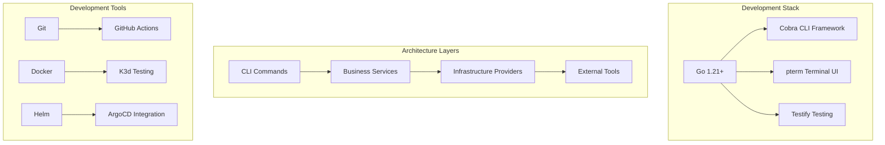

# Development Documentation

Welcome to the OpenFrame CLI development documentation. This section provides comprehensive guides for contributing to, extending, and understanding the internal workings of OpenFrame CLI.

## Quick Navigation

### Setup and Environment
- **[Environment Setup](setup/environment.md)** - IDE, tools, and development environment configuration
- **[Local Development](setup/local-development.md)** - Clone, build, and run OpenFrame CLI locally

### Architecture and Design  
- **[Architecture Overview](architecture/overview.md)** - System design, components, and data flow
- **[Core Components](architecture/components.md)** - Detailed component documentation
- **[Design Patterns](architecture/patterns.md)** - Architectural patterns and principles

### Testing and Quality
- **[Testing Overview](testing/overview.md)** - Test structure, running tests, and writing new tests
- **[Integration Tests](testing/integration.md)** - End-to-end testing strategies
- **[Unit Testing](testing/unit.md)** - Component-level testing practices

### Contributing
- **[Contributing Guidelines](contributing/guidelines.md)** - Code style, PR process, and conventions
- **[Development Workflow](contributing/workflow.md)** - Branch strategy and collaboration
- **[Release Process](contributing/releases.md)** - How releases are created and deployed

## Development Overview

OpenFrame CLI is built with Go and follows modern software engineering practices:



## Key Development Principles

| Principle | Description | Implementation |
|-----------|-------------|----------------|
| **Separation of Concerns** | Clear boundaries between CLI, business logic, and infrastructure | Layered architecture with interfaces |
| **Testability** | All components are unit and integration testable | Dependency injection and mocking |
| **User Experience** | Intuitive CLI with helpful error messages | pterm UI components and validation |
| **Reliability** | Robust error handling and recovery | Comprehensive error types and retry logic |
| **Extensibility** | Easy to add new commands and providers | Plugin-style architecture with interfaces |

## Project Structure

```text
openframe-cli/
├── cmd/                    # CLI command definitions
│   ├── bootstrap/         # Bootstrap command implementation
│   ├── cluster/           # Cluster management commands
│   ├── chart/             # Chart installation commands
│   └── dev/               # Development workflow commands
├── internal/               # Internal packages (not imported externally)
│   ├── bootstrap/         # Bootstrap service logic
│   ├── cluster/           # Cluster management services
│   ├── chart/             # Chart installation services
│   ├── dev/               # Development workflow services
│   └── shared/            # Shared utilities and components
├── tests/                  # Test suites
│   ├── integration/       # Integration tests
│   ├── mocks/             # Test mocks and fixtures
│   └── testutil/          # Test utilities
├── docs/                   # Documentation
├── scripts/                # Build and development scripts
└── deployments/           # Deployment configurations
```

## Getting Started with Development

### 1. Environment Setup
Start with [Environment Setup](setup/environment.md) to configure your development tools:
- Go development environment
- IDE configuration and extensions
- Required development tools
- Code formatting and linting

### 2. Local Development
Follow the [Local Development](setup/local-development.md) guide to:
- Clone and build the project
- Run tests locally
- Debug and troubleshoot
- Hot reload during development

### 3. Understanding Architecture
Read the [Architecture Overview](architecture/overview.md) to understand:
- System design and component relationships
- Data flow and communication patterns
- Key design decisions and trade-offs

### 4. Testing Strategy
Review [Testing Overview](testing/overview.md) for:
- Test organization and structure
- Running different test suites
- Writing effective tests
- Coverage requirements

### 5. Contributing Code
Check [Contributing Guidelines](contributing/guidelines.md) for:
- Code style and conventions
- Pull request process
- Commit message format
- Code review checklist

## Development Workflows

### Feature Development
```bash
# 1. Create feature branch
git checkout -b feature/new-command

# 2. Implement feature
# - Add command in cmd/
# - Add service logic in internal/
# - Write tests

# 3. Test locally
make test
make integration-test

# 4. Submit PR
git push origin feature/new-command
# Create PR via GitHub
```

### Bug Fixes
```bash
# 1. Create bug fix branch
git checkout -b fix/issue-description

# 2. Reproduce issue
make test-integration

# 3. Fix and validate
# - Implement fix
# - Add regression tests
# - Verify fix resolves issue

# 4. Submit PR with issue reference
```

### Testing Changes
```bash
# Unit tests
make test

# Integration tests
make test-integration

# Specific test packages
go test ./internal/cluster/...

# Test coverage
make coverage
```

## Development Tools and Scripts

### Available Make Targets
```bash
# Building
make build              # Build CLI binary
make build-all          # Build for all platforms
make install            # Install locally

# Testing  
make test               # Run unit tests
make test-integration   # Run integration tests
make test-coverage      # Generate coverage report

# Code Quality
make lint               # Run linters
make fmt                # Format code
make vet                # Run go vet

# Development
make dev-deps           # Install development dependencies
make clean              # Clean build artifacts
```

### Development Scripts
```bash
# scripts/dev-setup.sh - Set up development environment
# scripts/test-local.sh - Run comprehensive local tests  
# scripts/build-release.sh - Build release binaries
# scripts/update-deps.sh - Update Go dependencies
```

## Contributing Areas

Looking to contribute? Here are areas where we welcome contributions:

### High Priority
- **New Cloud Providers** - Support for EKS, GKE, AKS
- **Additional Deployment Modes** - Custom deployment configurations
- **Enhanced Testing** - More integration test coverage
- **Documentation** - Examples, tutorials, and guides

### Medium Priority  
- **UI Improvements** - Enhanced terminal experience
- **Performance** - Optimization of cluster operations
- **Monitoring Integration** - Built-in observability tools
- **Plugin System** - Extensible command architecture

### Getting Started Contributions
- **Bug Fixes** - Issues labeled "good first issue"
- **Documentation** - Improve existing docs and examples
- **Tests** - Add test coverage for existing features
- **Examples** - Real-world usage examples and tutorials

## Development Resources

### External Documentation
- **[Go Documentation](https://golang.org/doc/)** - Go language reference
- **[Cobra CLI](https://github.com/spf13/cobra)** - CLI framework documentation
- **[K3d Documentation](https://k3d.io/)** - Lightweight Kubernetes documentation
- **[Helm Documentation](https://helm.sh/docs/)** - Kubernetes package manager
- **[ArgoCD Documentation](https://argo-cd.readthedocs.io/)** - GitOps continuous delivery

### Internal Resources
- **[Code Style Guide](contributing/code-style.md)** - OpenFrame coding standards
- **[API Documentation](../reference/api/)** - Generated API documentation
- **[Troubleshooting Guide](troubleshooting/common-issues.md)** - Development troubleshooting

### Community
- **GitHub Discussions** - Design discussions and questions
- **GitHub Issues** - Bug reports and feature requests  
- **Pull Requests** - Code reviews and collaboration

## Development Philosophy

OpenFrame CLI development follows these core principles:

### User-Centric Design
- **Intuitive Commands**: CLI should be self-explanatory
- **Helpful Errors**: Clear error messages with actionable guidance
- **Progressive Disclosure**: Simple defaults with advanced options

### Engineering Excellence
- **Test-Driven**: Write tests before implementation
- **Documentation**: Code should be self-documenting with good comments
- **Performance**: Optimize for both developer and user experience

### Open Source Values
- **Transparency**: Open development process and decision making
- **Collaboration**: Welcome contributions from the community
- **Sustainability**: Design for long-term maintenance and evolution

---

**Ready to contribute?** Start with [Environment Setup](setup/environment.md) and then explore the specific area you're interested in. We welcome contributors of all experience levels!