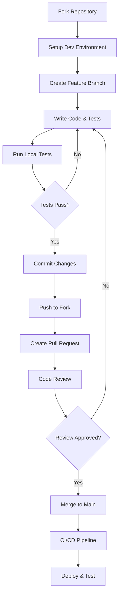

# Development Documentation

This section contains comprehensive guides for developing with and contributing to OpenFrame CLI. Whether you're setting up a development environment, understanding the architecture, or contributing code, these guides will help you get started.

## 🏗️ Architecture & Design

Understanding how OpenFrame CLI is structured and how its components interact:

- **[Architecture Overview](architecture/README.md)** - High-level system design, component relationships, and data flows

## 🛠️ Development Setup

Get your development environment ready:

- **[Environment Setup](setup/environment.md)** - IDE configuration, tools, and development dependencies
- **[Local Development](setup/local-development.md)** - Clone, build, run, and debug OpenFrame CLI locally

## 🔒 Security

Security best practices and guidelines:

- **[Security Guidelines](security/README.md)** - Authentication patterns, data protection, and vulnerability prevention

## 🧪 Testing

Comprehensive testing approaches:

- **[Testing Guide](testing/README.md)** - Test structure, running tests, writing new tests, and coverage requirements

## 🤝 Contributing  

Guidelines for contributing to the project:

- **[Contributing Guidelines](contributing/guidelines.md)** - Code standards, review process, and submission guidelines

## Quick Navigation

### New Contributors
If you're new to OpenFrame CLI development, start here:
1. [Architecture Overview](architecture/README.md) - Understand the system
2. [Environment Setup](setup/environment.md) - Configure your tools  
3. [Local Development](setup/local-development.md) - Get the code running
4. [Contributing Guidelines](contributing/guidelines.md) - Learn the process

### Experienced Developers
Jump to specific areas:
- **Architecture**: Deep dive into design patterns and component interactions
- **Security**: Review security models and best practices
- **Testing**: Understand test patterns and coverage expectations

### Operations & DevOps
Focus on deployment and operational aspects:
- **Architecture**: Service dependencies and operational considerations
- **Security**: Production security requirements and configurations
- **Testing**: Integration and end-to-end testing strategies

## Development Workflow Overview



## Key Technologies

OpenFrame CLI is built with:

| Technology | Purpose | Version |
|------------|---------|---------|
| **Go** | Primary language | 1.24.6+ |
| **Cobra** | CLI framework | v1.8.1+ |
| **Kubernetes** | Container orchestration | v1.31.2+ |
| **K3D** | Local Kubernetes clusters | v5.0+ |
| **Helm** | Package management | v3.10+ |
| **ArgoCD** | GitOps deployments | v2.14+ |
| **Telepresence** | Service intercepts | v2.10+ |

## Project Structure

```text
openframe-cli/
├── cmd/                    # CLI command definitions
│   ├── bootstrap/         # Bootstrap command
│   ├── cluster/           # Cluster management commands
│   ├── chart/             # Chart installation commands
│   ├── dev/               # Development workflow commands
│   └── root.go            # Root command setup
├── internal/              # Internal packages
│   ├── bootstrap/         # Bootstrap orchestration
│   ├── cluster/           # Cluster lifecycle management
│   ├── chart/             # Chart and ArgoCD integration
│   ├── dev/               # Development tools
│   └── shared/            # Common utilities
├── tests/                 # Test suites
│   ├── integration/       # Integration tests
│   ├── mocks/             # Test mocks
│   └── testutil/          # Test utilities
├── docs/                  # Documentation
├── examples/              # Usage examples
├── scripts/               # Build and utility scripts
├── go.mod                 # Go module definition
├── go.sum                 # Go dependency checksums
└── main.go                # Application entry point
```

## Development Principles

### Code Quality
- **Clean Architecture**: Clear separation of concerns with layered design
- **Testability**: All components designed for easy testing and mocking
- **Error Handling**: Comprehensive error handling with user-friendly messages
- **Documentation**: Code is self-documenting with clear comments

### User Experience
- **Interactive Design**: Wizard-style interfaces for complex operations
- **Clear Feedback**: Progress indicators and status messages
- **Error Recovery**: Helpful error messages with suggested solutions
- **Consistency**: Uniform command patterns and flag usage

### Operational Excellence
- **Observability**: Comprehensive logging and monitoring capabilities
- **Reliability**: Robust error handling and recovery mechanisms
- **Performance**: Efficient resource usage and fast execution
- **Security**: Secure defaults and best practices

## Getting Started

### Prerequisites
Before diving into development, ensure you have:
- Go 1.24.6 or later installed
- Docker and Kubernetes tools (kubectl, helm, k3d)
- Git and a code editor/IDE
- Basic familiarity with Kubernetes concepts

### Quick Start
1. **Read the [Architecture Overview](architecture/README.md)** to understand the system
2. **Follow the [Environment Setup](setup/environment.md)** guide
3. **Complete the [Local Development](setup/local-development.md)** setup
4. **Review [Contributing Guidelines](contributing/guidelines.md)** before making changes

## Community & Support

### Getting Help
- **OpenMSP Slack**: [Join the community](https://join.slack.com/t/openmsp/shared_invite/zt-36bl7mx0h-3~U2nFH6nqHqoTPXMaHEHA) for development questions
- **Documentation**: Browse these guides for detailed information
- **Code Reviews**: Learn from existing pull requests and code reviews

### Contributing
We welcome contributions! Here's how to get involved:
1. **Start Small**: Begin with bug fixes or documentation improvements
2. **Discuss Large Changes**: Use Slack to discuss major features or architectural changes
3. **Follow Guidelines**: Adhere to coding standards and review processes
4. **Be Patient**: Maintain a collaborative and respectful approach

### Code of Conduct
- Be respectful and inclusive in all interactions
- Focus on constructive feedback and learning
- Help others learn and grow in the community
- Follow the project's established patterns and conventions

---

Ready to start developing? Choose your path:
- **New to the project**: Start with [Architecture Overview](architecture/README.md)
- **Ready to code**: Jump to [Local Development](setup/local-development.md)  
- **Want to contribute**: Review [Contributing Guidelines](contributing/guidelines.md)