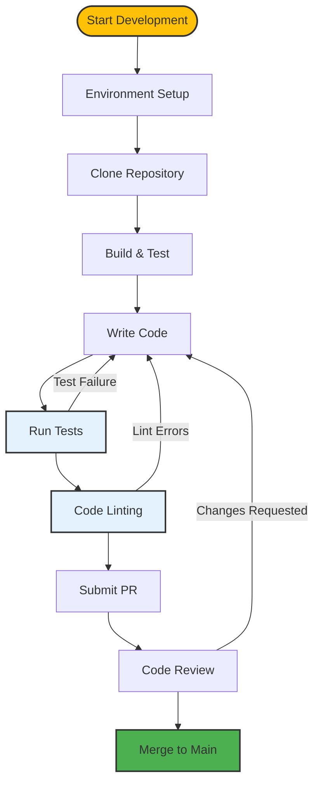

# Development Documentation

Welcome to the OpenFrame CLI development documentation! This section provides comprehensive guides for developers working with OpenFrame CLI, from environment setup to contributing guidelines.

## Documentation Structure

### Setup & Environment
Essential guides to get your development environment ready:

- **[Environment Setup](./setup/environment.md)** - IDE configuration, extensions, and development tools
- **[Local Development](./setup/local-development.md)** - Clone, build, and run OpenFrame CLI locally with hot reloading

### Architecture & Design
Understanding OpenFrame CLI's structure and design principles:

- **[Architecture Overview](./architecture/overview.md)** - High-level architecture, component relationships, and design decisions

### Testing & Quality
Ensuring code quality and reliability:

- **[Testing Overview](./testing/overview.md)** - Test structure, running tests, and writing new tests

### Contributing
Guidelines for contributing to the OpenFrame CLI project:

- **[Contributing Guidelines](./contributing/guidelines.md)** - Code style, PR process, and development workflow

## Quick Navigation

### For New Developers
Starting your OpenFrame CLI development journey:

1. 🛠️ **[Environment Setup](./setup/environment.md)** - Set up your IDE and tools
2. 🚀 **[Local Development](./setup/local-development.md)** - Get the code running locally
3. 🏗️ **[Architecture Overview](./architecture/overview.md)** - Understand the codebase structure
4. ✅ **[Testing Overview](./testing/overview.md)** - Learn the testing approach

### For Contributors
Ready to contribute to OpenFrame CLI:

1. 📋 **[Contributing Guidelines](./contributing/guidelines.md)** - Follow our development standards
2. ✅ **[Testing Overview](./testing/overview.md)** - Write proper tests for your changes
3. 🏗️ **[Architecture Overview](./architecture/overview.md)** - Understand design patterns

### For Maintainers
Maintaining and extending OpenFrame CLI:

1. 🏗️ **[Architecture Overview](./architecture/overview.md)** - Design decisions and patterns
2. ✅ **[Testing Overview](./testing/overview.md)** - Test strategy and coverage
3. 📋 **[Contributing Guidelines](./contributing/guidelines.md)** - Review standards

## Development Workflow Overview

Here's the typical development workflow for OpenFrame CLI:



## Technology Stack

OpenFrame CLI is built with modern Go development practices:

| Component | Technology | Purpose |
|-----------|------------|---------|
| **Language** | Go 1.21+ | Core CLI implementation |
| **CLI Framework** | Cobra | Command structure and argument parsing |
| **Testing** | Go testing + Testify | Unit and integration tests |
| **Kubernetes Client** | client-go | Kubernetes API interactions |
| **Container Orchestration** | K3d | Local cluster management |
| **Package Management** | Helm | Chart installation and management |
| **GitOps** | ArgoCD | Deployment automation |
| **Development Tools** | Telepresence, Skaffold | Local development workflow |

## Development Principles

### Code Organization
- **Modular Design**: Clear separation between commands, services, and utilities
- **Interface-Driven**: Dependency injection and mockable interfaces
- **Error Handling**: Comprehensive error wrapping and user-friendly messages
- **Configuration**: Environment-based configuration with sensible defaults

### User Experience
- **Interactive by Default**: Provide guided experiences with smart defaults
- **Non-Interactive Support**: Full automation capabilities for CI/CD
- **Progressive Disclosure**: Simple commands with advanced options available
- **Helpful Output**: Clear status indicators and actionable error messages

### Testing Strategy
- **Unit Tests**: Core business logic testing with mocks
- **Integration Tests**: End-to-end command testing
- **Acceptance Tests**: Real cluster testing scenarios
- **Documentation Tests**: Examples and code snippets validation

## Common Development Tasks

### Quick Commands Reference

| Task | Command | Description |
|------|---------|-------------|
| **Build** | `make build` | Build the CLI binary |
| **Test** | `make test` | Run all tests |
| **Lint** | `make lint` | Run code linters |
| **Format** | `make fmt` | Format Go code |
| **Install** | `make install` | Install CLI locally |
| **Clean** | `make clean` | Clean build artifacts |

### Development Scripts

Common development tasks are automated through Makefile targets:

```bash
# Full development cycle
make clean build test lint

# Development with file watching (requires entr)
find . -name "*.go" | entr -r make build test

# Integration testing with real clusters
make test-integration

# Release preparation
make build-all test-all
```

## Getting Help

### Documentation
- Start with **[Environment Setup](./setup/environment.md)** if you're new to development
- Check **[Architecture Overview](./architecture/overview.md)** to understand the codebase
- Review **[Contributing Guidelines](./contributing/guidelines.md)** before making changes

### Community
- **GitHub Discussions**: Ask questions and share ideas
- **Issues**: Report bugs and feature requests  
- **Pull Requests**: Contribute improvements and fixes
- **Code Reviews**: Learn from feedback and help others

### Debugging
- Use `go run main.go` for quick testing
- Enable verbose mode with `--verbose` flag
- Check logs in `~/.openframe/logs/`
- Use `kubectl` commands to inspect cluster state

## Contributing Back

We welcome contributions! Here's how to get started:

1. **Read** the **[Contributing Guidelines](./contributing/guidelines.md)**
2. **Fork** the repository on GitHub
3. **Follow** the **[Environment Setup](./setup/environment.md)** guide
4. **Make** your changes following our coding standards
5. **Test** your changes thoroughly
6. **Submit** a pull request with clear description

## What's Next?

Choose your path based on your role:

- **New to OpenFrame CLI development?** → **[Environment Setup](./setup/environment.md)**
- **Ready to contribute?** → **[Contributing Guidelines](./contributing/guidelines.md)**
- **Want to understand the architecture?** → **[Architecture Overview](./architecture/overview.md)**
- **Need to write tests?** → **[Testing Overview](./testing/overview.md)**

---

**Happy coding!** 🚀 The OpenFrame CLI community is here to help you succeed.