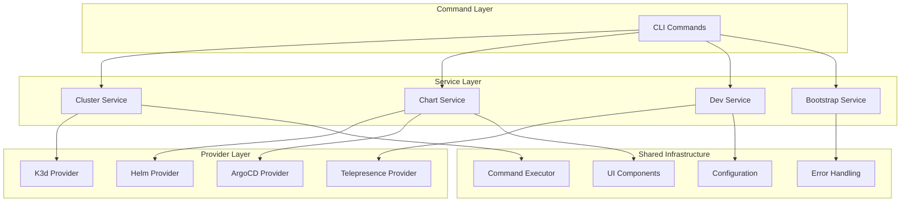

# Development Documentation

Welcome to the OpenFrame CLI development documentation! This section provides comprehensive guides for developers who want to work with, extend, or contribute to OpenFrame CLI.

## 📋 Documentation Overview

This development documentation is organized into focused sections to help you quickly find what you need:

### 🛠️ Setup Guides
Essential setup and configuration for OpenFrame development environments.

| Guide | Purpose | Audience |
|-------|---------|----------|
| **[Environment Setup](setup/environment.md)** | IDE configuration, development tools, and workspace setup | All developers |
| **[Local Development](setup/local-development.md)** | Running and debugging OpenFrame CLI locally | Contributors and extenders |

### 🏗️ Architecture Documentation  
Understanding how OpenFrame CLI is designed and structured.

| Guide | Purpose | Audience |
|-------|---------|----------|
| **[Architecture Overview](architecture/overview.md)** | High-level system design, components, and data flow | Architects and senior developers |

### 🧪 Testing Documentation
Comprehensive testing strategies and implementation guides.

| Guide | Purpose | Audience |
|-------|---------|----------|
| **[Testing Overview](testing/overview.md)** | Test structure, running tests, and writing new tests | All developers |

### 🤝 Contributing Guidelines
Information for contributors and maintainers.

| Guide | Purpose | Audience |
|-------|---------|----------|
| **[Contributing Guidelines](contributing/guidelines.md)** | Code style, PR process, and development workflow | Contributors and maintainers |

## 🚀 Quick Navigation

### New to OpenFrame Development?
Start with these essential guides:

1. **[Environment Setup](setup/environment.md)** - Configure your development environment
2. **[Architecture Overview](architecture/overview.md)** - Understand the system design
3. **[Local Development](setup/local-development.md)** - Run OpenFrame CLI locally
4. **[Contributing Guidelines](contributing/guidelines.md)** - Learn the development workflow

### Looking for Specific Information?

| I want to... | Go to... |
|--------------|----------|
| **Set up my IDE for OpenFrame development** | [Environment Setup](setup/environment.md) |
| **Run OpenFrame CLI from source** | [Local Development](setup/local-development.md) |
| **Understand the codebase architecture** | [Architecture Overview](architecture/overview.md) |
| **Write or run tests** | [Testing Overview](testing/overview.md) |
| **Contribute code or documentation** | [Contributing Guidelines](contributing/guidelines.md) |
| **Debug issues or add features** | [Local Development](setup/local-development.md) + [Architecture Overview](architecture/overview.md) |

## 🎯 Development Workflows

### Quick Development Setup

```bash
# 1. Clone the repository
git clone https://github.com/flamingo-stack/openframe-cli.git
cd openframe-cli

# 2. Set up development environment
# Follow: development/setup/environment.md

# 3. Run locally
# Follow: development/setup/local-development.md

# 4. Make changes and test
# Follow: development/testing/overview.md

# 5. Submit contributions
# Follow: development/contributing/guidelines.md
```

### Common Development Tasks

| Task | Documentation | Commands |
|------|---------------|----------|
| **Build from source** | [Local Development](setup/local-development.md) | `go build -o openframe main.go` |
| **Run tests** | [Testing Overview](testing/overview.md) | `go test ./...` |
| **Debug locally** | [Local Development](setup/local-development.md) | IDE debugger + local builds |
| **Update dependencies** | [Contributing Guidelines](contributing/guidelines.md) | `go mod tidy` |

## 🏗️ Architecture Quick Reference

OpenFrame CLI follows a clean, layered architecture:



**Key Principles:**
- **Separation of Concerns**: Clear boundaries between layers
- **Dependency Injection**: Testable and modular design
- **Error Handling**: Centralized, user-friendly error messages
- **Extensibility**: Plugin-style provider architecture

## 🛡️ Development Standards

### Code Quality
- **Go Standards**: Follow official Go conventions and best practices
- **Testing**: Comprehensive unit and integration test coverage
- **Documentation**: Clear, up-to-date documentation for all public APIs
- **Error Handling**: Graceful error handling with helpful user messages

### Development Process  
- **GitFlow**: Feature branches, pull requests, and code reviews
- **Continuous Integration**: Automated testing and validation
- **Semantic Versioning**: Clear, predictable version management
- **Community-Driven**: Open discussion and collaborative development

## 📚 Additional Resources

### OpenFrame Ecosystem
- **[OpenFrame Platform](https://openframe.ai)** - Main platform documentation
- **[Flamingo](https://flamingo.run)** - AI-powered MSP platform
- **[OpenMSP Community](https://www.openmsp.ai/)** - Community resources

### External Documentation
- **[Go Documentation](https://golang.org/doc/)** - Go language reference
- **[Kubernetes API](https://kubernetes.io/docs/reference/)** - Kubernetes development
- **[Cobra CLI](https://github.com/spf13/cobra)** - CLI framework documentation
- **[ArgoCD](https://argo-cd.readthedocs.io/)** - GitOps platform reference

### Development Tools
- **[VS Code Go Extension](https://marketplace.visualstudio.com/items?itemName=golang.Go)** - IDE support
- **[GoLand](https://www.jetbrains.com/go/)** - Professional Go IDE
- **[Delve](https://github.com/go-delve/delve)** - Go debugger
- **[golangci-lint](https://golangci-lint.run/)** - Linting and code quality

## 🤝 Getting Help

### Community Support
- **[OpenMSP Slack](https://join.slack.com/t/openmsp/shared_invite/zt-36bl7mx0h-3~U2nFH6nqHqoTPXMaHEHA)** - Real-time community support
- **[Flamingo Platform](https://flamingo.run)** - Platform-wide resources

### Development Support
- **Code Reviews**: Submit PRs for collaborative feedback
- **Architecture Discussions**: Engage in design conversations
- **Feature Requests**: Propose new capabilities and improvements

> **Note**: We use Slack for all support and discussions. GitHub Issues and GitHub Discussions are not actively monitored.

## 🔄 Staying Updated

- **Watch the Repository**: Get notifications for releases and updates  
- **Join Community Slack**: Stay connected with the development community
- **Review Release Notes**: Understand new features and breaking changes
- **Follow Contributing Guidelines**: Ensure your contributions align with project standards

---

*Ready to start developing with OpenFrame CLI? Begin with [environment setup](setup/environment.md) or jump to [architecture overview](architecture/overview.md) to understand the system design.*