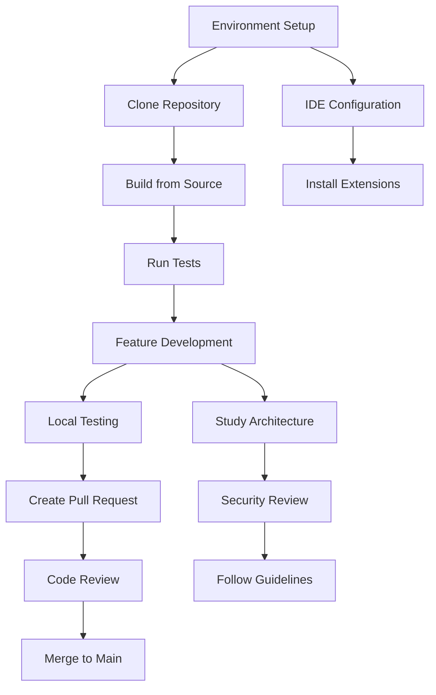

# Development Documentation

Welcome to the OpenFrame CLI development documentation. This section contains comprehensive guides for developers working on the OpenFrame CLI codebase, contributing to the project, or building custom extensions.

## 📖 Documentation Overview

This development section is organized into specialized guides covering all aspects of OpenFrame CLI development:

### 🛠️ Setup and Environment

Get your development environment ready for OpenFrame CLI contributions:

- **[Environment Setup](setup/environment.md)** - IDE configuration, extensions, and development tools
- **[Local Development](setup/local-development.md)** - Clone, build, and run OpenFrame CLI from source

### 🏗️ Architecture and Design

Understand the system architecture and design patterns:

- **[Architecture Overview](architecture/README.md)** - High-level system design, component relationships, and data flow

### 🔐 Security

Learn about security practices and implementation:

- **[Security Guidelines](security/README.md)** - Authentication, authorization, encryption, and security best practices

### 🧪 Testing

Comprehensive testing strategies and implementation:

- **[Testing Overview](testing/README.md)** - Test structure, running tests, writing new tests, and coverage requirements

### 🤝 Contributing

Guidelines for contributing to the OpenFrame CLI project:

- **[Contributing Guidelines](contributing/guidelines.md)** - Code style, branch naming, PR process, and review checklist

## 🎯 Quick Navigation

### For New Contributors

If you're new to OpenFrame CLI development, start here:

1. **[Environment Setup](setup/environment.md)** - Configure your development tools
2. **[Local Development](setup/local-development.md)** - Get the code running locally  
3. **[Architecture Overview](architecture/README.md)** - Understand the system design
4. **[Contributing Guidelines](contributing/guidelines.md)** - Learn the development workflow

### For Platform Developers

Building MSP services on OpenFrame? Focus on these guides:

- **[Architecture Overview](architecture/README.md)** - Component integration patterns
- **[Security Guidelines](security/README.md)** - MSP security requirements
- **[Testing Overview](testing/README.md)** - Service testing strategies

### For DevOps Engineers

Integrating OpenFrame CLI into CI/CD? Check these resources:

- **[Local Development](setup/local-development.md)** - Automation and scripting
- **[Testing Overview](testing/README.md)** - Automated testing in pipelines
- **[Architecture Overview](architecture/README.md)** - Deployment patterns

## 🚀 Development Workflow Overview



## 🛡️ Development Principles

OpenFrame CLI follows these core development principles:

### Clean Architecture

- **Separation of Concerns**: Clear boundaries between CLI, services, providers, and UI
- **Dependency Inversion**: High-level modules don't depend on low-level modules
- **Interface Segregation**: Small, focused interfaces for better testability

### Developer Experience

- **Interactive Wizards**: User-friendly interfaces for complex operations
- **Comprehensive Error Handling**: Clear error messages with actionable guidance
- **Extensive Testing**: High test coverage with integration and unit tests

### Platform Integration

- **GitOps First**: Built-in ArgoCD integration for continuous delivery
- **Kubernetes Native**: Deep integration with Kubernetes APIs and tools
- **MSP Optimized**: Designed specifically for MSP platform requirements

## 🔧 Technology Stack

Understanding the technology foundation:

| Component | Technology | Purpose |
|-----------|------------|---------|
| **CLI Framework** | Cobra | Command structure and flag parsing |
| **Terminal UI** | pterm, promptui | Interactive interfaces and styling |
| **Kubernetes** | client-go | Kubernetes API interactions |
| **Container Management** | K3D, Docker | Local cluster and container operations |
| **GitOps** | ArgoCD, Helm | Continuous delivery and package management |
| **Testing** | Testify, Go testing | Unit and integration testing |
| **Configuration** | YAML, Viper | Configuration management |

## 📦 Project Structure

```text
openframe-cli/
├── cmd/                    # CLI command definitions
│   ├── bootstrap/         # Bootstrap command
│   ├── cluster/           # Cluster management commands  
│   ├── chart/             # Chart installation commands
│   └── dev/               # Development tools commands
├── internal/              # Internal packages (not exported)
│   ├── bootstrap/         # Bootstrap service logic
│   ├── cluster/           # Cluster management services
│   ├── chart/             # Chart installation services
│   ├── dev/               # Development tool services
│   └── shared/            # Shared utilities and components
├── tests/                 # Test suites
│   ├── integration/       # Integration tests
│   ├── mocks/            # Test mocks and fixtures
│   └── testutil/         # Testing utilities
├── docs/                 # Documentation
└── main.go               # Application entry point
```

## 🎓 Learning Resources

### Official Documentation

- **[OpenFrame CLI Architecture](./architecture/README.md)** - Complete architectural documentation
- **API References** - Generated from source code comments
- **Command References** - Comprehensive CLI command documentation

### Video Resources

[](https://www.youtube.com/watch?v=PexpoNdZtUk)

### Community Resources

- **OpenMSP Community**: https://www.openmsp.ai/
- **Slack Workspace**: Real-time developer discussions
- **GitHub Repository**: https://github.com/flamingo-stack/openframe-cli

## 🤝 Getting Help

### Development Support

- **Architecture Questions**: Review the architecture documentation or ask in Slack
- **Code Issues**: Check existing issues or create new ones via community channels
- **Feature Requests**: Discuss ideas in the OpenMSP Slack community
- **Security Concerns**: Follow responsible disclosure practices

### Contributing Process

1. **Read Guidelines**: Start with [Contributing Guidelines](contributing/guidelines.md)
2. **Set Up Environment**: Follow [Environment Setup](setup/environment.md)
3. **Understand Architecture**: Review [Architecture Overview](architecture/README.md)
4. **Write Tests**: Follow [Testing Overview](testing/README.md)
5. **Follow Security**: Implement [Security Guidelines](security/README.md)

## 🎯 Development Goals

The OpenFrame CLI development focuses on:

- **Developer Productivity**: Streamlined workflows for MSP development
- **Platform Reliability**: Robust, tested, and secure infrastructure tools
- **Community Growth**: Enabling contributions and extensions
- **MSP Excellence**: Purpose-built tools for managed service providers

Ready to contribute? Start with the [Environment Setup](setup/environment.md) guide and join the OpenFrame CLI development community!