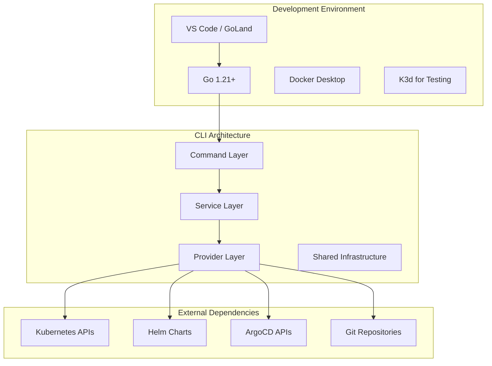
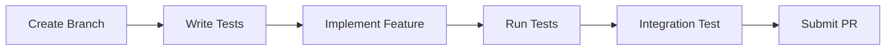

# Development Documentation

Welcome to the OpenFrame CLI development documentation. This section provides comprehensive guides for developers contributing to, extending, or deeply understanding the OpenFrame CLI codebase.

## Quick Navigation

### 🚀 **Getting Started Development**
- **[Environment Setup](setup/environment.md)** - IDE, tools, and development environment configuration
- **[Local Development](setup/local-development.md)** - Clone, build, and run locally with hot reload

### 🏗️ **Architecture & Design**
- **[Architecture Overview](architecture/overview.md)** - System design, components, and data flow
- **[Code Organization](architecture/code-structure.md)** - Package structure and design patterns

### 🧪 **Testing & Quality**
- **[Testing Overview](testing/overview.md)** - Test structure, running tests, and coverage
- **[Integration Tests](testing/integration.md)** - End-to-end testing strategies
- **[Mocking & Test Utilities](testing/mocking.md)** - Test doubles and helper functions

### 🤝 **Contributing**
- **[Contributing Guidelines](contributing/guidelines.md)** - Code style, PR process, and best practices
- **[Release Process](contributing/releases.md)** - Version management and release procedures
- **[Debugging Guide](contributing/debugging.md)** - Troubleshooting and debugging techniques

## Development Overview

OpenFrame CLI is built with modern Go practices and follows a clean architecture pattern:



## Core Technologies

| Technology | Purpose | Version |
|------------|---------|---------|
| **Go** | Primary language | 1.21+ |
| **Cobra** | CLI framework | v1.7+ |
| **Kubernetes APIs** | Cluster interaction | v1.24+ |
| **Helm SDK** | Chart management | v3.8+ |
| **Docker** | Container operations | 20.10+ |
| **K3d** | Local testing clusters | 5.4+ |

## Development Principles

### 🎯 **User Experience First**
- Interactive wizard-style interfaces
- Clear error messages and validation
- Progress indicators for long operations

### 🏗️ **Clean Architecture**
- Separation of concerns with layered design
- Dependency injection for testability
- Provider pattern for external integrations

### 🧪 **Test-Driven Development**
- Comprehensive unit and integration tests
- Mock-based testing for external dependencies
- Test utilities for common scenarios

### 📦 **Modular Design**
- Pluggable providers for different platforms
- Shared utilities for common operations
- Configuration-driven behavior

## Project Structure

```text
openframe-cli/
├── cmd/                    # Cobra command definitions
│   ├── bootstrap/         # Bootstrap command
│   ├── cluster/           # Cluster management commands
│   ├── chart/             # Chart installation commands
│   └── dev/               # Development tools commands
├── internal/              # Private application code
│   ├── bootstrap/         # Bootstrap service logic
│   ├── cluster/           # Cluster management services
│   ├── chart/             # Chart installation services
│   ├── dev/               # Development tools services
│   └── shared/            # Shared utilities and infrastructure
├── tests/                 # Test suites and utilities
│   ├── integration/       # Integration test scenarios
│   ├── mocks/             # Generated mock objects
│   └── testutil/          # Test helper functions
├── docs/                  # Documentation (generated)
├── scripts/               # Build and development scripts
└── deployments/           # Deployment configurations
```

## Common Development Tasks

### Running Tests
```bash
# Run all tests
make test

# Run tests with coverage
make test-coverage

# Run integration tests
make test-integration
```

### Building the CLI
```bash
# Build for current platform
make build

# Build for all platforms
make build-all

# Build and install locally
make install
```

### Code Quality
```bash
# Run linters
make lint

# Format code
make fmt

# Generate mocks
make generate
```

## Development Workflow

### 1. **Feature Development**


### 2. **Testing Strategy**
- **Unit Tests** - Test individual functions and methods
- **Integration Tests** - Test complete workflows with real dependencies
- **End-to-End Tests** - Test CLI commands in realistic scenarios

### 3. **Code Review Process**
- Automated checks (tests, linting, security)
- Manual review for design and best practices
- Documentation updates for new features

## Getting Help

### Internal Resources
- **[Architecture Decisions](architecture/decisions.md)** - Understanding design choices
- **[API Reference](reference/api.md)** - Internal API documentation
- **[Troubleshooting](troubleshooting/common-issues.md)** - Common development issues

### External Resources
- [Go Documentation](https://golang.org/doc/)
- [Cobra CLI Framework](https://cobra.dev/)
- [Kubernetes Client-Go](https://github.com/kubernetes/client-go)
- [Helm SDK Documentation](https://helm.sh/docs/topics/advanced/#go-sdk)

### Community
- GitHub Issues for bug reports and feature requests
- Discussions for general questions and ideas
- Pull Requests for contributions

## Contributing Quick Start

Ready to contribute? Here's the fastest path:

1. **[Set up your environment](setup/environment.md)** - Get your development tools ready
2. **[Clone and build locally](setup/local-development.md)** - Get the code running
3. **[Read the architecture guide](architecture/overview.md)** - Understand the system design
4. **[Review contributing guidelines](contributing/guidelines.md)** - Follow our standards

> **💡 New to the Codebase?** Start with the architecture overview to understand how components work together, then explore the specific area you want to contribute to.

---

*This documentation is designed for developers of all experience levels. Whether you're fixing a bug, adding a feature, or just exploring the code, these guides will help you be productive quickly.*