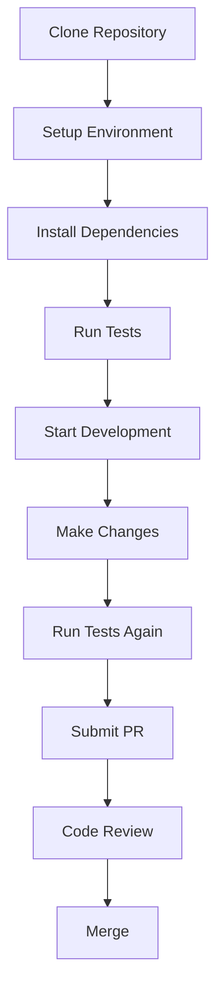

# Development Documentation

Welcome to the OpenFrame CLI development documentation! This section provides comprehensive guides for developers working with, contributing to, or extending the OpenFrame CLI project.

## 📚 Documentation Overview

This development documentation is organized into logical sections to help you find what you need quickly:

### 🚀 Setup Guides
Get your development environment configured and running:
- **[Environment Setup](setup/environment.md)** - IDE configuration, tools, and extensions
- **[Local Development](setup/local-development.md)** - Clone, build, and run locally

### 🏗️ Architecture Guides  
Understand how OpenFrame CLI is built and designed:
- **[Architecture Overview](architecture/overview.md)** - High-level design, components, and patterns

### 🧪 Testing Documentation
Learn testing strategies and best practices:
- **[Testing Overview](testing/overview.md)** - Test structure, running tests, writing new tests

### 🤝 Contributing Guides
Guidelines for contributing to the project:
- **[Contributing Guidelines](contributing/guidelines.md)** - Code style, PR process, and review checklist

## 🎯 Quick Navigation

### For New Contributors
1. Start with **[Environment Setup](setup/environment.md)** to configure your development tools
2. Follow **[Local Development](setup/local-development.md)** to get the project running locally
3. Review **[Contributing Guidelines](contributing/guidelines.md)** before making changes
4. Understand **[Testing Overview](testing/overview.md)** to write and run tests

### For Architecture Understanding
1. Read **[Architecture Overview](architecture/overview.md)** for high-level design concepts
2. Explore the source code structure using the architecture diagrams as a guide
3. Review component interactions and data flow patterns

### For Testing and Quality
1. **[Testing Overview](testing/overview.md)** covers our testing philosophy and tools
2. Learn how to run existing tests and write new ones
3. Understand our quality gates and coverage requirements

## 🛠️ Development Workflow



## 🔧 Core Technologies

OpenFrame CLI is built with modern Go development practices:

| Technology | Purpose | Documentation |
|------------|---------|---------------|
| **Go 1.21+** | Primary language | [Go Documentation](https://golang.org/doc/) |
| **Cobra CLI** | Command-line framework | [Cobra Guide](https://github.com/spf13/cobra) |
| **Kubernetes Client** | K8s API interactions | [client-go](https://github.com/kubernetes/client-go) |
| **Helm SDK** | Chart management | [Helm SDK](https://helm.sh/docs/topics/advanced/) |
| **K3d** | Local cluster provider | [K3d Documentation](https://k3d.io/) |

## 📋 Development Prerequisites

Before diving into development, ensure you have:

- **Go 1.21+** installed and configured
- **Docker** running for local K3d clusters
- **kubectl** configured for Kubernetes access
- **Make** for build automation
- **Git** for version control

> **💡 Tip**: The **[Environment Setup](setup/environment.md)** guide walks through installing and configuring all these tools.

## 🗂️ Project Structure

Understanding the codebase structure:

```text
openframe-cli/
├── cmd/                    # Command definitions
│   ├── bootstrap/         # Bootstrap command group
│   ├── cluster/           # Cluster management commands  
│   ├── chart/            # Chart installation commands
│   └── dev/              # Development workflow commands
├── internal/             # Internal packages (not exported)
│   ├── bootstrap/        # Bootstrap business logic
│   ├── cluster/          # Cluster services and models
│   ├── chart/           # Chart services and models
│   ├── dev/             # Development tool services
│   └── shared/          # Common utilities and UI
├── docs/                # Documentation (you are here!)
├── tests/               # Test files and fixtures
└── scripts/             # Build and development scripts
```

## 🎯 Development Goals

Our development practices focus on:

### **Reliability**
- Comprehensive test coverage
- Robust error handling  
- Graceful failure modes
- Prerequisite validation

### **Usability**
- Intuitive command structure
- Helpful error messages
- Interactive configuration
- Clear documentation

### **Maintainability**
- Modular architecture
- Clean separation of concerns
- Consistent code patterns
- Automated quality checks

### **Performance**
- Fast command execution
- Efficient resource usage
- Minimal external dependencies
- Optimized cluster operations

## 🔍 Key Development Areas

### Command Interface (`cmd/`)
- **Cobra command definitions** for CLI structure
- **Flag parsing and validation** for user input
- **Command orchestration** linking CLI to business logic

### Business Logic (`internal/`)
- **Service layers** containing core functionality  
- **Models and data structures** for configuration
- **External tool integration** (K3d, Helm, kubectl)

### User Experience
- **Interactive prompts** for configuration
- **Progress indicators** for long-running operations
- **Error messages** that guide users to solutions

### External Integrations
- **K3d cluster management** for local Kubernetes
- **Helm chart operations** for application deployment
- **ArgoCD installation** for GitOps workflows
- **Development tool integration** (Telepresence, Skaffold)

## 📖 Additional Resources

### Internal Documentation
- Explore inline code documentation in `cmd/**/.*.md` files
- Reference architecture documentation in `docs/reference/`
- Check command help with `openframe <command> --help`

### External Resources
- [Go by Example](https://gobyexample.com/) for Go language patterns
- [Kubernetes API Reference](https://kubernetes.io/docs/reference/) for K8s interactions
- [Cobra User Guide](https://github.com/spf13/cobra/blob/main/user_guide.md) for CLI patterns

## 🤝 Getting Help

### Development Questions
- Check existing documentation first
- Look for similar patterns in the codebase
- Run commands with `--verbose` for detailed logging
- Review test cases for usage examples

### Contributing Process
1. **Read [Contributing Guidelines](contributing/guidelines.md)** for our process
2. **Open an issue** for bugs or feature requests  
3. **Follow our PR template** when submitting changes
4. **Engage in code review** constructively

---

**Ready to start developing?** Begin with the **[Environment Setup](setup/environment.md)** guide and get your development environment configured!