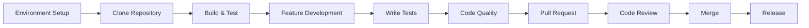

# Development Documentation

Welcome to the OpenFrame CLI development documentation. This section provides comprehensive guides for developers who want to contribute to, extend, or deeply understand OpenFrame CLI.

## Overview

OpenFrame CLI is a modern Go-based command-line tool built with the Cobra framework. It provides cluster management, GitOps workflows, and developer tools for Kubernetes environments. The architecture is modular, testable, and designed for extensibility.

## Documentation Structure

This development documentation is organized into focused areas:

### 🛠️ Setup and Environment
Get your development environment configured and ready for contribution.

| Document | Purpose | Audience |
|----------|---------|----------|
| **[Environment Setup](./setup/environment.md)** | IDE configuration, tools, and extensions | All developers |
| **[Local Development](./setup/local-development.md)** | Clone, build, run, and debug locally | Contributors |

### 🏗️ Architecture and Design  
Understand the system design, patterns, and architectural decisions.

| Document | Purpose | Audience |
|----------|---------|----------|
| **[Architecture Overview](./architecture/overview.md)** | High-level design, components, and data flow | All developers |

### 🧪 Testing and Quality
Learn about testing strategies, coverage, and quality practices.

| Document | Purpose | Audience |
|----------|---------|----------|
| **[Testing Overview](./testing/overview.md)** | Test structure, running tests, and writing new tests | Contributors |

### 🤝 Contributing and Collaboration
Guidelines for contributing code, documentation, and maintaining quality.

| Document | Purpose | Audience |
|----------|---------|----------|
| **[Contributing Guidelines](./contributing/guidelines.md)** | Code style, PR process, and review criteria | Contributors |

## Quick Navigation

### For New Contributors
1. Start with **[Environment Setup](./setup/environment.md)** to configure your tools
2. Follow **[Local Development](./setup/local-development.md)** to get the code running
3. Read **[Contributing Guidelines](./contributing/guidelines.md)** before making changes
4. Review **[Testing Overview](./testing/overview.md)** to understand test expectations

### For Understanding the Codebase
1. Begin with **[Architecture Overview](./architecture/overview.md)** for system design
2. Explore the source code with architectural context
3. Review **[Testing Overview](./testing/overview.md)** for quality patterns

### For Maintainers
1. **[Contributing Guidelines](./contributing/guidelines.md)** - Review processes and standards
2. **[Testing Overview](./testing/overview.md)** - Coverage requirements and test strategy
3. **[Architecture Overview](./architecture/overview.md)** - Design principles for decisions

## Development Stack

OpenFrame CLI is built with modern Go development practices:

### Core Technologies
- **Go 1.19+**: Primary development language
- **Cobra**: CLI framework and command structure
- **Docker**: Container runtime integration
- **Kubernetes**: Target platform and API integration

### External Dependencies
- **K3d**: Lightweight Kubernetes clusters
- **Helm**: Chart management and deployment
- **ArgoCD**: GitOps controller and workflows
- **Telepresence**: Development traffic interception
- **Skaffold**: Live development and deployment

### Development Tools
- **Go modules**: Dependency management
- **golangci-lint**: Code linting and formatting
- **go test**: Unit and integration testing
- **Docker**: Local testing and container builds

## Project Structure

```
openframe-cli/
├── cmd/                    # Cobra command definitions
│   ├── bootstrap/          # Bootstrap orchestration command
│   ├── cluster/            # Cluster management commands  
│   ├── chart/              # Chart installation commands
│   └── dev/                # Development workflow commands
├── internal/               # Internal application logic
│   ├── bootstrap/          # Bootstrap service implementation
│   ├── cluster/            # Cluster management services
│   ├── chart/              # Chart installation services
│   ├── dev/                # Development workflow services
│   └── shared/             # Shared utilities and UI
├── docs/                   # Documentation
│   ├── getting-started/    # User getting-started guides
│   ├── development/        # Development documentation
│   └── reference/          # Reference documentation
└── examples/               # Example configurations and scripts
```

## Key Design Principles

### 1. **Modularity**
Each command group (`cluster`, `chart`, `dev`) is self-contained with its own internal packages for services, models, and utilities.

### 2. **Interactive Experience**
Rich interactive wizards guide users through complex configuration, with non-interactive modes for automation.

### 3. **Prerequisites Management**
Automatic detection and guidance for required tools (Docker, K3d, Helm, etc.) with platform-specific installation instructions.

### 4. **Error Handling**
Centralized error handling with user-friendly messages and actionable guidance for resolution.

### 5. **Testing Strategy**
Comprehensive testing including unit tests, integration tests, and end-to-end validation of cluster operations.

## Development Workflow Overview



## Common Development Tasks

### Build and Test
```bash
# Build the CLI
go build -o openframe ./cmd

# Run tests
go test ./...

# Run linting
golangci-lint run

# Test specific command
./openframe cluster create test-cluster --dry-run
```

### Development Commands
```bash
# Install in development mode
go install ./cmd

# Run with verbose output
openframe cluster create --verbose

# Test bootstrap process
openframe bootstrap test-cluster --deployment-mode=oss-tenant
```

### Code Quality
```bash
# Format code
go fmt ./...

# Check for issues
go vet ./...

# Security scan
gosec ./...
```

## Getting Help

### Documentation Resources
- **[Getting Started Guides](../getting-started/introduction.md)** - User-focused documentation
- **[Reference Documentation](../reference/architecture/overview.md)** - Detailed technical reference
- **Inline Code Documentation** - Package and function-level docs in source

### Community and Support
- **GitHub Issues**: Report bugs and request features
- **Discussions**: Ask questions and share ideas
- **Code Reviews**: Learn from maintainer feedback
- **Examples**: Reference implementations and patterns

### Development Questions
- **Architecture decisions**: Review [Architecture Overview](./architecture/overview.md)
- **Testing patterns**: Check [Testing Overview](./testing/overview.md)
- **Code style**: Follow [Contributing Guidelines](./contributing/guidelines.md)
- **Local setup issues**: Reference [Local Development](./setup/local-development.md)

## Contributing Quick Start

Ready to contribute? Here's your path:

1. **Environment**: Set up your [development environment](./setup/environment.md)
2. **Code**: Clone and run locally with [local development guide](./setup/local-development.md)
3. **Understand**: Read the [architecture overview](./architecture/overview.md)
4. **Contribute**: Follow [contributing guidelines](./contributing/guidelines.md)
5. **Test**: Write tests per [testing overview](./testing/overview.md)

## Roadmap and Vision

OpenFrame CLI aims to be the definitive tool for Kubernetes development workflows, providing:

- **Seamless cluster management** across local and cloud environments
- **GitOps-first workflows** with ArgoCD integration
- **Developer experience** that scales from learning to production
- **Extensible architecture** for custom workflows and integrations

---

> **🎯 Development Goal**: Make Kubernetes accessible and productive for developers while maintaining the flexibility and power that platform engineers need.

Start your development journey with [Environment Setup](./setup/environment.md) or dive into the [Architecture Overview](./architecture/overview.md) to understand the system design.