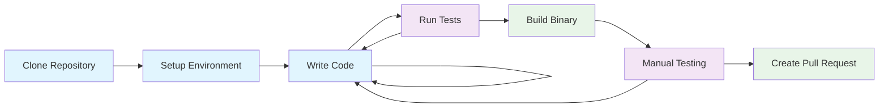

# Development Documentation

Welcome to the OpenFrame CLI development documentation! This section contains comprehensive guides for developers who want to contribute to the project, understand the architecture, or set up advanced development workflows.

## 📖 Documentation Overview

This development section is organized into focused areas to help you find the information you need quickly:

### 🛠️ Setup & Environment
Get your development environment configured and ready for contribution:

- **[Development Environment Setup](setup/environment.md)** - IDE configuration, extensions, and development tools
- **[Local Development Guide](setup/local-development.md)** - Clone, build, run, and debug locally

### 🏗️ Architecture & Design
Understand how OpenFrame CLI is built and why:

- **[Architecture Overview](architecture/overview.md)** - High-level system design, components, and data flow
- Component deep-dives (coming soon)
- Design patterns and principles (coming soon)

### 🧪 Testing & Quality
Ensure your changes maintain high quality:

- **[Testing Overview](testing/overview.md)** - Test strategy, running tests, writing new tests
- Code coverage and quality gates (coming soon)
- Performance testing (coming soon)

### 🤝 Contributing
Guidelines for contributing to the project:

- **[Contributing Guidelines](contributing/guidelines.md)** - Code style, PR process, and review checklist
- Release process (coming soon)
- Maintainer guides (coming soon)

## 🚀 Quick Navigation

| I want to... | Go to... |
|--------------|----------|
| Set up my IDE for Go development | [Environment Setup](setup/environment.md) |
| Clone and run OpenFrame CLI locally | [Local Development](setup/local-development.md) |
| Understand the system architecture | [Architecture Overview](architecture/overview.md) |
| Run tests or write new ones | [Testing Overview](testing/overview.md) |
| Submit a bug fix or feature | [Contributing Guidelines](contributing/guidelines.md) |
| Debug a specific command | [Local Development > Debugging](setup/local-development.md#debugging-commands) |
| Add a new CLI command | [Architecture > Command Structure](architecture/overview.md#cli-commands) |

## 🎯 Developer Personas

### 🆕 **New Contributors**
*"I want to fix a bug or add a small feature"*

**Start here:**
1. [Development Environment Setup](setup/environment.md) - Get your IDE ready
2. [Local Development Guide](setup/local-development.md) - Clone and build the project
3. [Contributing Guidelines](contributing/guidelines.md) - Learn our workflow

### 🏗️ **Architecture Enthusiasts**  
*"I want to understand how this system works"*

**Start here:**
1. [Architecture Overview](architecture/overview.md) - System design and components
2. Browse the `internal/` directory structure
3. [Testing Overview](testing/overview.md) - See how we ensure quality

### 🔧 **Core Maintainers**
*"I'm maintaining this project and need comprehensive docs"*

**Key resources:**
- [Contributing Guidelines](contributing/guidelines.md) - Review process and standards
- [Testing Overview](testing/overview.md) - CI/CD and quality gates
- [Architecture Overview](architecture/overview.md) - System boundaries and interfaces

### 🚀 **Platform Engineers**
*"I want to extend this tool for my organization"*

**Focus areas:**
- [Architecture Overview](architecture/overview.md) - Extension points and interfaces
- [Local Development Guide](setup/local-development.md) - Customization and building
- Plugin/extension documentation (coming soon)

## 🛠️ Development Stack

Understanding the technology stack will help you navigate the codebase:

| Technology | Purpose | Documentation |
|------------|---------|---------------|
| **Go 1.21+** | Primary programming language | [Go Docs](https://golang.org/doc/) |
| **Cobra CLI** | Command-line interface framework | [Cobra Guide](https://github.com/spf13/cobra) |
| **K3d** | Kubernetes cluster management | [K3d Docs](https://k3d.io/) |
| **Helm** | Chart management and templating | [Helm Docs](https://helm.sh/docs/) |
| **ArgoCD** | GitOps application deployment | [ArgoCD Docs](https://argo-cd.readthedocs.io/) |
| **Docker** | Container runtime integration | [Docker Docs](https://docs.docker.com/) |
| **Kubernetes** | Target platform | [K8s Docs](https://kubernetes.io/docs/) |

## 📁 Project Structure Overview

```
openframe-cli/
├── cmd/                    # CLI command implementations
│   ├── bootstrap/         # Complete environment setup
│   ├── cluster/          # Cluster management commands  
│   ├── chart/            # Helm chart operations
│   └── dev/              # Development tools
├── internal/             # Private application code
│   ├── bootstrap/        # Bootstrap business logic
│   ├── cluster/          # Cluster management services
│   ├── chart/            # Chart installation services
│   ├── dev/              # Development tool integrations
│   └── shared/           # Common utilities and UI
├── docs/                 # Documentation (this directory)
├── examples/             # Usage examples and demos
└── scripts/              # Build and development scripts
```

## 🔄 Development Workflow

The typical development cycle for OpenFrame CLI:



### Development Commands

```bash
# Set up development environment
make setup

# Run tests
make test

# Build binary
make build

# Run linting
make lint

# Run integration tests
make test-integration

# Clean build artifacts
make clean
```

## 🎯 Contribution Areas

Looking to contribute? Here are areas where we welcome help:

### 🐛 **Bug Fixes**
- Command error handling improvements
- Edge case fixes in cluster creation
- Cross-platform compatibility issues

### ✨ **Features**
- Additional cloud provider support
- New deployment modes
- Enhanced development tools integration

### 📖 **Documentation**
- Code examples and tutorials
- Architecture deep-dives
- User guides and how-tos

### 🧪 **Testing**
- Unit test coverage expansion
- Integration test scenarios
- Performance benchmarks

### 🛠️ **Tooling**
- CI/CD pipeline improvements
- Development environment enhancements
- Build system optimizations

## 📚 Learning Resources

### Internal Code Reading
Start with these files to understand the codebase:

1. `cmd/bootstrap/bootstrap.go` - Main entry point for complete setup
2. `internal/cluster/services/` - Core cluster management logic
3. `internal/shared/ui/` - Common UI components
4. `cmd/cluster/create.go` - Interactive cluster creation

### External Resources
- [Effective Go](https://golang.org/doc/effective_go.html) - Go best practices
- [Cobra User Guide](https://github.com/spf13/cobra/blob/master/user_guide.md) - CLI framework
- [Kubernetes Developer Guide](https://github.com/kubernetes/community/tree/master/contributors/devel) - K8s concepts

## 🆘 Getting Help

Stuck? Here's how to get unblocked:

### For Code Issues
1. Check [Architecture Overview](architecture/overview.md) for system understanding
2. Review [Local Development](setup/local-development.md) for debugging tips
3. Search GitHub issues for similar problems
4. Ask on our Discord development channel

### For Process Questions
1. Review [Contributing Guidelines](contributing/guidelines.md)
2. Check existing pull requests for examples
3. Reach out to maintainers on Discord
4. Open a discussion on GitHub

### For Environment Issues
1. Follow [Environment Setup](setup/environment.md) step by step
2. Check [prerequisites](../getting-started/prerequisites.md) are met
3. Try the troubleshooting sections in each guide
4. Share your specific error messages on Discord

---

**Ready to start developing?** 🚀

Begin with the [Development Environment Setup](setup/environment.md) to configure your tools, then move to [Local Development](setup/local-development.md) to get the code running locally.

We're excited to have you contribute to OpenFrame CLI!