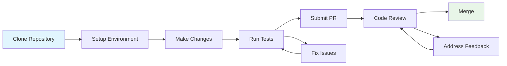
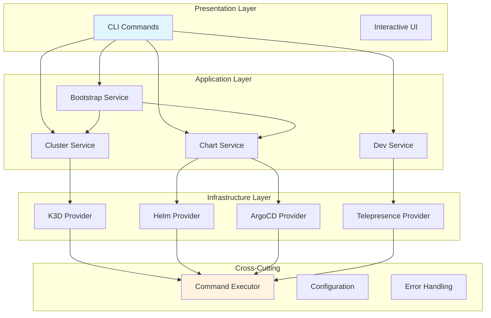

# Development Documentation

Welcome to the OpenFrame CLI development documentation! This section provides comprehensive guides for setting up your development environment, understanding the architecture, and contributing to the project.

## Overview

OpenFrame CLI is built with Go using modern development practices including clean architecture, dependency injection, and comprehensive testing. The codebase is organized into domain-driven modules with clear separation between commands, services, and infrastructure providers.

## Development Documentation Structure

### 🚀 Setup and Environment
Get your development environment configured and ready for contribution:

- **[Environment Setup](setup/environment.md)** - IDE, tools, and extensions
- **[Local Development](setup/local-development.md)** - Clone, build, and run locally

### 🏗️ Architecture and Design  
Understand the system design and internal components:

- **[Architecture Overview](architecture/overview.md)** - High-level design patterns and component relationships

### 🧪 Testing and Quality
Maintain code quality and reliability:

- **[Testing Overview](testing/overview.md)** - Test structure, running tests, and coverage

### 🤝 Contributing
Guidelines for contributing code and documentation:

- **[Contributing Guidelines](contributing/guidelines.md)** - Code style, PR process, and review checklist

## Quick Navigation

| Need to... | Go to... |
|------------|----------|
| **Set up development environment** | [Environment Setup](setup/environment.md) |
| **Clone and run locally** | [Local Development](setup/local-development.md) |
| **Understand the codebase** | [Architecture Overview](architecture/overview.md) |
| **Run tests** | [Testing Overview](testing/overview.md) |
| **Submit a contribution** | [Contributing Guidelines](contributing/guidelines.md) |

## Technology Stack

OpenFrame CLI is built using modern Go development tools and practices:

| Component | Technology | Purpose |
|-----------|------------|---------|
| **CLI Framework** | [Cobra](https://cobra.dev/) | Command structure and argument parsing |
| **UI/UX** | [pterm](https://github.com/pterm/pterm) | Interactive terminal interfaces |
| **Testing** | [testify](https://github.com/stretchr/testify) | Assertions and mocking |
| **Container Runtime** | [K3D](https://k3d.io/) | Local Kubernetes clusters |
| **GitOps** | [ArgoCD](https://argo-cd.readthedocs.io/) | Application deployment |
| **Traffic Interception** | [Telepresence](https://www.telepresence.io/) | Local development against remote clusters |

## Development Workflow



### Core Development Principles

1. **Clean Architecture**: Domain-driven design with clear layer separation
2. **Test-Driven Development**: Write tests first, ensure good coverage
3. **Interactive CLI Design**: Wizard-style interfaces for complex operations
4. **Dependency Injection**: Mockable interfaces for reliable testing
5. **Error Handling**: Comprehensive error types with user-friendly messages

## Getting Started with Development

### Prerequisites for Development
Ensure you have the development prerequisites installed:

```bash
# Core development tools
go version       # Go 1.21 or later
git --version    # Git for version control
make --version   # Make for build automation

# Optional but recommended
golangci-lint --version  # Code linting
gofmt --help            # Code formatting
```

### Development Commands
```bash
# Build the CLI
make build

# Run tests
make test

# Run tests with coverage
make test-coverage

# Lint code
make lint

# Format code
make fmt

# Run all quality checks
make check
```

## Architecture at a Glance

OpenFrame CLI follows a layered architecture pattern:



## Key Design Patterns

| Pattern | Implementation | Benefits |
|---------|----------------|----------|
| **Command Pattern** | Cobra commands with Execute() methods | Clear separation of CLI concerns |
| **Service Layer** | Business logic in service packages | Testable, reusable components |
| **Provider Pattern** | Infrastructure adapters | Swappable implementations |
| **Dependency Injection** | Constructor injection with interfaces | Mockable for testing |
| **Configuration Builder** | Fluent configuration APIs | Type-safe, discoverable settings |

## Common Development Tasks

### Adding a New Command
1. Create command file in appropriate `cmd/` subdirectory
2. Implement Cobra command with flags and validation
3. Add business logic to corresponding service
4. Write tests for command and service
5. Update help documentation

### Adding a New Provider
1. Define interface in service layer
2. Implement provider in `internal/*/providers/`
3. Add provider to dependency injection
4. Write unit tests with mocks
5. Add integration tests

### Extending Configuration
1. Add fields to configuration models
2. Update configuration builders
3. Add validation rules
4. Update documentation
5. Maintain backward compatibility

## Contributing

We welcome contributions! Before getting started:

1. **Read the [Contributing Guidelines](contributing/guidelines.md)**
2. **Check existing [issues](https://github.com/flamingo-stack/openframe-cli/issues)**
3. **Set up your [development environment](setup/environment.md)**
4. **Understand the [architecture](architecture/overview.md)**

## Support

For development-related questions:

- **Architecture Questions**: See [Architecture Overview](architecture/overview.md)
- **Setup Issues**: Check [Environment Setup](setup/environment.md)
- **Testing Help**: Review [Testing Overview](testing/overview.md)
- **Contribution Process**: Follow [Contributing Guidelines](contributing/guidelines.md)

---

Ready to start developing? Begin with [Environment Setup](setup/environment.md) to configure your development workspace.