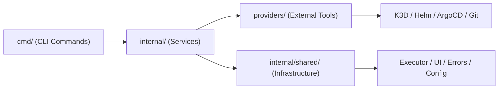

# Development Documentation

Welcome to the OpenFrame CLI development guide. This section covers everything you need to contribute to, build, test, and extend the OpenFrame CLI codebase.

---

## Overview

OpenFrame CLI is written in **Go** and uses [Cobra](https://github.com/spf13/cobra) for command routing. The codebase follows a layered architecture: CLI commands delegate to internal services, which use provider abstractions over external tools (K3D, Helm, ArgoCD, Git, Telepresence, Skaffold).


```mermaid
graph LR
    A["cmd/ (CLI Commands)"] --> B["internal/ (Services)"]
    B --> C["providers/ (External Tools)"]
    B --> D["internal/shared/ (Infrastructure)"]
    C --> E["K3D / Helm / ArgoCD / Git"]
    D --> F["Executor / UI / Errors / Config"]
```

---

## Documentation Index

| Guide | Description |
|---|---|
| [Environment Setup](setup/environment.md) | IDE configuration, development tools, editor extensions |
| [Local Development](setup/local-development.md) | Clone, build, run, and debug the CLI locally |
| [Architecture Overview](architecture/README.md) | High-level architecture, component relationships, data flows |
| [Security Best Practices](security/README.md) | Auth patterns, secrets management, security guidelines |
| [Testing Guide](testing/README.md) | Test structure, running tests, writing new tests |
| [Contributing Guidelines](contributing/guidelines.md) | Code style, branch naming, PR process, commit conventions |

---

## Quick Navigation

### I want to…

**Set up my development environment**
→ Start with [Environment Setup](setup/environment.md), then follow [Local Development](setup/local-development.md)

**Understand how the code is organized**
→ Read the [Architecture Overview](architecture/README.md)

**Run or write tests**
→ Go to the [Testing Guide](testing/README.md)

**Submit a contribution**
→ Review the [Contributing Guidelines](contributing/guidelines.md)

**Understand security considerations**
→ Read [Security Best Practices](security/README.md)

---

## Repository Structure at a Glance

```text
openframe-cli/
├── main.go                          # Binary entry point
├── cmd/                             # Cobra CLI commands
│   ├── root.go                      # Root command wiring
│   ├── bootstrap/bootstrap.go       # openframe bootstrap
│   ├── cluster/                     # openframe cluster *
│   ├── chart/                       # openframe chart *
│   └── dev/                         # openframe dev *
├── internal/                        # Business logic (not exported)
│   ├── bootstrap/                   # Bootstrap service
│   ├── cluster/                     # Cluster service, models, providers
│   ├── chart/                       # Chart service, models, providers, UI
│   ├── dev/                         # Dev service, intercept, scaffold
│   └── shared/                      # Cross-cutting concerns
│       ├── executor/                # Command execution abstraction
│       ├── errors/                  # Error types and handlers
│       ├── ui/                      # Prompts, tables, logo, progress
│       ├── config/                  # TLS, credentials, system init
│       ├── files/                   # File cleanup utilities
│       └── flags/                   # Global flag management
└── tests/                           # Test utilities and integration tests
    ├── testutil/                    # Mock executors, flag factories
    ├── integration/                 # End-to-end CLI integration tests
    └── mocks/                       # Mock implementations
```

---

## Technology Stack

| Component | Technology |
|---|---|
| Language | Go |
| CLI framework | [Cobra](https://github.com/spf13/cobra) |
| Terminal UI | [pterm](https://github.com/pterm/pterm) |
| Interactive prompts | [promptui](https://github.com/manifoldco/promptui) |
| Kubernetes client | [client-go](https://pkg.go.dev/k8s.io/client-go) |
| ArgoCD client | [argo-cd/v2](https://pkg.go.dev/github.com/argoproj/argo-cd/v2) |
| YAML processing | [sigs.k8s.io/yaml](https://pkg.go.dev/sigs.k8s.io/yaml), [gopkg.in/yaml.v3](https://pkg.go.dev/gopkg.in/yaml.v3) |
| Testing | [testify](https://github.com/stretchr/testify) |
| Cluster provider | K3D (via CLI) |
| GitOps | ArgoCD + Helm app-of-apps |

---

## Getting Help

- **OpenMSP Slack**: [openmsp.ai](https://www.openmsp.ai/) — primary support channel
- **Join Slack**: [Slack invite link](https://join.slack.com/t/openmsp/shared_invite/zt-36bl7mx0h-3~U2nFH6nqHqoTPXMaHEHA)
