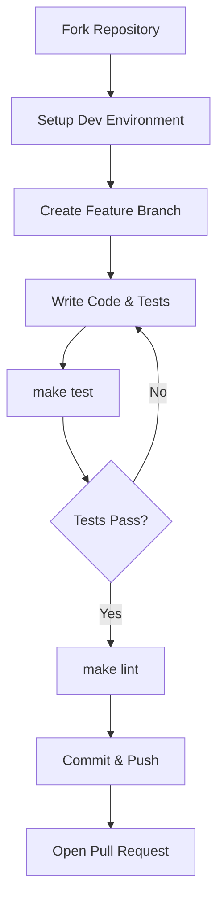

# Development Documentation

Guides for building, running, and contributing to OpenFrame CLI.

## Contents

- **[Architecture Overview](architecture/README.md)** - High-level design, components, and data flows
- **[Environment Setup](setup/environment.md)** - IDE, tools, and development dependencies
- **[Local Development](setup/local-development.md)** - Clone, build, run, test, and debug locally

## Key Technologies

| Technology | Purpose | Version |
|------------|---------|---------|
| **Go** | Primary language | 1.26 |
| **Cobra** | CLI framework | v1.10 |
| **client-go** | Kubernetes API client | v0.36 |
| **k3d** | Local Kubernetes clusters | v5+ |
| **Helm** | Chart installation | v3+ |
| **ArgoCD** | GitOps deployments (consumed via the Kubernetes dynamic client) | — |

## Project Structure

```text
openframe-cli/
├── main.go                 # Application entry point
├── go.mod / go.sum         # Go module definition and checksums
├── Makefile                # build / test / lint targets
├── cmd/                    # CLI command definitions
│   ├── root.go            # Root command and version info
│   ├── bootstrap/         # Full environment bootstrap
│   ├── cluster/           # Cluster management (create/delete/list/status/cleanup)
│   ├── app/               # App-of-apps install/upgrade/status/access/uninstall
│   ├── prerequisites/     # Prerequisite check/install
│   └── update/            # Self-update (check/rollback)
├── internal/              # Private application code
│   ├── bootstrap/         # Bootstrap orchestration
│   ├── cluster/           # Cluster lifecycle management
│   ├── chart/             # Helm/ArgoCD integration
│   ├── app/               # App install/upgrade logic
│   ├── k8s/               # Kubernetes client helpers
│   ├── platform/          # OS/platform detection
│   ├── prerequisites/     # Prerequisite detection and install
│   └── shared/            # Common utilities (incl. wsllauncher for Windows/WSL2)
├── tests/                 # Cross-package tests
│   ├── integration/       # Integration tests
│   └── testutil/          # Test helpers
└── docs/                  # Documentation
```

Unit tests are colocated as `*_test.go` files inside each package under `cmd/` and `internal/`.

## Development Workflow


```mermaid
flowchart TD
    A[Fork Repository] --> B[Setup Dev Environment]
    B --> C[Create Feature Branch]
    C --> D[Write Code & Tests]
    D --> E[make test]
    E --> F{Tests Pass?}
    F -->|No| D
    F -->|Yes| G[make lint]
    G --> H[Commit & Push]
    H --> I[Open Pull Request]
```

## Getting Started

### Prerequisites
- Go 1.26 or later
- Docker plus Kubernetes tooling (kubectl, helm, k3d)
- Git and a code editor

On Windows the CLI forwards into WSL2 and runs as a Linux binary; the WSL launch is handled by `internal/shared/wsllauncher`.

### Quick Start
1. Read the [Architecture Overview](architecture/README.md).
2. Follow [Environment Setup](setup/environment.md).
3. Complete [Local Development](setup/local-development.md).

## Getting Help

- **OpenMSP Slack**: [Join the community](https://join.slack.com/t/openmsp/shared_invite/zt-36bl7mx0h-3~U2nFH6nqHqoTPXMaHEHA)
- Browse the guides in this directory and existing pull requests.
