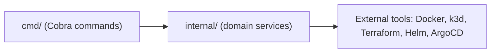

# Development Documentation

This section covers everything you need to develop, test, and contribute to OpenFrame CLI — the Go-based command-line tool that provisions Kubernetes clusters and deploys the OpenFrame platform.

> OpenFrame CLI lives in [flamingo-stack/openframe-cli](https://github.com/flamingo-stack/openframe-cli). The platform it deploys (charts, services, app-of-apps) lives in the separate [flamingo-stack/openframe-oss-tenant](https://github.com/flamingo-stack/openframe-oss-tenant) repository.

## Contents

| Document | Description |
|---|---|
| [Environment Setup](setup/environment.md) | IDE recommendations, required tools, and editor configuration for Go development |
| [Local Development](setup/local-development.md) | Cloning, building, running, and debugging the CLI locally |
| [Architecture Overview](architecture/README.md) | High-level component map, data flow, and key design decisions |
| [Security](security/README.md) | Secure-download, signing, secret-redaction, and self-update security model |
| [Testing](testing/README.md) | Test structure, running unit/integration tests, and writing new tests |
| [Contributing Guidelines](contributing/guidelines.md) | Code style, branching, commit conventions, and PR review checklist |

## Quick Orientation

OpenFrame CLI is organized as a [Cobra](https://github.com/spf13/cobra) command tree (`cmd/`) backed by domain services under `internal/`:

```mermaid
graph LR
    cmd["cmd/ (Cobra commands)"] --> internal["internal/ (domain services)"]
    internal --> external["External tools: Docker, k3d, Terraform, Helm, ArgoCD"]
```

- `cmd/` — thin command adapters (flags → service calls); one subpackage per command group (`bootstrap`, `cluster`, `app`, `prerequisites`, `update`).
- `internal/` — all business logic: cluster provisioning, chart installation, status aggregation, self-update, shared UI/executor/error infrastructure.
- `tests/` — `testutil` (shared unit-test helpers, mock executor, flag-contract testing) and `integration/common` (builds and drives the real `openframe` binary end-to-end).

Start with [Environment Setup](setup/environment.md) if this is your first time working on the codebase, or jump straight to [Local Development](setup/local-development.md) if your Go toolchain is already configured.
