# Development Documentation

Welcome to the OpenFrame CLI development documentation! This section provides comprehensive guides for developers who want to contribute to OpenFrame CLI, extend its functionality, or deeply understand its architecture and implementation.

## Documentation Overview

This development section is organized into focused areas to help you quickly find the information you need:

### 🚀 **Setup & Environment**
Get your development environment ready and running locally.

- **[Environment Setup](setup/environment.md)** - IDE configuration, recommended tools, and development environment setup
- **[Local Development](setup/local-development.md)** - Clone, build, run, and debug OpenFrame CLI locally

### 🏗️ **Architecture & Design**
Understand the system design and architectural decisions.

- **[Architecture Overview](architecture/overview.md)** - High-level system design, component relationships, and data flow

### 🧪 **Testing**
Learn about the testing strategy and how to write effective tests.

- **[Testing Overview](testing/overview.md)** - Test structure, running tests, writing new tests, and coverage requirements

### 🤝 **Contributing**
Guidelines for contributing to the project.

- **[Contributing Guidelines](contributing/guidelines.md)** - Code style, PR process, review checklist, and community standards

## Quick Navigation

| I want to... | Go to |
|--------------|--------|
| **Set up my development environment** | [Environment Setup](setup/environment.md) |
| **Run OpenFrame CLI from source** | [Local Development](setup/local-development.md) |
| **Understand the codebase structure** | [Architecture Overview](architecture/overview.md) |
| **Add new features or fix bugs** | [Contributing Guidelines](contributing/guidelines.md) |
| **Write or run tests** | [Testing Overview](testing/overview.md) |
| **Debug issues or add logging** | [Local Development Guide](setup/local-development.md#debugging) |

## Development Workflow Quick Start

New to OpenFrame CLI development? Follow this path:

```mermaid
graph TD
    START[👋 New Developer] --> ENV[📦 Setup Environment]
    ENV --> CLONE[📥 Clone & Build]
    CLONE --> ARCH[🏗️ Study Architecture]
    ARCH --> TEST[🧪 Run Tests]
    TEST --> FEATURE[✨ Pick First Issue]
    FEATURE --> PR[🔄 Submit PR]
    PR --> REVIEW[👀 Code Review]
    REVIEW --> MERGE[🎉 Merged!]
    
    click ENV "setup/environment.html"
    click CLONE "setup/local-development.html"
    click ARCH "architecture/overview.html"
    click TEST "testing/overview.html"
    click PR "contributing/guidelines.html"
```



## Essential Commands for Development

Once you have your environment set up, these are the commands you'll use most:

### Development Server
```bash
# Run from source with hot reload
go run . cluster create --help

# Build and test locally
make build
./bin/openframe --version

# Run all tests
make test

# Run with verbose debugging
go run . --verbose cluster create
```

### Testing & Quality
```bash
# Run unit tests
go test ./...

# Run integration tests
make integration-test

# Check code coverage
go test -cover ./...

# Lint code
golangci-lint run
```

### Working with Dependencies
```bash
# Add new dependency
go mod tidy

# Update dependencies
go get -u ./...

# Vendor dependencies
go mod vendor
```

## Key Development Concepts

Understanding these concepts will help you navigate the codebase:

### Command Structure
OpenFrame CLI uses the Cobra framework with a hierarchical command structure:
- **Root Command** (`cmd/root.go`) - Entry point and global flags
- **Command Groups** (`cmd/cluster/`, `cmd/chart/`, `cmd/dev/`) - Feature groupings
- **Subcommands** (`create.go`, `delete.go`, etc.) - Individual operations

### Service Layer Pattern
Business logic is separated into service layers:
- **Models** (`internal/*/models/`) - Data structures and types
- **Services** (`internal/*/services/`) - Core business logic
- **Providers** (`internal/*/providers/`) - External tool integrations
- **UI** (`internal/*/ui/`) - User interface and interaction

### Shared Components
Common functionality is centralized:
- **Executor** (`internal/shared/executor/`) - Command execution abstraction
- **UI Components** (`internal/shared/ui/`) - Reusable interface elements
- **Error Handling** (`internal/shared/errors/`) - Consistent error management
- **Configuration** (`internal/shared/config/`) - Settings management

## Development Best Practices

### Code Organization
- Follow Go package naming conventions
- Keep packages focused and cohesive
- Use dependency injection for testability
- Separate interface definitions from implementations

### Error Handling
- Use structured error types from `internal/shared/errors/`
- Provide actionable error messages
- Include context for debugging
- Implement retry logic where appropriate

### User Experience
- Use interactive prompts for configuration
- Provide clear progress indicators
- Show helpful error messages with next steps
- Support both verbose and silent modes

### Testing Strategy
- Write unit tests for business logic
- Use integration tests for command flows
- Mock external dependencies
- Test error conditions and edge cases

## Common Development Tasks

### Adding a New Command
1. Create command file in appropriate `cmd/` subdirectory
2. Implement command logic using Cobra patterns
3. Add service layer in `internal/` if needed
4. Write tests for both CLI and service layers
5. Update documentation and help text

### Adding External Tool Integration
1. Create provider in `internal/*/providers/`
2. Implement prerequisite checking
3. Add installation logic if auto-install supported
4. Create service abstraction layer
5. Add comprehensive error handling

### Improving User Experience
1. Add interactive prompts using `internal/shared/ui/`
2. Implement progress tracking for long operations
3. Provide clear status messages and help text
4. Add validation with helpful error messages

## Community & Support

### Getting Help
- **GitHub Discussions**: Ask questions and share ideas
- **Issues**: Report bugs or request features
- **Discord/Slack**: Real-time community chat
- **Code Reviews**: Learn from feedback on PRs

### Contributing Back
- Start with "good first issue" labels
- Improve documentation and examples
- Add tests for uncovered code paths
- Share your use cases and feedback

### Development Philosophy
OpenFrame CLI is built with these principles:
- **Developer Experience First**: Make common tasks simple and intuitive
- **Production Ready**: Include best practices and security by default
- **Community Driven**: Welcome contributions and feedback from users
- **Cross-Platform**: Support Windows, macOS, and Linux consistently

---

## Next Steps

Ready to start developing? Choose your path:

- **🆕 New to the project?** Start with [Environment Setup](setup/environment.md)
- **🏃 Ready to contribute?** Jump to [Contributing Guidelines](contributing/guidelines.md)  
- **🔍 Want to understand the code?** Read the [Architecture Overview](architecture/overview.md)
- **🐛 Found a bug?** Check the [Testing Overview](testing/overview.md)

> **💡 Pro Tip**: Join our developer community to stay updated on architectural decisions, get help with complex issues, and collaborate with other contributors.