# Development Documentation

Welcome to the OpenFrame CLI development documentation! This section provides comprehensive guides for developers who want to contribute to OpenFrame CLI, extend its functionality, or set up advanced development environments.

## 📋 Documentation Overview

This development section is organized into focused areas to help you quickly find the information you need:

### 🚀 Setup Guides
Get your development environment configured for maximum productivity:

- **[Environment Setup](./setup/environment.md)** - IDE configuration, tools, and extensions
- **[Local Development](./setup/local-development.md)** - Clone, build, and run locally

### 🏗️ Architecture Guides  
Understand how OpenFrame CLI is built and organized:

- **[Architecture Overview](./architecture/overview.md)** - System design, components, and data flow

### 🧪 Testing Guides
Learn about testing strategies and best practices:

- **[Testing Overview](./testing/overview.md)** - Test structure, running tests, and writing new tests

### 📝 Contributing Guides
Guidelines for contributing code and documentation:

- **[Contributing Guidelines](./contributing/guidelines.md)** - Code style, PR process, and review checklist

## 🎯 Quick Navigation

Choose your path based on your goals:

```mermaid
flowchart TD
    Start([👋 I want to...]) --> Choice{What's your goal?}
    
    Choice -->|🛠️ Set up for development| Setup[Setup Guides]
    Choice -->|🏗️ Understand the codebase| Architecture[Architecture Guides]
    Choice -->|🧪 Write or run tests| Testing[Testing Guides]
    Choice -->|📝 Contribute code/docs| Contributing[Contributing Guides]
    
    Setup --> EnvSetup[Environment Setup]
    Setup --> LocalDev[Local Development]
    
    Architecture --> ArchOverview[Architecture Overview]
    
    Testing --> TestOverview[Testing Overview]
    
    Contributing --> ContribGuidelines[Contributing Guidelines]
    
    style Setup fill:#e3f2fd
    style Architecture fill:#f3e5f5
    style Testing fill:#e8f5e8
    style Contributing fill:#fff3e0
```



## 🚀 For New Developers

If you're new to OpenFrame CLI development, follow this recommended path:

### 1. Environment Setup (15 minutes)
Start with [Environment Setup](./setup/environment.md) to configure your IDE and install development tools.

### 2. Local Development (10 minutes)  
Follow [Local Development](./setup/local-development.md) to clone the repository and run your first build.

### 3. Architecture Understanding (20 minutes)
Read the [Architecture Overview](./architecture/overview.md) to understand the codebase structure and design decisions.

### 4. Testing Setup (10 minutes)
Check out [Testing Overview](./testing/overview.md) to understand how to run and write tests.

### 5. Contributing Preparation (10 minutes)
Review [Contributing Guidelines](./contributing/guidelines.md) before making your first contribution.

**Total time investment: ~1 hour for complete onboarding**

## 🏗️ For Architecture Understanding

If you want to understand how OpenFrame CLI works internally:

| Component | Documentation | Key Files |
|-----------|---------------|-----------|
| **Command Structure** | [Architecture Overview](./architecture/overview.md) | `cmd/*/` |
| **Service Layer** | [Architecture Overview](./architecture/overview.md) | `internal/*/services/` |
| **Shared Components** | [Architecture Overview](./architecture/overview.md) | `internal/shared/` |
| **External Integrations** | [Architecture Overview](./architecture/overview.md) | `internal/*/` |

## 🧪 For Testing and Quality

Ensure your contributions maintain high quality:

### Testing Strategy
- **Unit Tests**: Test individual functions and methods
- **Integration Tests**: Test component interactions
- **End-to-End Tests**: Test complete user workflows
- **Documentation Tests**: Validate code examples

### Quality Tools
```bash
# Run all tests
go test ./...

# Run tests with coverage
go test -cover ./...

# Lint code
golangci-lint run

# Format code
go fmt ./...
```

See [Testing Overview](./testing/overview.md) for detailed testing guidelines.

## 📝 For Contributors

Ready to contribute? Here's your checklist:

### Before You Start
- [ ] Read [Contributing Guidelines](./contributing/guidelines.md)
- [ ] Set up your [development environment](./setup/environment.md)
- [ ] Understand the [architecture](./architecture/overview.md)
- [ ] Know how to [run tests](./testing/overview.md)

### Development Workflow
1. **Fork and clone** the repository
2. **Create a feature branch** with descriptive name
3. **Make your changes** following code style guidelines
4. **Add/update tests** for your changes
5. **Run the full test suite** to ensure nothing breaks
6. **Update documentation** if needed
7. **Submit a pull request** with clear description

### Types of Contributions Welcome
| Type | Examples | Documentation |
|------|----------|---------------|
| **Bug Fixes** | Fix command issues, error handling | [Contributing Guidelines](./contributing/guidelines.md) |
| **Features** | New commands, integrations | [Architecture Overview](./architecture/overview.md) |
| **Documentation** | Guides, examples, API docs | [Contributing Guidelines](./contributing/guidelines.md) |
| **Testing** | Test coverage, test utilities | [Testing Overview](./testing/overview.md) |
| **Refactoring** | Code organization, performance | [Architecture Overview](./architecture/overview.md) |

## 🛠️ Development Tools and Resources

### Essential Tools
| Tool | Purpose | Installation |
|------|---------|-------------|
| **Go 1.23+** | Primary language | [golang.org](https://golang.org) |
| **Docker** | Container testing | [docker.com](https://docker.com) |
| **Git** | Version control | [git-scm.com](https://git-scm.com) |
| **Make** | Build automation | System package manager |

### Recommended IDE Setup
- **VS Code** with Go extension
- **GoLand** with Kubernetes plugin  
- **Vim/Neovim** with vim-go
- **Emacs** with go-mode

See [Environment Setup](./setup/environment.md) for detailed IDE configuration.

### Useful Commands

```bash
# Development workflow
make build          # Build the CLI
make test           # Run tests  
make lint           # Lint code
make clean          # Clean build artifacts

# Testing specific components
go test ./cmd/cluster/...     # Test cluster commands
go test ./internal/shared/... # Test shared components

# Integration testing
make test-integration         # Run integration tests
make test-e2e                # Run end-to-end tests
```

## 📚 Additional Resources

### External Documentation
- **Go Documentation**: https://pkg.go.dev/
- **Cobra CLI**: https://cobra.dev/
- **Kubernetes Client**: https://pkg.go.dev/k8s.io/client-go
- **Docker SDK**: https://pkg.go.dev/github.com/docker/docker

### Community Resources
- **GitHub Discussions**: Ask questions and share ideas
- **Issue Templates**: Report bugs or request features
- **Code Examples**: Real-world usage patterns in tests

## 🤝 Getting Help

If you need assistance during development:

### Documentation Issues
- **Missing information**: Open an issue requesting documentation
- **Outdated examples**: Submit a PR with updated examples
- **Unclear instructions**: Open an issue with specific questions

### Technical Issues
- **Build failures**: Check [Local Development](./setup/local-development.md)
- **Test failures**: Review [Testing Overview](./testing/overview.md)
- **Architecture questions**: See [Architecture Overview](./architecture/overview.md)

### Community Support
- **GitHub Issues**: Technical problems and bug reports
- **GitHub Discussions**: General questions and feature ideas  
- **Pull Request Reviews**: Code feedback and suggestions

## 🚀 Ready to Start?

Choose your next step:

- **New to development?** → Start with [Environment Setup](./setup/environment.md)
- **Ready to code?** → Go to [Local Development](./setup/local-development.md)
- **Want to understand the code?** → Read [Architecture Overview](./architecture/overview.md)
- **Ready to contribute?** → Review [Contributing Guidelines](./contributing/guidelines.md)

Happy coding! 🎉 The OpenFrame CLI project welcomes your contributions and we're here to help you succeed.