# Development Documentation

Welcome to the OpenFrame CLI development documentation! This section provides comprehensive guides for developers who want to contribute to OpenFrame CLI, understand its architecture, or customize it for their specific needs.

## 📚 Documentation Structure

This development documentation is organized into several key areas:

### 🛠️ Setup & Environment
Get your development environment ready for contributing to OpenFrame CLI.

| Guide | Purpose | Audience |
|-------|---------|----------|
| **[Environment Setup](setup/environment.md)** | IDE, tools, and development environment configuration | New contributors |
| **[Local Development](setup/local-development.md)** | Clone, build, run, and debug OpenFrame CLI locally | All developers |

### 🏗️ Architecture & Design
Understand how OpenFrame CLI is built and why design decisions were made.

| Guide | Purpose | Audience |
|-------|---------|----------|
| **[Architecture Overview](architecture/overview.md)** | System design, components, and data flow | Developers, architects |

### 🧪 Testing & Quality
Learn about testing strategies and maintaining code quality.

| Guide | Purpose | Audience |
|-------|---------|----------|
| **[Testing Overview](testing/overview.md)** | Test structure, running tests, writing new tests | Contributors |

### 🤝 Contributing
Guidelines for contributing code, documentation, and features.

| Guide | Purpose | Audience |
|-------|---------|----------|
| **[Contributing Guidelines](contributing/guidelines.md)** | Code style, PR process, review checklist | Contributors |

## 🚀 Quick Start for Developers

If you're new to OpenFrame CLI development, follow this path:

```mermaid
flowchart TD
    Start([Want to Contribute?]) --> Setup[1. Environment Setup]
    Setup --> Local[2. Local Development]
    Local --> Architecture[3. Architecture Overview]
    Architecture --> Testing[4. Testing Overview]
    Testing --> Contributing[5. Contributing Guidelines]
    Contributing --> Code[Start Coding! 🎉]
    
    Setup --> SetupDocs[setup/environment.md]
    Local --> LocalDocs[setup/local-development.md]
    Architecture --> ArchDocs[architecture/overview.md]
    Testing --> TestDocs[testing/overview.md]
    Contributing --> ContribDocs[contributing/guidelines.md]
```



### First-Time Contributor Checklist

- [ ] **[Set up development environment](setup/environment.md)** - Install Go, IDE extensions, and tools
- [ ] **[Clone and build locally](setup/local-development.md)** - Get the code running on your machine
- [ ] **[Read architecture overview](architecture/overview.md)** - Understand the system design
- [ ] **[Run the test suite](testing/overview.md)** - Ensure everything works correctly
- [ ] **[Review contributing guidelines](contributing/guidelines.md)** - Learn the development workflow

## 🎯 Development Goals & Principles

OpenFrame CLI is built with these core principles:

### User Experience First
- **Intuitive Commands**: Follow CLI conventions and patterns users expect
- **Clear Feedback**: Provide helpful error messages and progress indicators
- **Interactive & Automated**: Support both interactive use and CI/CD automation

### Code Quality
- **Modular Architecture**: Clean separation between UI, business logic, and external integrations
- **Comprehensive Testing**: Unit tests, integration tests, and end-to-end validation
- **Documentation**: Code is self-documenting with clear comments and structure

### Maintainability
- **Consistent Patterns**: Follow established patterns across the codebase
- **Minimal Dependencies**: Carefully evaluate external dependencies
- **Backward Compatibility**: Respect existing APIs and user workflows

## 🛠️ Technology Stack

OpenFrame CLI is built using modern Go practices and integrates with the Kubernetes ecosystem:

| Technology | Purpose | Why We Use It |
|------------|---------|---------------|
| **Go 1.19+** | Primary language | Performance, concurrency, static binaries |
| **Cobra** | CLI framework | Powerful command-line interface builder |
| **K3d** | Local Kubernetes | Lightweight, Docker-based Kubernetes clusters |
| **Helm** | Package management | Industry-standard Kubernetes application packaging |
| **ArgoCD** | GitOps deployment | Declarative, Git-based application deployment |
| **Docker** | Containerization | Standard container runtime for K3d |

### External Tool Integration


## 📁 Repository Structure

```
openframe-cli/
├── cmd/                    # CLI command definitions (Cobra commands)
│   ├── bootstrap/          # Bootstrap command implementation
│   ├── cluster/            # Cluster management commands
│   ├── chart/              # Chart installation commands
│   └── dev/                # Development tools commands
├── internal/               # Private application code
│   ├── bootstrap/          # Bootstrap service logic
│   ├── cluster/            # Cluster management services
│   ├── chart/              # Chart installation services
│   ├── dev/                # Development tools services
│   └── shared/             # Shared utilities and components
├── docs/                   # Documentation (this section)
│   ├── getting-started/    # User onboarding guides
│   ├── development/        # Developer documentation (you are here)
│   └── reference/          # Generated API reference
├── tests/                  # Test files and test data
├── scripts/                # Build and development scripts
├── .github/                # GitHub workflows and templates
└── deployments/            # Deployment configurations
```

## 🔧 Common Development Tasks

### Building and Testing
```bash
# Build the binary
go build -o bin/openframe main.go

# Run tests
go test ./...

# Run integration tests
go test -tags=integration ./...

# Generate documentation
go generate ./...
```

### Code Quality
```bash
# Format code
go fmt ./...

# Lint code  
golangci-lint run

# Check for security issues
gosec ./...

# Check dependencies
go mod tidy
go mod verify
```

### Local Testing
```bash
# Test bootstrap functionality
./bin/openframe bootstrap test-cluster --verbose

# Test cluster operations
./bin/openframe cluster create test
./bin/openframe cluster status test
./bin/openframe cluster delete test
```

## 🐛 Debugging & Troubleshooting

### Development Debugging
```bash
# Enable verbose logging
OPENFRAME_LOG_LEVEL=debug ./bin/openframe bootstrap

# Use delve debugger
dlv debug main.go -- bootstrap --verbose

# Profile memory usage
go tool pprof http://localhost:6060/debug/pprof/heap
```

### Common Issues
- **Build failures**: Check Go version and dependencies with `go mod verify`
- **Test failures**: Ensure Docker is running and tools are installed
- **Integration test issues**: Clean up test clusters with `k3d cluster delete --all`

## 🤝 Getting Help

### For Development Questions
- **GitHub Discussions**: Ask questions and share ideas
- **GitHub Issues**: Report bugs or request features
- **Code Reviews**: Learn from PR feedback and reviews

### For Code Understanding
- **Architecture docs**: Start with [Architecture Overview](architecture/overview.md)
- **Inline comments**: Code includes extensive documentation
- **Test files**: Tests serve as usage examples

### For Contributing
- **Contributing guidelines**: See [Contributing Guidelines](contributing/guidelines.md)
- **Code review checklist**: Ensure your code meets standards
- **CI/CD pipeline**: Understand automated checks and requirements

## 📈 Development Roadmap

Current focus areas for OpenFrame CLI development:

### Short Term (Current Sprint)
- Enhanced error handling and user feedback
- Improved test coverage for edge cases  
- Documentation improvements and examples

### Medium Term (Next Quarter)
- Plugin architecture for extensibility
- Advanced deployment mode configurations
- Performance optimizations for large clusters

### Long Term (Future Releases)
- Multi-cluster management capabilities
- Advanced GitOps workflow integration
- Cloud provider integration options

---

## Ready to Start?

Choose your next step based on your goals:

**🔨 I want to contribute code**: Start with [Environment Setup](setup/environment.md)  
**🏗️ I want to understand the architecture**: Jump to [Architecture Overview](architecture/overview.md)  
**🧪 I want to run tests**: Check out [Testing Overview](testing/overview.md)  
**📝 I want to contribute documentation**: See [Contributing Guidelines](contributing/guidelines.md)

---

> 💡 **Pro Tip**: The best way to learn OpenFrame CLI is to start with the [Local Development](setup/local-development.md) guide, build it yourself, and then explore the codebase while running examples.