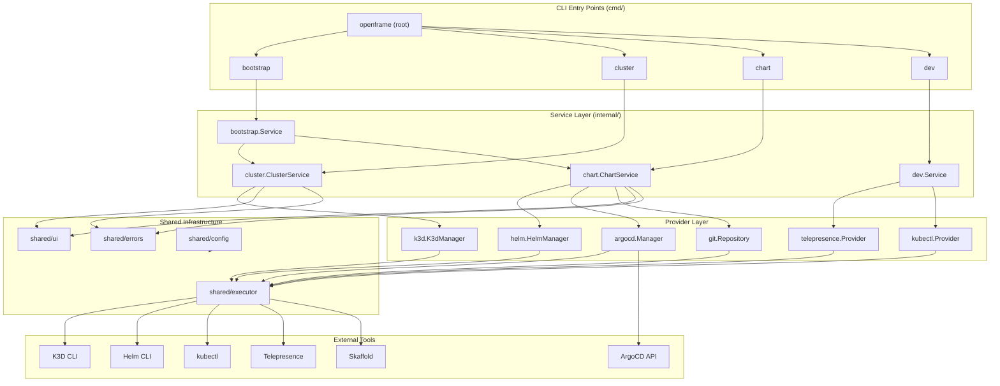
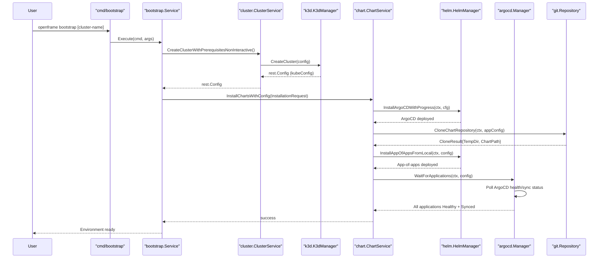
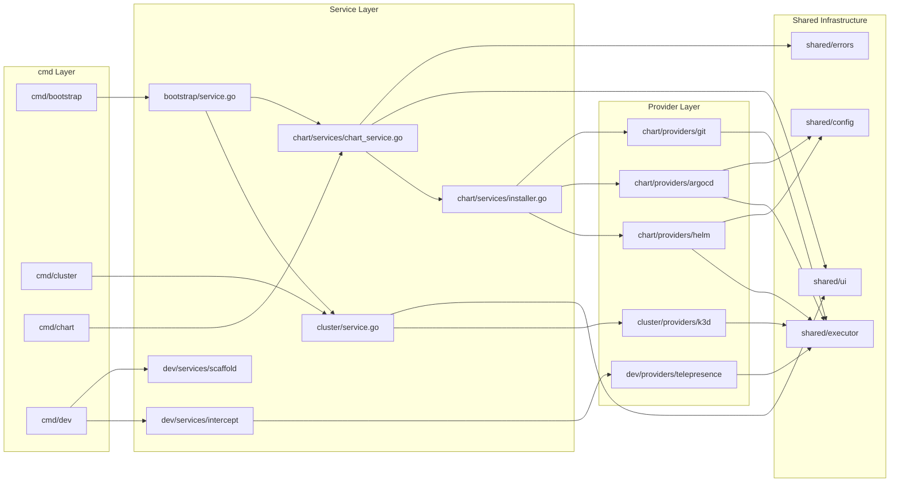

# Architecture Overview

OpenFrame CLI is a structured Go application that orchestrates complex Kubernetes infrastructure operations through a clean layered architecture. This document describes the high-level design, component relationships, and key data flows.

---

## Design Philosophy

The CLI is designed around three principles:

1. **Layered separation** — Commands never touch infrastructure directly; they delegate to Services, which delegate to Providers, which wrap external tools via a unified Executor.
2. **Interface-driven** — All infrastructure providers implement typed interfaces (`ArgoCDService`, `HelmProvider`, `ClusterLister`, etc.) defined in `internal/chart/utils/types/interfaces.go`, enabling easy mocking for tests.
3. **Dual-mode operation** — Every workflow supports both interactive (wizard-guided) and non-interactive (flag-driven) modes, making the same binary suitable for human use and CI/CD automation.

---

## High-Level Architecture



---

## Core Components

| Package | Path | Responsibility |
|---|---|---|
| `cmd` | `cmd/` | Cobra command definitions, flag parsing, entry points |
| `bootstrap` | `internal/bootstrap/` | Orchestrates cluster creation + chart installation sequentially |
| `cluster` | `internal/cluster/` | Cluster lifecycle: create, delete, list, status via K3D |
| `chart/services` | `internal/chart/services/` | ArgoCD + app-of-apps workflow orchestration |
| `chart/providers/argocd` | `internal/chart/providers/argocd/` | Native Kubernetes API calls to ArgoCD, application polling |
| `chart/providers/helm` | `internal/chart/providers/helm/` | Helm CLI wrapper, chart install/upgrade |
| `chart/providers/git` | `internal/chart/providers/git/` | Git clone of app-of-apps repos to temp directories |
| `chart/ui/configuration` | `internal/chart/ui/configuration/` | Interactive wizard for deployment mode, Docker, ingress |
| `cluster/providers/k3d` | `internal/cluster/providers/k3d/` | K3D cluster CRUD, kubeconfig management, WSL2 support |
| `cluster/prerequisites` | `internal/cluster/prerequisites/` | Validates Docker, kubectl, k3d, helm prerequisites |
| `chart/prerequisites` | `internal/chart/prerequisites/` | Validates Git, Helm, mkcert, memory requirements |
| `dev/services/intercept` | `internal/dev/services/intercept/` | Telepresence intercept lifecycle management |
| `dev/services/scaffold` | `internal/dev/services/scaffold/` | Skaffold workflow: cluster bootstrap + live reload |
| `shared/executor` | `internal/shared/executor/` | Unified command execution (real + mock), WSL2 helpers |
| `shared/ui` | `internal/shared/ui/` | Logo, prompts, tables, progress, message templates |
| `shared/errors` | `internal/shared/errors/` | Typed errors, retry policies, user-facing formatting |
| `shared/config` | `internal/shared/config/` | TLS config, credentials prompting |

---

## Bootstrap Data Flow

The `openframe bootstrap` command is the primary workflow. Here is the full sequence:



---

## Dependency Layers



---

## Key Design Decisions

### 1. CommandExecutor Abstraction

All external tool invocations go through `internal/shared/executor`. This abstraction:
- Allows injecting `MockCommandExecutor` in unit tests with pattern-based response injection
- Handles WSL2 detection and WSL recovery transparently
- Provides consistent error wrapping across all providers

### 2. Interface-Driven Providers

All provider types are defined as Go interfaces in `internal/chart/utils/types/interfaces.go`:

```go
// Example from the codebase
type ArgoCDService interface { ... }
type HelmProvider interface { ... }
type ClusterLister interface { ... }
```

This means any provider can be swapped for a mock in tests without changing service code.

### 3. Prerequisite Checking Pattern

Both the cluster and chart subsystems use a `PrerequisiteChecker` struct that:
- Checks each tool via a configurable `check` function
- Returns per-tool `Requirement` structs with install instructions
- Can skip auto-install checks in CI environments

### 4. Wizard vs. Flag Mode

Every command that accepts wizard prompts also accepts equivalent flags. The `--non-interactive` flag disables all prompts and uses provided flags or defaults. This is enforced at the command layer (`cmd/`), not the service layer.

---

## External Dependencies

| Library | Role |
|---|---|
| `github.com/spf13/cobra` | CLI command definitions, flag parsing, subcommand routing |
| `github.com/pterm/pterm` | Spinners, tables, colored output, progress bars |
| `github.com/manifoldco/promptui` | Interactive select menus and text input |
| `k8s.io/client-go` | Native Kubernetes API client for ArgoCD monitoring |
| `github.com/argoproj/argo-cd/v2` | ArgoCD typed clientset |
| `k8s.io/apimachinery` | Kubernetes API types |
| `gopkg.in/yaml.v3` | YAML parsing for Helm values files |
| `sigs.k8s.io/yaml` | YAML marshaling for K8s manifests |
| `github.com/stretchr/testify` | Test assertions |

---

## Reference Documentation

For detailed per-package documentation, see the full architecture reference:

- [Full Architecture Reference](../../reference/architecture/overview.md)
