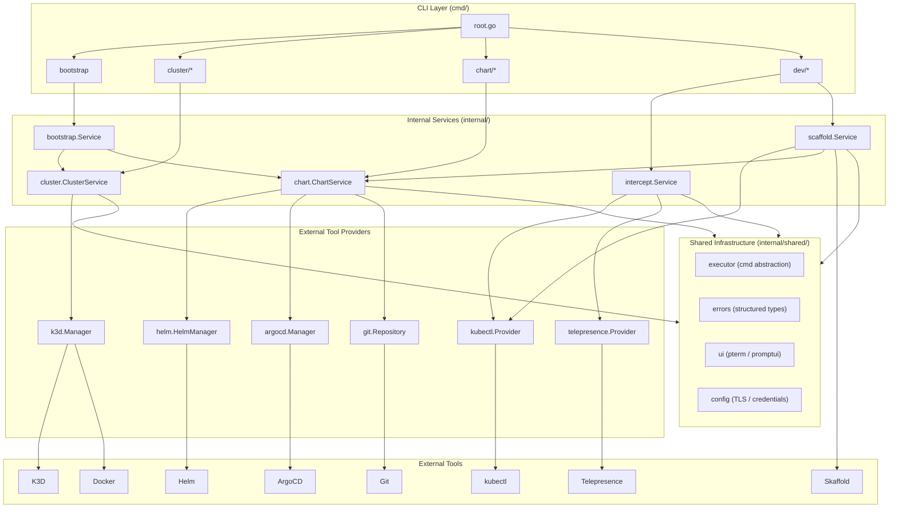
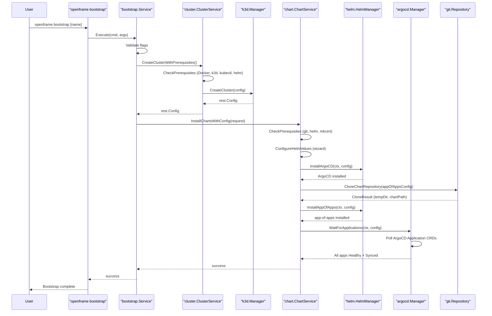
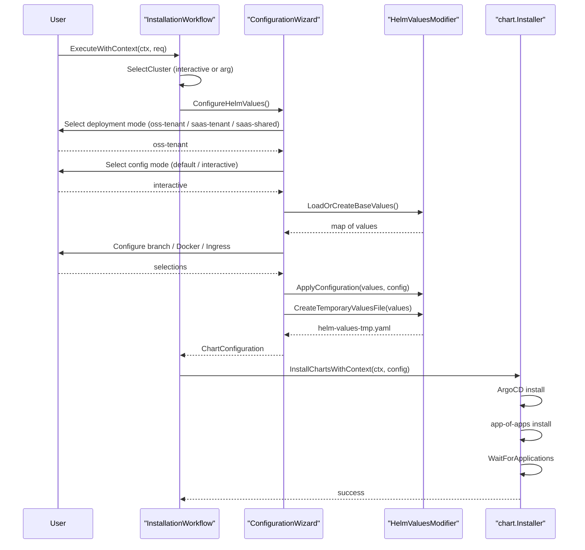
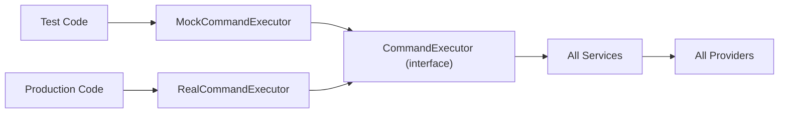
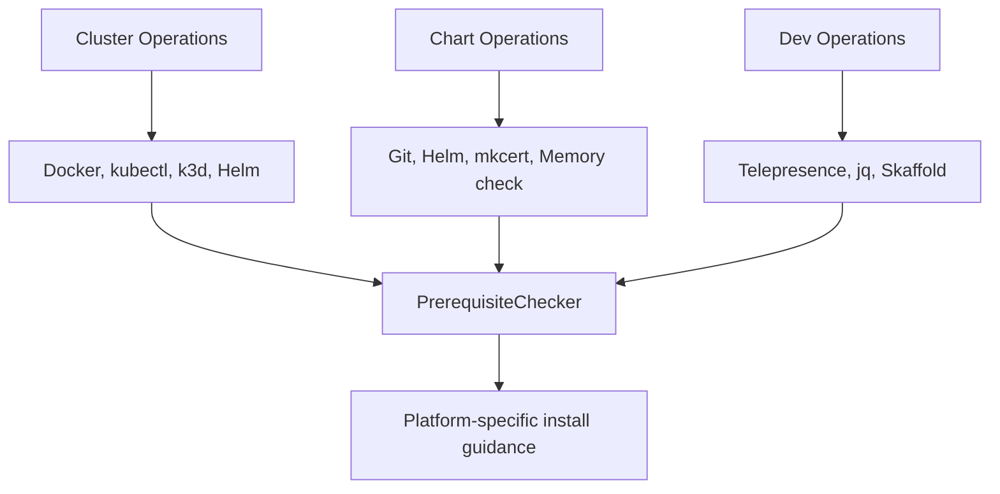

# Architecture Overview

OpenFrame CLI is a Go-based command-line tool built with a strict layered architecture. Commands at the top delegate to internal services, which use provider abstractions over external tools. All cross-cutting concerns (command execution, error handling, UI, configuration) live in a shared infrastructure layer.

> For the full architecture reference, see [./reference/architecture/overview.md](./reference/architecture/overview.md).

---

## High-Level Architecture

---

## Core Components

| Package | Path | Responsibility |
|---|---|---|
| **Root Command** | `cmd/root.go` | Entry point; wires all subcommands, version info, global flags |
| **Bootstrap Command** | `cmd/bootstrap/` | Orchestrates cluster creation + chart installation in one command |
| **Cluster Command** | `cmd/cluster/` | Subcommands: create, delete, list, status, cleanup |
| **Chart Command** | `cmd/chart/` | Subcommands: install (ArgoCD + app-of-apps) |
| **Dev Command** | `cmd/dev/` | Subcommands: intercept, skaffold |
| **Bootstrap Service** | `internal/bootstrap/service.go` | Sequentially calls cluster create then chart install; handles Windows WSL init |
| **Cluster Service** | `internal/cluster/service.go` | Business logic for cluster lifecycle; wraps K3D manager |
| **K3D Manager** | `internal/cluster/providers/k3d/manager.go` | Low-level K3D operations via CLI; produces `rest.Config` |
| **Chart Service** | `internal/chart/services/chart_service.go` | Orchestrates ArgoCD + app-of-apps installation workflow |
| **Helm Manager** | `internal/chart/providers/helm/manager.go` | Helm operations using native Go clients + kubectl fallback |
| **ArgoCD Manager** | `internal/chart/providers/argocd/applications.go` | Watches ArgoCD application health/sync via native K8s clients |
| **Git Repository** | `internal/chart/providers/git/repository.go` | Shallow-clones app-of-apps chart repo to temp dir |
| **Intercept Service** | `internal/dev/services/intercept/service.go` | Manages Telepresence intercept lifecycle |
| **Scaffold Service** | `internal/dev/services/scaffold/service.go` | Runs Skaffold dev workflow with cluster bootstrap |
| **Configuration Wizard** | `internal/chart/ui/configuration/wizard.go` | Interactive Helm values configuration wizard |
| **Shared Executor** | `internal/shared/executor/executor.go` | Command execution abstraction (real + mock); handles WSL on Windows |
| **Shared Errors** | `internal/shared/errors/errors.go` | Structured error types, retry policies, user-friendly display |
| **Shared UI** | `internal/shared/ui/` | Prompts, tables, logo, progress tracking via pterm/promptui |

---

## Bootstrap Command Data Flow

The most important flow is the `bootstrap` command, which orchestrates the full environment setup:

---

## Configuration Wizard Flow

The interactive chart installation flow guides operators through Helm values configuration:

---

## Dependency Injection Pattern

The CLI uses constructor injection throughout. The `CommandExecutor` interface is the central abstraction that makes the entire CLI unit-testable without running real tools:

All services accept a `CommandExecutor` via their constructors. In production this is `executor.NewRealExecutor()`. In tests this is `testutil.NewTestMockExecutor()`.

---

## Error Handling Architecture

Errors in the CLI follow a structured pattern using custom error types:

| Error Type | When Used |
|---|---|
| `ValidationError` | Field validation failures (flag values, cluster names, ports) |
| `CommandError` | External tool execution failures (k3d, helm, kubectl) |
| `BranchNotFoundError` | Git branch not found in chart repositories |
| `AlreadyHandledError` | Errors already displayed — prevents double-showing |

The `ErrorHandler` routes errors to appropriate display logic based on type, using pterm for colored, user-friendly output with troubleshooting guidance.

---

## Prerequisite System

Each command group has its own prerequisite checker:

Prerequisite checkers detect CI environments and skip interactive prompts automatically.

---

## Key Design Decisions

1. **Interface-first providers** — All external tool interactions go through interfaces defined in `internal/*/utils/types/interfaces.go`, enabling full mockability in tests.

2. **Shared executor abstraction** — The `CommandExecutor` interface centralizes all shell command execution, with WSL2 wrapping built in for Windows.

3. **Structured error types** — Custom error types provide rich context for user-friendly display and enable programmatic error handling.

4. **Deferred Helm initialization** — The Helm manager defers Go client initialization until first use, preventing startup overhead for commands that don't need it.

5. **App-of-apps GitOps pattern** — The CLI shallow-clones the chart repository to a temp directory and installs locally, avoiding the need for a running chart server.

---

## Reference Documentation

For detailed per-component documentation, see the auto-generated reference:

- [Architecture Reference](./reference/architecture/overview.md) — Full CodeWiki output with complete component details
