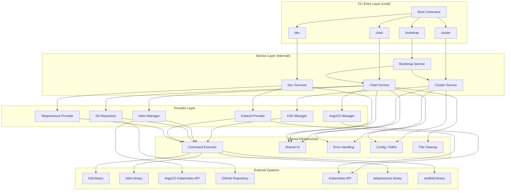
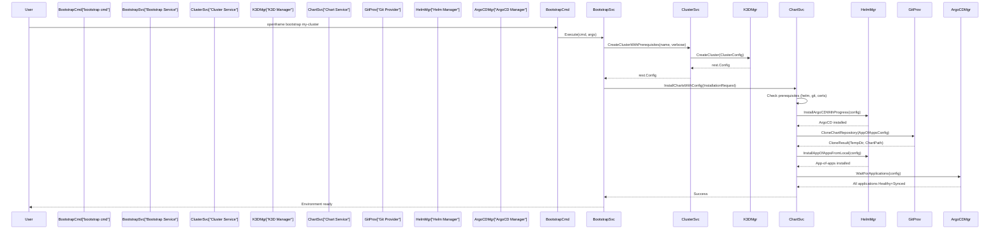

# Architecture Overview

OpenFrame CLI follows a **layered clean architecture** pattern: thin Cobra command handlers delegate to service layers, which compose providers and infrastructure utilities. All external I/O (Kubernetes API, shell commands, Git) is abstracted behind interfaces to maximize testability and portability.

For a deeper technical dive, see the [Reference Architecture Documentation](../../reference/architecture/overview.md).

---

## High-Level Architecture



---

## Core Components

| Package | Path | Responsibility |
|---------|------|----------------|
| **Root Command** | `cmd/root.go` | CLI entrypoint, global flags (`--verbose`, `--silent`), version info, subcommand registration |
| **Bootstrap Command** | `cmd/bootstrap/` | Orchestrates full environment setup: cluster create → chart install in sequence |
| **Cluster Command** | `cmd/cluster/` | Cobra subcommands for create, delete, list, status, cleanup |
| **Chart Command** | `cmd/chart/` | Cobra subcommands for ArgoCD + app-of-apps installation |
| **Dev Command** | `cmd/dev/` | Cobra subcommands for `intercept` (Telepresence) and `skaffold` workflows |
| **Bootstrap Service** | `internal/bootstrap/` | Business logic to sequence cluster creation then chart installation; handles Windows WSL init |
| **Cluster Service** | `internal/cluster/service.go` | High-level cluster lifecycle; delegates to K3D manager |
| **K3D Manager** | `internal/cluster/providers/k3d/` | Low-level K3D cluster operations; config file generation, kubeconfig management, TLS SAN injection |
| **Chart Service** | `internal/chart/services/` | Installation workflow: prerequisites → git clone → helm install ArgoCD → app-of-apps → ArgoCD sync wait |
| **Helm Manager** | `internal/chart/providers/helm/` | Helm CLI wrapper; installs ArgoCD and app-of-apps charts; native K8s client fallback |
| **ArgoCD Manager** | `internal/chart/providers/argocd/` | Watches ArgoCD `Application` CRDs via native Go client; waits for Healthy+Synced state |
| **Git Repository** | `internal/chart/providers/git/` | Clones GitHub repos (`--depth 1`) to temp dirs for chart content |
| **Configuration Wizard** | `internal/chart/ui/configuration/` | Multi-step interactive wizard for deployment mode, SaaS credentials, ingress, Docker registry |
| **Intercept Service** | `internal/dev/services/intercept/` | Manages full Telepresence lifecycle: connect → intercept → wait → cleanup on signal |
| **Scaffold Service** | `internal/dev/services/scaffold/` | Discovers `skaffold.yaml` files, bootstraps cluster, runs `skaffold dev` |
| **Command Executor** | `internal/shared/executor/` | Abstracts `os/exec`; supports dry-run and verbose modes; WSL2 detection and recovery |
| **Shared UI** | `internal/shared/ui/` | Logo rendering, selection prompts, table rendering, confirmation dialogs |
| **Shared Errors** | `internal/shared/errors/` | Typed errors with retry policies and colored terminal output |
| **Shared Config** | `internal/shared/config/` | TLS bypass utilities, credentials prompter, log directory init |

---

## Layer Responsibilities

### 1. CLI Layer (`cmd/`)

Thin Cobra command definitions. Responsibilities:
- Parse CLI flags
- Validate flag combinations
- Delegate all business logic to the service layer
- Handle the `--verbose` / `--silent` global flags

No business logic lives in `cmd/` — it is purely a wiring layer.

### 2. Service Layer (`internal/*/service*.go`, `internal/*/services/`)

Business logic orchestration. Responsibilities:
- Sequence multi-step operations (e.g., cluster create → chart install)
- Coordinate between providers
- Manage UI feedback (spinners, progress, next-steps output)
- Handle errors with typed error propagation

### 3. Provider Layer (`internal/*/providers/`)

Thin wrappers around external tools and APIs. Responsibilities:
- Invoke external binaries via the `CommandExecutor`
- Make Kubernetes API calls using native Go clients
- Return strongly-typed results

Each provider implements an interface so it can be replaced with a mock in tests.

### 4. Shared Infrastructure (`internal/shared/`)

Cross-cutting utilities used by all layers:
- **`executor/`** — subprocess runner with WSL2 support, dry-run mode, verbose mode
- **`ui/`** — all terminal UI primitives (pterm + promptui)
- **`errors/`** — typed errors, retry policies, colored error display
- **`config/`** — TLS configuration, credentials, system service initialization
- **`files/`** — temporary file lifecycle management

---

## Data Flow: Bootstrap Command



---

## Key Design Decisions

### Interface-Based External I/O

All subprocess execution goes through the `CommandExecutor` interface:

```go
type CommandExecutor interface {
    Execute(ctx context.Context, command string, args ...string) (*CommandResult, error)
    ExecuteWithOptions(ctx context.Context, opts ExecuteOptions) (*CommandResult, error)
}
```

This means any unit test can inject a `MockCommandExecutor` that returns pre-configured responses without ever invoking `k3d`, `helm`, or `kubectl`.

### Native Kubernetes Clients for ArgoCD

Rather than shelling out to `kubectl` for ArgoCD Application polling, the CLI uses the generated ArgoCD Go clientset (`k8s.io/client-go` + ArgoCD versioned client). This provides:
- Reliable multi-platform behavior (no subprocess path resolution issues on Windows/WSL2)
- Type-safe Application CRD access
- Watch/poll loops with proper context cancellation

### WSL2-Aware Execution

The `RealCommandExecutor` detects Windows WSL2 environments and:
- Converts Unix paths to WSL-compatible paths where needed
- Wraps commands with `wsl -e` prefix when necessary
- Provides health-check and recovery utilities for the WSL2 Ubuntu distribution

### Configuration Wizard Pattern

The interactive configuration wizard (`internal/chart/ui/configuration/`) uses a strategy pattern — each configuration aspect (branch, Docker registry, ingress, SaaS credentials) is encapsulated in a dedicated configurator struct that implements the same workflow interface. The wizard orchestrates them in sequence.

---

## Key Dependencies

| Library | Usage |
|---------|-------|
| `github.com/spf13/cobra` | CLI framework — all commands, flags, usage templates |
| `github.com/pterm/pterm` | Rich terminal UI — spinners, tables, boxes, progress |
| `github.com/manifoldco/promptui` | Interactive selection menus and text input |
| `k8s.io/client-go` | Native Kubernetes API client |
| `github.com/argoproj/argo-cd/v2` | ArgoCD generated clientset for Application CRD polling |
| `gopkg.in/yaml.v3` | YAML parsing for helm-values.yaml and cluster configs |
| `golang.org/x/term` | Raw terminal mode for single-keystroke prompts |
