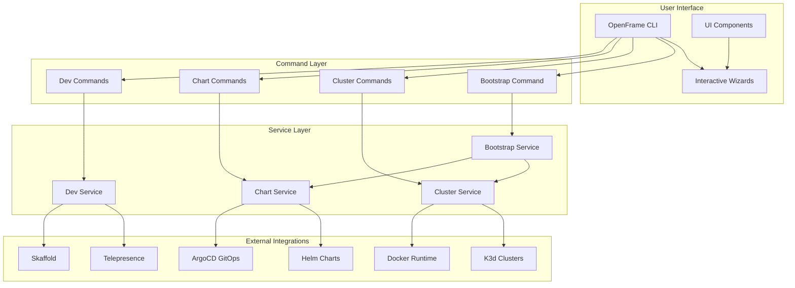
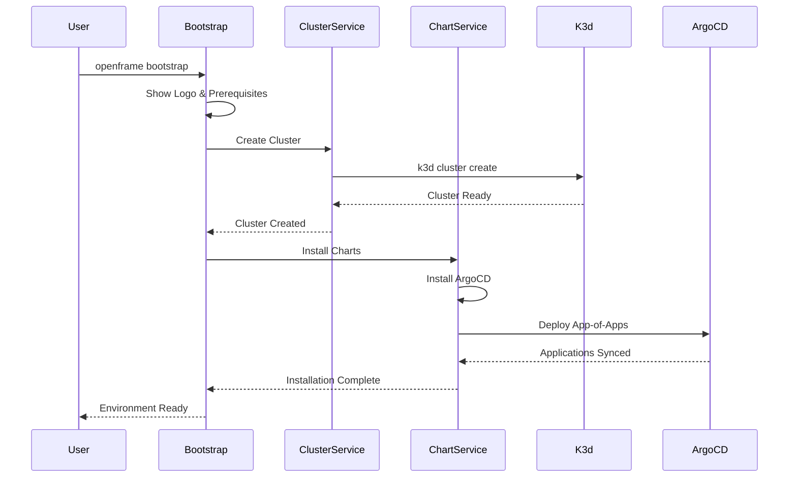
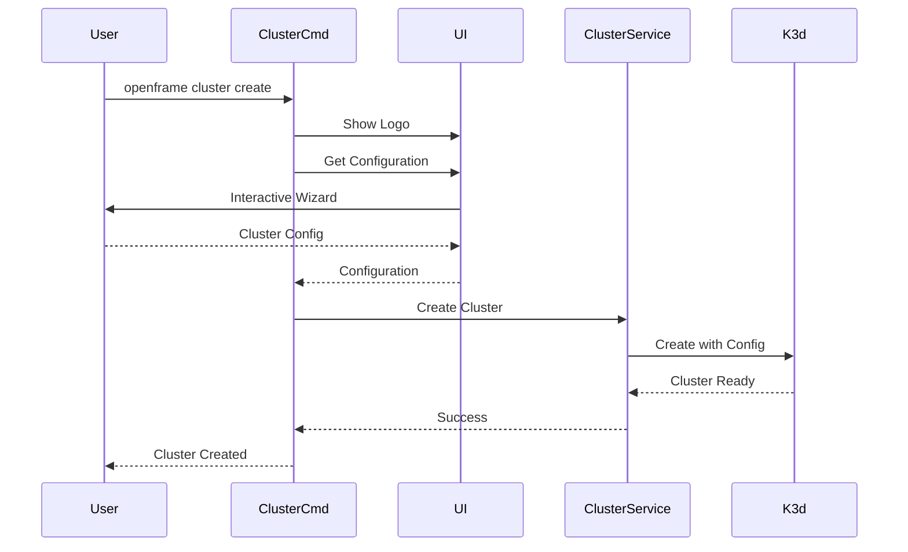
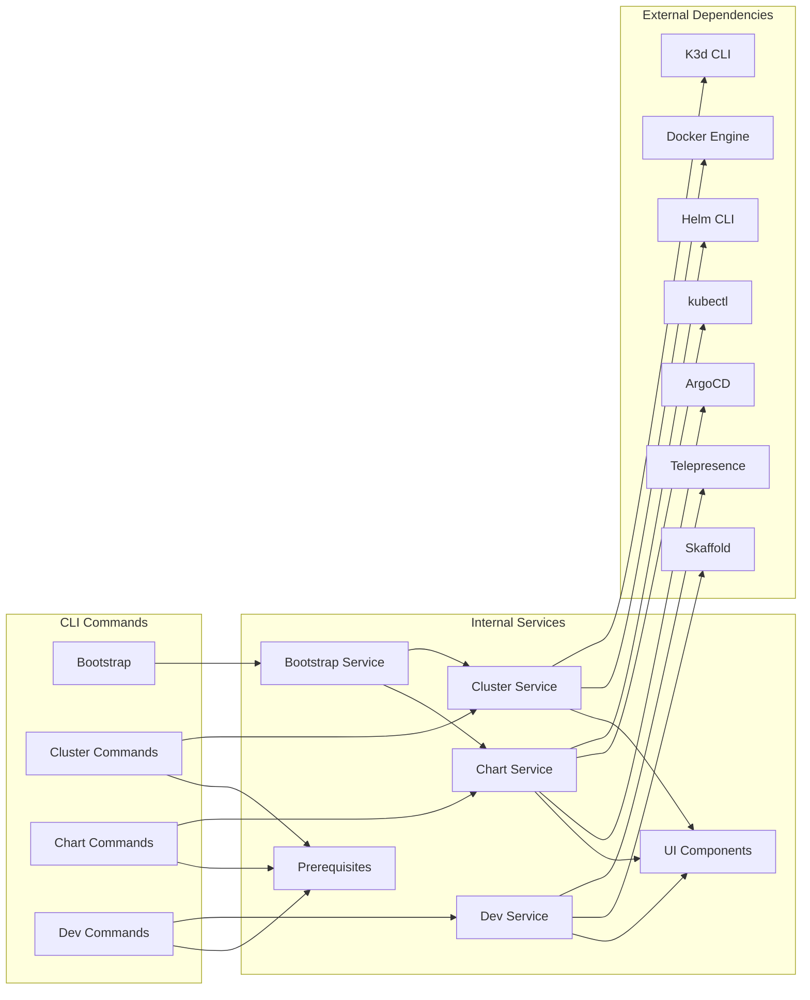

# Architecture Overview

This document provides a comprehensive overview of OpenFrame CLI's architecture, design patterns, and component relationships.

## High-Level Architecture

OpenFrame CLI follows a modular, command-driven architecture that orchestrates Kubernetes cluster lifecycle management with integrated GitOps workflows.



## Core Components

| Component | Package | Responsibility | Dependencies |
|-----------|---------|----------------|--------------|
| **Bootstrap Service** | `internal/bootstrap` | Orchestrates complete environment setup | Cluster Service, Chart Service |
| **Cluster Service** | `internal/cluster` | Kubernetes cluster lifecycle management | K3d, Docker, kubectl |
| **Chart Service** | `internal/chart` | Helm chart and ArgoCD installation | Helm, ArgoCD, kubectl |
| **Development Service** | `internal/dev` | Local development workflow tools | Telepresence, Skaffold |
| **UI Components** | `internal/ui` | Interactive prompts and formatted output | Cobra, Survey |
| **Prerequisites** | `internal/prerequisites` | Tool availability and version checking | External tool binaries |

## Command Structure and Flow

### Bootstrap Workflow



### Cluster Management Workflow



## Data Flow and Dependencies

### Component Relationships



## Key Design Patterns

### 1. Command Pattern

Each CLI command is implemented as a separate package with a consistent interface:

```go
// Command interface pattern
type Command interface {
    Execute(cmd *cobra.Command, args []string) error
}

// Service interface pattern  
type Service interface {
    Execute(cmd *cobra.Command, args []string) error
    Validate() error
    Prerequisites() error
}
```

### 2. Service Layer Pattern

Business logic is separated from command handling:

- **Commands** (`cmd/`) handle CLI parsing and user interaction
- **Services** (`internal/`) contain business logic and orchestration
- **External integrations** are abstracted through service interfaces

### 3. Dependency Injection

Services receive their dependencies through constructors:

```go
type BootstrapService struct {
    clusterService ClusterService
    chartService   ChartService
    ui            UIComponents
}

func NewBootstrapService(cluster ClusterService, chart ChartService, ui UIComponents) *BootstrapService {
    return &BootstrapService{
        clusterService: cluster,
        chartService:   chart,
        ui:            ui,
    }
}
```

### 4. Configuration Management

Configuration is managed through structured types with validation:

```go
type ClusterConfig struct {
    Name          string            `yaml:"name" validate:"required"`
    NodeCount     int              `yaml:"nodeCount" validate:"min=1,max=10"`
    Resources     ResourceLimits   `yaml:"resources"`
    Network       NetworkConfig    `yaml:"network"`
    AddOns        []string         `yaml:"addOns"`
}
```

## Directory Structure and Responsibilities

### Command Layer (`cmd/`)

```text
cmd/
├── bootstrap/          # Complete environment setup
│   └── bootstrap.go   # Cobra command definition
├── cluster/           # Cluster lifecycle management
│   ├── cluster.go     # Root cluster command
│   ├── create.go      # Interactive cluster creation
│   ├── delete.go      # Safe cluster deletion
│   ├── list.go        # Display managed clusters
│   ├── status.go      # Cluster health monitoring
│   └── cleanup.go     # Resource cleanup
├── chart/             # Helm chart and ArgoCD management
│   ├── chart.go       # Root chart command
│   └── install.go     # ArgoCD installation
└── dev/               # Development workflow tools
    └── dev.go         # Development tools parent command
```

### Service Layer (`internal/`)

```text
internal/
├── bootstrap/         # Bootstrap orchestration logic
├── cluster/          # Cluster management services
├── chart/            # Chart installation services
├── dev/              # Development workflow services
├── ui/               # User interface components
├── utils/            # Shared utilities
└── models/           # Data structures and validation
```

### Public Packages (`pkg/`)

```text
pkg/
├── config/           # Configuration management
├── k3d/              # K3d integration
├── helm/             # Helm integration
└── argocd/           # ArgoCD integration
```

## Error Handling Strategy

### Layered Error Handling

```go
// Domain errors
type ClusterError struct {
    Operation string
    Cluster   string
    Cause     error
}

// Service errors wrap domain errors
func (s *ClusterService) CreateCluster(config ClusterConfig) error {
    if err := s.validateConfig(config); err != nil {
        return fmt.Errorf("cluster configuration invalid: %w", err)
    }
    
    if err := s.k3d.CreateCluster(config); err != nil {
        return &ClusterError{
            Operation: "create",
            Cluster:   config.Name,
            Cause:     err,
        }
    }
    
    return nil
}

// Commands handle service errors
func (cmd *CreateCommand) Execute(args []string) error {
    if err := cmd.service.CreateCluster(config); err != nil {
        var clusterErr *ClusterError
        if errors.As(err, &clusterErr) {
            return fmt.Errorf("failed to %s cluster %s: %w", 
                clusterErr.Operation, clusterErr.Cluster, clusterErr.Cause)
        }
        return err
    }
    return nil
}
```

## Concurrency and Performance

### Concurrent Operations

- **Parallel Installation**: ArgoCD and applications install concurrently
- **Resource Monitoring**: Background monitoring of cluster health
- **Cleanup Operations**: Concurrent cleanup of multiple resources

### Performance Optimizations

- **Lazy Loading**: External tool validation only when needed
- **Caching**: Configuration and status caching for repeated operations  
- **Streaming**: Real-time log streaming for long operations
- **Connection Pooling**: Reuse of kubectl and Docker connections

## Testing Architecture

### Test Structure

```text
testing/
├── unit/              # Unit tests for individual components
├── integration/       # Integration tests with external tools
├── e2e/              # End-to-end workflow tests
├── fixtures/         # Test data and configurations
└── mocks/            # Mock implementations for external dependencies
```

### Testing Patterns

- **Unit Tests**: Test individual functions and methods in isolation
- **Integration Tests**: Test integration with external tools (Docker, K3d)
- **End-to-End Tests**: Test complete workflows from CLI to cluster
- **Mock Objects**: Mock external dependencies for reliable testing

## Configuration and Extensibility

### Plugin Architecture

OpenFrame CLI is designed for extensibility:

- **Command Plugins**: New commands can be added through the plugin interface
- **Service Extensions**: New services can be registered and discovered
- **External Tool Integration**: New tools can be integrated through standardized interfaces

### Configuration Hierarchy

1. **Command Line Flags**: Highest priority, override everything
2. **Environment Variables**: Override configuration files
3. **Configuration Files**: User and system-level configuration
4. **Default Values**: Built-in sensible defaults

## Security Considerations

### Principle of Least Privilege

- Commands run with minimal required permissions
- External tool execution is sandboxed where possible
- Configuration validation prevents malicious inputs

### Credential Management

- No credentials stored in configuration files
- Integration with system credential stores
- Secure handling of Kubernetes contexts and Docker credentials

## Performance Characteristics

### Resource Usage

- **Memory**: Minimal memory footprint, streaming for large operations
- **CPU**: Efficient concurrent operations, minimal CPU overhead
- **Disk**: Temporary files cleaned automatically
- **Network**: Efficient use of connections, connection pooling

### Scalability

- **Multi-Cluster**: Support for managing multiple clusters concurrently
- **Large Deployments**: Efficient handling of large ArgoCD deployments
- **Resource Cleanup**: Automatic cleanup prevents resource accumulation

## Future Architecture Considerations

### Planned Enhancements

- **Remote Cluster Support**: Extend beyond local K3d clusters
- **Plugin Ecosystem**: Standardized plugin architecture
- **Web Interface**: Optional web UI for cluster management
- **Metrics and Observability**: Built-in monitoring and metrics collection

### Extensibility Points

- **Custom Deployment Modes**: Support for organization-specific modes
- **External Tool Integration**: Framework for integrating new tools
- **Configuration Providers**: Support for external configuration sources
- **Event System**: Plugin system based on events and hooks

> 📐 **Architecture Philosophy**: OpenFrame CLI prioritizes simplicity, reliability, and extensibility. The modular design ensures that each component can be understood, tested, and modified independently while maintaining clear interfaces and responsibilities.