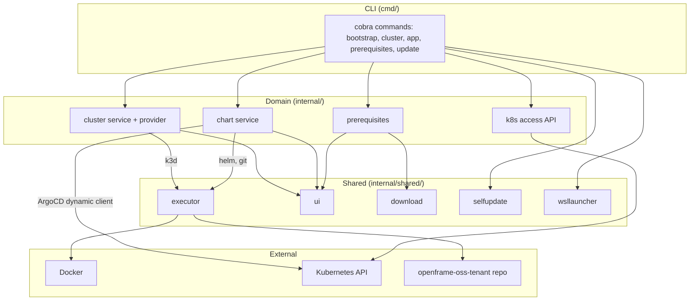

# Architecture Overview

OpenFrame CLI (`openframe`) is a Go 1.26 + Cobra tool that stands up OpenFrame on
Kubernetes. It is organized around three isolated concerns — **cluster**,
**app**, and **prerequisites** — with a thin **bootstrap** orchestrator and a
self-**update** command. See [../../architecture/decisions.md](../../architecture/decisions.md)
for the design rationale and [../../architecture/overview.md](../../architecture/overview.md)
for the package-level map.

## Layers

## Command Layer (`cmd/`)

Cobra commands parse flags and delegate to the domain packages. `cmd/root.go`
adds global `--verbose` / `--silent` flags, runs each command under a
signal-cancelled context, forwards the CLI into WSL2 on Windows, and runs the
best-effort self-update check afterwards.

| Group | Subcommands |
|-------|-------------|
| `bootstrap` | orchestrator: `prerequisites → cluster create → app install` |
| `cluster` | `create`, `delete`, `list`, `status`, `cleanup` |
| `app` (alias `chart`, `c`) | `install`, `upgrade`, `status`, `access`, `uninstall` |
| `prerequisites` | `check`, `install` |
| `update` | self-update, `check`, `rollback` |

There is no `dev`/`chart` command group and no intercept, scaffold, Telepresence,
or Skaffold code anywhere in the CLI.

## Domain Layer (`internal/`)

- **`internal/cluster`** — cluster lifecycle. `provider/` defines a cluster
  provider interface parameterized by provider and target; only **k3d (local)**
  is implemented, cloud targets return a "coming soon" message.
- **`internal/chart`** — installs the OpenFrame app. `providers/git` clones the
  chart repo, `providers/helm` installs the app-of-apps release, and
  `providers/argocd` drives ArgoCD through the Kubernetes dynamic client.
- **`internal/app`** — app-level `status` and `uninstall` helpers.
- **`internal/k8s`** — the cluster-access API used by `app` commands: list
  contexts, build a `rest.Config`, and check cluster health/resources. The `app`
  subsystem talks to a cluster only through this API and never imports
  cluster-creation code.
- **`internal/prerequisites`** and per-domain `prerequisites/` packages — OS-aware
  checkers/installers.
- **`internal/platform`** — OS detection and Windows/WSL2 documentation hints.

## Shared Infrastructure (`internal/shared/`)

| Package | Responsibility |
|---------|----------------|
| `executor` | Runs external commands (k3d, helm, kubectl, git, docker, mkcert) with consistent output/error handling; mockable in tests |
| `ui` | pterm-based logo, spinners, sections, tables, prompts |
| `config` | System initialization and configuration |
| `download` | Verified, SHA-256-pinned tool downloads into a CLI-managed bin dir |
| `selfupdate` | Checksum + cosign (sigstore-go) verified binary self-update with rollback |
| `wsllauncher` | Windows → WSL2 forwarding and WSL setup |
| `errors`, `redact`, `files`, `flags` | Error handling, secret redaction, file helpers, shared flags |

## Deploy Flow

`app install` (and `bootstrap`) performs:

1. `git` clones `openframe-oss-tenant`.
2. `helm` installs the app-of-apps chart as the release **`app-of-apps`**.
3. The chart creates an ArgoCD **root `Application` named `argocd-apps`** that
   fans out to child `Application` resources.
4. The CLI waits, via the dynamic client, for the applications to become healthy.

`app upgrade --sync` patches the `argocd-apps` root Application for a hard refresh
and sync; `app upgrade --ref` re-deploys the app-of-apps at a new git ref.

## ArgoCD via the Dynamic Client

ArgoCD is **not** imported as a Go module. All ArgoCD `Application` reads and
patches go through the Kubernetes **dynamic / unstructured client** (GVR
`argoproj.io/v1alpha1 applications`). This keeps the CLI version-agnostic against
the deployed ArgoCD and removes a large supply-chain dependency. See D6 in the
decisions doc.

## Platform Support

- **macOS / Linux** — prerequisites (Docker required; kubectl/k3d/helm
  auto-installed from pinned releases; mkcert for localhost HTTPS) are checked
  and installed.
- **Windows** — the CLI re-executes itself inside WSL2 and runs as a Linux
  binary; prerequisites are managed in the WSL environment.

## Self-Update

`internal/shared/selfupdate` downloads a release, verifies its checksum and
cosign signature, and atomically replaces the running binary with
backup/rollback. Post-command update notices are printed to stderr (never
blocking or altering the exit code); `OPENFRAME_AUTO_UPDATE=1` applies them in
place.

## Testing

- Domain services are tested against a mockable `executor` so external tools are
  not required.
- Kubernetes interactions use fake/dynamic clients.
- Command contracts (`*contract_test.go`) assert the command tree and flags stay
  stable.
