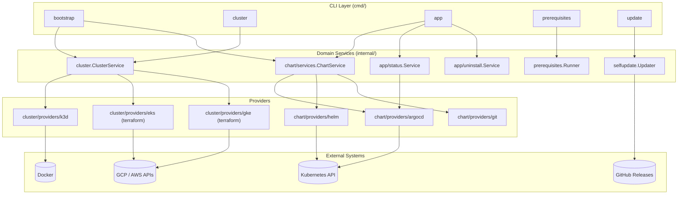
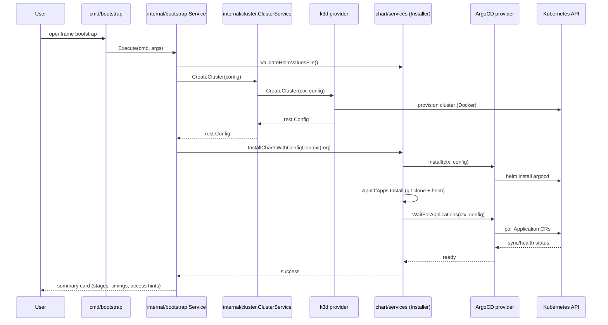
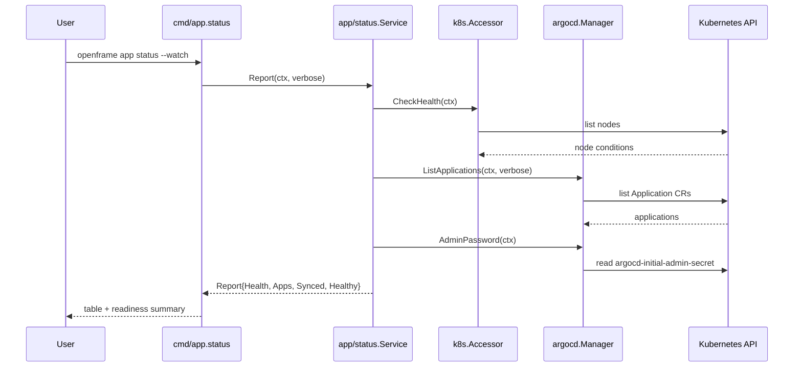

# Architecture Overview

OpenFrame CLI is organized around three core abstractions — **cluster** (provisioning), **app** (platform deployment via ArgoCD), and **prerequisites** (tool verification/installation) — plus supporting shared infrastructure for UI, execution, and self-update.

## High-Level Architecture

```mermaid
graph TB
    subgraph "CLI Layer (cmd/)"
        Bootstrap[bootstrap]
        Cluster[cluster]
        App[app]
        Prereq[prerequisites]
        Update[update]
    end

    subgraph "Domain Services (internal/)"
        ClusterSvc["cluster.ClusterService"]
        ChartSvc["chart/services.ChartService"]
        AppStatus["app/status.Service"]
        AppUninstall["app/uninstall.Service"]
        PrereqFw["prerequisites.Runner"]
        SelfUpdate["selfupdate.Updater"]
    end

    subgraph "Providers"
        K3d["cluster/providers/k3d"]
        EKS["cluster/providers/eks (terraform)"]
        GKE["cluster/providers/gke (terraform)"]
        ArgoCD["chart/providers/argocd"]
        Helm["chart/providers/helm"]
        Git["chart/providers/git"]
    end

    subgraph "External Systems"
        Docker[(Docker)]
        K8sAPI[(Kubernetes API)]
        CloudAPI[(GCP / AWS APIs)]
        GitHub[(GitHub Releases)]
    end

    Bootstrap --> ClusterSvc
    Bootstrap --> ChartSvc
    Cluster --> ClusterSvc
    App --> ChartSvc
    App --> AppStatus
    App --> AppUninstall
    Prereq --> PrereqFw
    Update --> SelfUpdate

    ClusterSvc --> K3d
    ClusterSvc --> EKS
    ClusterSvc --> GKE
    ChartSvc --> ArgoCD
    ChartSvc --> Helm
    ChartSvc --> Git
    AppStatus --> ArgoCD

    K3d --> Docker
    EKS --> CloudAPI
    GKE --> CloudAPI
    ArgoCD --> K8sAPI
    Helm --> K8sAPI
    SelfUpdate --> GitHub
```

The `internal/k8s` package deliberately isolates read/inspect access to an *existing* cluster (contexts, health, resources) from `internal/cluster`, which handles cluster *creation*. This lets `app install` target any reachable cluster — one made by `openframe cluster create`, or by the user directly.

## Core Components

| Component | Path | Responsibility |
|---|---|---|
| Root command | `cmd/root.go` | Cobra root, version metadata, global flags (`--silent`, `--verbose`, `--plain`), pinned-dependency reporting |
| Bootstrap | `cmd/bootstrap/`, `internal/bootstrap/` | One-shot `cluster create` + `app install` with a staged progress tracker |
| Cluster commands | `cmd/cluster/` | `create`, `delete`, `list`, `status`, `use`, `cleanup` subcommands |
| Cluster service | `internal/cluster/service.go` | Cluster lifecycle orchestration, provider dispatch, existing-cluster reuse logic |
| Cluster providers | `internal/cluster/providers/{k3d,eks,gke}` | Backend-specific cluster create/delete/status via Docker/k3d or Terraform |
| Cluster discovery | `internal/cluster/discovery/` | Finds cloud clusters outside the openframe registry (GKE/EKS), gcloud/AWS auth flows |
| Cluster prerequisites | `internal/cluster/prerequisites/` | Type-aware tool gates (Docker/k3d/helm for k3d; terraform+CLI for EKS/GKE) |
| App commands | `cmd/app/` | `install`, `upgrade`, `status`, `access`, `uninstall` subcommands |
| Chart services | `internal/chart/services/` | Orchestrates ArgoCD + app-of-apps install, validation, retries |
| ArgoCD provider | `internal/chart/providers/argocd/` | ArgoCD Helm install, application listing/sync, admin password, wait logic |
| Helm provider | `internal/chart/providers/helm/` | Helm CLI wrapper for install/upgrade/uninstall |
| Git provider | `internal/chart/providers/git/` | Clones the app-of-apps chart repository at a given ref |
| App status | `internal/app/status/` | Aggregates cluster health + ArgoCD app sync/health into a `Report` |
| App status TUI | `internal/app/status/tui/` | Interactive k9s-style bubbletea view for navigating/syncing apps |
| App uninstall | `internal/app/uninstall/` | Removes ArgoCD applications and Helm releases, keeping the cluster |
| Prerequisites framework | `internal/prerequisites/` | OS-aware `Prerequisite`/`Set`/`Runner` abstraction (auto-install on macOS/Linux, docs-only on Windows) |
| k8s access | `internal/k8s/` | Kubeconfig context resolution, `rest.Config` building, cluster health/resource checks |
| Platform hints | `internal/platform/` | Per-OS install guidance, Windows/WSL cluster-access error messaging |
| Shared executor | `internal/shared/executor/` | `CommandExecutor` abstraction (real + mock) for all shelled-out commands |
| Shared errors | `internal/shared/errors/` | Structured error handling, retry policy, friendly hints |
| Shared UI | `internal/shared/ui/` | Logo, spinners, prompts, glyphs, GitHub Actions annotations, silent/plain modes |
| Shared download | `internal/shared/download/` | Checksum-verified pinned-tool downloads (k3d, helm, mkcert, terraform, infracost) |
| Self-update | `internal/shared/selfupdate/` | Checks/applies CLI updates, cosign signature + checksum verification, rollback |
| WSL launcher | `internal/shared/wsllauncher/` | Forwards the native Windows binary into WSL2 for cluster operations |

## Data Flow: Bootstrap Sequence

```mermaid
sequenceDiagram
    participant User
    participant CLI as cmd/bootstrap
    participant Boot as internal/bootstrap.Service
    participant Cluster as internal/cluster.ClusterService
    participant K3d as k3d provider
    participant Chart as chart/services (Installer)
    participant ArgoCD as ArgoCD provider
    participant K8s as Kubernetes API

    User->>CLI: openframe bootstrap
    CLI->>Boot: Execute(cmd, args)
    Boot->>Chart: ValidateHelmValuesFile()
    Boot->>Cluster: CreateCluster(config)
    Cluster->>K3d: CreateCluster(ctx, config)
    K3d->>K8s: provision cluster (Docker)
    K3d-->>Cluster: rest.Config
    Cluster-->>Boot: rest.Config
    Boot->>Chart: InstallChartsWithConfigContext(req)
    Chart->>ArgoCD: Install(ctx, config)
    ArgoCD->>K8s: helm install argocd
    Chart->>Chart: AppOfApps.Install (git clone + helm)
    Chart->>ArgoCD: WaitForApplications(ctx, config)
    ArgoCD->>K8s: poll Application CRs
    K8s-->>ArgoCD: sync/health status
    ArgoCD-->>Chart: ready
    Chart-->>Boot: success
    Boot-->>User: summary card (stages, timings, access hints)
```

## Data Flow: App Status Aggregation

```mermaid
sequenceDiagram
    participant User
    participant CLI as cmd/app.status
    participant Svc as app/status.Service
    participant Accessor as k8s.Accessor
    participant ArgoCDMgr as argocd.Manager
    participant K8s as Kubernetes API

    User->>CLI: openframe app status --watch
    CLI->>Svc: Report(ctx, verbose)
    Svc->>Accessor: CheckHealth(ctx)
    Accessor->>K8s: list nodes
    K8s-->>Accessor: node conditions
    Svc->>ArgoCDMgr: ListApplications(ctx, verbose)
    ArgoCDMgr->>K8s: list Application CRs
    K8s-->>ArgoCDMgr: applications
    Svc->>ArgoCDMgr: AdminPassword(ctx)
    ArgoCDMgr->>K8s: read argocd-initial-admin-secret
    Svc-->>CLI: Report{Health, Apps, Synced, Healthy}
    CLI-->>User: table + readiness summary
```

## Key Design Decisions

- **Two separate cluster concerns.** `internal/cluster` (creation/provisioning) is kept distinct from `internal/k8s` (read/inspect access to an already-reachable cluster), so `app install`/`app status` can target any cluster regardless of who created it.
- **Provider abstraction over cluster backends.** `internal/cluster/provider` defines unified `Provider`/`Planner` interfaces so k3d (Docker-based), EKS, and GKE (both Terraform-based) can be dispatched uniformly from `ClusterService`.
- **Everything shells out through one executor.** All external tool invocations (Docker, k3d, Helm, Terraform, gcloud, aws) go through `internal/shared/executor.CommandExecutor`, which has a real implementation and a `MockCommandExecutor` for tests — enabling fully offline unit testing of orchestration logic.
- **No unverified downloads.** Prerequisite tool binaries (k3d, Helm, mkcert, Terraform, infracost) are fetched via `internal/shared/download`, which pins exact versions and verifies SHA256 checksums before atomically installing — replacing unsafe `curl | bash` patterns.
- **OS-aware prerequisite handling.** `internal/prerequisites.Runner` auto-installs missing tools on macOS/Linux but only prints documentation links on Windows, where Docker/k3d-based cluster operations are instead forwarded into WSL2 via `internal/shared/wsllauncher`.
- **Native Kubernetes API access.** The CLI uses `client-go` directly (`internal/k8s`) rather than shelling out to `kubectl`, giving structured error handling and avoiding a `kubectl` dependency for read/status operations.
- **Interactive and automatable by design.** Every workflow that has an interactive wizard (`huh`-based prompts) also has an equivalent set of non-interactive flags (`--skip-wizard`, `--non-interactive`) so the same commands work in CI/CD.

## Dependencies

OpenFrame CLI is a **service** published to the `go` ecosystem as `github.com/flamingo-stack/openframe-cli`. Per the ecosystem graph, it has no recorded upstream dependencies on other repositories in this organization, and no recorded downstream consumers — it is a leaf/terminal artifact in the internal dependency graph. Its functional dependencies are external, third-party Go modules (Cobra, client-go, pterm, huh, bubbletea, sigstore-go) and external CLI tools invoked via the shared executor (Docker, k3d, Helm, Terraform, gcloud, aws).
