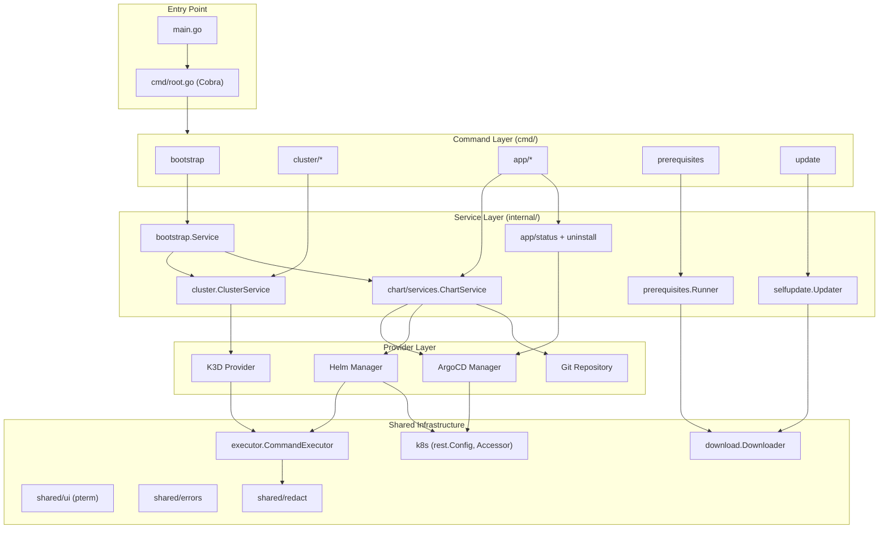
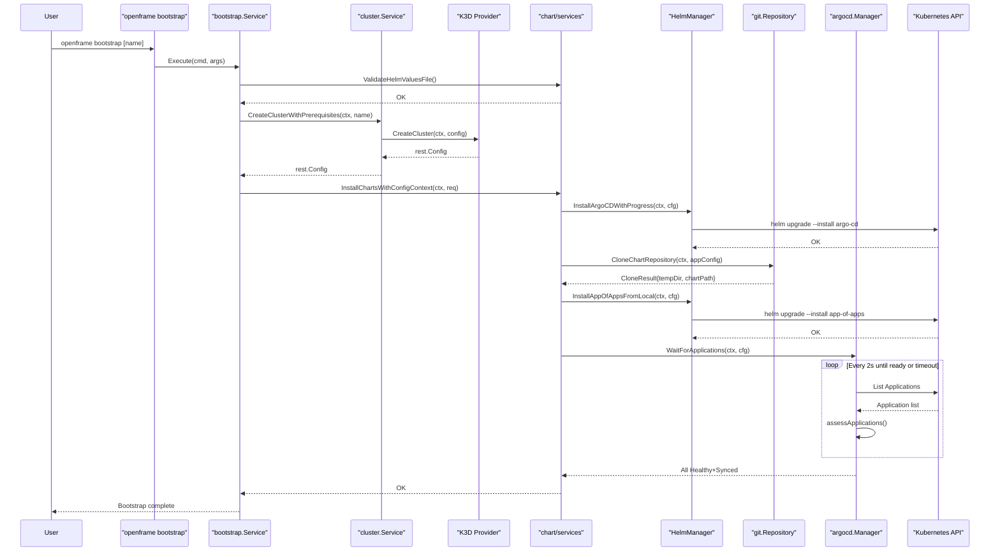
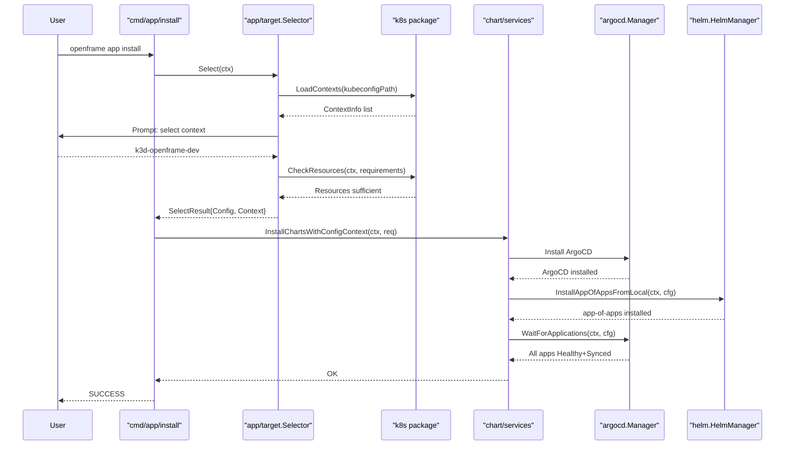
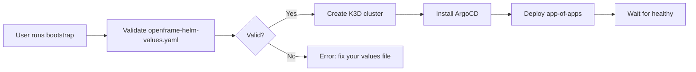

# Architecture Overview

OpenFrame CLI is a Go-based command-line tool with a layered architecture that cleanly separates command definitions, business logic, provider integrations, and shared infrastructure.

For the full generated reference, see the [architecture reference documentation](../../reference/architecture/overview.md).

---

## High-Level Design


```mermaid
graph TB
    subgraph Entry["Entry Point"]
        main["main.go"]
        root["cmd/root.go (Cobra)"]
    end

    subgraph Commands["Command Layer (cmd/)"]
        bootstrap["bootstrap"]
        cluster["cluster/*"]
        app["app/*"]
        prereq["prerequisites"]
        update["update"]
    end

    subgraph Services["Service Layer (internal/)"]
        bsvc["bootstrap.Service"]
        csvc["cluster.ClusterService"]
        chsvc["chart/services.ChartService"]
        appsvc["app/status + uninstall"]
        prefw["prerequisites.Runner"]
        supdater["selfupdate.Updater"]
    end

    subgraph Providers["Provider Layer"]
        k3dp["K3D Provider"]
        argop["ArgoCD Manager"]
        helmp["Helm Manager"]
        gitp["Git Repository"]
    end

    subgraph Shared["Shared Infrastructure"]
        exec["executor.CommandExecutor"]
        k8spkg["k8s (rest.Config, Accessor)"]
        uipkg["shared/ui (pterm)"]
        errpkg["shared/errors"]
        redact["shared/redact"]
        dl["download.Downloader"]
    end

    main --> root
    root --> Commands
    bootstrap --> bsvc
    cluster --> csvc
    app --> chsvc
    app --> appsvc
    prereq --> prefw
    update --> supdater

    bsvc --> csvc
    bsvc --> chsvc
    csvc --> k3dp
    chsvc --> argop
    chsvc --> helmp
    chsvc --> gitp
    appsvc --> argop

    k3dp --> exec
    helmp --> exec
    argop --> k8spkg
    helmp --> k8spkg
    prefw --> dl
    supdater --> dl
    exec --> redact
```

---

## Core Components

| Package | Path | Responsibility |
|---|---|---|
| **Root Command** | `cmd/root.go` | Cobra root; wires subcommands, global flags (`--verbose`, `--silent`), version info, WSL launcher |
| **Bootstrap Command** | `cmd/bootstrap/` | Orchestrates `cluster create` + `app install` as a single user-facing workflow |
| **Cluster Commands** | `cmd/cluster/` | Cobra subcommands: create, delete, list, status, cleanup |
| **App Commands** | `cmd/app/` | Cobra subcommands: install, upgrade, status, access, uninstall |
| **Prerequisites Command** | `cmd/prerequisites/` | Exposes `check` / `install` for Docker, k3d, Helm |
| **Update Command** | `cmd/update/` | Self-update, rollback, update-check with cosign signature verification |
| **Bootstrap Service** | `internal/bootstrap/` | Coordinates cluster creation then chart installation end-to-end |
| **Cluster Service** | `internal/cluster/service.go` | Lifecycle operations (create, delete, list, status, cleanup) via the provider interface |
| **K3D Provider** | `internal/cluster/providers/k3d/` | K3D-specific cluster creation and management |
| **Cluster Provider Interface** | `internal/cluster/provider/` | Unified `Provider` interface; K3D satisfies it today |
| **Chart Services** | `internal/chart/services/` | High-level install workflow: prerequisites → ArgoCD → app-of-apps → wait |
| **ArgoCD Provider** | `internal/chart/providers/argocd/` | Install, wait, refresh/sync, application management via native client-go dynamic client |
| **Helm Provider** | `internal/chart/providers/helm/` | Helm CLI wrapper; ArgoCD and app-of-apps installation |
| **Git Provider** | `internal/chart/providers/git/` | Shallow clone of chart repository using go-git (no `git` binary) |
| **App Status Service** | `internal/app/status/` | Aggregates cluster health + ArgoCD app status into a unified Report |
| **App Uninstall Service** | `internal/app/uninstall/` | Removes ArgoCD applications and Helm releases safely |
| **k8s Package** | `internal/k8s/` | Kubeconfig context loading, `rest.Config` construction, cluster health/resource checks |
| **Prerequisites Framework** | `internal/prerequisites/` | OS-aware check + auto-install runner (macOS/Linux auto-installs, Windows shows docs) |
| **Executor** | `internal/shared/executor/` | Command execution abstraction (real + mock); records argv for security testing |
| **Self-Update** | `internal/shared/selfupdate/` | GitHub release fetch, cosign signature verification, binary swap, rollback |
| **Download** | `internal/shared/download/` | Verified binary downloads (SHA256 + pinned versions) for k3d, mkcert, Helm |
| **Redact** | `internal/shared/redact/` | Secret redaction from log/debug output |
| **WSL Launcher** | `internal/shared/wsllauncher/` | Re-runs the CLI inside WSL2 on Windows; auto-installs the Linux binary |
| **Platform** | `internal/platform/` | Host OS detection, per-tool install hints, WSL guidance errors |
| **Shared UI** | `internal/shared/ui/` | Logo, prompts, silent mode, status colors, selection menus (pterm) |
| **Shared Config** | `internal/shared/config/` | `EnvBool`, TLS config for local clusters, system service |
| **Shared Errors** | `internal/shared/errors/` | Error types, friendly hints, retry policies, `AlreadyHandledError` sentinel |

---

## Data Flow: Bootstrap Sequence

The `openframe bootstrap` command is the primary user workflow. This sequence diagram shows all the moving parts:


```mermaid
sequenceDiagram
    participant User
    participant CLI as "openframe bootstrap"
    participant BSvc as "bootstrap.Service"
    participant CSvc as "cluster.Service"
    participant K3D as "K3D Provider"
    participant ChSvc as "chart/services"
    participant Helm as "HelmManager"
    participant Git as "git.Repository"
    participant ArgoCD as "argocd.Manager"
    participant K8s as "Kubernetes API"

    User->>CLI: openframe bootstrap [name]
    CLI->>BSvc: Execute(cmd, args)
    BSvc->>ChSvc: ValidateHelmValuesFile()
    ChSvc-->>BSvc: OK

    BSvc->>CSvc: CreateClusterWithPrerequisites(ctx, name)
    CSvc->>K3D: CreateCluster(ctx, config)
    K3D-->>CSvc: rest.Config
    CSvc-->>BSvc: rest.Config

    BSvc->>ChSvc: InstallChartsWithConfigContext(ctx, req)
    ChSvc->>Helm: InstallArgoCDWithProgress(ctx, cfg)
    Helm->>K8s: helm upgrade --install argo-cd
    K8s-->>Helm: OK

    ChSvc->>Git: CloneChartRepository(ctx, appConfig)
    Git-->>ChSvc: CloneResult{tempDir, chartPath}

    ChSvc->>Helm: InstallAppOfAppsFromLocal(ctx, cfg)
    Helm->>K8s: helm upgrade --install app-of-apps
    K8s-->>Helm: OK

    ChSvc->>ArgoCD: WaitForApplications(ctx, cfg)
    loop Every 2s until ready or timeout
        ArgoCD->>K8s: List Applications
        K8s-->>ArgoCD: Application list
        ArgoCD->>ArgoCD: assessApplications()
    end
    ArgoCD-->>ChSvc: All Healthy+Synced

    ChSvc-->>BSvc: OK
    BSvc-->>User: Bootstrap complete
```

---

## Data Flow: App Install / Upgrade


```mermaid
sequenceDiagram
    participant User
    participant AppCmd as "cmd/app/install"
    participant Target as "app/target.Selector"
    participant K8sPkg as "k8s package"
    participant ChSvc as "chart/services"
    participant ArgoProv as "argocd.Manager"
    participant HelmProv as "helm.HelmManager"

    User->>AppCmd: openframe app install
    AppCmd->>Target: Select(ctx)
    Target->>K8sPkg: LoadContexts(kubeconfigPath)
    K8sPkg-->>Target: ContextInfo list
    Target->>User: Prompt: select context
    User-->>Target: k3d-openframe-dev
    Target->>K8sPkg: CheckResources(ctx, requirements)
    K8sPkg-->>Target: Resources sufficient
    Target-->>AppCmd: SelectResult{Config, Context}

    AppCmd->>ChSvc: InstallChartsWithConfigContext(ctx, req)
    ChSvc->>ArgoProv: Install ArgoCD
    ArgoProv-->>ChSvc: ArgoCD installed
    ChSvc->>HelmProv: InstallAppOfAppsFromLocal(ctx, cfg)
    HelmProv-->>ChSvc: app-of-apps installed
    ChSvc->>ArgoProv: WaitForApplications(ctx, cfg)
    ArgoProv-->>ChSvc: All apps Healthy+Synced
    ChSvc-->>AppCmd: OK
    AppCmd-->>User: SUCCESS
```

---

## Key Design Decisions

### 1. Provider Interface Pattern

The `cluster.Provider` interface allows the CLI to support multiple cluster backends (K3D today, potentially Kind or cloud providers in the future):

```go
// internal/cluster/provider/provider.go
type Provider interface {
    CreateCluster(ctx context.Context, cfg models.ClusterConfig) (*rest.Config, error)
    DeleteCluster(ctx context.Context, name string, clusterType models.ClusterType, force bool) error
    ListClusters(ctx context.Context) ([]models.ClusterInfo, error)
    GetClusterStatus(ctx context.Context, name string) (*models.ClusterStatus, error)
}
```

### 2. CommandExecutor Abstraction

All external binary invocations (k3d, helm) go through the `CommandExecutor` interface, enabling complete mock substitution in unit tests:

```go
// Real execution
exec := executor.NewRealCommandExecutor(false, true)
result, err := exec.Execute(ctx, "k3d", "cluster", "list")

// Test mock
mock := executor.MockCommandExecutor{}
mock.SetResponse("k3d cluster list", &executor.CommandResult{Stdout: `[]`})
```

### 3. GitOps via ArgoCD App-of-Apps

Platform deployment uses the ArgoCD [App of Apps pattern](https://argo-cd.readthedocs.io/en/stable/operator-manual/cluster-bootstrapping/). The CLI installs a single "app-of-apps" Helm chart that ArgoCD then uses to deploy and manage all child applications from the `openframe-oss-tenant` repository.

### 4. Secret Redaction at the Executor Layer

All output from external commands passes through `redact.Redact()` before being displayed or logged. Secrets registered via `redact.RegisterSecret()` and URL-embedded credentials are automatically scrubbed with `***`.

### 5. AlreadyHandledError Sentinel

To avoid double-printing errors, the `AlreadyHandledError` sentinel is used throughout the codebase. When a command has already displayed its error to the user, it wraps the error as `AlreadyHandledError` — the main entry point then silently exits with the appropriate code.

### 6. Interactive + Non-Interactive Modes

Every wizard checks `ui.IsNonInteractive()` before prompting. Non-interactive mode is triggered by `--non-interactive`, piped stdin, or `--output json/yaml`. This makes every command safe for CI/CD pipelines without special handling.

---

## Configuration File: openframe-helm-values.yaml

The bootstrap wizard generates a `openframe-helm-values.yaml` configuration file. Before any cluster creation, the CLI validates this file via a "preflight" check — the cheapest possible gate to catch errors before expensive cluster operations begin.


```mermaid
graph LR
    A["User runs bootstrap"] --> B["Validate openframe-helm-values.yaml"]
    B --> C{"Valid?"}
    C -->|Yes| D["Create K3D cluster"]
    C -->|No| E["Error: fix your values file"]
    D --> F["Install ArgoCD"]
    F --> G["Deploy app-of-apps"]
    G --> H["Wait for healthy"]
```

---

## Upgrade Modes

The `openframe app upgrade` command has two distinct modes:

| Mode | Flag | Description |
|---|---|---|
| **Change-Ref (Mode 1)** | `--ref <branch/tag/commit>` | Updates the git ref in ArgoCD, triggers re-sync to new version |
| **Force-Sync (Mode 2)** | `--force-sync` | Forces ArgoCD to re-sync the current ref without changing the version |

---

## Further Reading

- [Reference Architecture Documentation](../../reference/architecture/overview.md) — Full generated documentation with all component details
- [openframe-oss-tenant](https://github.com/flamingo-stack/openframe-oss-tenant) — The external OpenFrame platform chart repository
