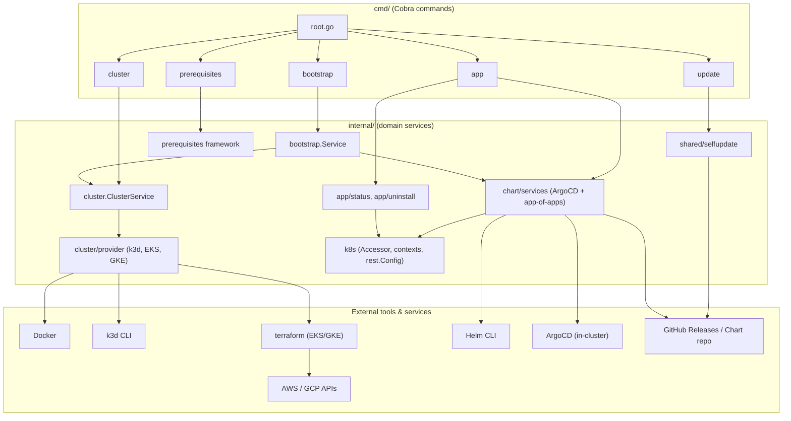
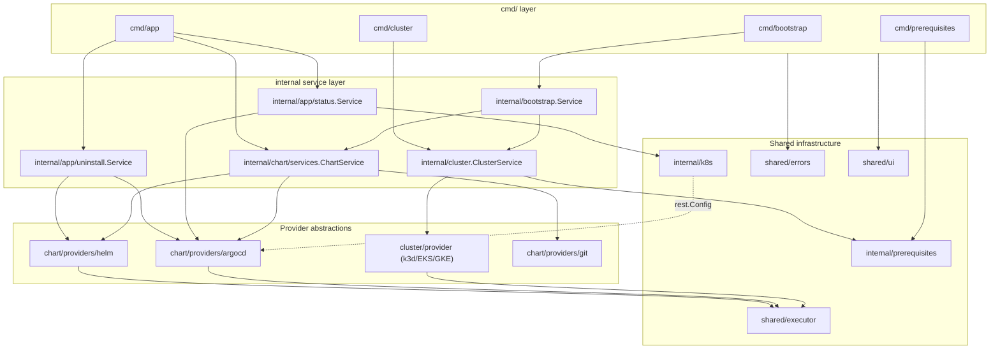
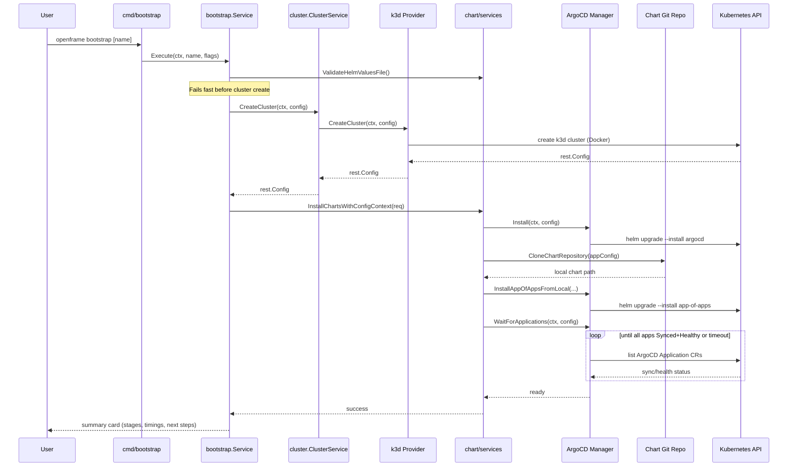

# Architecture Overview

OpenFrame CLI is organized as a [Cobra](https://github.com/spf13/cobra) command tree (`cmd/`) backed by domain packages under `internal/`. Each command group (`bootstrap`, `cluster`, `app`, `prerequisites`, `update`) is a thin adapter that wires flags to a corresponding internal service, keeping business logic out of the CLI layer.

## High-Level Architecture

```mermaid
graph TB
    subgraph CLI["cmd/ (Cobra commands)"]
        Root["root.go"]
        Bootstrap["bootstrap"]
        Cluster["cluster"]
        App["app"]
        Prereq["prerequisites"]
        Update["update"]
    end

    subgraph Domain["internal/ (domain services)"]
        BootstrapSvc["bootstrap.Service"]
        ClusterSvc["cluster.ClusterService"]
        Provider["cluster/provider (k3d, EKS, GKE)"]
        ChartSvc["chart/services (ArgoCD + app-of-apps)"]
        AppStatus["app/status, app/uninstall"]
        PrereqFw["prerequisites framework"]
        K8s["k8s (Accessor, contexts, rest.Config)"]
        SelfUpdate["shared/selfupdate"]
    end

    subgraph External["External tools & services"]
        Docker["Docker"]
        K3d["k3d CLI"]
        Terraform["terraform (EKS/GKE)"]
        Helm["Helm CLI"]
        ArgoCDExt["ArgoCD (in-cluster)"]
        GitHub["GitHub Releases / Chart repo"]
        CloudAPI["AWS / GCP APIs"]
    end

    Root --> Bootstrap & Cluster & App & Prereq & Update
    Bootstrap --> BootstrapSvc
    BootstrapSvc --> ClusterSvc
    BootstrapSvc --> ChartSvc
    Cluster --> ClusterSvc
    ClusterSvc --> Provider
    App --> ChartSvc
    App --> AppStatus
    Prereq --> PrereqFw
    Update --> SelfUpdate

    Provider --> Docker & K3d
    Provider --> Terraform
    Terraform --> CloudAPI
    ChartSvc --> Helm
    ChartSvc --> GitHub
    ChartSvc --> ArgoCDExt
    AppStatus --> K8s
    ChartSvc --> K8s
    SelfUpdate --> GitHub
```

## Core Components

| Package | Responsibility |
|---|---|
| `cmd/root.go` | Root Cobra command, version metadata, global flags (`--verbose`, `--silent`, `--plain`), WSL forwarding entry point |
| `cmd/bootstrap` | One-shot `cluster create` + `app install` composite command |
| `cmd/cluster` | Cluster lifecycle subcommands: `create`, `delete`, `list`, `status`, `use`, `cleanup` |
| `cmd/app` | Platform lifecycle subcommands: `install`, `upgrade`, `status`, `access`, `uninstall` |
| `cmd/prerequisites` | `check`/`install` for tools required by a given cluster type |
| `cmd/update` | Self-update command tree: `update`, `update check`, `update rollback` |
| `internal/bootstrap` | Orchestrates cluster creation followed by chart install, with staged progress tracking |
| `internal/cluster` | `ClusterService` — cluster lifecycle logic, provider dispatch, reuse/resume decisions |
| `internal/cluster/provider` | Unified `Provider`/`Planner` interfaces implemented by k3d, EKS, GKE backends |
| `internal/cluster/discovery` | Read-only discovery of external (non-OpenFrame-managed) GKE/EKS clusters |
| `internal/cluster/prerequisites` | Per-cluster-type requirement sets (Docker/k3d/Helm vs Terraform+cloud CLI) |
| `internal/cluster/ui` | Interactive wizards, cluster pickers, confirmation prompts |
| `internal/chart/services` | `ChartService`, `Installer`, `ArgoCD`, `AppOfApps` — orchestrates install/upgrade/readiness waits |
| `internal/chart/providers/argocd` | ArgoCD manager: install, wait-for-apps, admin password, sync, Application CRUD |
| `internal/chart/providers/helm` | Helm CLI wrapper for chart install/upgrade/uninstall |
| `internal/chart/providers/git` | Clones the app-of-apps chart repository at a given ref |
| `internal/app/status` | Aggregates cluster health + ArgoCD sync/health into a `Report` |
| `internal/app/status/tui` | Bubble Tea interactive TUI for `app status --interactive` |
| `internal/app/uninstall` | Removes ArgoCD Applications, Helm releases, and (optionally) the namespace |
| `internal/k8s` | Read-only cluster access: kubeconfig context resolution, `rest.Config` construction |
| `internal/prerequisites` | OS-aware generic framework (`Set`, `Prerequisite`, `Runner`) |
| `internal/platform` | OS detection and per-tool install-hint text |
| `internal/shared/executor` | `CommandExecutor` abstraction (real + mock) for all external command invocations |
| `internal/shared/download` | Verified, checksum-pinned binary downloads (k3d, helm, terraform, mkcert, infracost) |
| `internal/shared/selfupdate` | GitHub-release-based self-update: cosign verification, checksum verification, rollback |
| `internal/shared/errors` | Structured error handling, retry policy, friendly hints |
| `internal/shared/ui` | Terminal presentation layer: logo, glyphs, spinners, prompts |
| `internal/shared/wsllauncher` | Forwards the Windows binary into WSL2 |

## Component Relationships

```mermaid
flowchart TD
    subgraph Commands["cmd/ layer"]
        C_Bootstrap["cmd/bootstrap"]
        C_Cluster["cmd/cluster"]
        C_App["cmd/app"]
        C_Prereq["cmd/prerequisites"]
    end

    subgraph Services["internal service layer"]
        S_Bootstrap["internal/bootstrap.Service"]
        S_Cluster["internal/cluster.ClusterService"]
        S_Chart["internal/chart/services.ChartService"]
        S_Status["internal/app/status.Service"]
        S_Uninstall["internal/app/uninstall.Service"]
    end

    subgraph Providers["Provider abstractions"]
        P_Cluster["cluster/provider (k3d/EKS/GKE)"]
        P_ArgoCD["chart/providers/argocd"]
        P_Helm["chart/providers/helm"]
        P_Git["chart/providers/git"]
    end

    subgraph SharedInfra["Shared infrastructure"]
        K8sAccess["internal/k8s"]
        Exec["shared/executor"]
        PrereqFw["internal/prerequisites"]
        Errors["shared/errors"]
        UI["shared/ui"]
    end

    C_Bootstrap --> S_Bootstrap
    S_Bootstrap --> S_Cluster
    S_Bootstrap --> S_Chart

    C_Cluster --> S_Cluster
    S_Cluster --> P_Cluster
    P_Cluster --> Exec

    C_App --> S_Chart
    C_App --> S_Status
    C_App --> S_Uninstall
    S_Chart --> P_ArgoCD
    S_Chart --> P_Helm
    S_Chart --> P_Git
    S_Status --> P_ArgoCD
    S_Status --> K8sAccess
    S_Uninstall --> P_ArgoCD
    S_Uninstall --> P_Helm

    C_Prereq --> PrereqFw
    S_Cluster --> PrereqFw

    P_ArgoCD --> Exec
    P_Helm --> Exec
    K8sAccess -.->|"rest.Config"| P_ArgoCD

    Commands --> Errors
    Commands --> UI
```

## Data Flow: Bootstrap Sequence

`openframe bootstrap` is the composite of cluster creation and platform installation, and best illustrates how the layers cooperate end-to-end:

```mermaid
sequenceDiagram
    participant User
    participant CmdBootstrap as cmd/bootstrap
    participant BootstrapSvc as bootstrap.Service
    participant ClusterSvc as cluster.ClusterService
    participant K3dProvider as k3d Provider
    participant ChartSvc as chart/services
    participant ArgoCD as ArgoCD Manager
    participant GitRepo as Chart Git Repo
    participant K8sAPI as Kubernetes API

    User->>CmdBootstrap: openframe bootstrap [name]
    CmdBootstrap->>BootstrapSvc: Execute(ctx, name, flags)
    BootstrapSvc->>ChartSvc: ValidateHelmValuesFile()
    Note over BootstrapSvc: Fails fast before cluster create
    BootstrapSvc->>ClusterSvc: CreateCluster(ctx, config)
    ClusterSvc->>K3dProvider: CreateCluster(ctx, config)
    K3dProvider->>K8sAPI: create k3d cluster (Docker)
    K8sAPI-->>K3dProvider: rest.Config
    K3dProvider-->>ClusterSvc: rest.Config
    ClusterSvc-->>BootstrapSvc: rest.Config

    BootstrapSvc->>ChartSvc: InstallChartsWithConfigContext(req)
    ChartSvc->>ArgoCD: Install(ctx, config)
    ArgoCD->>K8sAPI: helm upgrade --install argocd
    ChartSvc->>GitRepo: CloneChartRepository(appConfig)
    GitRepo-->>ChartSvc: local chart path
    ChartSvc->>ArgoCD: InstallAppOfAppsFromLocal(...)
    ArgoCD->>K8sAPI: helm upgrade --install app-of-apps
    ChartSvc->>ArgoCD: WaitForApplications(ctx, config)
    loop until all apps Synced+Healthy or timeout
        ArgoCD->>K8sAPI: list ArgoCD Application CRs
        K8sAPI-->>ArgoCD: sync/health status
    end
    ArgoCD-->>ChartSvc: ready
    ChartSvc-->>BootstrapSvc: success
    BootstrapSvc-->>User: summary card (stages, timings, next steps)
```

## Key Design Decisions

- **Thin command layer, fat service layer.** `cmd/` packages parse flags and call into `internal/` services; no business logic lives in Cobra `RunE` handlers. This keeps commands testable via `tests/testutil/flag_contract.go` contract tests, independent of the underlying logic.
- **Unified provider abstraction for cluster backends.** `internal/cluster/provider` defines `Provider`/`Planner` interfaces implemented identically by k3d, EKS, and GKE, selected at runtime by `internal/cluster/provider/factory.go` based on `ClusterConfig.Type`. This lets `ClusterService` remain backend-agnostic.
- **`internal/k8s` is deliberately read-only and isolated from cluster creation.** It only knows how to resolve kubeconfig contexts and build a `rest.Config` — it never creates or destroys clusters, keeping status/access code paths safe to run against any cluster, including ones not created by this CLI.
- **All external commands go through `CommandExecutor`.** Every shell-out (`docker`, `k3d`, `helm`, `terraform`, `gcloud`, `aws`) is routed through `internal/shared/executor.CommandExecutor`, which has a real (`os/exec`-backed) and mock implementation. This is what makes the extensive unit test suite possible without real infrastructure.
- **Verified downloads instead of `curl | bash`.** `internal/shared/download` pins exact versions and SHA256 checksums for k3d, Helm, Terraform, mkcert, and infracost, installing them into `~/.openframe/bin` without requiring `sudo`.
- **Native Kubernetes client instead of shelling out to `kubectl`.** `internal/k8s` uses `k8s.io/client-go` and `k8s.io/apimachinery` directly for health checks and `rest.Config` resolution.
- **Windows runs inside WSL2.** Rather than reimplementing Docker/k3d/networking natively on Windows, `internal/shared/wsllauncher` transparently forwards the CLI's execution into WSL2, auto-installing the matching Linux binary there if needed.
- **Structured, exit-code-faithful error handling.** `internal/shared/errors` distinguishes an `AlreadyHandledError` sentinel (already printed upstream) from unhandled errors, and preserves a failed external command's original exit code for automation (see `main.go`'s `exitCode()`).

## Dependencies

OpenFrame CLI is published as the standalone Go module `github.com/flamingo-stack/openframe-cli` and has **no recorded upstream dependencies or downstream consumers** in the Flamingo organization's repository graph — it is not a library consumed by other repos. Its functional dependencies are external tools and Go libraries it shells out to or vendors, not internal ecosystem packages:

- **Kubernetes tooling**: `k8s.io/client-go`, `k8s.io/apimachinery`.
- **CLI framework & UI**: `spf13/cobra`, `pterm`, `charmbracelet/huh`, `charmbracelet/bubbletea`.
- **Pinned external CLIs** (checksum-verified downloads, not Go modules): `k3d`, `helm`, `terraform`, `mkcert`, `infracost`.
- **Cloud provider CLIs**: `gcloud` (+ `gke-gcloud-auth-plugin`) and the AWS CLI.
- **Sigstore/cosign** (`sigstore/sigstore-go`): verifies self-update release signatures.
- **GitHub Releases API**: source of truth for self-update checks and the platform chart repository ([flamingo-stack/openframe-oss-tenant](https://github.com/flamingo-stack/openframe-oss-tenant)) cloned during chart installation.

Since no other repository in the organization graph depends on OpenFrame CLI, compatibility of its CLI surface is governed by the flag/subcommand contract tests in `tests/testutil/flag_contract.go` rather than dependent-repository builds.
