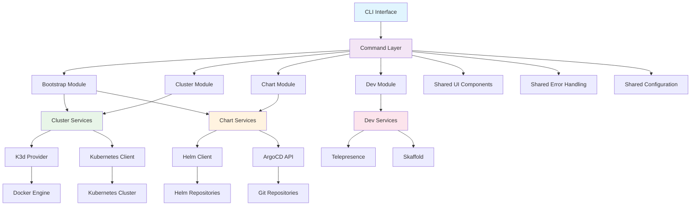
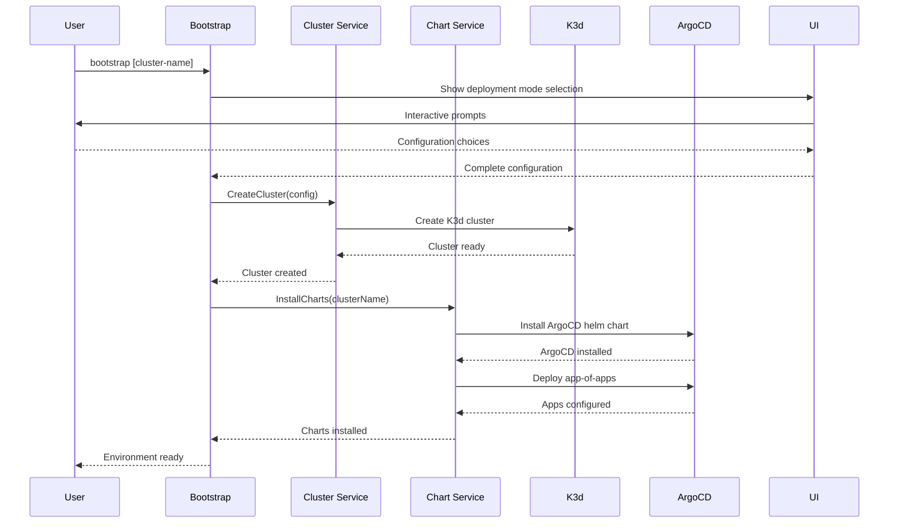
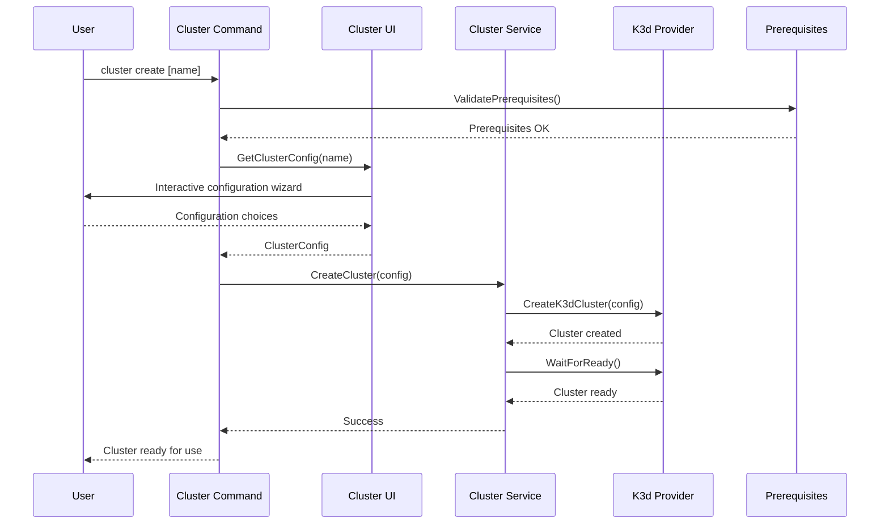
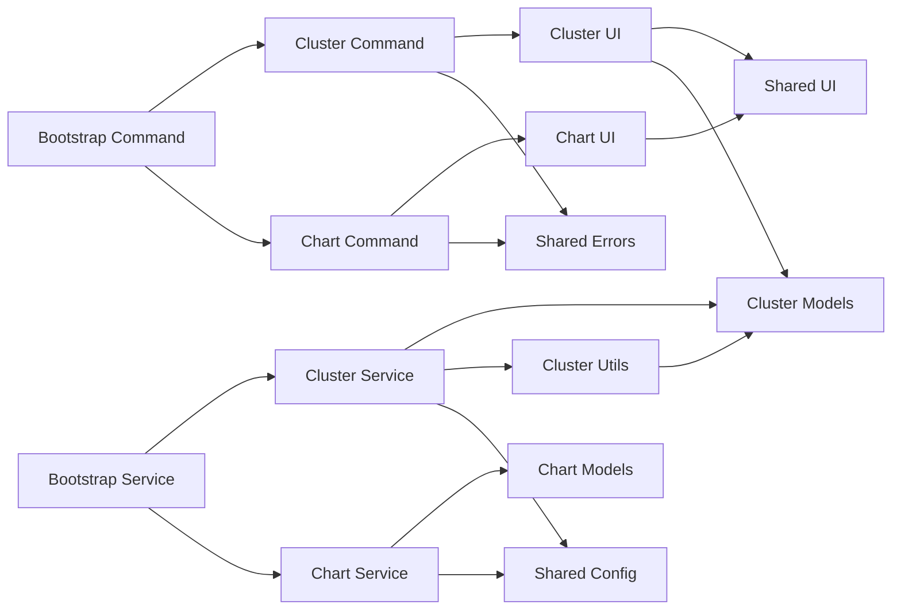
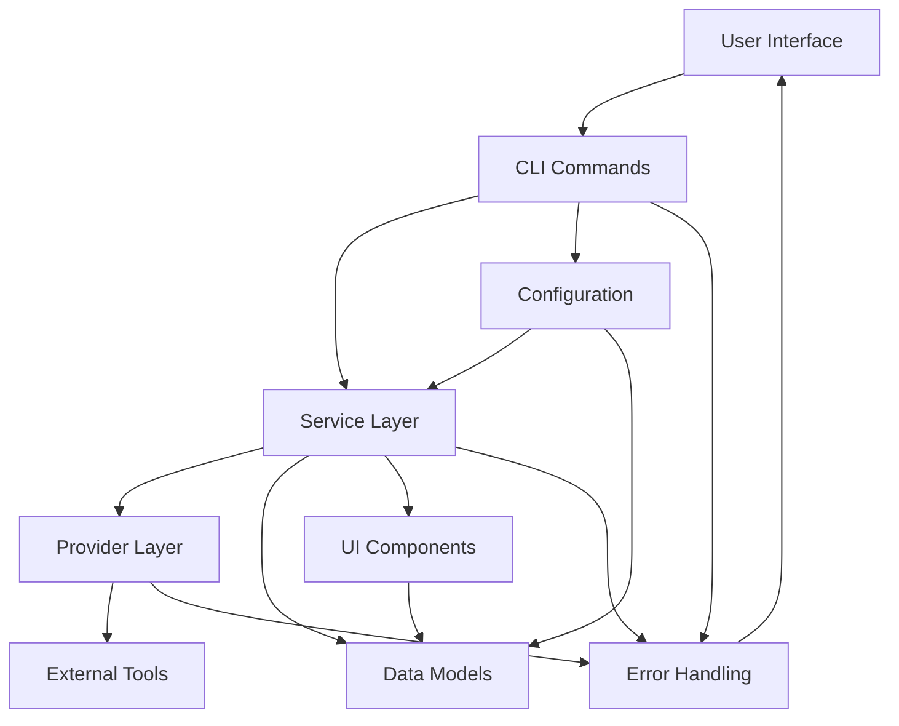
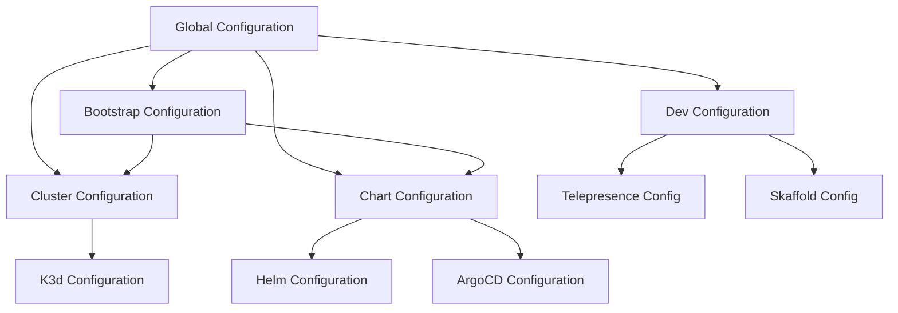
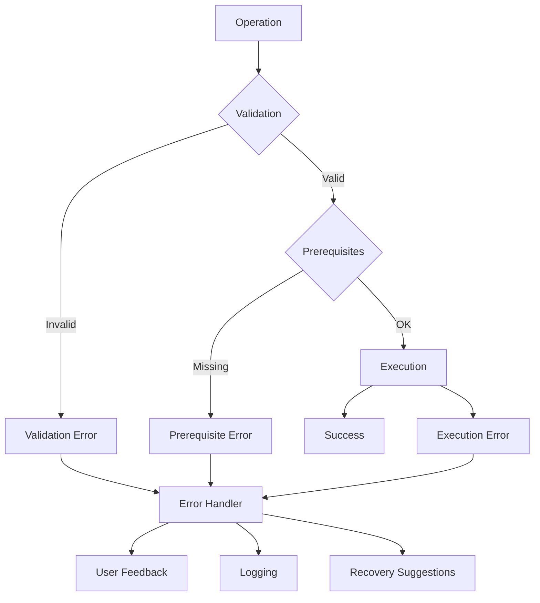
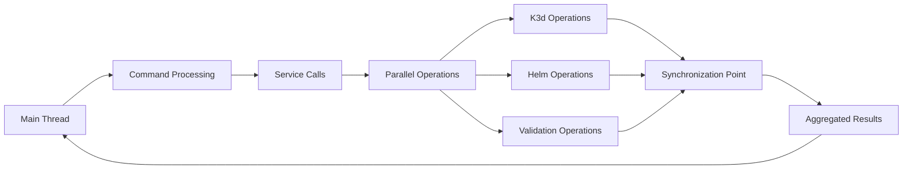
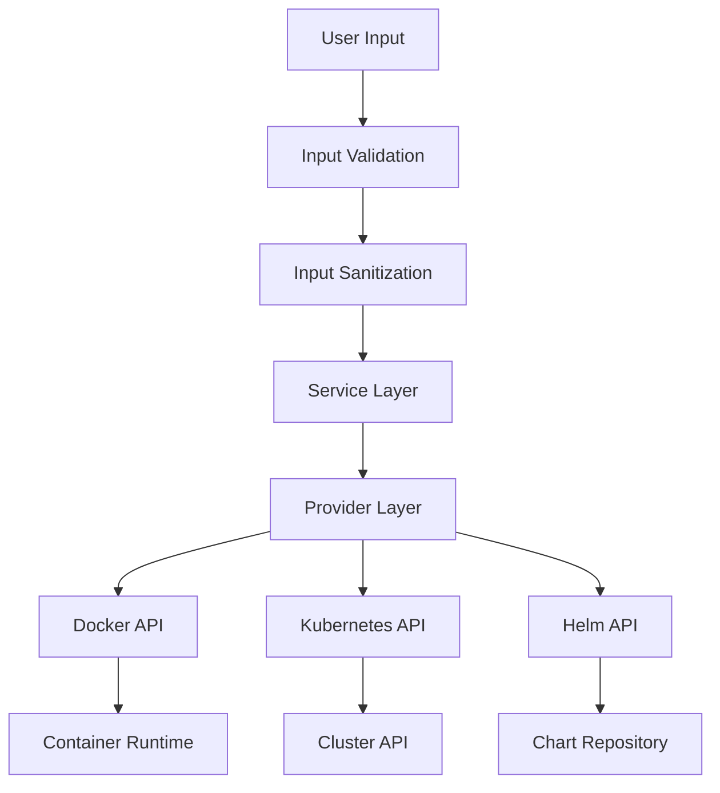

# Architecture Overview

This document provides a comprehensive overview of OpenFrame CLI's architecture, including system design, component relationships, data flow, and key design decisions.

## High-Level Architecture

OpenFrame CLI follows a modular, layered architecture designed for maintainability, testability, and extensibility.



## Core Components

### Command Layer (`cmd/`)

The command layer provides the CLI interface using the Cobra framework.

| Component | Package | Responsibility |
|-----------|---------|----------------|
| **Bootstrap Command** | `cmd/bootstrap` | Orchestrates complete environment setup |
| **Cluster Commands** | `cmd/cluster` | Manages cluster lifecycle operations |
| **Chart Commands** | `cmd/chart` | Handles ArgoCD and chart management |
| **Dev Commands** | `cmd/dev` | Provides development workflow tools |

#### Command Structure

```text
cmd/
├── bootstrap/
│   └── bootstrap.go        # Complete environment setup
├── cluster/
│   ├── cluster.go         # Root cluster command
│   ├── create.go          # Cluster creation
│   ├── delete.go          # Cluster deletion
│   ├── list.go            # Cluster listing
│   ├── status.go          # Cluster status
│   └── cleanup.go         # Resource cleanup
├── chart/
│   ├── chart.go           # Root chart command
│   └── install.go         # ArgoCD installation
└── dev/
    └── dev.go             # Development tools
```

### Service Layer (`internal/`)

The service layer contains business logic and orchestrates operations between providers.

| Module | Responsibility | Key Components |
|--------|----------------|----------------|
| **Bootstrap Services** | Environment orchestration | Cluster + Chart coordination |
| **Cluster Services** | K3d cluster management | Creation, deletion, status |
| **Chart Services** | ArgoCD and Helm management | Installation, configuration |
| **Dev Services** | Development tools | Traffic interception, workflows |

#### Internal Package Organization

```text
internal/
├── bootstrap/
│   ├── services/          # Bootstrap orchestration logic
│   └── models/            # Bootstrap configuration
├── cluster/
│   ├── services/          # Cluster business logic
│   ├── models/            # Cluster data structures
│   ├── ui/                # Interactive prompts
│   ├── utils/             # Cluster utilities
│   └── prerequisites/     # Dependency validation
├── chart/
│   ├── services/          # Chart management logic
│   ├── models/            # Chart configuration
│   └── prerequisites/     # Chart dependencies
├── dev/
│   ├── services/          # Development tool logic
│   ├── models/            # Dev configuration
│   └── prerequisites/     # Dev tool dependencies
└── shared/
    ├── ui/                # Common UI components
    ├── errors/            # Error handling
    └── config/            # Configuration management
```

## Data Flow Architecture

### Bootstrap Command Flow

The bootstrap command orchestrates a complete environment setup:



### Cluster Management Flow

Individual cluster operations follow this pattern:



## Component Interactions

### Dependency Management



### Interface Boundaries



## Key Design Patterns

### 1. Command Pattern

Each CLI command implements a consistent interface:

```go
type Command interface {
    Execute(cmd *cobra.Command, args []string) error
}

// Example implementation
func getCreateCmd() *cobra.Command {
    cmd := &cobra.Command{
        Use:   "create [NAME]",
        Short: "Create a new cluster",
        RunE:  runCreateCluster,  // Delegates to service layer
    }
    return cmd
}
```

### 2. Service Layer Pattern

Business logic is isolated in service layers:

```go
type ClusterService interface {
    CreateCluster(config ClusterConfig) error
    DeleteCluster(name string) error
    ListClusters() ([]Cluster, error)
    GetClusterStatus(name string) (*ClusterStatus, error)
}

type clusterService struct {
    provider  ProviderInterface
    validator ValidatorInterface
}
```

### 3. Provider Pattern

External tool interactions are abstracted through providers:

```go
type K3dProvider interface {
    CreateCluster(config K3dConfig) error
    DeleteCluster(name string) error
    ListClusters() ([]K3dCluster, error)
}

type HelmProvider interface {
    InstallChart(config HelmConfig) error
    UninstallChart(name, namespace string) error
}
```

### 4. Configuration Pattern

Configuration is managed through structured models:

```go
type ClusterConfig struct {
    Name         string
    Nodes        int
    K8sVersion   string
    Ports        []PortMapping
    Volumes      []VolumeMount
    Environment  map[string]string
}

func (c *ClusterConfig) Validate() error {
    // Validation logic
}
```

## Data Models

### Core Data Structures

| Model | Package | Purpose | Key Fields |
|-------|---------|---------|------------|
| **ClusterConfig** | `internal/cluster/models` | Cluster configuration | Name, Nodes, K8sVersion, Ports |
| **ChartConfig** | `internal/chart/models` | Chart installation config | ChartName, Namespace, Values |
| **BootstrapConfig** | `internal/bootstrap/models` | Complete setup config | ClusterConfig, ChartConfig, Mode |
| **DevConfig** | `internal/dev/models` | Development tool config | Service, Port, Protocol |

### Configuration Hierarchy



## Error Handling Strategy

### Error Types

```go
// Domain-specific error types
type ClusterError struct {
    Type    ErrorType
    Message string
    Cause   error
}

type ErrorType string

const (
    ErrorTypeValidation   ErrorType = "validation"
    ErrorTypePrerequisite ErrorType = "prerequisite"
    ErrorTypeExecution    ErrorType = "execution"
    ErrorTypeTimeout      ErrorType = "timeout"
)
```

### Error Flow



## Performance Considerations

### Concurrency Design



### Resource Management

| Resource | Management Strategy | Implementation |
|----------|-------------------|----------------|
| **Docker Containers** | Lifecycle management | K3d provider cleanup |
| **Kubernetes Resources** | Namespace isolation | Resource labeling and cleanup |
| **File Descriptors** | Proper closure | Defer statements and context cancellation |
| **Network Connections** | Connection pooling | HTTP client reuse |

## Extension Points

### Adding New Commands

```text
1. Create command file in appropriate cmd/ directory
2. Implement command structure with Cobra
3. Create service layer in internal/ if needed
4. Add models for configuration
5. Implement provider interfaces if needed
6. Add tests and documentation
```

### Adding New Providers

```text
1. Define provider interface
2. Implement provider struct
3. Add to service layer dependency injection
4. Create configuration models
5. Add prerequisite validation
6. Implement error handling
7. Add comprehensive tests
```

### Adding New UI Components

```text
1. Create UI component in internal/shared/ui/
2. Define interface for reusability
3. Implement for different command contexts
4. Add configuration options
5. Test interactive flows
```

## Testing Architecture

### Test Organization

```text
tests/
├── unit/                  # Unit tests alongside source
├── integration/           # Integration tests
│   ├── cluster/          # Cluster integration tests
│   ├── chart/            # Chart integration tests
│   └── bootstrap/        # End-to-end tests
├── fixtures/             # Test data and fixtures
└── utils/                # Test utilities
```

### Testing Strategy

| Test Level | Scope | Tools | Coverage |
|------------|-------|-------|----------|
| **Unit** | Individual functions/methods | Go testing, Testify | >80% |
| **Integration** | Component interactions | Real K3d clusters | Critical paths |
| **End-to-End** | Complete workflows | Full bootstrap process | Happy path + error scenarios |
| **Performance** | Resource usage | Benchmarks | Resource limits |

## Security Considerations

### Security Boundaries



### Security Measures

| Area | Measures | Implementation |
|------|----------|----------------|
| **Input Validation** | Sanitize all user inputs | Validation functions in models |
| **Privilege Escalation** | Minimal required permissions | Docker group membership only |
| **Network Security** | Local cluster access only | K3d network isolation |
| **Credential Management** | No persistent credentials | Temporary cluster credentials |

## Performance Metrics

### Key Performance Indicators

| Metric | Target | Measurement |
|--------|--------|-------------|
| **Cluster Creation Time** | < 60 seconds | Time from command start to cluster ready |
| **Bootstrap Time** | < 5 minutes | Complete environment setup |
| **Memory Usage** | < 100MB | CLI process memory footprint |
| **Binary Size** | < 50MB | Executable file size |

## Future Architecture Considerations

### Planned Enhancements

1. **Plugin System**: Allow third-party extensions
2. **Remote Cluster Support**: Manage clusters beyond K3d
3. **Configuration Profiles**: Preset configurations for different use cases
4. **Advanced Networking**: Custom network configurations
5. **Multi-Cluster Management**: Coordinate multiple clusters

### Scalability Considerations

- **Horizontal**: Support for multiple concurrent clusters
- **Vertical**: Efficient resource utilization for large clusters
- **Operational**: Simplified maintenance and updates

This architecture provides a solid foundation for OpenFrame CLI's current functionality while allowing for future growth and extension. The modular design ensures maintainability and testability, while the clear separation of concerns makes the codebase accessible to new contributors.