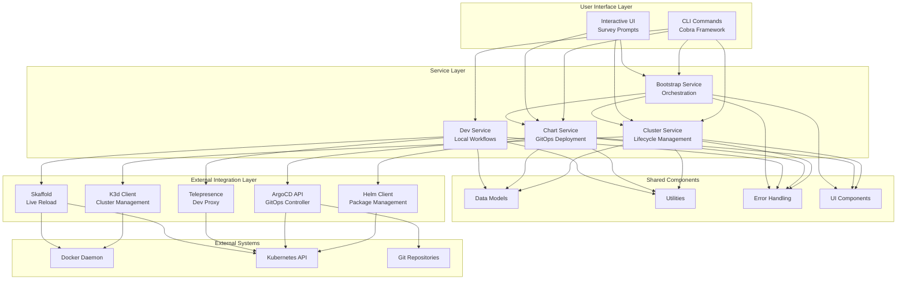
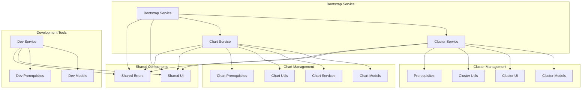
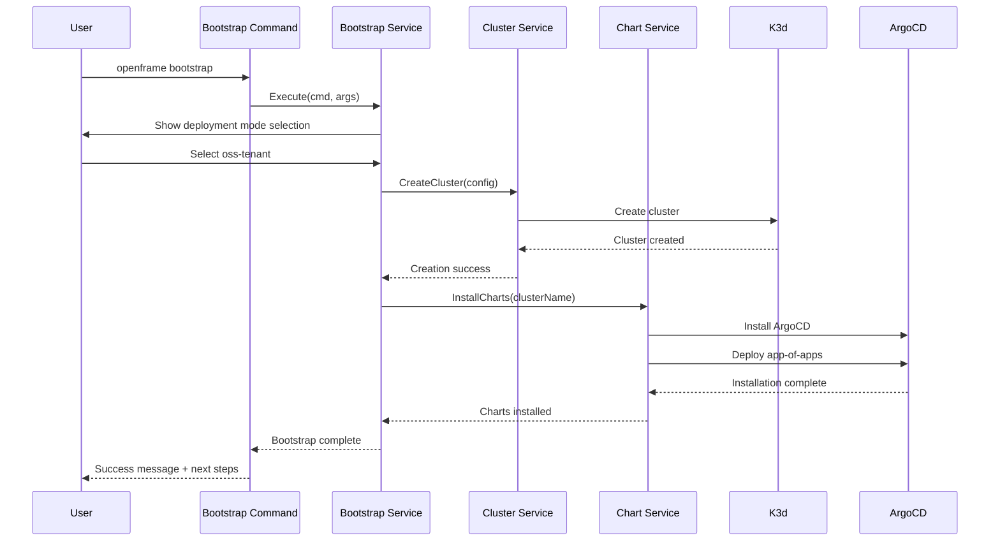
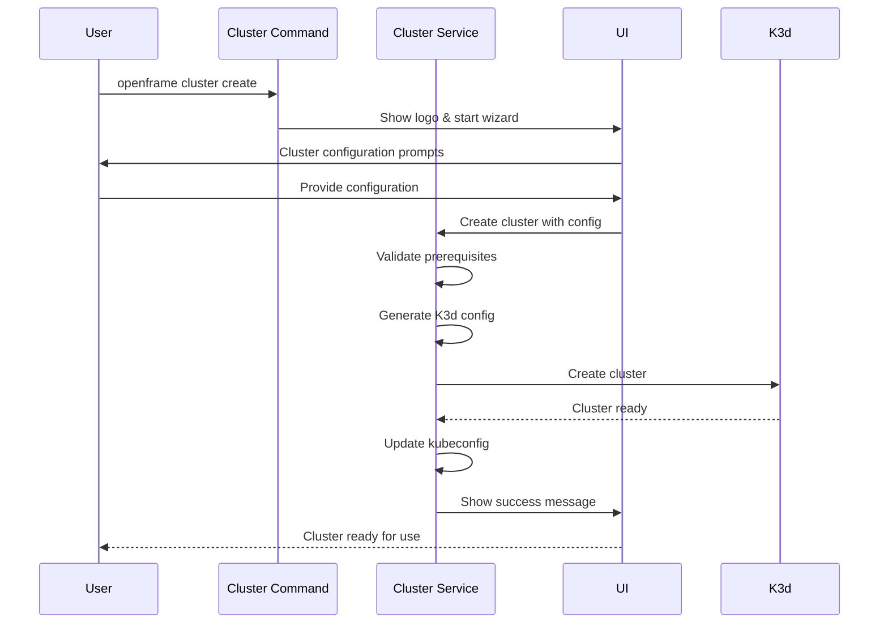
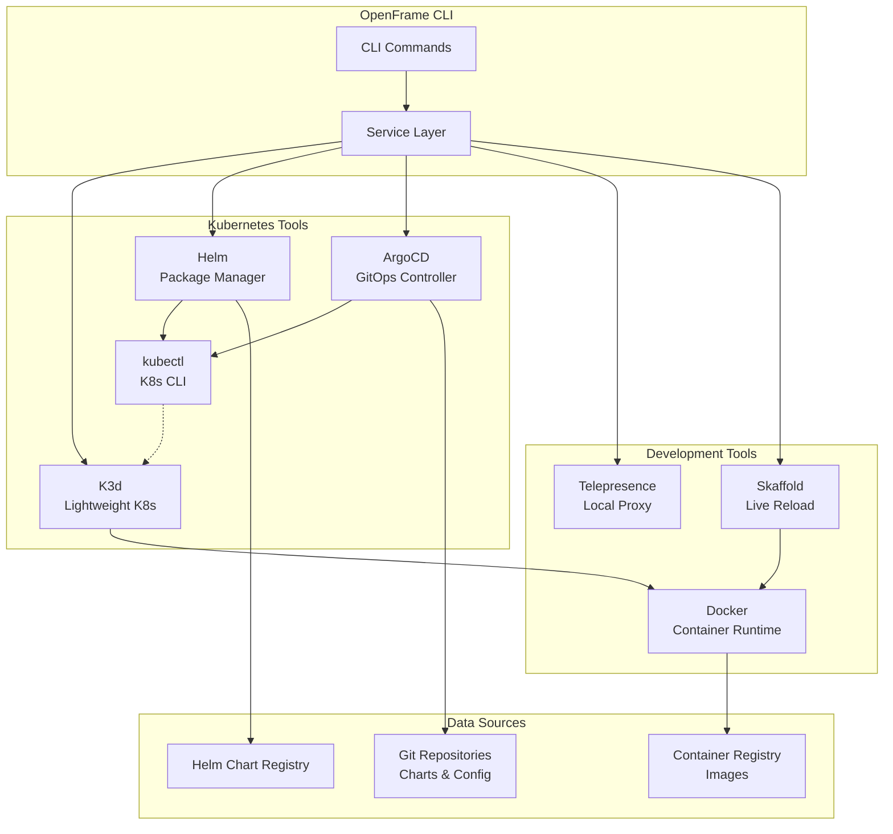
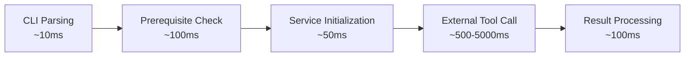
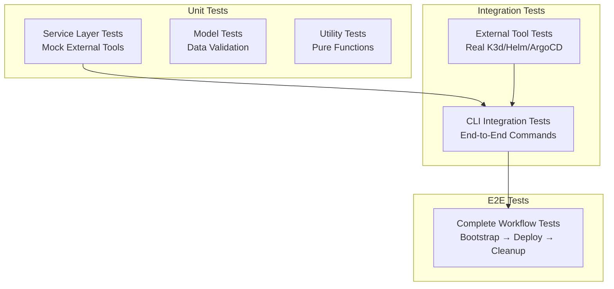

# Architecture Overview

OpenFrame CLI follows a clean, layered architecture that separates concerns between user interface, business logic, and external system integration. This design makes the system maintainable, testable, and extensible.

## High-Level System Architecture

## Core Components

### CLI Layer (`cmd/`)

The command layer handles user input, flag parsing, and delegates work to service layers.

| Component | Package | Responsibilities |
|-----------|---------|------------------|
| **Bootstrap Command** | `cmd/bootstrap/` | Complete environment setup orchestration |
| **Cluster Commands** | `cmd/cluster/` | Cluster lifecycle management (create, delete, status) |
| **Chart Commands** | `cmd/chart/` | Helm chart installation and ArgoCD setup |
| **Dev Commands** | `cmd/dev/` | Development workflow integration |

**Key Design Patterns:**
- **Cobra Framework**: Structured CLI with subcommands and flags
- **Command Pattern**: Each command encapsulates a specific operation
- **Delegation**: Commands delegate business logic to service layer

### Service Layer (`internal/`)

Business logic layer that implements core functionality without CLI concerns.

| Service | Package | Purpose |
|---------|---------|---------|
| **Bootstrap Service** | `internal/bootstrap/` | Orchestrates cluster creation + chart installation |
| **Cluster Service** | `internal/cluster/services/` | K3d cluster lifecycle operations |
| **Chart Service** | `internal/chart/services/` | ArgoCD installation and chart management |
| **Dev Service** | `internal/dev/` | Telepresence and Skaffold integration |

**Key Design Patterns:**
- **Service Pattern**: Business logic separated from presentation
- **Dependency Injection**: Services receive dependencies via constructors
- **Interface Abstraction**: External dependencies behind interfaces for testing

### Shared Components

| Component | Package | Purpose |
|-----------|---------|---------|
| **Models** | `internal/*/models/` | Data structures and configuration objects |
| **UI Components** | `internal/shared/ui/` | Reusable UI elements (logo, prompts) |
| **Error Handling** | `internal/shared/errors/` | Centralized error management and wrapping |
| **Utilities** | `internal/*/utils/` | Helper functions and common operations |

## Component Relationships

### Internal Dependencies

### Data Flow Patterns

#### Bootstrap Workflow

#### Cluster Creation Flow

## Key Design Decisions

### Separation of Concerns

**Decision**: Separate CLI handling from business logic  
**Rationale**: Enables testing business logic without CLI dependencies  
**Implementation**: Service layer interfaces with clear boundaries  

### External Tool Integration

**Decision**: Wrap external tools behind interfaces  
**Rationale**: Enables mocking for testing and swapping implementations  
**Implementation**: Client interfaces for K3d, Helm, ArgoCD, etc.  

### Error Handling Strategy

**Decision**: Centralized error handling with context preservation  
**Rationale**: Consistent error messages and debugging information  
**Implementation**: Error wrapping with operation context  

### Configuration Management

**Decision**: Declarative configuration with sensible defaults  
**Rationale**: Reduce cognitive load while maintaining flexibility  
**Implementation**: Structured configuration objects with validation  

## External Dependencies Architecture

### Kubernetes Ecosystem Integration

### Integration Patterns

| Tool | Integration Pattern | Purpose |
|------|-------------------|---------|
| **K3d** | Direct CLI execution | Lightweight Kubernetes cluster creation |
| **Helm** | Go SDK + CLI | Chart installation and management |
| **ArgoCD** | REST API + kubectl | GitOps application deployment |
| **Telepresence** | CLI execution | Local development proxy |
| **Skaffold** | CLI execution + config files | Live reload development workflows |

## Performance Characteristics

### Startup Time

**Optimization Strategies:**
- **Lazy Loading**: Initialize services only when needed
- **Prerequisite Caching**: Cache tool availability checks
- **Parallel Execution**: Run independent operations concurrently

### Memory Usage

| Component | Memory Pattern | Optimization |
|-----------|---------------|---------------|
| **CLI Layer** | Low, short-lived | Minimal object allocation |
| **Service Layer** | Medium, request-scoped | Object pooling for heavy operations |
| **External Tools** | High, tool-dependent | Process isolation, cleanup |

### Scalability Patterns

- **Single-User Focus**: Optimized for individual developer workflows
- **Stateless Operations**: No persistent state between commands  
- **Resource Cleanup**: Automatic cleanup of temporary resources
- **Concurrent Safety**: Thread-safe operations for parallel execution

## Testing Architecture

### Test Strategy by Layer

| Layer | Test Strategy | Tools |
|-------|--------------|--------|
| **CLI Layer** | Integration tests with mock services | Cobra testing, mock interfaces |
| **Service Layer** | Unit tests with mocked external dependencies | Go testing, testify mocks |
| **External Integration** | Integration tests with real tools | Docker containers, test clusters |

### Test Structure

## Extension Points

### Adding New Commands

1. **Create command package** in `cmd/new-command/`
2. **Implement service layer** in `internal/new-command/`
3. **Add models and utilities** as needed
4. **Integrate with shared components** (UI, errors)
5. **Add to root command** registration

### Adding External Tool Support

1. **Define client interface** for the external tool
2. **Implement client** with error handling
3. **Add prerequisite checks** for tool availability
4. **Create service wrapper** for business logic
5. **Add CLI commands** that use the service

### Extending Configuration

1. **Add fields to model structs** with validation tags
2. **Update UI prompts** for new configuration options
3. **Add CLI flags** for non-interactive mode
4. **Update documentation** and help text

---

This architecture provides a solid foundation for extending OpenFrame CLI while maintaining clean separation of concerns and testability. The modular design allows for incremental feature development and easy maintenance. 🏗️