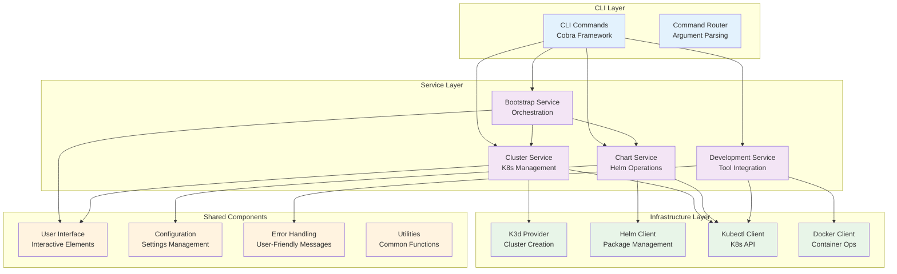
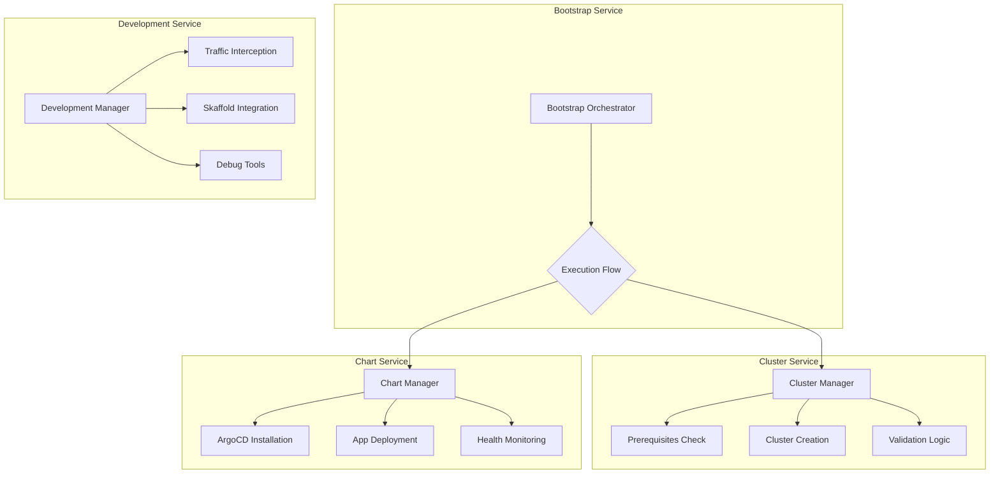
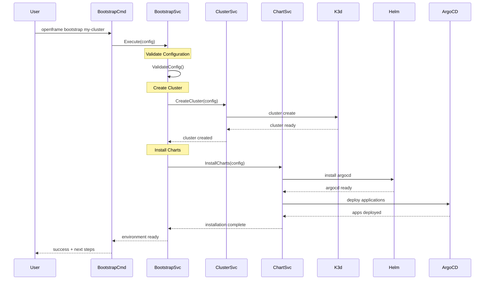
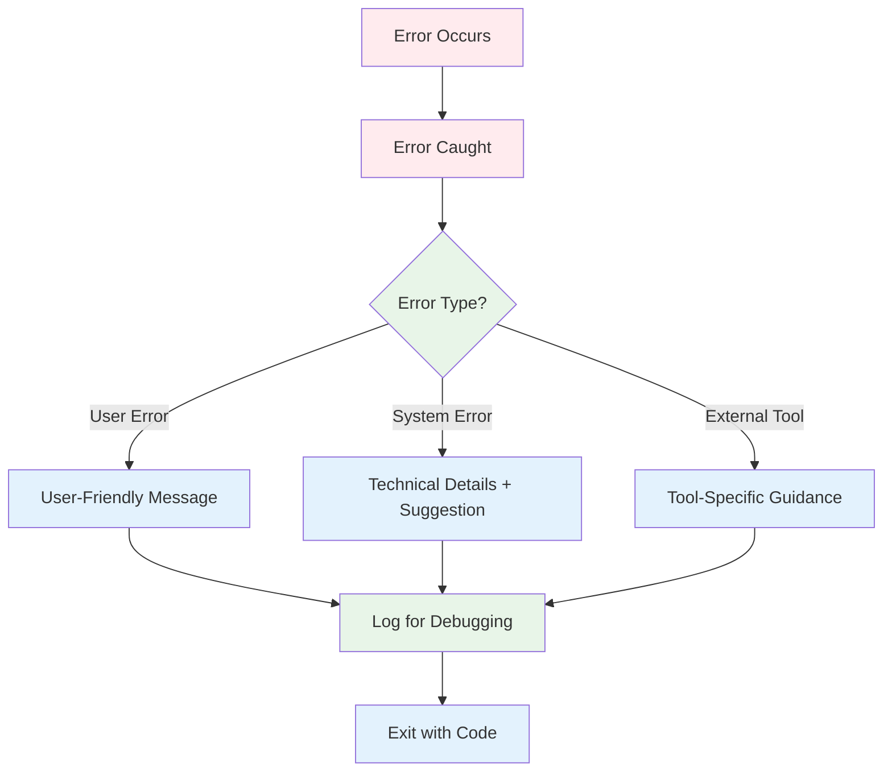
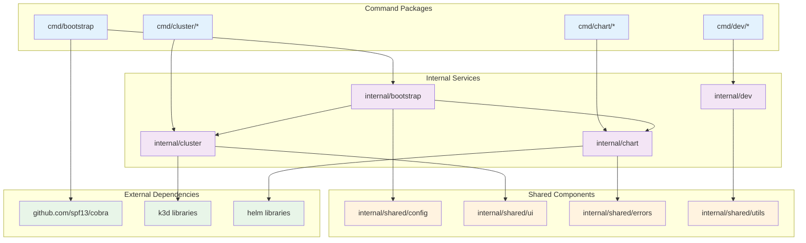
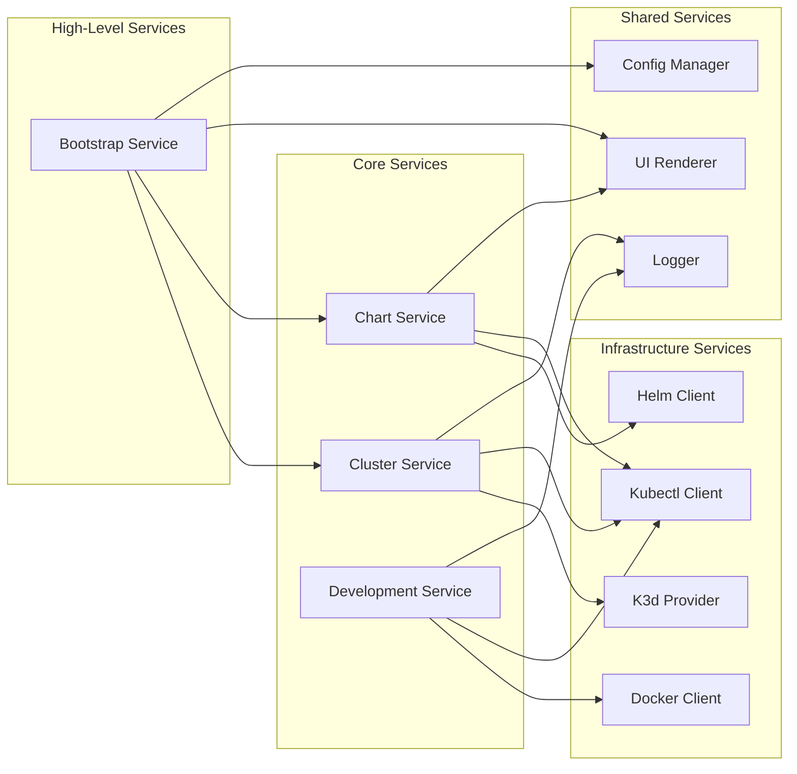

# Architecture Overview

OpenFrame CLI follows a layered, modular architecture that separates concerns and provides clear interfaces between components. This guide provides a comprehensive view of how the system is designed, why architectural decisions were made, and how components interact.

## 🏗️ High-Level Architecture

The CLI is built using a layered architecture with clear separation between command handling, business logic, and external integrations:



## 🎯 Design Principles

### 1. **Separation of Concerns**
Each layer has a specific responsibility:
- **CLI Layer**: Command parsing, validation, and user interaction
- **Service Layer**: Business logic and workflow orchestration
- **Infrastructure Layer**: External tool integration and platform abstraction

### 2. **Dependency Injection**
Services receive their dependencies explicitly, making testing and mocking easier:

```go
type ClusterService struct {
    k3dClient    K3dClient
    kubectlClient KubectlClient
    ui           UIRenderer
}

func NewClusterService(k3d K3dClient, kubectl KubectlClient, ui UIRenderer) *ClusterService {
    return &ClusterService{
        k3dClient:    k3d,
        kubectlClient: kubectl,
        ui:           ui,
    }
}
```

### 3. **Interface Segregation**
Small, focused interfaces rather than large monolithic ones:

```go
type ClusterCreator interface {
    CreateCluster(config ClusterConfig) error
}

type ClusterLister interface {
    ListClusters() ([]ClusterInfo, error)
}

type ClusterManager interface {
    ClusterCreator
    ClusterLister
    DeleteCluster(name string) error
}
```

### 4. **Immutable Configuration**
Configuration objects are immutable after creation, passed down through the call stack.

## 🧩 Core Components

### Command Structure

The CLI follows the Cobra framework patterns with a hierarchical command structure:

```
openframe
├── bootstrap [cluster-name]           # Complete environment setup
├── cluster                           # Cluster management group
│   ├── create [name]                # Create new cluster  
│   ├── delete [name]                # Delete cluster
│   ├── list                         # List clusters
│   ├── status [name]                # Show cluster status
│   └── cleanup                      # Clean unused resources
├── chart                            # Chart management group  
│   └── install                      # Install charts
└── dev                              # Development tools group
    └── intercept [service]          # Traffic interception
```

### Core Components Table

| Component | Package | Responsibility | Key Features |
|-----------|---------|---------------|--------------|
| **Bootstrap Command** | `cmd/bootstrap` | Complete environment orchestration | One-command setup, multiple deployment modes |
| **Cluster Management** | `cmd/cluster/*` | Kubernetes cluster lifecycle | Create, delete, list, status, cleanup |
| **Chart Management** | `cmd/chart/*` | Helm chart and ArgoCD operations | GitOps deployment, chart installation |
| **Development Tools** | `cmd/dev/*` | Local development workflows | Traffic interception, debugging tools |
| **Shared UI** | `internal/shared/ui` | Consistent user experience | Logo, prompts, progress indicators |
| **Error Handling** | `internal/shared/errors` | User-friendly error messages | Structured errors with suggestions |
| **Configuration** | `internal/shared/config` | Settings and preferences | File-based config, environment variables |

### Service Layer Architecture



## 🔄 Data Flow

### Bootstrap Command Flow

The bootstrap command orchestrates the complete setup process:



### Error Flow

Error handling follows a structured approach with user-friendly messages:



## 🏛️ Package Structure

### Directory Organization

```
internal/
├── bootstrap/              # Bootstrap orchestration
│   ├── models/            # Configuration and data structures
│   ├── services/          # Business logic
│   └── ui/                # Bootstrap-specific UI
├── cluster/               # Cluster management
│   ├── models/           # Cluster configuration models
│   ├── services/         # Cluster lifecycle services
│   ├── providers/        # K3d, cloud provider abstractions
│   └── ui/               # Cluster UI components
├── chart/                # Chart and ArgoCD management
│   ├── models/          # Chart configuration models
│   ├── services/        # Helm and ArgoCD services
│   └── templates/       # Chart templates and manifests
├── dev/                 # Development tools
│   ├── services/       # Tool integration services
│   └── providers/      # Telepresence, Skaffold integrations
└── shared/              # Shared components
    ├── config/          # Configuration management
    ├── errors/          # Error handling utilities
    ├── ui/              # Common UI components
    └── utils/           # General utilities
```

### Package Dependencies



## 🔧 Key Design Patterns

### 1. **Service Locator Pattern**

Services are registered and retrieved through a central registry:

```go
type ServiceRegistry struct {
    clusterService *cluster.Service
    chartService   *chart.Service
    devService     *dev.Service
}

func (r *ServiceRegistry) GetClusterService() *cluster.Service {
    if r.clusterService == nil {
        r.clusterService = cluster.NewService(
            r.getK3dProvider(),
            r.getKubectlClient(),
        )
    }
    return r.clusterService
}
```

### 2. **Factory Pattern**

Complex object creation is handled by factory functions:

```go
func NewBootstrapService(config Config) *BootstrapService {
    return &BootstrapService{
        config:        config,
        clusterSvc:    NewClusterService(config.Cluster),
        chartSvc:      NewChartService(config.Chart),
        ui:            ui.NewRenderer(config.Interactive),
    }
}
```

### 3. **Strategy Pattern**

Different deployment strategies are implemented as interchangeable strategies:

```go
type DeploymentStrategy interface {
    Deploy(config DeploymentConfig) error
}

type OSSDeploymentStrategy struct{}
func (s *OSSDeploymentStrategy) Deploy(config DeploymentConfig) error { /* */ }

type SaaSDeploymentStrategy struct{}
func (s *SaaSDeploymentStrategy) Deploy(config DeploymentConfig) error { /* */ }
```

### 4. **Chain of Responsibility**

Error handling and validation use chains of handlers:

```go
type ValidationChain struct {
    handlers []ValidationHandler
}

func (c *ValidationChain) Validate(config Config) error {
    for _, handler := range c.handlers {
        if err := handler.Validate(config); err != nil {
            return err
        }
    }
    return nil
}
```

## 📊 Component Relationships

### Service Interactions



### Data Models

Core data structures that flow through the system:

| Model | Package | Purpose | Key Fields |
|-------|---------|---------|------------|
| **BootstrapConfig** | `bootstrap/models` | Complete setup configuration | ClusterConfig, ChartConfig, DeploymentMode |
| **ClusterConfig** | `cluster/models` | Cluster creation parameters | Name, Nodes, Memory, Ports |
| **ChartConfig** | `chart/models` | Helm chart configuration | ChartName, Values, Namespace |
| **DeploymentConfig** | `shared/models` | Deployment strategy config | Mode, Environment, Features |

## 🚀 Extension Points

The architecture provides several extension points for customization:

### 1. **Provider Interface**

New cluster providers can be added by implementing the provider interface:

```go
type ClusterProvider interface {
    CreateCluster(config ClusterConfig) error
    DeleteCluster(name string) error
    ListClusters() ([]ClusterInfo, error)
    GetClusterStatus(name string) (ClusterStatus, error)
}

// Implementations:
// - K3dProvider (current)
// - KindProvider (future)
// - CloudProvider (future)
```

### 2. **Deployment Strategies**

New deployment modes can be added:

```go
type DeploymentStrategy interface {
    Deploy(config DeploymentConfig) error
    Validate(config DeploymentConfig) error
}

// Current strategies:
// - OSSDeploymentStrategy
// - SaaSSharedDeploymentStrategy  
// - SaasTenantDeploymentStrategy
```

### 3. **UI Renderers**

Different user interface modes:

```go
type UIRenderer interface {
    ShowLogo()
    PromptUser(message string) (string, error)
    ShowProgress(message string)
    ShowError(err error)
}

// Implementations:
// - InteractiveRenderer (current)
// - SilentRenderer (CI/CD)
// - JSONRenderer (programmatic)
```

## 🎯 Future Architectural Considerations

### Planned Enhancements

1. **Plugin System**: Support for external plugins to extend functionality
2. **Configuration Validation**: JSON Schema-based configuration validation
3. **Metrics Collection**: Optional telemetry for usage analytics
4. **Multi-Cloud Support**: Abstraction layer for different cloud providers
5. **State Management**: Centralized state store for cluster and deployment tracking

### Technical Debt

Areas identified for future improvement:

1. **Error Context**: More detailed error context and debugging information
2. **Async Operations**: Better support for long-running operations
3. **Resource Cleanup**: More robust cleanup on failures
4. **Testing Coverage**: Expanded integration test coverage
5. **Documentation**: Generated API documentation from code

---

> **🧠 Understanding the Architecture**: This architecture prioritizes maintainability, testability, and extensibility. Each layer has clear responsibilities, and interfaces define contracts between components. When contributing, try to follow these patterns and consider how your changes fit into the overall design philosophy.