# Architecture Overview

OpenFrame CLI is built using clean architecture principles with a layered design that promotes maintainability, testability, and extensibility. This document provides a comprehensive overview of the system's architecture, design patterns, and component relationships.

## High-Level Architecture

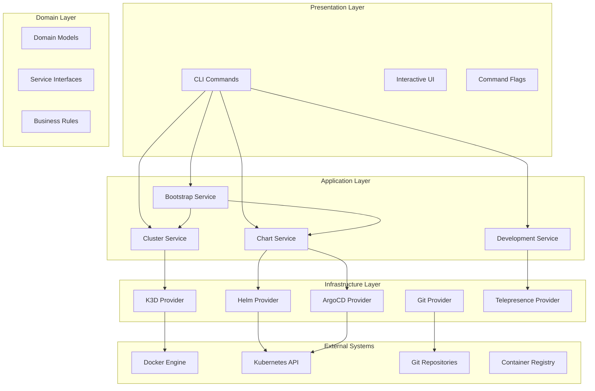

## Core Architectural Principles

### 🏗️ **Clean Architecture**
- **Separation of Concerns**: Each layer has a single, well-defined responsibility
- **Dependency Inversion**: High-level modules don't depend on low-level modules
- **Interface Segregation**: Clients depend only on interfaces they use
- **Single Responsibility**: Each component has one reason to change

### 🔄 **Dependency Injection**
- Constructor-based injection for better testability
- Interface-based abstractions for loose coupling
- Mockable dependencies for comprehensive testing

### 🎯 **Provider Pattern**
- Pluggable implementations for different platforms
- Consistent interfaces across all external integrations
- Easy extension and customization

## Layer Breakdown

### 1. Presentation Layer (`cmd/`)

The presentation layer handles user interaction through the CLI interface.

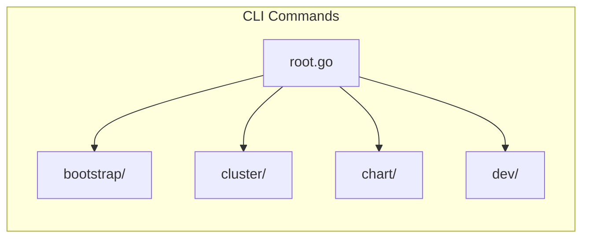

**Key Responsibilities:**
- Command line argument parsing
- User input validation
- Interactive prompts and wizards
- Output formatting and display
- Error presentation

**Core Components:**

| Component | Purpose |
|-----------|---------|
| **Root Command** | CLI entry point and global configuration |
| **Bootstrap Command** | Orchestrates complete environment setup |
| **Cluster Commands** | K3d cluster lifecycle management |
| **Chart Commands** | Helm and ArgoCD operations |
| **Dev Commands** | Development workflow tools |

### 2. Application Layer (`internal/*/services/`)

The application layer contains business logic and orchestrates use cases.

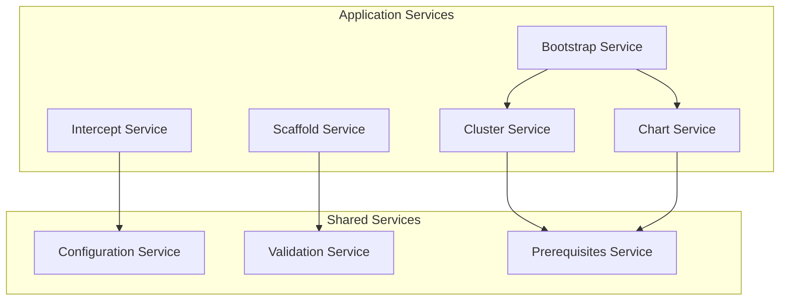

**Service Responsibilities:**

| Service | Purpose |
|---------|---------|
| **Bootstrap** | Coordinates cluster creation and chart installation |
| **Cluster** | Manages K3d cluster lifecycle operations |
| **Chart** | Handles Helm charts and ArgoCD applications |
| **Intercept** | Manages Telepresence service intercepts |
| **Scaffold** | Generates development scaffolding |

### 3. Domain Layer (`internal/*/models/`)

The domain layer contains business entities, rules, and interfaces.

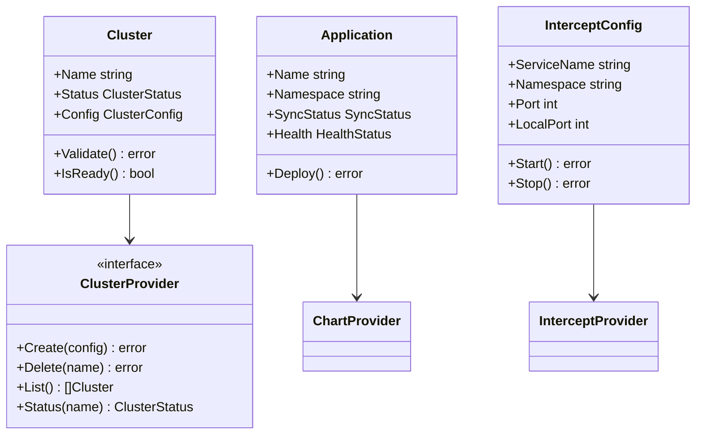

**Domain Models:**
- **Cluster**: Represents Kubernetes cluster state and operations
- **Application**: ArgoCD application with sync and health status
- **Chart**: Helm chart with configuration and dependencies
- **Intercept**: Telepresence intercept configuration

### 4. Infrastructure Layer (`internal/*/providers/`)

The infrastructure layer implements external system integrations.

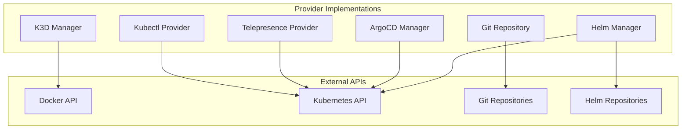

**Provider Interfaces:**

```go
type ClusterProvider interface {
    Create(ctx context.Context, config ClusterConfig) error
    Delete(ctx context.Context, name string) error
    List(ctx context.Context) ([]Cluster, error)
    Status(ctx context.Context, name string) (ClusterStatus, error)
}

type ChartProvider interface {
    Install(ctx context.Context, chart Chart) error
    Upgrade(ctx context.Context, chart Chart) error
    Uninstall(ctx context.Context, name string) error
    Status(ctx context.Context, name string) (ChartStatus, error)
}

type InterceptProvider interface {
    Start(ctx context.Context, config InterceptConfig) error
    Stop(ctx context.Context, name string) error
    List(ctx context.Context) ([]Intercept, error)
}
```

## Data Flow Architecture

### Bootstrap Workflow

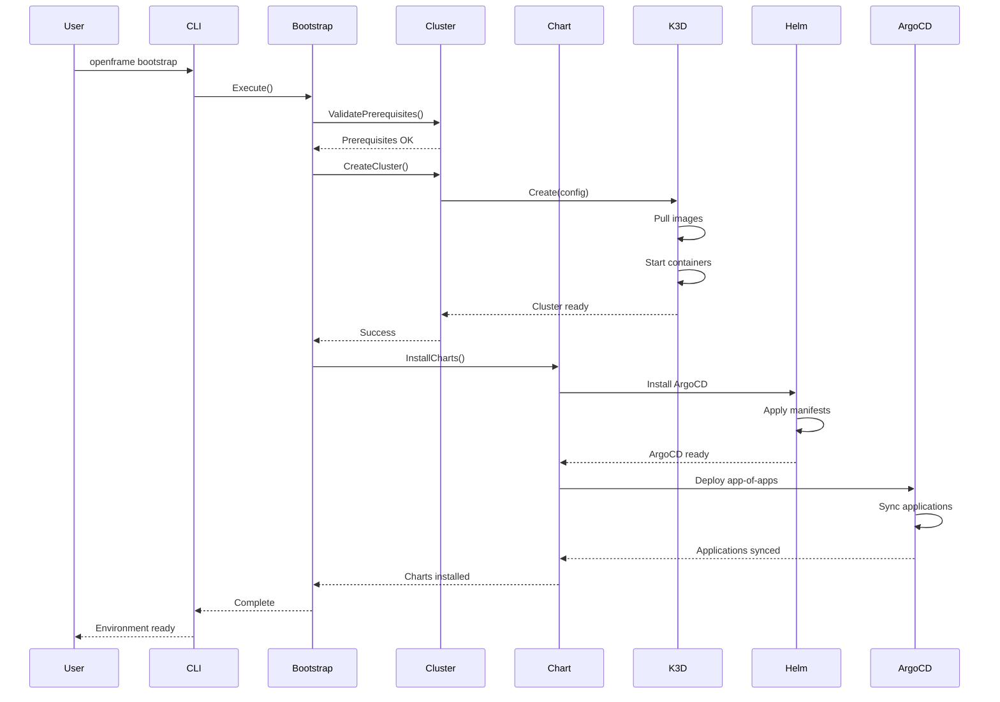

### Development Intercept Workflow

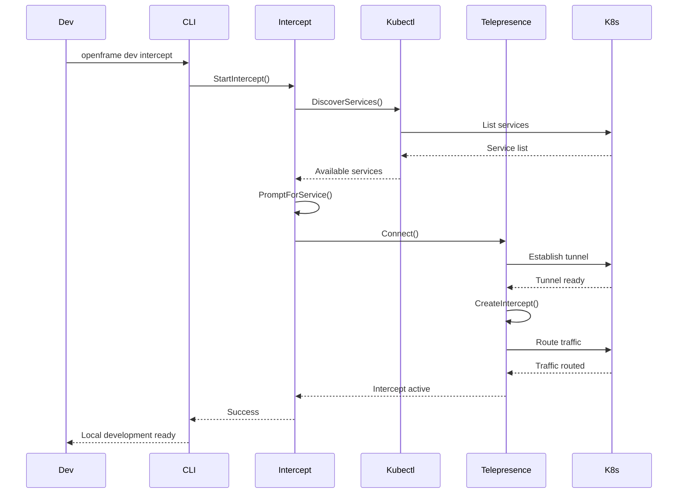

## Component Interactions

### Shared Infrastructure Components

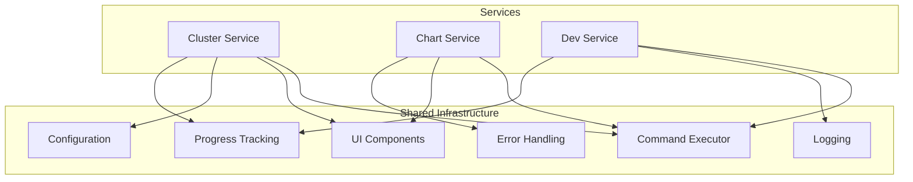

**Shared Components:**

| Component | Purpose |
|-----------|---------|
| **Command Executor** | Abstracts external command execution with logging and error handling |
| **UI Components** | Consistent terminal UI with progress bars, prompts, and formatting |
| **Configuration** | Manages CLI settings, credentials, and environment variables |
| **Error Handling** | Centralized error processing with user-friendly messages |
| **Progress Tracking** | Visual progress indicators for long-running operations |

### Configuration Management

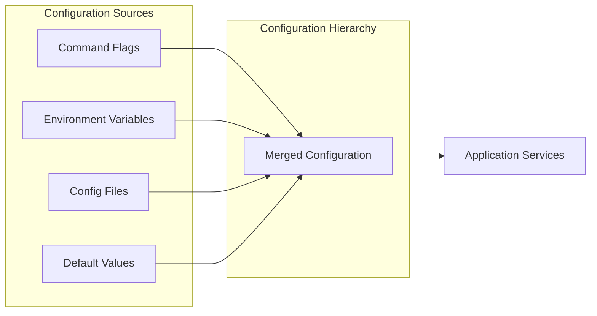

Configuration precedence (highest to lowest):
1. Command line flags
2. Environment variables
3. Configuration files
4. Default values

## Error Handling Strategy

### Error Types and Handling

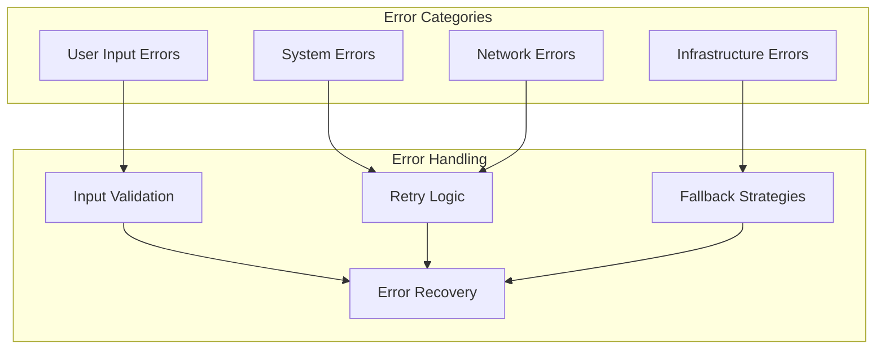

**Error Handling Patterns:**
- **Validation Errors**: Immediate feedback with suggestions
- **Transient Errors**: Automatic retry with exponential backoff
- **Infrastructure Errors**: Graceful degradation and cleanup
- **Fatal Errors**: Clean shutdown with helpful error messages

## Testing Architecture

### Test Layer Structure

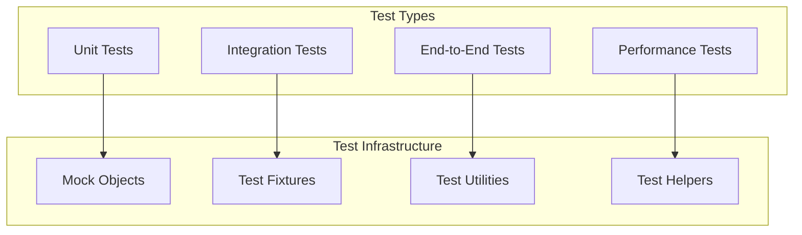

**Testing Strategy:**
- **Unit Tests**: Fast, isolated tests with mocked dependencies
- **Integration Tests**: Service interaction tests with test containers
- **E2E Tests**: Complete workflow tests with real clusters
- **Performance Tests**: Benchmarks and load testing

## Extension Points

### Adding New Providers

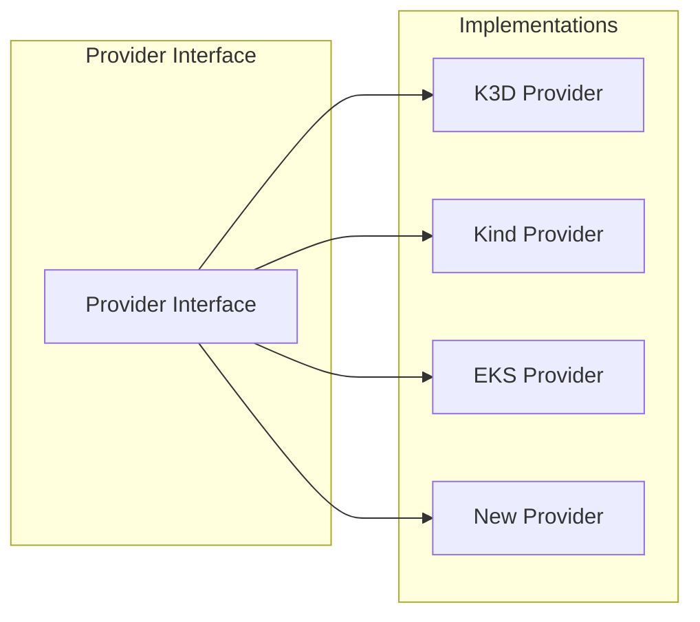

**Extension Process:**
1. Implement provider interface
2. Add configuration options
3. Register with provider factory
4. Add integration tests
5. Update documentation

### Plugin Architecture (Future)

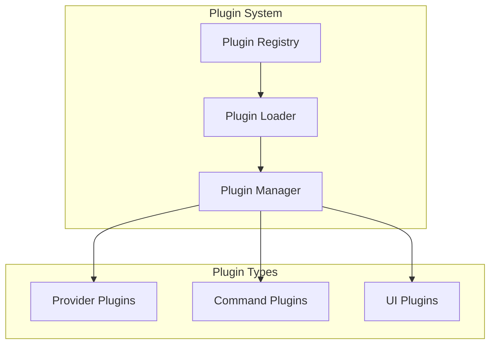

## Design Decisions

### Key Architectural Decisions

| Decision | Rationale | Trade-offs |
|----------|-----------|------------|
| **Clean Architecture** | Maintainability and testability | More complexity for simple operations |
| **Provider Pattern** | Extensibility and platform support | Additional abstraction layer |
| **Cobra CLI Framework** | Rich CLI features and community support | Framework dependency |
| **Go Language** | Performance, concurrency, and deployment simplicity | Learning curve for some developers |
| **K3d for Local Development** | Lightweight and fast cluster creation | Limited to local development |

### Future Architecture Evolution

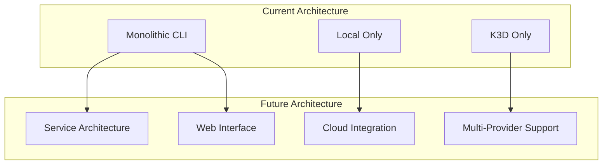

**Planned Enhancements:**
- Plugin system for custom providers
- Web-based management interface
- Cloud provider integrations
- Distributed service architecture
- Advanced GitOps workflows

## Performance Considerations

### Optimization Strategies

| Area | Strategy | Implementation |
|------|----------|----------------|
| **Command Startup** | Lazy loading of providers | On-demand initialization |
| **Concurrent Operations** | Go routines for parallel tasks | Cluster creation and chart installation |
| **Resource Usage** | Efficient resource cleanup | Defer statements and context cancellation |
| **Network Operations** | Connection pooling and caching | HTTP client reuse |

## Security Architecture

### Security Layers

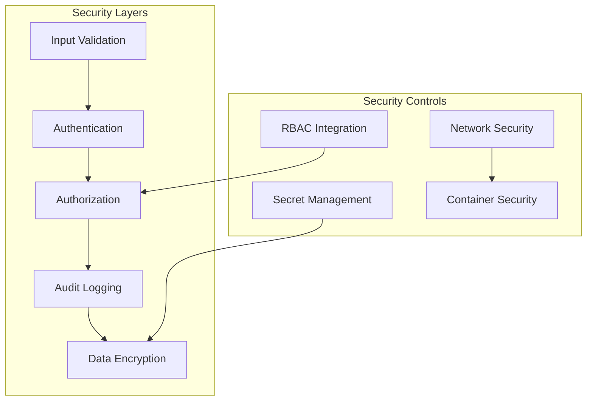

**Security Principles:**
- Least privilege access
- Secure by default configuration
- Credential management best practices
- Audit logging for compliance

## Next Steps

To dive deeper into the OpenFrame CLI architecture:

1. **[Code Structure Guide](code-structure.md)** - Detailed package organization
2. **[Design Patterns](design-patterns.md)** - Common patterns used throughout the codebase
3. **[API Reference](../reference/api.md)** - Internal API documentation
4. **[Testing Architecture](../testing/overview.md)** - How testing is structured

> **💡 Understanding the Flow**: Start by tracing a command from the CLI layer through the services to the providers. This will give you a concrete understanding of how the architecture works in practice.