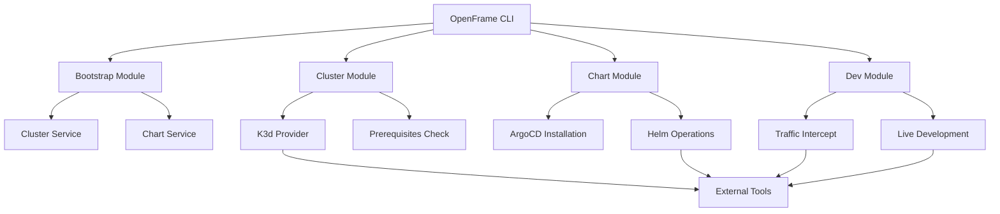
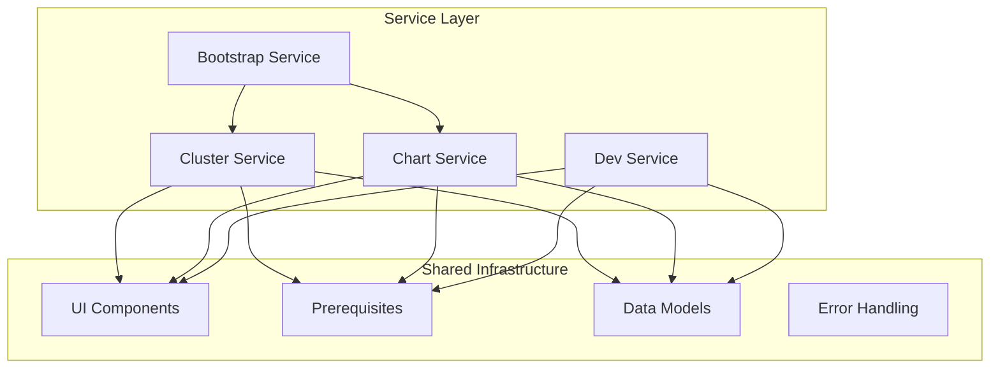
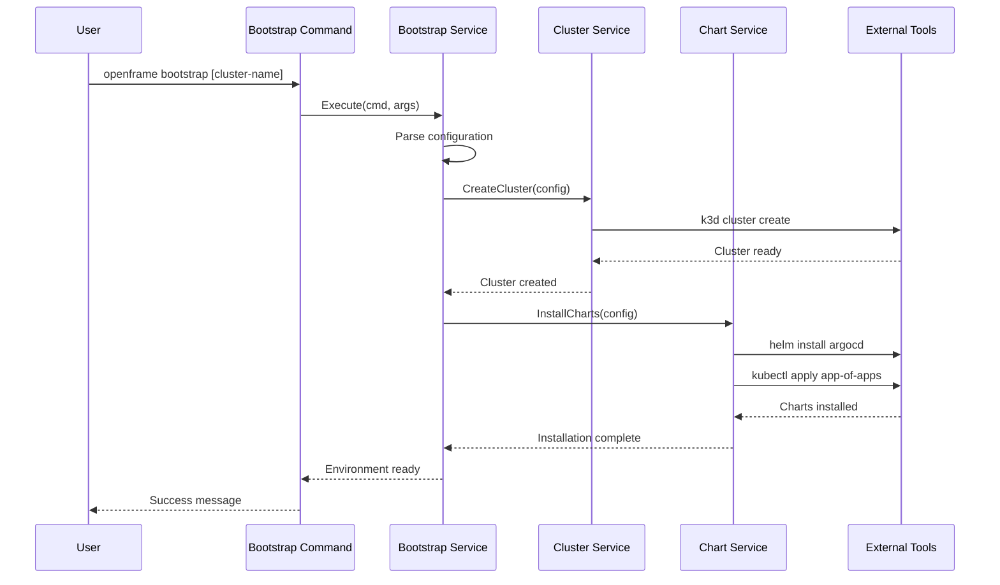
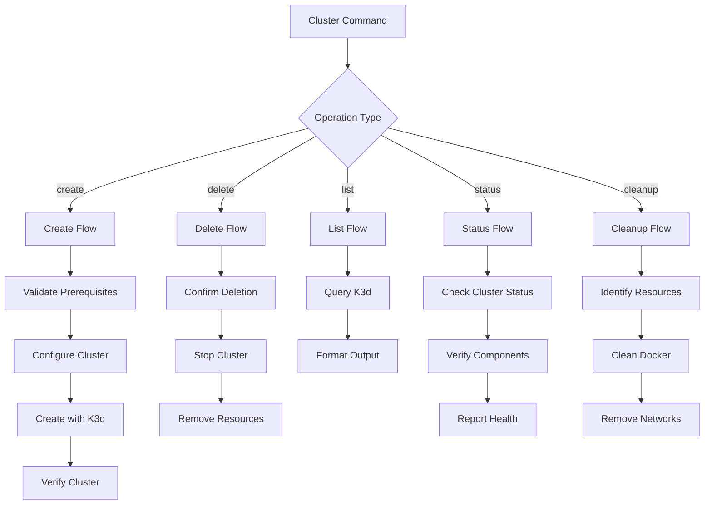
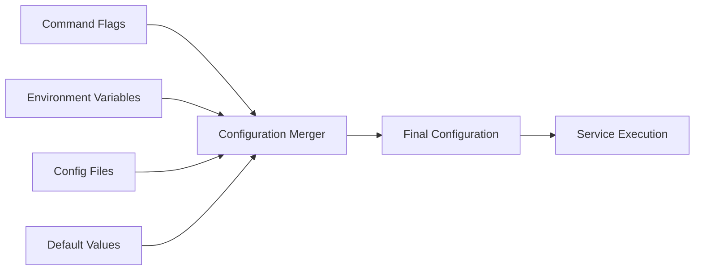
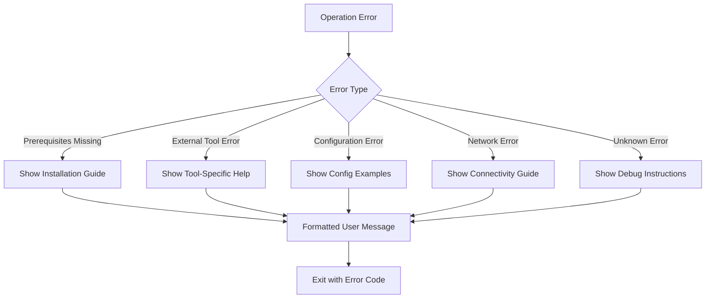
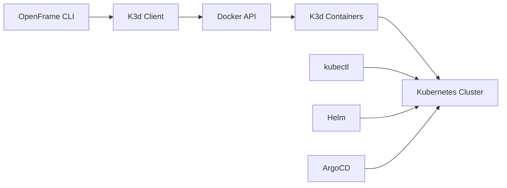
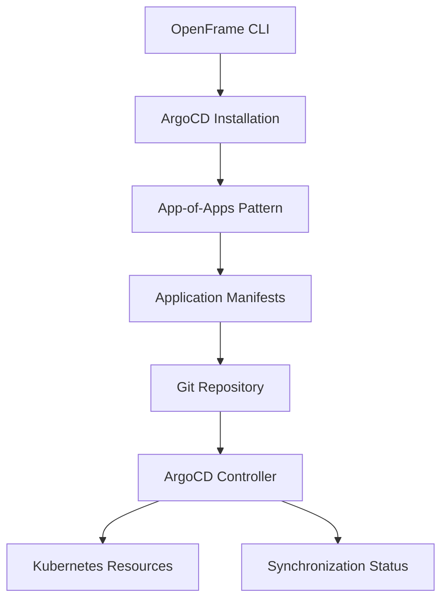

# Architecture Overview

OpenFrame CLI follows a modular, service-oriented architecture designed for maintainability, testability, and extensibility. This guide provides a comprehensive understanding of how the system is structured and how components interact.

## High-Level Architecture

OpenFrame CLI is built using modern Go patterns with clear separation of concerns:



## Architectural Principles

### 1. **Modular Design**
Each major feature area (cluster, chart, dev, bootstrap) is implemented as a self-contained module with clear boundaries.

### 2. **Layered Architecture**
- **Command Layer**: CLI interface and user interaction
- **Service Layer**: Business logic and orchestration
- **Integration Layer**: External tool interactions
- **Infrastructure Layer**: Shared utilities and models

### 3. **Dependency Injection**
Services are injected rather than directly instantiated, enabling better testing and flexibility.

### 4. **Single Responsibility**
Each component has a focused, well-defined responsibility.

## Core Components

### Command Layer (`cmd/`)

The command layer implements the CLI interface using the Cobra framework:

| Component | Package | Responsibility |
|-----------|---------|------------------|
| **Bootstrap Command** | `cmd/bootstrap/` | Orchestrates complete environment setup |
| **Cluster Commands** | `cmd/cluster/` | Cluster lifecycle management (CRUD operations) |
| **Chart Commands** | `cmd/chart/` | Helm chart and ArgoCD management |
| **Development Commands** | `cmd/dev/` | Local development workflows |

#### Command Structure Pattern
```go
// Standard command pattern used throughout
func GetCommandName() *cobra.Command {
    cmd := &cobra.Command{
        Use:   "command-name [args]",
        Short: "Brief description",
        Long:  "Detailed description with examples",
        Args:  cobra.ExactArgs(1),
        RunE: func(cmd *cobra.Command, args []string) error {
            return serviceName.NewService().Execute(cmd, args)
        },
    }
    
    // Add flags
    cmd.Flags().String("flag-name", "default", "Description")
    
    return cmd
}
```

### Service Layer (`internal/`)

The service layer contains the core business logic:



#### Service Interface Pattern
```go
// Standard service interface pattern
type Service interface {
    Execute(cmd *cobra.Command, args []string) error
    Validate(config *models.Config) error
}

type serviceImpl struct {
    ui     ui.Interface
    prereq prerequisites.Checker
}

func NewService() Service {
    return &serviceImpl{
        ui:     ui.New(),
        prereq: prerequisites.New(),
    }
}
```

## Component Relationships

### Bootstrap Module Integration

The bootstrap module orchestrates other modules to provide complete environment setup:



### Cluster Management Flow

The cluster module handles Kubernetes cluster lifecycle:



## Data Flow Patterns

### Configuration Management

OpenFrame CLI uses a hierarchical configuration approach:



**Priority Order (highest to lowest):**
1. Command-line flags
2. Environment variables
3. Configuration files
4. Built-in defaults

### Error Handling Flow

The CLI implements structured error handling with user-friendly messages:



## Key Patterns and Conventions

### Interface Design

OpenFrame CLI consistently uses interfaces for external dependencies:

```go
// External tool interfaces for testability
type K3dProvider interface {
    CreateCluster(name string, config ClusterConfig) error
    DeleteCluster(name string) error
    ListClusters() ([]ClusterInfo, error)
}

type HelmClient interface {
    Install(chart, release, namespace string) error
    Uninstall(release, namespace string) error
    List(namespace string) ([]Release, error)
}
```

### UI Component Pattern

Shared UI components provide consistent user experience:

```go
// Reusable UI components
type UI interface {
    ShowLogo()
    ProgressSpinner(message string) func()
    ConfirmPrompt(message string) bool
    SelectPrompt(message string, options []string) (string, error)
    Success(message string)
    Error(message string)
    Warning(message string)
}
```

### Configuration Models

Structured configuration models with validation:

```go
type ClusterConfig struct {
    Name        string `json:"name" validate:"required"`
    K8sVersion  string `json:"k8sVersion" validate:"required"`
    NodeCount   int    `json:"nodeCount" validate:"min=1,max=10"`
    Registry    RegistryConfig `json:"registry"`
    Network     NetworkConfig  `json:"network"`
}

func (c *ClusterConfig) Validate() error {
    return validator.New().Struct(c)
}
```

## External Tool Integration

### K3d Integration

K3d provides lightweight Kubernetes clusters for local development:



**Integration Points:**
- Cluster creation with custom configuration
- Port forwarding for services
- Volume mounting for persistent storage
- Network configuration for development

### Helm Integration

Helm manages Kubernetes applications and charts:

```go
// Helm service integration example
type HelmService struct {
    client HelmClient
    config *HelmConfig
}

func (h *HelmService) InstallArgoCD(namespace string) error {
    return h.client.Install(
        "argo/argo-cd",
        "argocd", 
        namespace,
        WithValues(h.config.ArgoCDValues),
        WithCreateNamespace(true),
    )
}
```

### ArgoCD Integration

ArgoCD provides GitOps capabilities:



## Testing Architecture

The testing strategy follows the architectural layers:

### Unit Tests
- **Command Layer**: Test flag parsing and command structure
- **Service Layer**: Test business logic with mocked dependencies
- **Integration Layer**: Test external tool interactions

### Integration Tests
- **End-to-End**: Test complete workflows with real clusters
- **Contract Tests**: Verify external API integrations
- **Performance Tests**: Validate resource usage and timing

### Test Organization
```text
tests/
├── unit/                 # Unit tests for individual components
├── integration/          # Integration tests with external tools
├── e2e/                 # End-to-end scenario tests
├── fixtures/            # Test data and configurations
└── helpers/             # Shared test utilities
```

## Performance Considerations

### Async Operations

Long-running operations use context and cancellation:

```go
func (s *ClusterService) CreateCluster(ctx context.Context, config ClusterConfig) error {
    ctx, cancel := context.WithTimeout(ctx, 5*time.Minute)
    defer cancel()
    
    // Create cluster with context
    return s.k3dClient.CreateClusterWithContext(ctx, config)
}
```

### Resource Management

Proper cleanup and resource management:

```go
func (s *Service) Execute(cmd *cobra.Command, args []string) error {
    // Setup resources
    resources, err := s.setupResources()
    if err != nil {
        return err
    }
    defer s.cleanupResources(resources)
    
    // Execute operation
    return s.performOperation(resources)
}
```

### Caching Strategies

Cache external tool outputs to improve performance:

```go
type CachedK3dProvider struct {
    provider K3dProvider
    cache    map[string]ClusterInfo
    ttl      time.Duration
}

func (c *CachedK3dProvider) ListClusters() ([]ClusterInfo, error) {
    if c.isCacheValid() {
        return c.getCachedClusters(), nil
    }
    
    clusters, err := c.provider.ListClusters()
    if err == nil {
        c.updateCache(clusters)
    }
    return clusters, err
}
```

## Security Considerations

### Input Validation

All user inputs are validated before processing:

```go
func ValidateClusterName(name string) error {
    if len(name) == 0 {
        return errors.New("cluster name cannot be empty")
    }
    if !regexp.MustCompile(`^[a-z0-9-]+$`).MatchString(name) {
        return errors.New("cluster name must contain only lowercase letters, numbers, and hyphens")
    }
    return nil
}
```

### Credential Management

Sensitive data is handled securely:

```go
type SecureConfig struct {
    Registry struct {
        Username string `json:"username"`
        Password string `json:"password,omitempty"` // Never logged
    }
}

func (c *SecureConfig) String() string {
    // Redact sensitive fields in logs
    return fmt.Sprintf("Registry{Username: %s, Password: [REDACTED]}", c.Registry.Username)
}
```

## Extension Points

The architecture supports extension through interfaces:

### Custom Providers
```go
// Register custom cluster providers
func RegisterClusterProvider(name string, provider ClusterProvider) {
    clusterProviders[name] = provider
}

// Register custom chart repositories
func RegisterChartRepository(name, url string) {
    chartRepositories[name] = url
}
```

### Plugin Architecture (Future)
```go
// Plugin interface for future extensibility
type Plugin interface {
    Name() string
    Version() string
    Commands() []*cobra.Command
    Initialize(config PluginConfig) error
    Cleanup() error
}
```

## Next Steps

Now that you understand the architecture:

1. **[Testing Overview](../testing/overview.md)** - Learn how to test different architectural layers
2. **[Contributing Guidelines](../contributing/guidelines.md)** - Understand our development patterns
3. **[Environment Setup](../setup/environment.md)** - Set up your development environment if you haven't already

## Architecture Decision Records (ADRs)

Key architectural decisions and their rationale:

### ADR-1: Use Cobra for CLI Framework
**Decision**: Use spf13/cobra for command-line interface
**Rationale**: Mature, well-documented, supports subcommands and flags

### ADR-2: Layer Separation with Interfaces  
**Decision**: Separate concerns with interfaces between layers
**Rationale**: Enables testing, maintainability, and future extensibility

### ADR-3: K3d as Default Cluster Provider
**Decision**: Use K3d for local Kubernetes clusters
**Rationale**: Lightweight, fast startup, good for development workflows

### ADR-4: App-of-Apps Pattern for ArgoCD
**Decision**: Use GitOps app-of-apps pattern for application deployment
**Rationale**: Scalable, follows GitOps best practices, enables self-service

---

This architecture overview provides the foundation for understanding and contributing to OpenFrame CLI. The modular design ensures the system remains maintainable and extensible as it evolves.