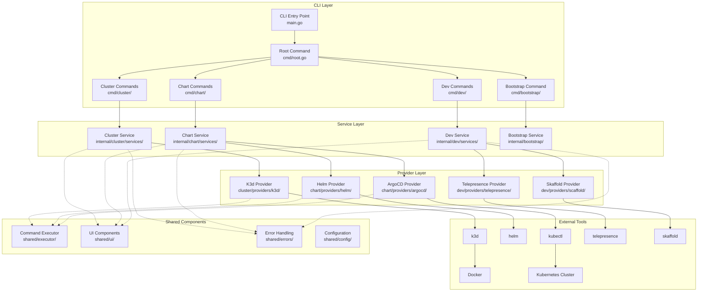
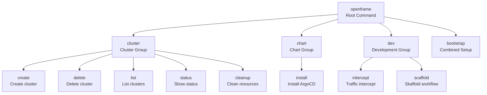
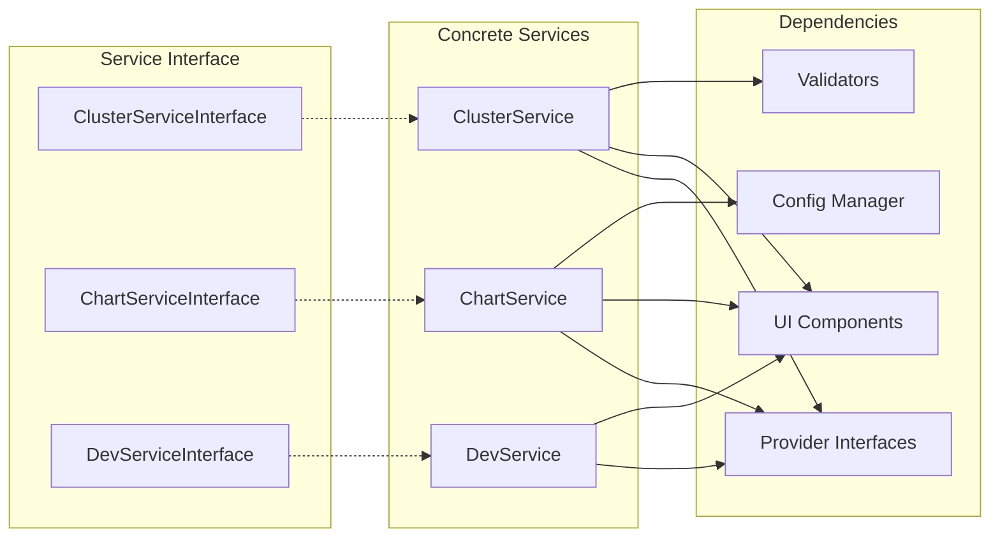
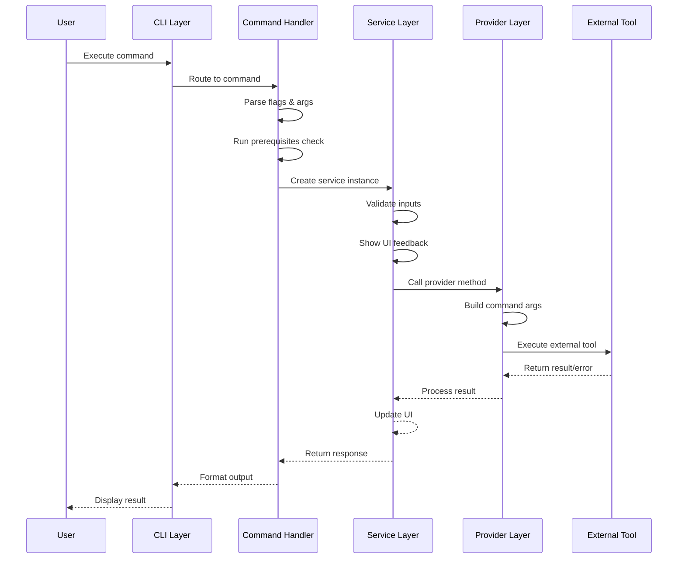
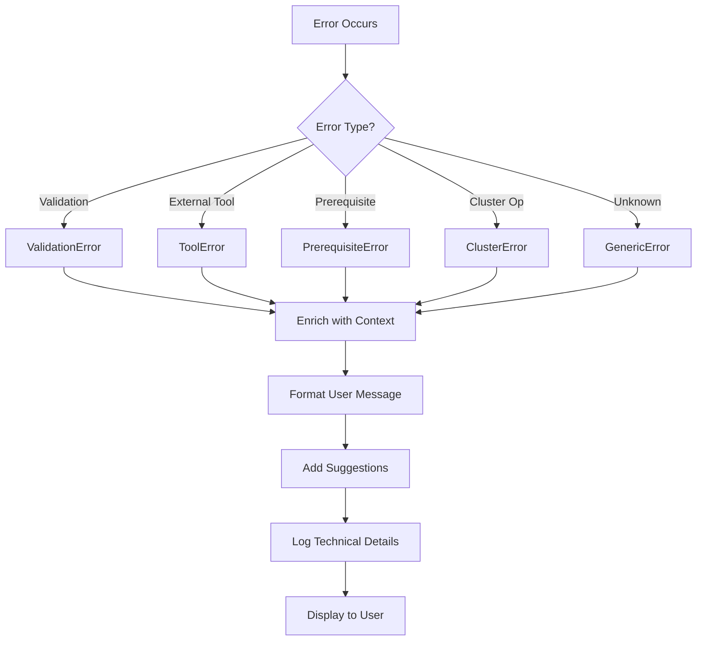
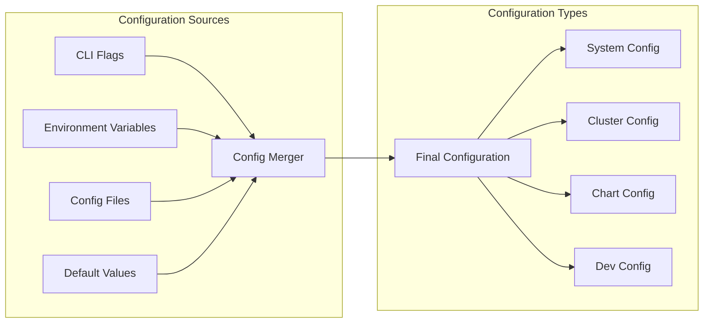
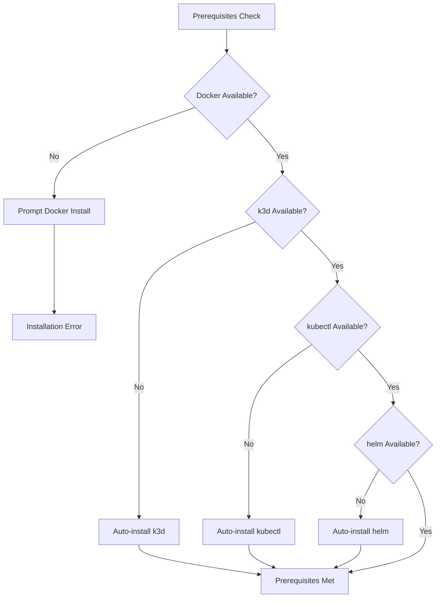

# Architecture Overview

OpenFrame CLI is designed as a modular, extensible command-line tool that orchestrates Kubernetes cluster management, GitOps deployment, and development workflows. This document provides a comprehensive look at the system architecture, design patterns, and key implementation details.

## High-Level Architecture

### System Overview Diagram



## Core Design Patterns

### 1. Command Pattern (CLI Layer)

The CLI layer implements the Command pattern using Cobra framework for consistent command structure and flag handling.

#### Command Hierarchy


#### Command Implementation Pattern
```go
// cmd/cluster/create.go
func getCreateCmd() *cobra.Command {
    var createCmd = &cobra.Command{
        Use:   "create [cluster-name]",
        Short: "Create a new K3d cluster",
        Args:  cobra.MaximumNArgs(1),
        PreRunE: func(cmd *cobra.Command, args []string) error {
            // Prerequisites check
            return prerequisites.NewInstaller().CheckAndInstall()
        },
        RunE: func(cmd *cobra.Command, args []string) error {
            // Business logic delegation
            service := services.NewClusterService()
            return service.CreateInteractively(args)
        },
    }
    
    // Flag definitions
    addCreateFlags(createCmd)
    return createCmd
}
```

### 2. Service Layer Pattern

The Service Layer provides a clean separation between CLI concerns and business logic, enabling testability and reusability.

#### Service Architecture


#### Service Implementation Example
```go
// internal/cluster/services/cluster_service.go
type ClusterService struct {
    provider     providers.ClusterProvider
    ui           ui.UIProvider
    validator    validators.ClusterValidator
    config       config.ConfigManager
}

func (s *ClusterService) Create(config *models.ClusterConfig) error {
    // Validation
    if err := s.validator.Validate(config); err != nil {
        return errors.NewValidationError("invalid configuration", err)
    }
    
    // User feedback
    s.ui.ShowProgress("Creating cluster", config.Name)
    
    // Business logic
    if err := s.provider.CreateCluster(config); err != nil {
        return errors.NewClusterError("creation failed", err)
    }
    
    // Post-creation setup
    return s.configureCluster(config)
}
```

### 3. Provider Pattern (External Tool Integration)

Providers abstract external tool interactions, enabling easy mocking for tests and potential alternative implementations.

#### Provider Interface Design
```go
// internal/cluster/providers/interfaces.go
type ClusterProvider interface {
    CreateCluster(config *models.ClusterConfig) error
    DeleteCluster(name string) error
    ListClusters() ([]*models.Cluster, error)
    GetClusterStatus(name string) (*models.ClusterStatus, error)
    GetKubeConfig(name string) (string, error)
}

// internal/cluster/providers/k3d/manager.go
type K3dProvider struct {
    executor executor.CommandExecutor
    logger   logger.Logger
}

func (p *K3dProvider) CreateCluster(config *models.ClusterConfig) error {
    args := p.buildCreateArgs(config)
    
    cmd := p.executor.NewCommand("k3d", args...)
    cmd.SetEnv(p.buildEnvironment(config))
    
    return cmd.Run()
}
```

### 4. Factory Pattern (Dependency Injection)

Factory functions provide dependency injection and configuration, enabling flexible testing and component substitution.

```go
// internal/cluster/services/factory.go
func NewClusterService(opts ...ServiceOption) *ClusterService {
    service := &ClusterService{
        provider:  providers.NewK3dProvider(),
        ui:        ui.NewTerminalUI(),
        validator: validators.NewClusterValidator(),
        config:    config.NewSystemConfig(),
    }
    
    // Apply options for dependency injection
    for _, opt := range opts {
        opt(service)
    }
    
    return service
}

type ServiceOption func(*ClusterService)

func WithProvider(provider providers.ClusterProvider) ServiceOption {
    return func(s *ClusterService) {
        s.provider = provider
    }
}
```

## Data Flow Architecture

### Command Execution Flow



### Error Handling Flow



## Key Components Deep Dive

### 1. Command Executor (Shared Component)

The command executor provides a consistent interface for running external tools with proper error handling, logging, and testing support.

```go
// internal/shared/executor/executor.go
type CommandExecutor interface {
    NewCommand(name string, args ...string) Command
    SetWorkingDirectory(dir string) CommandExecutor
    SetEnvironment(env map[string]string) CommandExecutor
}

type Command interface {
    Run() error
    Output() ([]byte, error)
    CombinedOutput() ([]byte, error)
    Start() error
    Wait() error
    SetEnv(key, value string) Command
    SetStdin(r io.Reader) Command
}
```

### 2. UI Components (User Experience)

UI components provide consistent user interaction patterns across all commands.

```go
// internal/shared/ui/interface.go
type UIProvider interface {
    ShowLogo()
    Info(message string, args ...interface{})
    Success(message string, args ...interface{})
    Warning(message string, args ...interface{})
    Error(message string, args ...interface{})
    ShowProgress(operation, target string)
    Prompt(message string) (string, error)
    Select(message string, options []string) (int, error)
    Confirm(message string) (bool, error)
}
```

### 3. Configuration Management

Configuration management handles system settings, user preferences, and runtime configuration.



### 4. Error Handling System

Structured error handling provides consistent error types with context and user-friendly messages.

```go
// internal/shared/errors/types.go
type OpenFrameError struct {
    Type        ErrorType
    Message     string
    Cause       error
    Context     map[string]interface{}
    Suggestions []string
    Retryable   bool
}

func NewClusterError(message string, cause error, opts ...ErrorOption) *OpenFrameError {
    err := &OpenFrameError{
        Type:    ErrorTypeCluster,
        Message: message,
        Cause:   cause,
        Context: make(map[string]interface{}),
    }
    
    for _, opt := range opts {
        opt(err)
    }
    
    return err
}
```

## Prerequisites System

The prerequisites system ensures all required tools are available before executing commands.

### Prerequisites Architecture



### Prerequisites Implementation

```go
// internal/shared/prerequisites/checker.go
type PrerequisiteChecker interface {
    Check() error
    Install() error
    IsInstalled() bool
    GetVersion() (string, error)
}

// internal/cluster/prerequisites/k3d/k3d.go
type K3dChecker struct {
    executor executor.CommandExecutor
    installer Installer
}

func (c *K3dChecker) Check() error {
    if c.IsInstalled() {
        return nil
    }
    
    return errors.NewPrerequisiteError("k3d not found",
        errors.WithSuggestion("Run 'openframe prerequisites install' or install manually"),
        errors.WithDocLink("https://k3d.io/install"))
}
```

## Extension Points

The architecture provides several extension points for adding new functionality:

### 1. New Command Groups
Add new command groups by:
1. Creating `cmd/{group}/` directory
2. Implementing command structure
3. Adding service layer in `internal/{group}/`
4. Registering with root command

### 2. New Providers  
Add support for new external tools by:
1. Implementing provider interface
2. Adding prerequisite checker
3. Creating installer if auto-install supported
4. Adding provider factory

### 3. New Cloud Providers
Extend cluster support by:
1. Implementing `ClusterProvider` interface
2. Adding provider-specific configuration
3. Implementing cloud-specific operations
4. Adding authentication handling

### 4. New UI Components
Extend user interface by:
1. Adding new UI methods to interface
2. Implementing in terminal UI provider
3. Adding tests for UI interactions
4. Considering accessibility requirements

## Performance Considerations

### 1. Command Execution
- **Concurrent execution**: Multiple operations can run in parallel when safe
- **Streaming output**: Long-running commands stream output to user
- **Timeout handling**: All external commands have configurable timeouts
- **Resource cleanup**: Proper cleanup on interruption or failure

### 2. Memory Management
- **Streaming processing**: Large outputs are processed as streams
- **Context cancellation**: Operations can be cancelled cleanly
- **Resource pooling**: Reuse expensive objects where possible
- **Garbage collection**: Minimize allocations in hot paths

### 3. Network Operations
- **Retry logic**: Network operations include exponential backoff
- **Connection pooling**: HTTP clients use connection pooling  
- **Timeout configuration**: Configurable timeouts for different operations
- **Progress feedback**: Long network operations show progress

## Security Considerations

### 1. Credential Handling
- **No storage**: Credentials are not stored persistently by default
- **Environment variables**: Support standard credential environment variables
- **Secure transmission**: Use TLS for all external communications
- **Permission validation**: Check file/directory permissions before use

### 2. External Tool Execution
- **Path validation**: Validate external tool paths to prevent injection
- **Argument sanitization**: Sanitize all command arguments
- **Shell avoidance**: Use direct command execution, not shell interpretation
- **Working directory**: Set safe working directories

### 3. Configuration Security
- **File permissions**: Config files use restrictive permissions (600)
- **Validation**: All configuration is validated before use
- **Secrets handling**: Sensitive values are handled carefully
- **Audit logging**: Security-relevant operations are logged

---

**Next**: Learn about [Testing Strategy](../testing/overview.md) to understand how this architecture is validated, or explore [Contributing Guidelines](../contributing/guidelines.md) to start extending the system.