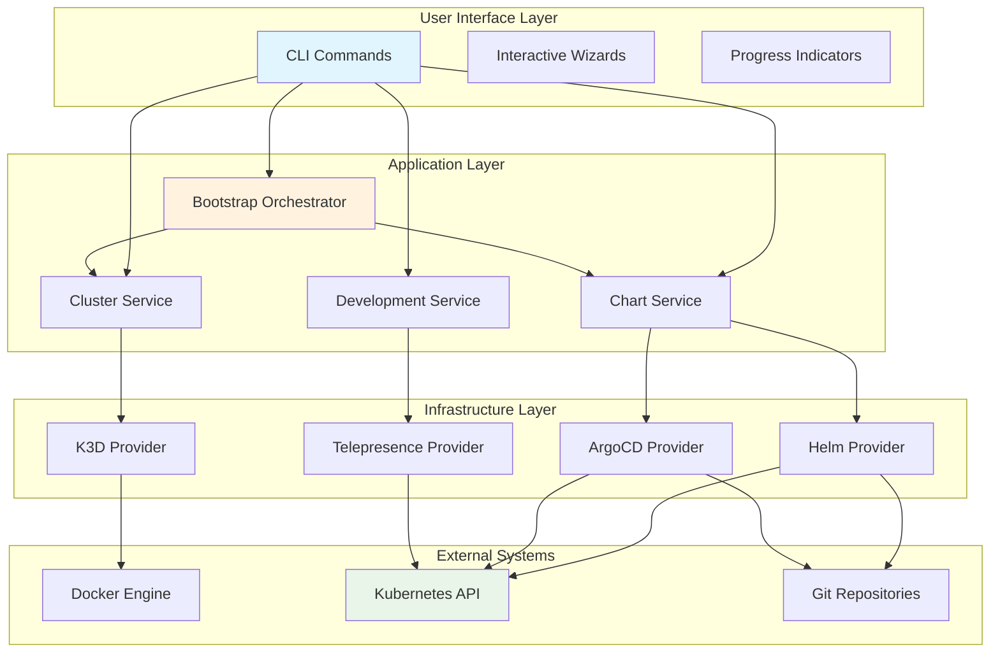
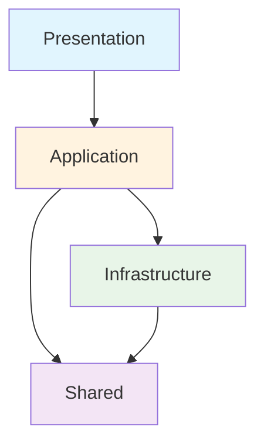
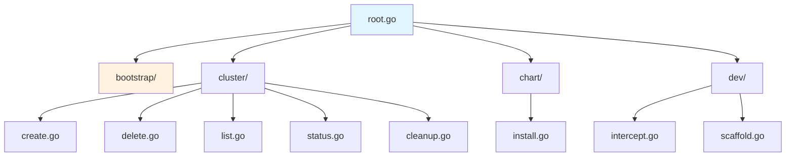
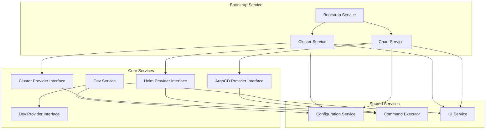
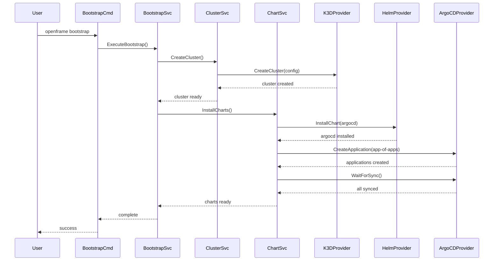
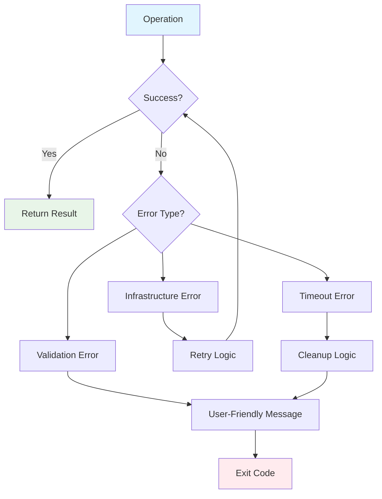
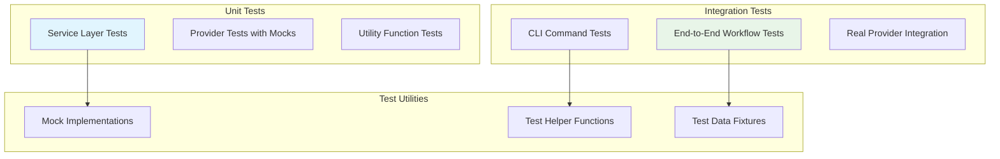
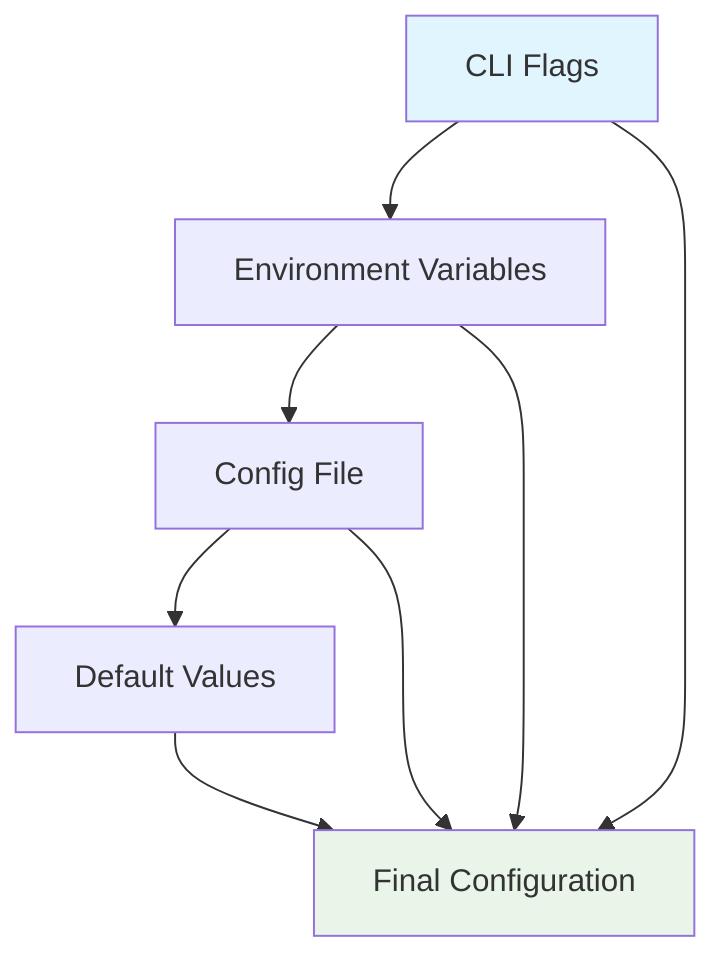

# Architecture Overview

OpenFrame CLI implements a clean architecture pattern with domain-driven design, providing a maintainable and testable codebase for Kubernetes cluster management and development workflows.

## High-Level Architecture

### System Overview


## Core Design Principles

### 1. Clean Architecture Layers

| Layer | Purpose | Examples |
|-------|---------|----------|
| **Presentation** | User interaction, CLI commands, UI | `cmd/*`, Interactive wizards |
| **Application** | Business logic, orchestration | `internal/*/service.go` |
| **Infrastructure** | External integrations, providers | `internal/*/providers/*` |
| **Shared** | Cross-cutting concerns | `internal/shared/*` |

### 2. Dependency Direction


Dependencies flow inward: outer layers depend on inner layers, never the reverse.

### 3. Interface-Driven Design

All external dependencies are abstracted behind interfaces, enabling:
- **Testability**: Mock implementations for unit tests
- **Flexibility**: Swappable implementations (e.g., different cluster providers)
- **Decoupling**: Services don't depend on concrete implementations

## Module Architecture

### Command Structure (cmd/)


Each command module follows this pattern:
1. **Command Definition**: Cobra command with flags and validation
2. **Service Delegation**: Business logic delegated to service layer
3. **Error Handling**: Consistent error formatting and exit codes
4. **Help Integration**: Rich help text and examples

### Service Layer (internal/*/services/)


Service characteristics:
- **Single Responsibility**: Each service handles one domain
- **Interface Dependencies**: Services depend on interfaces, not implementations
- **Error Handling**: Domain-specific error types and handling
- **Configuration**: Injected configuration dependencies

### Provider Layer (internal/*/providers/)

Providers implement infrastructure concerns:

#### K3D Provider (Cluster Management)
```go
type ClusterProvider interface {
    CreateCluster(config ClusterConfig) (*Cluster, error)
    DeleteCluster(name string) error
    ListClusters() ([]*Cluster, error)
    GetClusterStatus(name string) (*ClusterStatus, error)
}
```

#### Helm Provider (Package Management)
```go
type HelmProvider interface {
    InstallChart(chart ChartConfig) error
    UpgradeChart(chart ChartConfig) error
    UninstallChart(name, namespace string) error
    ListReleases() ([]*Release, error)
}
```

#### ArgoCD Provider (GitOps)
```go
type ArgoCDProvider interface {
    InstallArgoCD(config ArgoCDConfig) error
    CreateApplication(app ApplicationConfig) error
    SyncApplication(name, namespace string) error
    WaitForApplications(timeout time.Duration) error
}
```

## Data Flow Patterns

### Bootstrap Flow (Complete Environment Setup)


### Error Handling Flow


## Key Design Patterns

### 1. Command Pattern (CLI Commands)
```go
// Each command implements this pattern
func GetClusterCreateCmd() *cobra.Command {
    return &cobra.Command{
        Use:   "create [cluster-name]",
        Short: "Create a new K3D cluster",
        RunE: func(cmd *cobra.Command, args []string) error {
            // Parse flags and arguments
            config := parseCreateFlags(cmd)
            
            // Delegate to service
            service := cluster.NewService(/* dependencies */)
            return service.CreateCluster(config)
        },
    }
}
```

### 2. Dependency Injection
```go
// Services receive dependencies via constructor
func NewClusterService(
    provider ClusterProvider,
    ui UIService,
    config ConfigService,
) *ClusterService {
    return &ClusterService{
        provider: provider,
        ui: ui,
        config: config,
    }
}
```

### 3. Builder Pattern (Configuration)
```go
// Fluent configuration building
config := cluster.NewConfigBuilder().
    WithName("my-cluster").
    WithMemory("4Gi").
    WithPorts(8080, 8443).
    Build()
```

### 4. Strategy Pattern (Deployment Modes)
```go
type DeploymentStrategy interface {
    GetHelmValues() map[string]interface{}
    GetApplications() []*ApplicationConfig
}

// Different strategies for different deployment modes
type OSSStrategy struct{}
type SaaSSharedStrategy struct{}
type SaaSDedicatedStrategy struct{}
```

## Component Responsibilities

### Core Components

| Component | Responsibilities |
|-----------|------------------|
| **Bootstrap Service** | Orchestrates complete environment setup, coordinates cluster and chart services |
| **Cluster Service** | Manages cluster lifecycle, handles cluster-specific configurations |
| **Chart Service** | Manages Helm charts and ArgoCD applications, implements GitOps patterns |
| **Development Service** | Provides developer tools, traffic interception, service scaffolding |

### Infrastructure Providers

| Provider | Responsibilities |
|----------|------------------|
| **K3D Provider** | K3D cluster management, Docker integration, networking configuration |
| **Helm Provider** | Helm chart installation, release management, repository handling |
| **ArgoCD Provider** | ArgoCD installation, application management, sync monitoring |
| **Telepresence Provider** | Traffic interception, local development workflows |

### Shared Components

| Component | Responsibilities |
|-----------|------------------|
| **Command Executor** | External command execution, output capture, error handling |
| **Configuration Service** | Configuration loading, validation, default values |
| **UI Service** | Interactive prompts, progress indicators, formatted output |
| **Error Handler** | Error categorization, user-friendly messages, retry logic |

## Testing Architecture

### Test Structure


### Testing Patterns

#### 1. Service Layer Testing
```go
func TestClusterService_CreateCluster(t *testing.T) {
    // Arrange
    mockProvider := &mocks.ClusterProvider{}
    mockUI := &mocks.UIService{}
    service := cluster.NewService(mockProvider, mockUI, nil)
    
    // Configure mocks
    mockProvider.On("CreateCluster", mock.Anything).Return(cluster, nil)
    
    // Act
    err := service.CreateCluster(config)
    
    // Assert
    assert.NoError(t, err)
    mockProvider.AssertExpectations(t)
}
```

#### 2. CLI Integration Testing
```go
func TestBootstrapCommand(t *testing.T) {
    // Use real CLI with test cluster
    runner := testutil.NewCLIRunner()
    result := runner.Run("bootstrap", "test-cluster", "--non-interactive")
    
    assert.Equal(t, 0, result.ExitCode)
    assert.Contains(t, result.Output, "Bootstrap Complete")
}
```

## Configuration Management

### Configuration Hierarchy


### Configuration Sources (Priority Order)
1. **CLI Flags**: Highest priority, explicit user input
2. **Environment Variables**: System-level configuration
3. **Configuration File**: Persistent user preferences
4. **Default Values**: Fallback values for all settings

## Performance Considerations

### Optimization Strategies

| Area | Strategy | Implementation |
|------|----------|----------------|
| **Command Startup** | Lazy loading | Load providers only when needed |
| **Network Operations** | Connection pooling | Reuse HTTP clients and connections |
| **File Operations** | Caching | Cache configuration and templates |
| **Docker Operations** | Batch operations | Combine multiple Docker commands |

### Resource Management
- **Memory**: Efficient streaming for large operations
- **CPU**: Parallel operations where possible
- **Disk**: Cleanup temporary files automatically
- **Network**: Timeout and retry configurations

## Security Considerations

### Security Patterns

| Pattern | Implementation | Purpose |
|---------|----------------|---------|
| **Input Validation** | Strict validation of all user inputs | Prevent injection attacks |
| **Credential Management** | Secure storage and rotation | Protect sensitive data |
| **Network Security** | TLS everywhere, certificate validation | Secure communications |
| **Privilege Separation** | Minimal permissions principle | Reduce attack surface |

---

## Next Steps

Understanding the architecture? Continue with:

- **[Testing Overview](../testing/overview.md)** - Learn the testing strategy and patterns
- **[Contributing Guidelines](../contributing/guidelines.md)** - Understand contribution processes
- **[Local Development](../setup/local-development.md)** - Set up your development environment

This architecture provides a solid foundation for maintainable, testable, and extensible CLI development while following industry best practices.