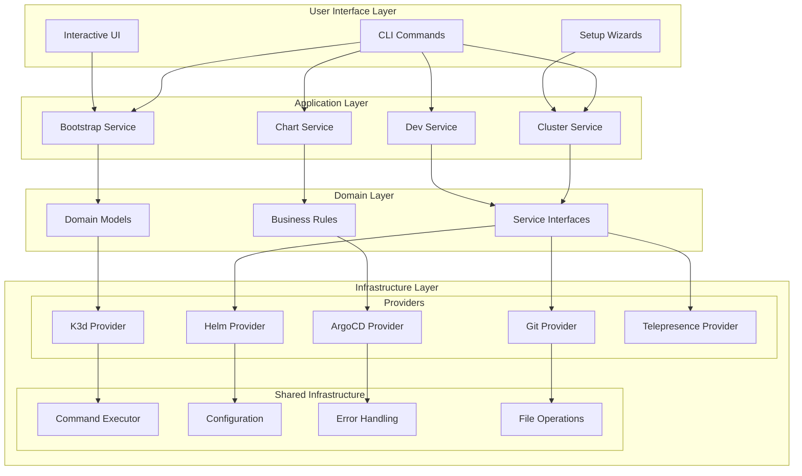
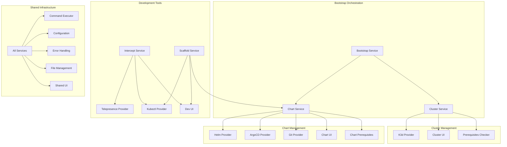
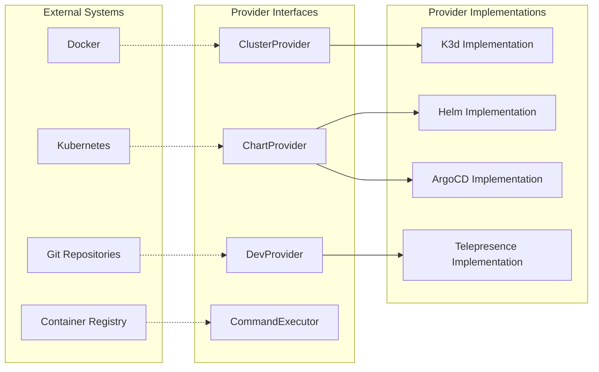
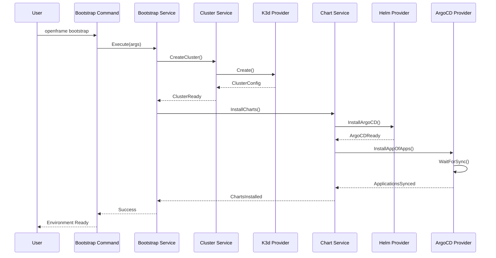
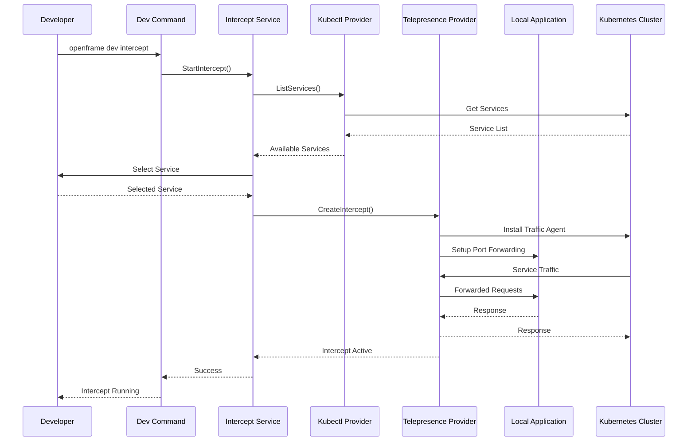
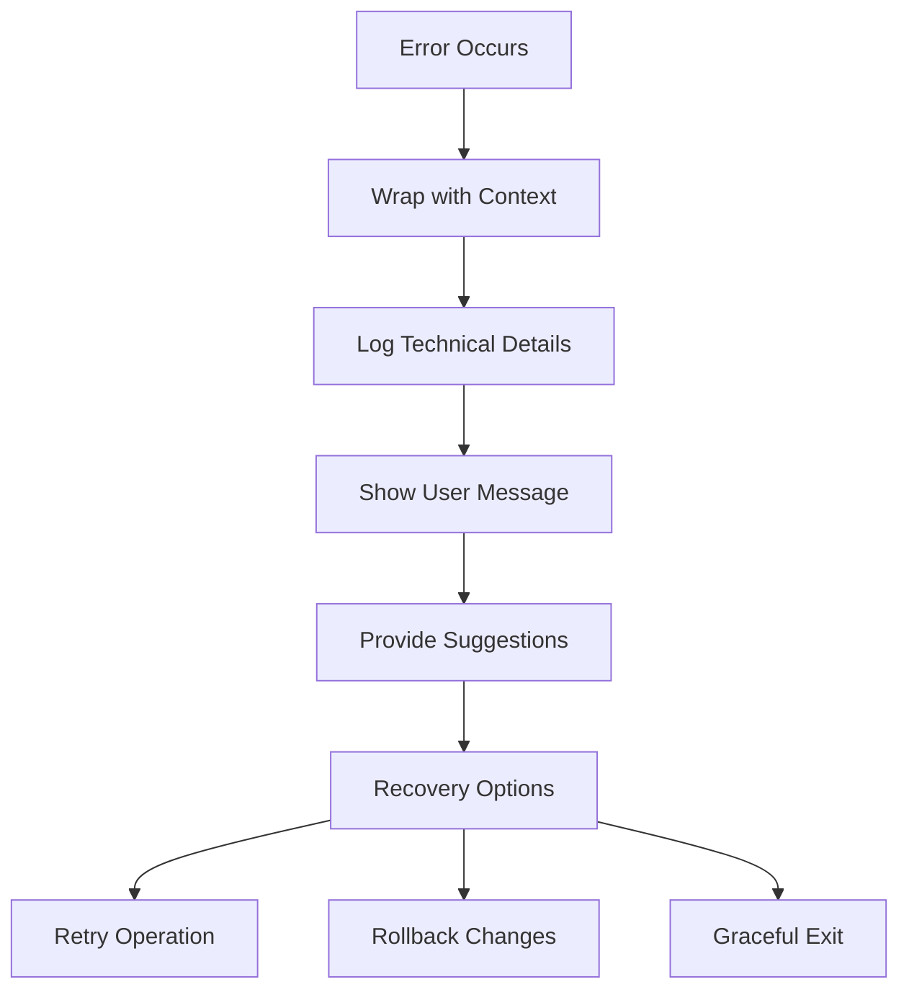
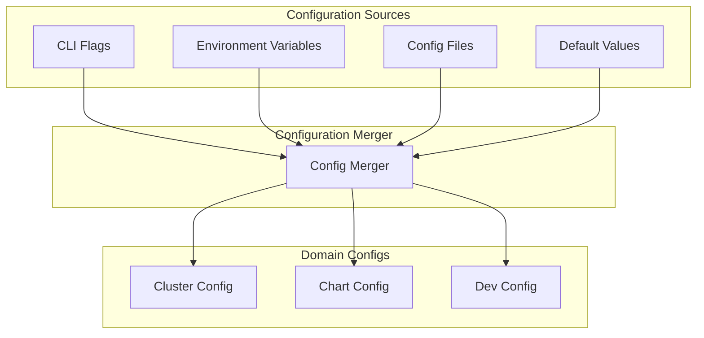
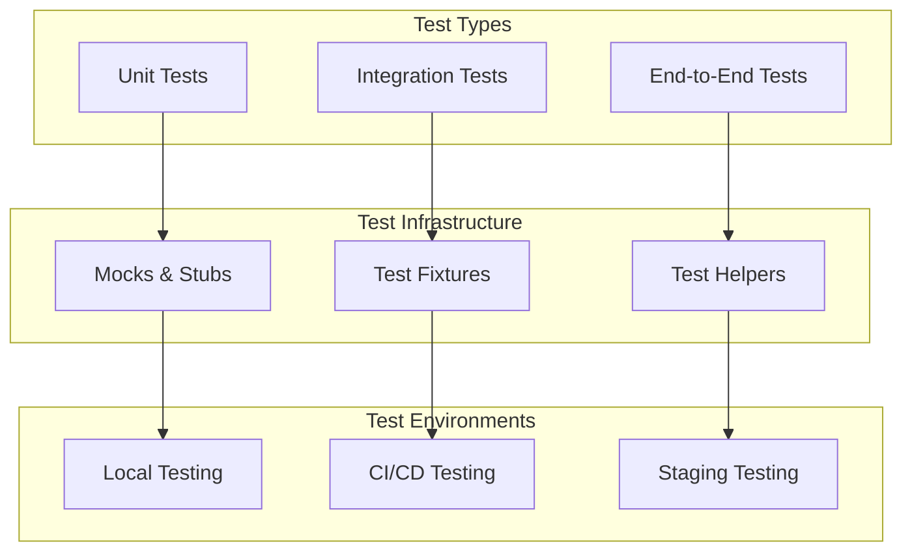

# Architecture Overview

This document provides a comprehensive overview of OpenFrame CLI's architecture, including its design principles, component relationships, and data flow patterns. Understanding this architecture will help you navigate the codebase and contribute effectively.

## 🏗️ Architectural Principles

OpenFrame CLI is built on several key architectural principles:

### Clean Architecture
- **Separation of Concerns**: Clear boundaries between business logic, infrastructure, and presentation
- **Dependency Inversion**: High-level modules don't depend on low-level modules; both depend on abstractions
- **Single Responsibility**: Each component has one reason to change

### Hexagonal Architecture
- **Port and Adapter Pattern**: Business logic is isolated from external dependencies
- **Provider Pattern**: External integrations (K3d, Helm, ArgoCD) are swappable implementations
- **Service Layer**: Core business logic independent of CLI framework

### Domain-Driven Design
- **Bounded Contexts**: Clear boundaries between cluster, chart, dev, and bootstrap domains
- **Ubiquitous Language**: Consistent terminology throughout the codebase
- **Rich Domain Models**: Business logic encapsulated in domain entities

## 🎯 High-Level Architecture



## 📁 Directory Structure

### Package Organization

```text
openframe-cli/
├── cmd/                           # Command Layer (Cobra CLI)
│   ├── bootstrap/                 # Bootstrap command implementation
│   ├── cluster/                   # Cluster management commands  
│   ├── chart/                     # Chart management commands
│   ├── dev/                       # Development tool commands
│   └── root.go                    # Root command and CLI setup
│
├── internal/                      # Internal packages (non-importable)
│   ├── bootstrap/                 # Bootstrap domain
│   │   └── service.go            # Bootstrap orchestration logic
│   │
│   ├── cluster/                   # Cluster management domain
│   │   ├── service.go            # Cluster service implementation
│   │   ├── models/               # Cluster domain models
│   │   ├── providers/            # Cluster provider implementations
│   │   │   └── k3d/             # K3d-specific implementation
│   │   ├── ui/                   # Cluster UI components
│   │   └── utils/                # Cluster utilities
│   │
│   ├── chart/                     # Chart management domain
│   │   ├── service.go            # Chart service implementation
│   │   ├── models/               # Chart domain models
│   │   ├── providers/            # Chart provider implementations
│   │   │   ├── helm/            # Helm provider
│   │   │   ├── argocd/          # ArgoCD provider
│   │   │   └── git/             # Git provider
│   │   ├── ui/                   # Chart UI components
│   │   └── utils/                # Chart utilities
│   │
│   ├── dev/                       # Development tools domain
│   │   ├── services/             # Dev service implementations
│   │   │   ├── intercept/       # Service intercept logic
│   │   │   └── scaffold/        # Application scaffolding
│   │   ├── providers/            # Dev tool providers
│   │   │   ├── telepresence/    # Telepresence integration
│   │   │   └── kubectl/         # Kubectl integration
│   │   └── ui/                   # Dev UI components
│   │
│   └── shared/                    # Shared infrastructure
│       ├── executor/             # Command execution abstraction
│       ├── ui/                   # Common UI components
│       ├── config/               # Configuration management
│       ├── errors/               # Error handling utilities
│       └── files/                # File operation utilities
│
└── tests/                         # Test files and utilities
    ├── integration/              # Integration tests
    ├── mocks/                    # Test mocks and stubs
    └── testutil/                 # Test utilities and helpers
```

## 🔄 Component Relationships

### Service Dependencies



### Interface Boundaries



## 📊 Data Flow Patterns

### Bootstrap Flow



### Intercept Flow



## 🧩 Core Components Deep Dive

### Command Layer (`cmd/`)

The command layer implements the CLI interface using the Cobra framework:

```go
// Example command structure
type Command struct {
    Use   string
    Short string
    Long  string
    RunE  func(cmd *cobra.Command, args []string) error
}

// Command delegates to service layer
func runBootstrap(cmd *cobra.Command, args []string) error {
    service := bootstrap.NewService()
    return service.Execute(cmd, args)
}
```

**Responsibilities:**
- Parse command-line arguments and flags
- Validate input parameters
- Delegate to appropriate service layer
- Handle user interaction and display

### Service Layer (`internal/*/`)

The service layer contains the core business logic:

```go
// Service interface pattern
type ClusterService interface {
    Create(name string, config ClusterConfig) error
    Delete(name string) error
    List() ([]Cluster, error)
    Status(name string) (*ClusterStatus, error)
}

// Service implementation
type clusterService struct {
    provider ClusterProvider
    ui       UIService
    config   ConfigService
}
```

**Responsibilities:**
- Implement business logic and workflows
- Coordinate between multiple providers
- Manage domain models and state
- Enforce business rules and validation

### Provider Layer (`internal/*/providers/`)

The provider layer implements external integrations:

```go
// Provider interface
type ClusterProvider interface {
    Create(name string, config *ClusterConfig) error
    Delete(name string) error
    List() ([]string, error)
    GetStatus(name string) (*ClusterStatus, error)
}

// K3d provider implementation
type k3dProvider struct {
    executor CommandExecutor
}

func (p *k3dProvider) Create(name string, config *ClusterConfig) error {
    // K3d-specific implementation
    return p.executor.Execute("k3d", "cluster", "create", name)
}
```

**Responsibilities:**
- Integrate with external tools (k3d, helm, kubectl)
- Abstract tool-specific details
- Provide consistent interfaces
- Handle tool-specific error scenarios

### Shared Infrastructure (`internal/shared/`)

Shared infrastructure provides common utilities:

```go
// Command executor interface
type CommandExecutor interface {
    Execute(command string, args ...string) error
    ExecuteWithOutput(command string, args ...string) (string, error)
}

// UI service for user interaction
type UIService interface {
    ShowProgress(message string)
    PromptSelect(message string, options []string) (string, error)
    DisplayTable(data [][]string)
}
```

**Responsibilities:**
- Provide reusable utilities across domains
- Abstract system-level operations
- Manage configuration and state
- Handle cross-cutting concerns

## 🔍 Design Patterns

### Provider Pattern

```go
// Provider registration
type ProviderRegistry struct {
    clusterProviders map[string]ClusterProvider
    chartProviders   map[string]ChartProvider
}

func (r *ProviderRegistry) RegisterClusterProvider(name string, provider ClusterProvider) {
    r.clusterProviders[name] = provider
}

func (r *ProviderRegistry) GetClusterProvider(name string) ClusterProvider {
    return r.clusterProviders[name]
}
```

### Service Locator

```go
// Service locator for dependency management
type ServiceContainer struct {
    services map[string]interface{}
}

func (c *ServiceContainer) Register(name string, service interface{}) {
    c.services[name] = service
}

func (c *ServiceContainer) Resolve(name string) interface{} {
    return c.services[name]
}
```

### Command Pattern

```go
// Command pattern for operations
type Command interface {
    Execute() error
    Rollback() error
}

type CreateClusterCommand struct {
    name     string
    provider ClusterProvider
}

func (c *CreateClusterCommand) Execute() error {
    return c.provider.Create(c.name)
}

func (c *CreateClusterCommand) Rollback() error {
    return c.provider.Delete(c.name)
}
```

## 🚦 Error Handling Strategy

### Error Types

```go
// Domain-specific error types
type ClusterError struct {
    Operation string
    Cluster   string
    Cause     error
}

func (e *ClusterError) Error() string {
    return fmt.Sprintf("cluster %s failed during %s: %v", e.Cluster, e.Operation, e.Cause)
}

// User-friendly error wrapper
type UserError struct {
    Message     string
    Suggestions []string
    Cause       error
}
```

### Error Flow



## 📋 Configuration Management

### Configuration Layers



### Configuration Structure

```go
// Hierarchical configuration
type Config struct {
    Cluster ClusterConfig `yaml:"cluster"`
    Chart   ChartConfig   `yaml:"chart"`
    Dev     DevConfig     `yaml:"dev"`
    Logging LogConfig     `yaml:"logging"`
}

type ClusterConfig struct {
    Provider    string            `yaml:"provider"`
    Name        string            `yaml:"name"`
    Nodes       int               `yaml:"nodes"`
    Version     string            `yaml:"version"`
    ExtraArgs   map[string]string `yaml:"extraArgs"`
}
```

## 🧪 Testing Architecture

### Test Organization



### Testing Patterns

```go
// Table-driven tests
func TestClusterService_Create(t *testing.T) {
    tests := []struct {
        name        string
        clusterName string
        config      ClusterConfig
        mockSetup   func(*MockProvider)
        wantErr     bool
    }{
        // Test cases...
    }
    
    for _, tt := range tests {
        t.Run(tt.name, func(t *testing.T) {
            // Test implementation
        })
    }
}

// Mock interfaces for testing
type MockClusterProvider struct {
    CreateFunc func(string, ClusterConfig) error
}

func (m *MockClusterProvider) Create(name string, config ClusterConfig) error {
    if m.CreateFunc != nil {
        return m.CreateFunc(name, config)
    }
    return nil
}
```

## 📈 Performance Considerations

### Command Execution Optimization

- **Concurrent Operations**: Parallel execution where safe
- **Caching**: Cache expensive operations and results  
- **Lazy Loading**: Load resources only when needed
- **Resource Pooling**: Reuse connections and clients

### Memory Management

- **Streaming**: Process large outputs in streams
- **Cleanup**: Proper resource cleanup and garbage collection
- **Limits**: Respect system resource constraints

## 🚀 Extensibility Points

### Adding New Providers

```go
// 1. Implement provider interface
type MyClusterProvider struct{}

func (p *MyClusterProvider) Create(name string, config *ClusterConfig) error {
    // Custom implementation
}

// 2. Register provider
func init() {
    registry.RegisterClusterProvider("myprovider", &MyClusterProvider{})
}
```

### Adding New Commands

```go
// 1. Create command file
func GetMyCmd() *cobra.Command {
    return &cobra.Command{
        Use:  "mycmd",
        RunE: runMyCmd,
    }
}

// 2. Add to root command
rootCmd.AddCommand(GetMyCmd())
```

## 📚 Architecture Resources

### Design Documents
- **[ADR-001: Architecture Decision Records](../contributing/guidelines.md)**
- **[Provider Interface Design](../contributing/guidelines.md)**
- **[Error Handling Strategy](../contributing/guidelines.md)**

### Code Examples
- **[Service Implementation Examples](../testing/overview.md)**
- **[Provider Implementation Patterns](../testing/overview.md)**
- **[Testing Strategies](../testing/overview.md)**

---

*Ready to dive into testing? Check out our [testing overview](../testing/overview.md) to understand how to test OpenFrame CLI effectively.*