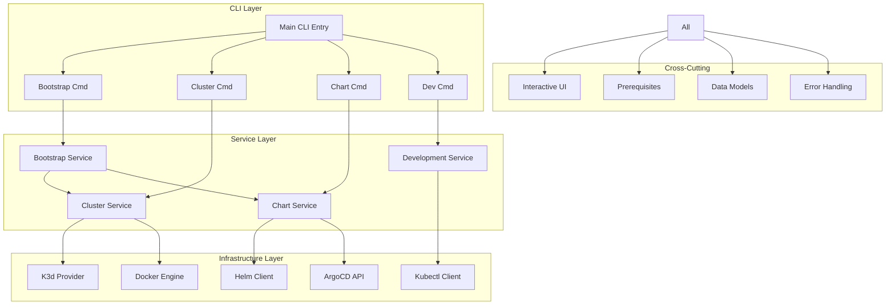
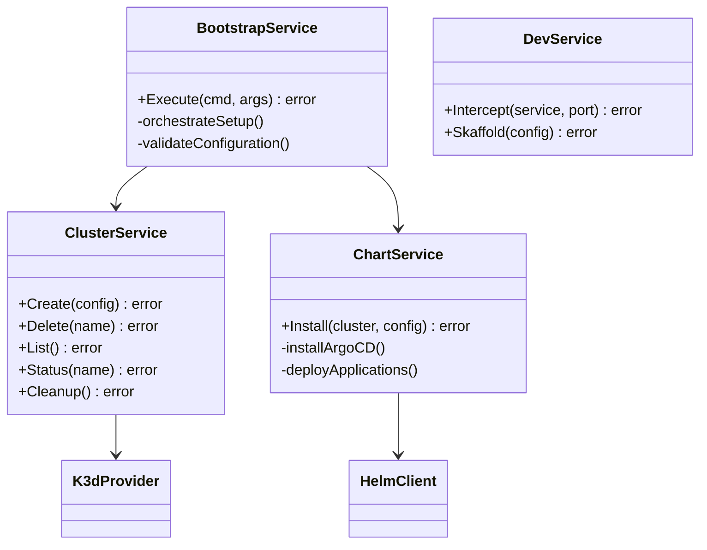
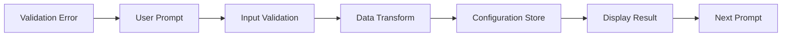
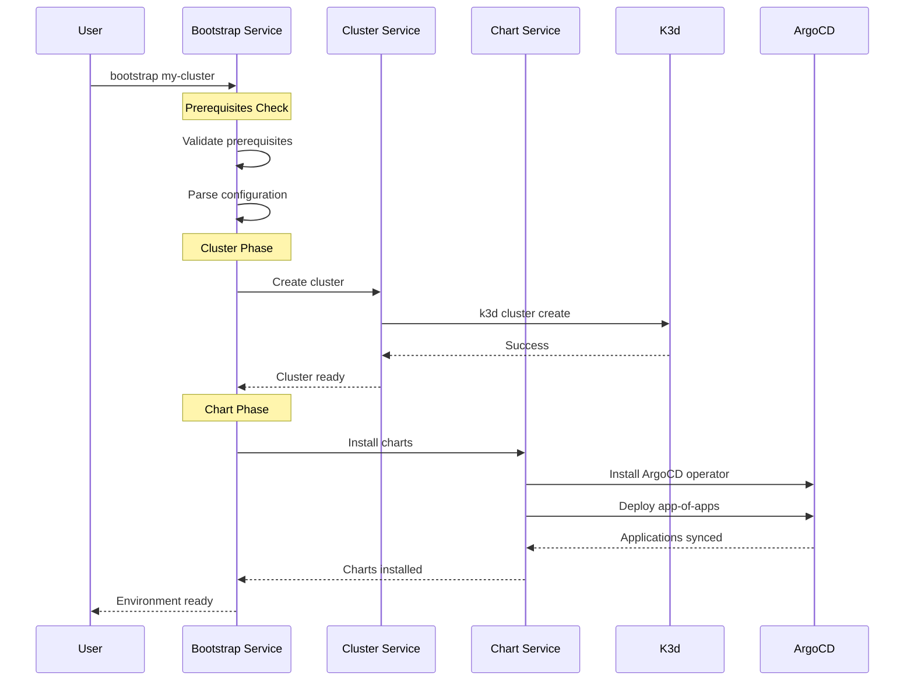
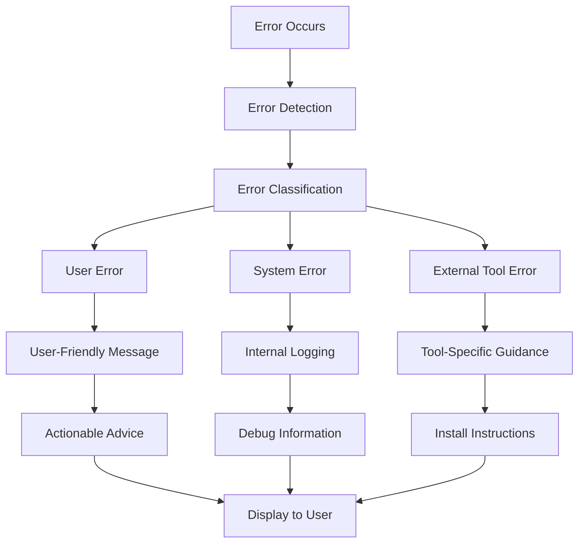
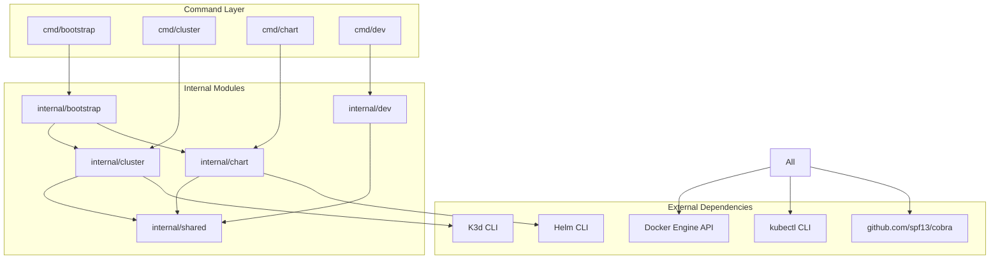
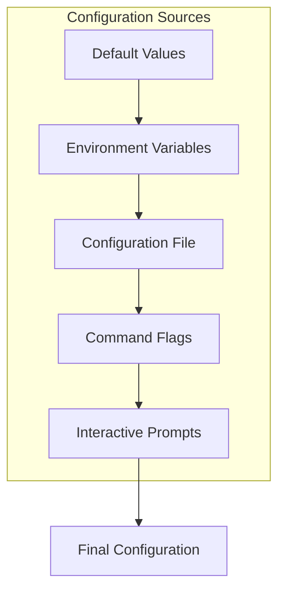

# Architecture Overview

This guide provides an in-depth look at OpenFrame CLI's architecture, design patterns, and key architectural decisions. Understanding this foundation is essential for effective contribution and extension of the project.

## High-Level Architecture

OpenFrame CLI follows a modular, command-oriented architecture built on the Cobra CLI framework. The system is designed for extensibility, testability, and clear separation of concerns.



## Core Components

### 1. Command Layer (`cmd/`)

The command layer defines the CLI interface and user-facing commands using the Cobra framework.

#### Component Structure

| Package | Purpose | Key Files |
|---------|---------|-----------|
| `cmd/bootstrap/` | End-to-end environment setup | `bootstrap.go` |
| `cmd/cluster/` | Cluster lifecycle management | `cluster.go`, `create.go`, `delete.go`, `list.go`, `status.go`, `cleanup.go` |
| `cmd/chart/` | ArgoCD and chart operations | `chart.go`, `install.go` |
| `cmd/dev/` | Development workflow tools | `dev.go` |

#### Design Patterns

**Command Pattern**: Each command is encapsulated with its own configuration, validation, and execution logic.

```go
// Example command structure
func GetBootstrapCmd() *cobra.Command {
    cmd := &cobra.Command{
        Use:   "bootstrap [cluster-name]",
        Short: "Bootstrap complete OpenFrame environment",
        RunE: func(cmd *cobra.Command, args []string) error {
            return bootstrap.NewService().Execute(cmd, args)
        },
    }
    // Flag configuration...
    return cmd
}
```

### 2. Service Layer (`internal/*/`)

The service layer contains the core business logic, isolated from CLI concerns and external dependencies.

#### Service Architecture



#### Service Responsibilities

| Service | Core Responsibilities |
|---------|----------------------|
| **Bootstrap** | Orchestrate cluster creation and chart installation |
| **Cluster** | K3d cluster lifecycle, node management, networking |
| **Chart** | ArgoCD installation, Helm chart deployment, GitOps setup |
| **Dev** | Telepresence integration, Skaffold workflows |

### 3. Infrastructure Layer

The infrastructure layer provides abstractions over external tools and services.

#### Provider Pattern

```go
// Example provider interface
type ClusterProvider interface {
    Create(config ClusterConfig) error
    Delete(name string) error
    List() ([]ClusterInfo, error)
    Status(name string) (*ClusterStatus, error)
}

// K3d implementation
type K3dProvider struct {
    dockerClient DockerClient
    configPath   string
}
```

### 4. Cross-Cutting Concerns

#### Interactive UI System



The UI system provides consistent interactive experiences:

- **Configuration wizards** for complex setups
- **Progress indicators** for long-running operations  
- **Error messaging** with actionable guidance
- **Confirmation prompts** for destructive operations

#### Prerequisites Management

```go
type PrerequisiteChecker interface {
    Check() (*CheckResult, error)
    Install() error
    GetInstructions() []Instruction
}

type Prerequisites struct {
    checkers map[string]PrerequisiteChecker
}
```

Prerequisites are checked automatically before command execution:

- **Tool detection**: Docker, K3d, Helm, kubectl
- **Version validation**: Ensure compatibility
- **Installation guidance**: Platform-specific instructions
- **Dependency resolution**: Install missing tools

## Data Flow Architecture

### Bootstrap Command Flow



### Error Handling Flow



## Key Design Decisions

### 1. **Command Orchestration vs. Individual Commands**

**Decision**: Provide both granular commands (`cluster create`, `chart install`) and orchestrated workflows (`bootstrap`).

**Rationale**: 
- Beginners benefit from single-command setup
- Advanced users need granular control
- CI/CD pipelines require specific operations

**Implementation**:
```go
// Bootstrap orchestrates multiple services
func (s *BootstrapService) Execute() error {
    if err := s.clusterService.Create(); err != nil {
        return err
    }
    return s.chartService.Install()
}
```

### 2. **Interactive vs. Non-Interactive Modes**

**Decision**: Support both interactive wizards and non-interactive automation.

**Rationale**:
- Interactive mode improves user experience and learning
- Non-interactive mode enables automation and CI/CD
- Configuration can be saved and reused

**Implementation**:
```go
type ConfigurationMode int

const (
    Interactive ConfigurationMode = iota
    NonInteractive
    FileConfig
)
```

### 3. **Prerequisites Integration**

**Decision**: Embed prerequisite checking into the CLI rather than requiring external setup scripts.

**Rationale**:
- Better user experience with automatic detection
- Platform-specific guidance reduces support burden
- Enables progressive setup (install missing tools automatically)

### 4. **Error Handling Strategy**

**Decision**: Centralized error handling with context-aware messaging.

**Rationale**:
- Consistent user experience across commands
- Actionable error messages reduce user frustration
- Debugging information aids troubleshooting

**Implementation**:
```go
type ErrorHandler struct {
    context map[string]interface{}
    logger  Logger
}

func (h *ErrorHandler) Handle(err error) error {
    switch e := err.(type) {
    case *PrerequisiteError:
        return h.handlePrerequisiteError(e)
    case *ConfigurationError:
        return h.handleConfigurationError(e)
    default:
        return h.handleUnknownError(e)
    }
}
```

## Module Dependencies

### Dependency Graph



### Interface Boundaries

Clear interfaces define boundaries between modules:

```go
// Cluster service interface
type ClusterService interface {
    Create(config *ClusterConfig) error
    Delete(name string) error
    List() ([]*ClusterInfo, error)
    Status(name string) (*ClusterStatus, error)
}

// Chart service interface  
type ChartService interface {
    Install(cluster string, config *ChartConfig) error
    Uninstall(cluster string) error
    Status(cluster string) (*ChartStatus, error)
}
```

## Configuration Management

### Configuration Hierarchy



### Configuration Structure

```yaml
# Example configuration structure
cluster:
  defaults:
    nodes: 3
    registry: k3d-registry.local:5000
    ports:
      http: 80
      https: 443
      api: 6443

chart:
  argocd:
    version: "5.46.0"
    namespace: argocd
    adminPassword: auto-generate
    
deployment:
  mode: oss-tenant
  apps:
    - name: openframe-core
      path: charts/core
    - name: openframe-apps  
      path: charts/applications

development:
  telepresence:
    namespace: development
  skaffold:
    profile: local
```

## Performance Considerations

### Async Operations

Long-running operations use asynchronous patterns:

```go
type OperationProgress struct {
    Stage       string
    Percentage  int
    Message     string
    Error       error
}

func (s *ClusterService) CreateAsync(config *ClusterConfig) (<-chan OperationProgress, error) {
    progress := make(chan OperationProgress, 10)
    
    go func() {
        defer close(progress)
        // Implementation...
    }()
    
    return progress, nil
}
```

### Resource Management

- **Connection pooling** for Kubernetes API calls
- **Caching** for cluster status and configuration
- **Cleanup routines** for temporary resources
- **Graceful shutdown** handling

## Testing Architecture

### Test Pyramid

```mermaid
pyramid
    top[E2E Tests]
    middle[Integration Tests]  
    bottom[Unit Tests]
```

- **Unit Tests**: Test individual components in isolation
- **Integration Tests**: Test service interactions with real dependencies
- **E2E Tests**: Test complete workflows with actual clusters

### Mock Strategy

```go
//go:generate mockgen -source=interfaces.go -destination=mocks/mock.go

type MockClusterProvider struct {
    CreateFunc func(config ClusterConfig) error
    DeleteFunc func(name string) error
}

func (m *MockClusterProvider) Create(config ClusterConfig) error {
    if m.CreateFunc != nil {
        return m.CreateFunc(config)
    }
    return nil
}
```

## Extensibility Points

### Plugin Architecture (Future)

The architecture supports future plugin development:

```go
type Plugin interface {
    Name() string
    Commands() []*cobra.Command
    Initialize(config PluginConfig) error
}

type PluginManager struct {
    plugins map[string]Plugin
}
```

### Custom Providers

Support for alternative cluster providers:

```go
type ProviderRegistry struct {
    providers map[string]ClusterProvider
}

func (r *ProviderRegistry) Register(name string, provider ClusterProvider) {
    r.providers[name] = provider
}
```

## Security Considerations

### Credential Management

- **No credential storage** in configuration files
- **Environment variable** support for automation
- **Kubernetes RBAC** integration for cluster access
- **Temporary credential** generation

### Input Validation

- **Command argument** validation
- **Configuration file** schema validation  
- **User input** sanitization
- **Path traversal** prevention

---

## Summary

OpenFrame CLI's architecture emphasizes:

1. **Modularity**: Clear separation between commands, services, and infrastructure
2. **Extensibility**: Plugin-ready design with well-defined interfaces  
3. **User Experience**: Interactive wizards with automation support
4. **Reliability**: Comprehensive error handling and prerequisites management
5. **Testing**: Multi-level testing strategy for quality assurance

This architecture supports both current functionality and future growth, enabling contributors to add features while maintaining consistency and quality.

Understanding this architecture will help you:
- Navigate the codebase effectively
- Contribute features that align with design principles  
- Debug issues by understanding component interactions
- Extend functionality through proper abstraction layers

Next, explore the [Testing Overview](../testing/overview.md) to understand how this architecture is validated and maintained.