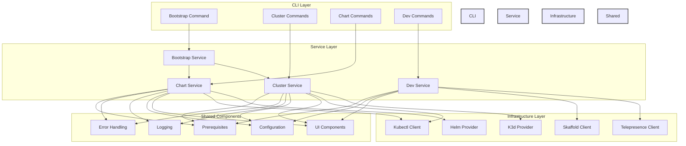
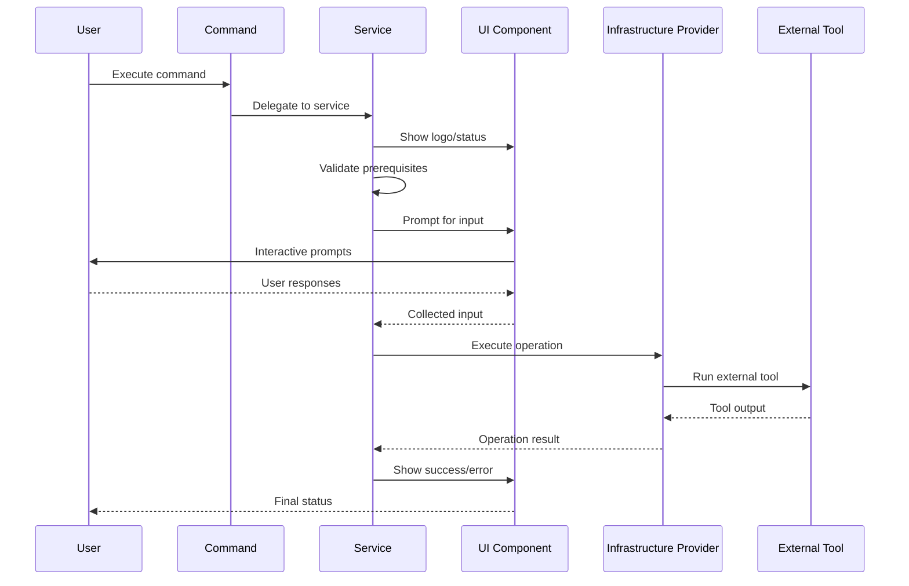
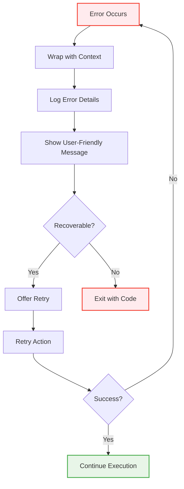
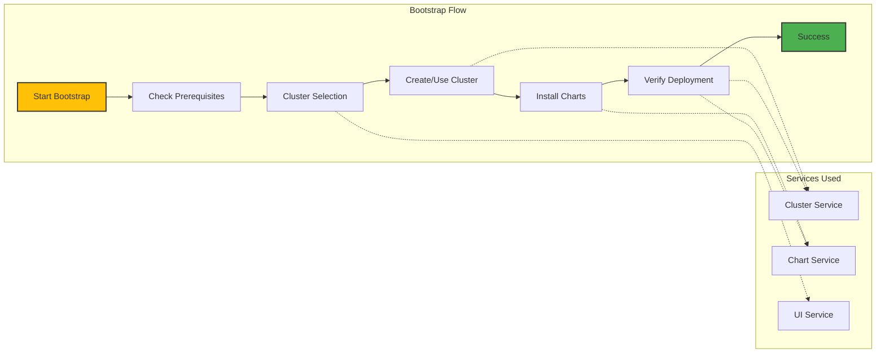
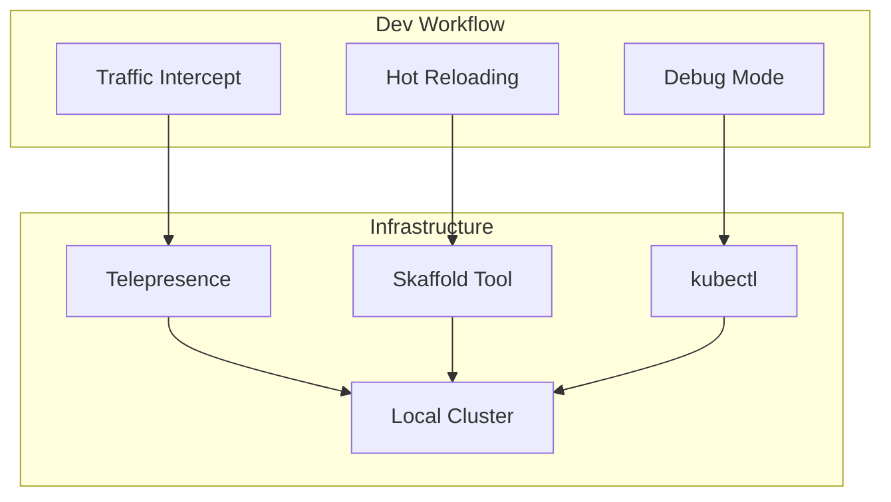
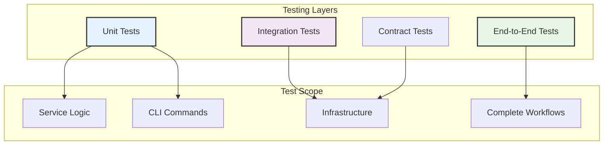

# Architecture Overview

Understanding OpenFrame CLI's architecture, design patterns, and key components for effective development and contribution.

## High-Level Architecture

OpenFrame CLI follows a layered architecture with clear separation of concerns:



## Core Components

### Command Layer (cmd/)

The command layer defines the CLI interface using [Cobra](https://cobra.dev/):

| Component | Package | Responsibilities |
|-----------|---------|------------------|
| **Bootstrap Command** | `cmd/bootstrap` | Orchestrates complete environment setup |
| **Cluster Commands** | `cmd/cluster` | Kubernetes cluster lifecycle management |
| **Chart Commands** | `cmd/chart` | Helm chart installation and management |
| **Dev Commands** | `cmd/dev` | Development workflow tools |

#### Command Structure Pattern

```go
// Example command structure
func GetExampleCmd() *cobra.Command {
    cmd := &cobra.Command{
        Use:   "example [args]",
        Short: "Brief description",
        Long:  "Detailed description with examples",
        Args:  cobra.MaximumNArgs(1),
        RunE: func(cmd *cobra.Command, args []string) error {
            // Delegate to service layer
            return service.NewExampleService().Execute(cmd, args)
        },
    }
    
    // Add flags
    cmd.Flags().String("flag-name", "default", "Flag description")
    
    return cmd
}
```

### Service Layer (internal/)

The service layer contains business logic and coordinates between commands and infrastructure:

| Service | Package | Purpose |
|---------|---------|---------|
| **Bootstrap Service** | `internal/bootstrap` | Complete environment setup orchestration |
| **Cluster Service** | `internal/cluster` | Kubernetes cluster management logic |
| **Chart Service** | `internal/chart` | Helm and ArgoCD installation logic |
| **Dev Service** | `internal/dev` | Development workflow coordination |

#### Service Interface Pattern

```go
// Example service interface
type ServiceInterface interface {
    Execute(cmd *cobra.Command, args []string) error
    Validate(config Config) error
    GetStatus() (Status, error)
}

// Service implementation
type Service struct {
    provider     ProviderInterface
    ui           ui.Interface  
    logger       logger.Interface
    config       config.Interface
}

func NewService() *Service {
    return &Service{
        provider: NewProvider(),
        ui:       ui.New(),
        logger:   logger.New(), 
        config:   config.New(),
    }
}
```

### Infrastructure Layer

The infrastructure layer handles external tool integration:

#### Provider Pattern

```go
// Provider interface for external tools
type ClusterProvider interface {
    Create(config ClusterConfig) error
    Delete(name string) error
    List() ([]Cluster, error)
    GetStatus(name string) (*ClusterStatus, error)
}

// K3d implementation
type K3dProvider struct {
    executor cmd.Executor
    logger   logger.Interface
}

func (p *K3dProvider) Create(config ClusterConfig) error {
    // Implementation using k3d CLI
    return p.executor.Run("k3d", "cluster", "create", config.Name, ...)
}
```

### Shared Components (internal/shared/)

#### UI Components

Interactive user interface components:

```go
// UI interface for user interactions
type Interface interface {
    ShowLogo() 
    Prompt(message string) (string, error)
    Select(message string, options []string) (int, error)
    Confirm(message string) (bool, error)
    Progress(message string) ProgressBar
    Success(message string)
    Error(message string)
}

// Spinner and progress implementations
type ProgressBar interface {
    Start()
    Update(message string)
    Finish()
    Error(message string)
}
```

#### Configuration Management

```go
// Configuration structure
type Config struct {
    Development bool                `yaml:"development"`
    LogLevel    string             `yaml:"logLevel"`
    Verbose     bool               `yaml:"verbose"`
    Cluster     ClusterConfig      `yaml:"cluster"`
    Chart       ChartConfig        `yaml:"chart"`
    Dev         DevConfig          `yaml:"dev"`
}

// Configuration interface
type ConfigInterface interface {
    Load() (*Config, error)
    Save(config *Config) error
    GetDefault() *Config
    Validate() error
}
```

## Data Flow Patterns

### Command Execution Flow



### Error Handling Flow



## Design Patterns

### 1. Command Pattern

Each CLI command follows the command pattern for consistent structure:

```go
type Command interface {
    Execute(args []string) error
    Validate(args []string) error
    GetHelp() string
}
```

### 2. Factory Pattern

Service creation uses factory pattern for dependency injection:

```go
func NewBootstrapService() *BootstrapService {
    return &BootstrapService{
        clusterService: cluster.NewService(),
        chartService:   chart.NewService(),
        ui:             ui.New(),
        logger:         logger.New(),
    }
}
```

### 3. Strategy Pattern

Different deployment modes use strategy pattern:

```go
type DeploymentStrategy interface {
    Deploy(config Config) error
    GetRequiredValues() []string
}

type OSSTenanStrategy struct{}
type SaaSSharedStrategy struct{}
type SaasTenantStrategy struct{}
```

### 4. Observer Pattern

UI components observe service events:

```go
type EventObserver interface {
    OnStart(event StartEvent)
    OnProgress(event ProgressEvent)  
    OnComplete(event CompleteEvent)
    OnError(event ErrorEvent)
}
```

## Component Relationships

### Bootstrap Orchestration



### Development Workflow Integration



## Key Design Decisions

### 1. External Tool Integration

**Decision**: Integrate with existing tools rather than reimplementation
**Rationale**: 
- Leverage proven, well-maintained tools
- Avoid reinventing the wheel
- Easier maintenance and updates
- Better community support

**Implementation**: Provider interfaces with tool-specific implementations

### 2. Interactive by Default

**Decision**: Provide interactive experiences with non-interactive options
**Rationale**:
- Better user experience for beginners
- Guided setup reduces errors  
- CI/CD automation still supported
- Progressive disclosure of complexity

**Implementation**: UI components with interactive prompts and `--non-interactive` flags

### 3. Layered Architecture

**Decision**: Clear separation between CLI, service, and infrastructure layers
**Rationale**:
- Easier testing with mock interfaces
- Clear responsibility boundaries
- Better code organization
- Easier to extend and maintain

**Implementation**: Interface-driven design with dependency injection

### 4. Configuration Over Convention

**Decision**: Provide smart defaults with full configurability
**Rationale**:
- Quick start for common cases
- Flexibility for advanced use cases  
- Environment-specific configurations
- Reproducible setups

**Implementation**: Hierarchical configuration (flags → env → config file → defaults)

## Testing Architecture

### Testing Strategy



### Mock Strategy

```go
// Provider mocks for testing
type MockClusterProvider struct {
    mock.Mock
}

func (m *MockClusterProvider) Create(config ClusterConfig) error {
    args := m.Called(config)
    return args.Error(0)
}

// Service testing with mocks
func TestClusterService_Create(t *testing.T) {
    provider := &MockClusterProvider{}
    service := &ClusterService{provider: provider}
    
    provider.On("Create", mock.AnythingOfType("ClusterConfig")).Return(nil)
    
    err := service.Create(ClusterConfig{Name: "test"})
    assert.NoError(t, err)
    provider.AssertExpectations(t)
}
```

## Performance Considerations

### Concurrent Operations

```go
// Parallel execution for independent operations
func (s *BootstrapService) Execute(cmd *cobra.Command, args []string) error {
    var wg sync.WaitGroup
    errCh := make(chan error, 2)
    
    // Start cluster creation
    wg.Add(1)
    go func() {
        defer wg.Done()
        if err := s.clusterService.Create(clusterConfig); err != nil {
            errCh <- err
        }
    }()
    
    // Wait for completion
    wg.Wait()
    close(errCh)
    
    // Check for errors
    for err := range errCh {
        return err
    }
    
    return nil
}
```

### Resource Management

```go
// Context-based timeout management
func (p *K3dProvider) Create(ctx context.Context, config ClusterConfig) error {
    ctx, cancel := context.WithTimeout(ctx, 5*time.Minute)
    defer cancel()
    
    cmd := exec.CommandContext(ctx, "k3d", "cluster", "create", config.Name)
    return cmd.Run()
}
```

## Extension Points

### Adding New Commands

1. Create command in `cmd/new-command/`
2. Implement service in `internal/new-command/`
3. Add provider interface if needed
4. Add to root command
5. Write tests

### Adding New Providers

1. Define provider interface
2. Implement provider for new tool
3. Add provider factory
4. Update service to use provider
5. Add integration tests

### Adding New UI Components  

1. Extend UI interface
2. Implement in UI service
3. Add to existing services
4. Test interactive behavior

## Security Considerations

### Input Validation

```go
func ValidateClusterName(name string) error {
    if len(name) == 0 {
        return errors.New("cluster name cannot be empty")
    }
    if len(name) > 63 {
        return errors.New("cluster name too long")
    }
    if !regexp.MustCompile(`^[a-z0-9-]+$`).MatchString(name) {
        return errors.New("invalid cluster name format")
    }
    return nil
}
```

### Command Injection Prevention

```go
// Safe command execution
func (e *Executor) Run(name string, args ...string) error {
    // Validate command name against whitelist
    if !e.isAllowedCommand(name) {
        return errors.New("command not allowed")
    }
    
    // Escape arguments
    cmd := exec.Command(name, args...)
    return cmd.Run()
}
```

## Observability

### Logging Strategy

```go
// Structured logging with levels
type Logger interface {
    Debug(msg string, fields ...Field)
    Info(msg string, fields ...Field)
    Warn(msg string, fields ...Field)
    Error(msg string, fields ...Field)
}

// Usage in services
logger.Info("Creating cluster", 
    Field{"name", config.Name},
    Field{"provider", "k3d"},
    Field{"duration", time.Since(start)},
)
```

### Metrics Collection

```go
// Optional metrics for usage analysis
type Metrics interface {
    Counter(name string, tags map[string]string)
    Histogram(name string, value time.Duration)
    Gauge(name string, value float64)
}
```

## Next Steps for Developers

1. **[Testing Overview](../testing/overview.md)** - Learn testing patterns and practices
2. **[Contributing Guidelines](../contributing/guidelines.md)** - Development workflow and standards
3. Explore specific components:
   - Start with `cmd/bootstrap/bootstrap.go` for command patterns
   - Review `internal/bootstrap/service.go` for service patterns
   - Check `internal/shared/ui/` for UI components

---

**Architecture understood!** 🏗️ Next: **[Testing Overview](../testing/overview.md)** to learn how to test your changes effectively.