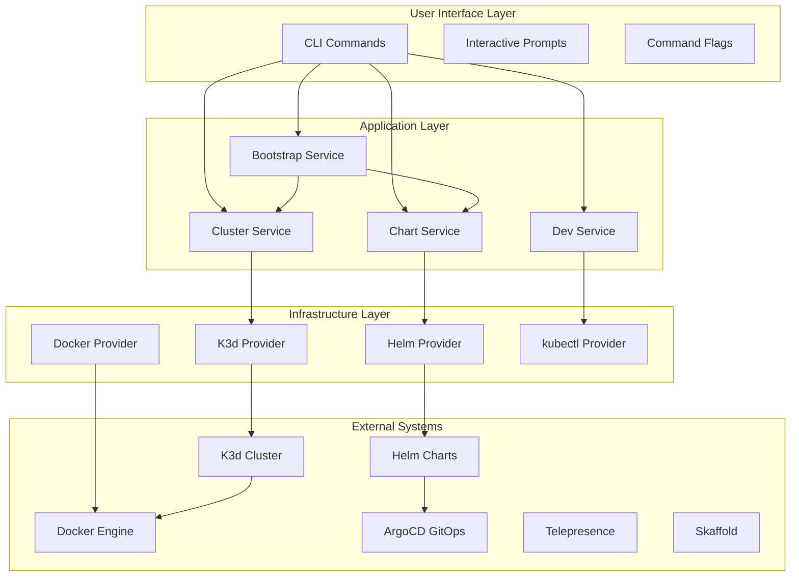
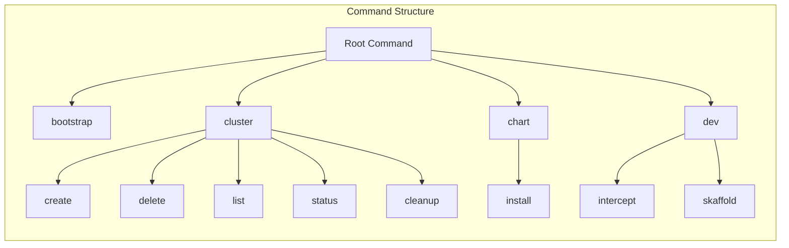
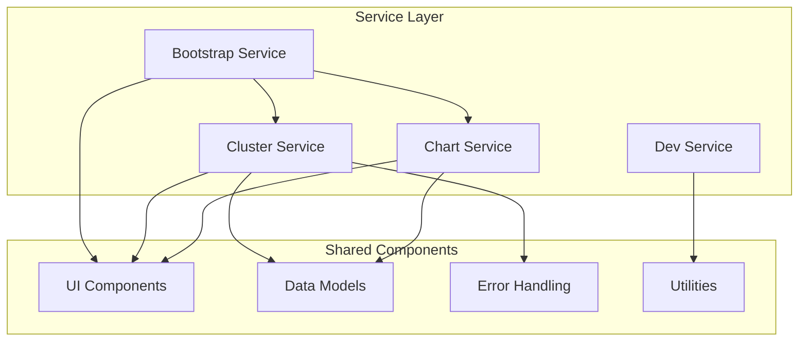
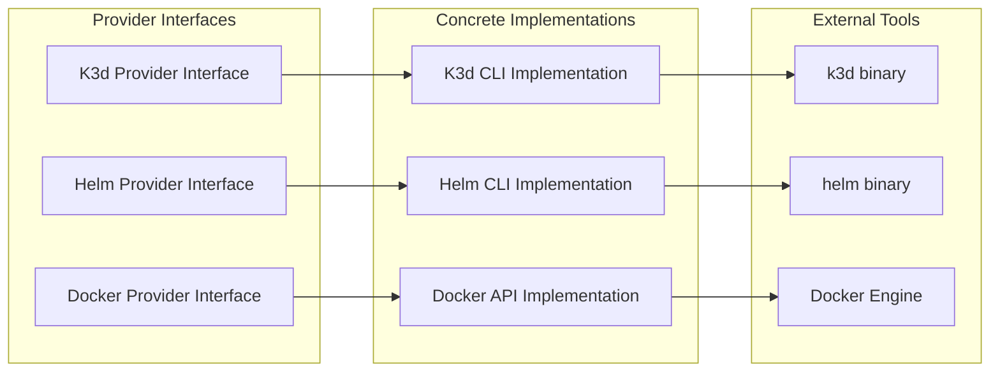
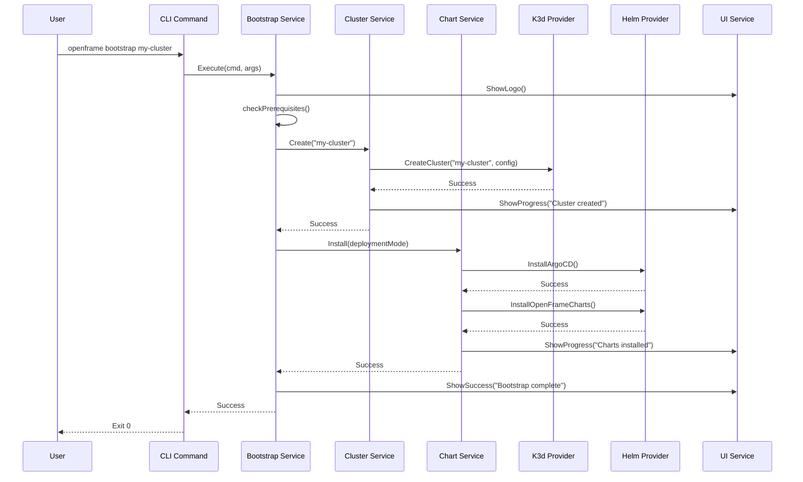
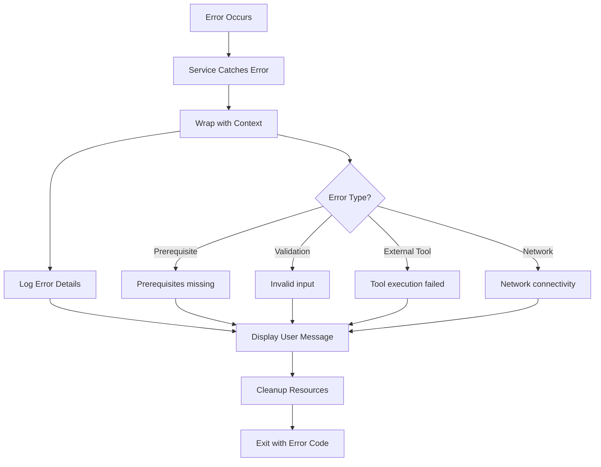
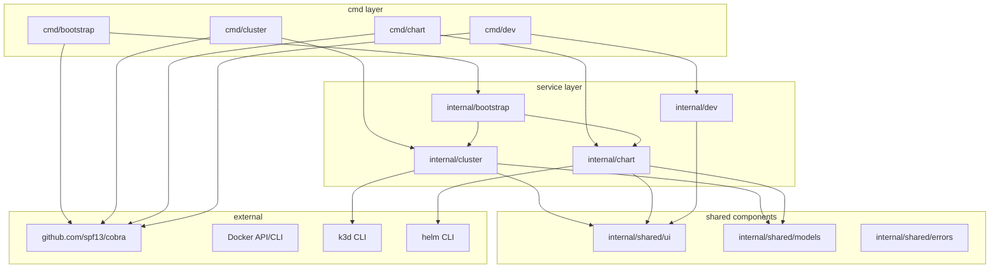
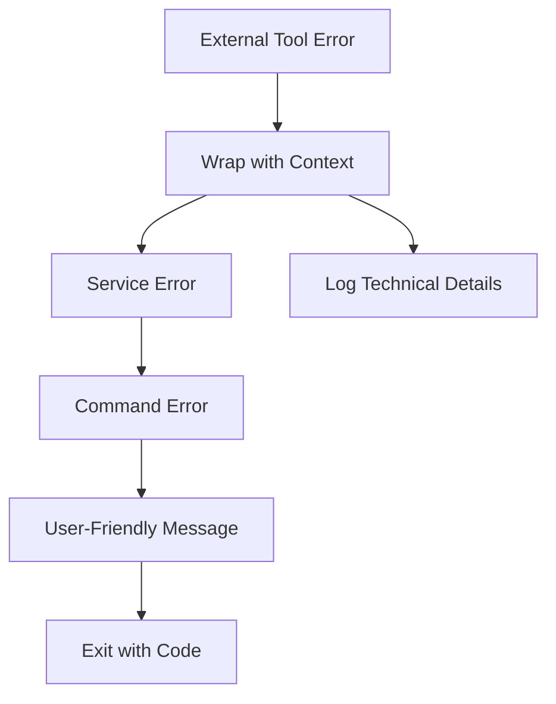
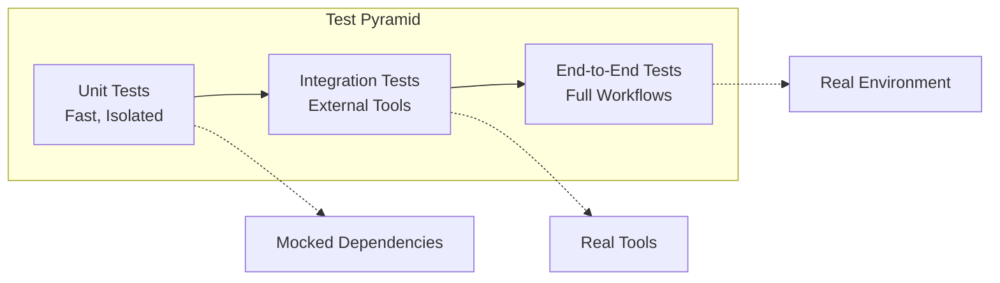

# Architecture Overview

OpenFrame CLI is designed with a clean, modular architecture that separates concerns and makes the codebase maintainable, testable, and extensible. This document provides a comprehensive overview of the system design, component relationships, and key architectural decisions.

## System Architecture

### High-Level Architecture



### Layered Architecture

OpenFrame CLI follows a **3-layer architecture** with clear separation of responsibilities:

| Layer | Purpose | Components | Dependencies |
|-------|---------|------------|--------------|
| **Presentation** | User interaction, command parsing | `cmd/` packages | Application layer only |
| **Application** | Business logic, orchestration | `internal/` services | Infrastructure layer only |
| **Infrastructure** | External tool integration | Provider interfaces | External systems only |

## Core Components

### Command Layer (`cmd/`)

The command layer contains Cobra command definitions that handle user interaction, argument parsing, and flag management.



**Key Responsibilities:**
- Parse command-line arguments and flags
- Validate user input
- Display help and usage information
- Delegate business logic to service layer
- Handle command aliases and shortcuts

**Example Structure:**
```go
// cmd/cluster/cluster.go
func GetClusterCmd() *cobra.Command {
    cmd := &cobra.Command{
        Use:     "cluster",
        Aliases: []string{"k"},
        Short:   "Manage Kubernetes clusters",
        PersistentPreRunE: func(cmd *cobra.Command, args []string) error {
            // Prerequisites check
            return cluster.CheckPrerequisites()
        },
    }
    
    // Add subcommands
    cmd.AddCommand(getCreateCmd())
    cmd.AddCommand(getDeleteCmd())
    cmd.AddCommand(getListCmd())
    cmd.AddCommand(getStatusCmd())
    
    return cmd
}
```

### Service Layer (`internal/`)

The service layer contains business logic and orchestrates complex workflows by coordinating multiple operations.



**Bootstrap Service** - Orchestrates complete environment setup:
```go
type BootstrapService struct {
    clusterService *cluster.Service
    chartService   *chart.Service
    ui            *ui.Service
}

func (s *BootstrapService) Execute(cmd *cobra.Command, args []string) error {
    // 1. Show logo and check prerequisites
    s.ui.ShowLogo()
    if err := s.checkPrerequisites(); err != nil {
        return err
    }
    
    // 2. Create cluster
    if err := s.clusterService.Create(clusterName); err != nil {
        return err
    }
    
    // 3. Install charts
    if err := s.chartService.Install(deploymentMode); err != nil {
        return err
    }
    
    // 4. Show success message
    s.ui.ShowSuccess("Bootstrap complete!")
    return nil
}
```

**Cluster Service** - Manages K3d cluster lifecycle:
```go
type Service struct {
    k3dProvider   providers.K3dProvider
    ui           *ui.Service
    validator    *validators.ClusterValidator
}

func (s *Service) Create(name string) error {
    // Validate cluster name
    if err := s.validator.ValidateName(name); err != nil {
        return err
    }
    
    // Create cluster with K3d
    return s.k3dProvider.CreateCluster(name, s.getClusterConfig())
}
```

### Infrastructure Layer

The infrastructure layer provides abstractions for external tool integration through provider interfaces.



**Provider Interface Example:**
```go
type K3dProvider interface {
    CreateCluster(name string, config ClusterConfig) error
    DeleteCluster(name string) error
    ListClusters() ([]Cluster, error)
    GetClusterStatus(name string) (*ClusterStatus, error)
}

type k3dCLIProvider struct {
    execRunner exec.Runner
}

func (p *k3dCLIProvider) CreateCluster(name string, config ClusterConfig) error {
    args := []string{"cluster", "create", name}
    args = append(args, config.ToK3dArgs()...)
    
    return p.execRunner.Run("k3d", args...)
}
```

## Data Flow Architecture

### Bootstrap Command Flow

The most complex operation is the bootstrap command, which demonstrates the full data flow:



### Error Handling Flow



## Design Patterns

### 1. Command Pattern

Each CLI command is implemented using the Command pattern with Cobra:

```go
// Command interface (provided by Cobra)
type Command struct {
    Use   string
    RunE  func(cmd *Command, args []string) error
    // ... other fields
}

// Concrete command implementation
func getBootstrapCmd() *cobra.Command {
    return &cobra.Command{
        Use:   "bootstrap [cluster-name]",
        RunE:  func(cmd *cobra.Command, args []string) error {
            return bootstrap.NewService().Execute(cmd, args)
        },
    }
}
```

### 2. Service Layer Pattern

Business logic is encapsulated in service classes:

```go
type Service struct {
    dependencies Dependencies
}

func NewService(deps Dependencies) *Service {
    return &Service{dependencies: deps}
}

func (s *Service) Execute(input Input) (Output, error) {
    // Business logic implementation
}
```

### 3. Provider Pattern

External tool integration uses the Provider pattern for dependency injection:

```go
type Provider interface {
    Operation(params Params) error
}

type Service struct {
    provider Provider
}

// Dependency injection
func NewService(provider Provider) *Service {
    return &Service{provider: provider}
}
```

### 4. Builder Pattern

Complex configurations use the Builder pattern:

```go
type ClusterConfigBuilder struct {
    config ClusterConfig
}

func NewClusterConfigBuilder() *ClusterConfigBuilder {
    return &ClusterConfigBuilder{
        config: ClusterConfig{},
    }
}

func (b *ClusterConfigBuilder) WithName(name string) *ClusterConfigBuilder {
    b.config.Name = name
    return b
}

func (b *ClusterConfigBuilder) WithPorts(ports []int) *ClusterConfigBuilder {
    b.config.Ports = ports
    return b
}

func (b *ClusterConfigBuilder) Build() ClusterConfig {
    return b.config
}
```

## Key Design Decisions

### 1. Why Cobra for CLI Framework?

**Decision**: Use Cobra for command-line interface
**Reasoning**:
- Industry standard for Go CLI applications
- Excellent support for subcommands, flags, and help generation
- Built-in shell completion support
- Used by kubectl, helm, and other Kubernetes tools

### 2. Why Service Layer Architecture?

**Decision**: Separate business logic into service layer
**Reasoning**:
- Testability: Services can be unit tested independently
- Reusability: Services can be used by different commands
- Maintainability: Clear separation of concerns
- Extensibility: Easy to add new features or modify existing ones

### 3. Why Provider Interfaces?

**Decision**: Abstract external tool integration behind interfaces
**Reasoning**:
- Testability: Can mock external dependencies
- Flexibility: Can swap implementations (CLI vs API)
- Reliability: Isolates external tool changes
- Development: Can use fake implementations for testing

### 4. Why Internal Package Structure?

**Decision**: Use `internal/` package for private code
**Reasoning**:
- Encapsulation: Prevents external packages from importing internal code
- API stability: Only public interfaces are exposed
- Refactoring: Internal changes don't break external users
- Go convention: Standard practice in Go projects

## Component Dependencies

### Dependency Graph



### Module Dependencies

```go
// go.mod dependencies
require (
    github.com/spf13/cobra v1.7.0        // CLI framework
    github.com/spf13/viper v1.16.0       // Configuration management
    gopkg.in/yaml.v3 v3.0.1              // YAML processing
    github.com/stretchr/testify v1.8.4   // Testing framework
)
```

## Error Handling Architecture

### Error Types

```go
type ErrorType string

const (
    ErrorTypePrerequisite ErrorType = "prerequisite"
    ErrorTypeValidation  ErrorType = "validation"
    ErrorTypeExecution   ErrorType = "execution"
    ErrorTypeNetwork     ErrorType = "network"
)

type OpenFrameError struct {
    Type    ErrorType
    Message string
    Cause   error
    Context map[string]interface{}
}
```

### Error Propagation



## Testing Architecture

### Test Organization

```
tests/
├── unit/              # Unit tests for individual components
│   ├── cluster/       # Cluster service tests
│   ├── chart/         # Chart service tests
│   └── bootstrap/     # Bootstrap service tests
├── integration/       # Integration tests with external tools
│   ├── k3d/           # K3d integration tests
│   ├── helm/          # Helm integration tests
│   └── e2e/           # End-to-end workflow tests
├── mocks/             # Generated mocks for testing
└── fixtures/          # Test data and fixtures
```

### Test Strategy



## Performance Considerations

### Concurrent Operations

```go
// Example: Parallel prerequisite checks
func (s *Service) checkPrerequisites() error {
    checks := []func() error{
        s.checkDocker,
        s.checkKubectl,
        s.checkHelm,
        s.checkK3d,
    }
    
    errCh := make(chan error, len(checks))
    
    for _, check := range checks {
        go func(fn func() error) {
            errCh <- fn()
        }(check)
    }
    
    for range checks {
        if err := <-errCh; err != nil {
            return err
        }
    }
    
    return nil
}
```

### Resource Management

```go
type ResourceManager struct {
    resources []Resource
    mu        sync.Mutex
}

func (rm *ResourceManager) Add(resource Resource) {
    rm.mu.Lock()
    defer rm.mu.Unlock()
    rm.resources = append(rm.resources, resource)
}

func (rm *ResourceManager) Cleanup() error {
    rm.mu.Lock()
    defer rm.mu.Unlock()
    
    var errs []error
    for i := len(rm.resources) - 1; i >= 0; i-- {
        if err := rm.resources[i].Cleanup(); err != nil {
            errs = append(errs, err)
        }
    }
    
    return errors.Join(errs...)
}
```

## Future Architecture Considerations

### Planned Improvements

1. **Plugin Architecture**: Support for external plugins
2. **Configuration Management**: Better support for multiple environments
3. **Async Operations**: Background operations for long-running tasks
4. **Caching**: Cache external tool results for performance
5. **Observability**: Structured logging and metrics

### Extension Points

```go
// Future plugin interface
type Plugin interface {
    Name() string
    Execute(ctx context.Context, args []string) error
}

// Future configuration management
type ConfigManager interface {
    LoadConfig(path string) (*Config, error)
    SaveConfig(config *Config, path string) error
    MergeConfigs(configs ...*Config) *Config
}
```

---

This architecture provides a solid foundation for OpenFrame CLI that is maintainable, testable, and extensible while following Go best practices and proven architectural patterns.