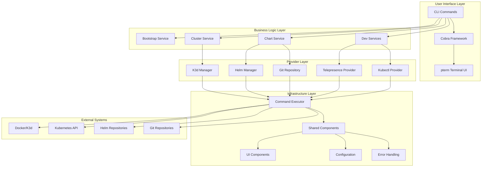
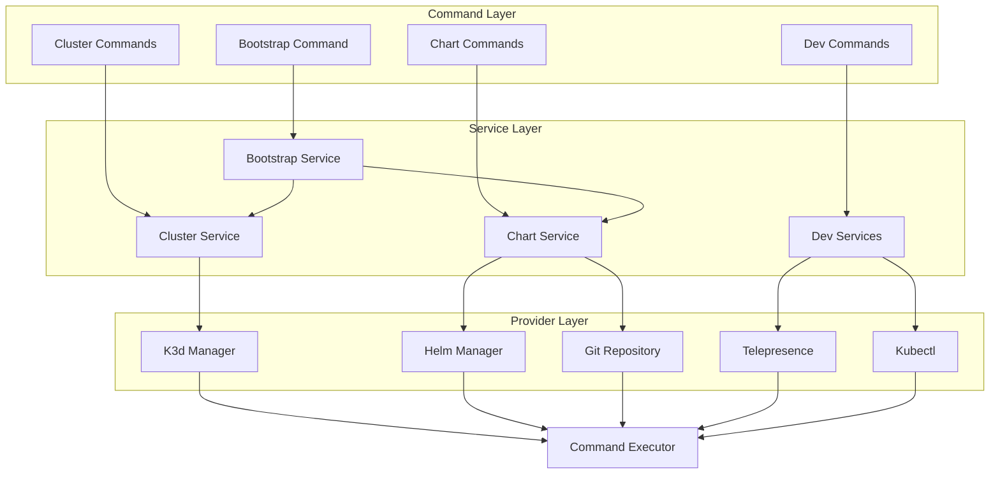
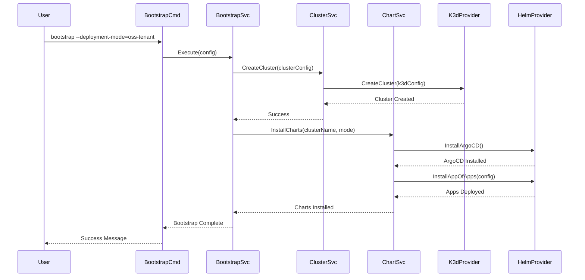
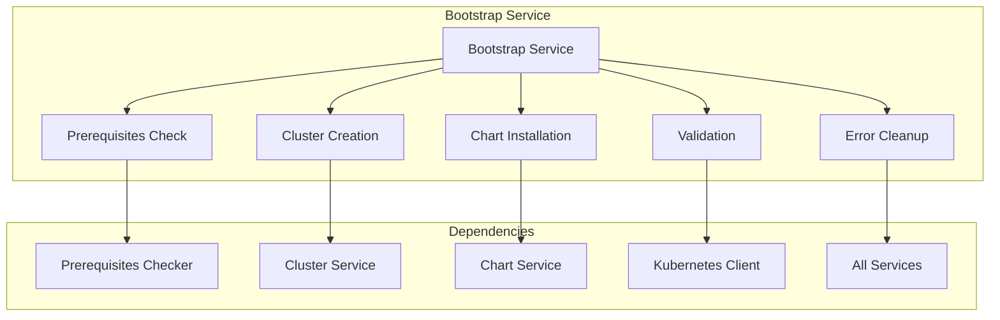
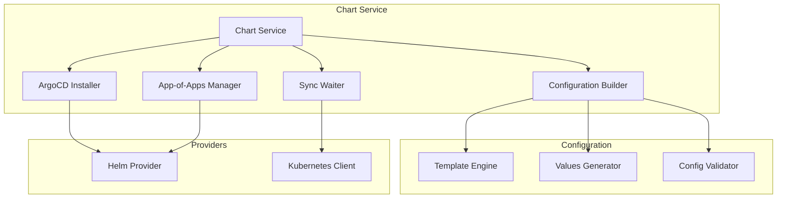
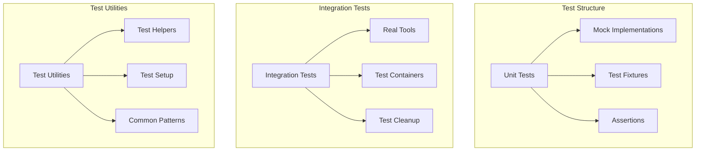

# Architecture Overview

OpenFrame CLI is designed with a layered architecture that promotes separation of concerns, testability, and extensibility. This document provides a comprehensive overview of the system design, component relationships, and key architectural decisions.

## High-Level Architecture



## Architectural Layers

### 1. User Interface Layer

The top layer handles user interaction and command processing:

| Component | Responsibility | Technology |
|-----------|---------------|------------|
| **CLI Commands** | Command definitions, argument parsing, validation | Cobra CLI framework |
| **Terminal UI** | Interactive prompts, progress bars, tables | pterm library |
| **Help System** | Command documentation and usage examples | Cobra built-in help |

**Key Features:**
- Self-documenting commands with comprehensive help
- Interactive prompts with input validation
- Beautiful terminal output with colors and progress indicators
- Shell completion support

### 2. Business Logic Layer

Contains the core application logic and orchestration:

| Service | Purpose | Key Operations |
|---------|---------|----------------|
| **Bootstrap Service** | Complete environment setup | Orchestrates cluster creation + chart installation |
| **Cluster Service** | Kubernetes cluster management | Create, delete, status, cleanup operations |
| **Chart Service** | Helm chart and ArgoCD management | Install charts, configure ArgoCD, wait for sync |
| **Dev Services** | Development workflow tools | Telepresence intercepts, scaffolding |

**Design Principles:**
- Single responsibility for each service
- Dependency injection for testability
- Interface-based design for extensibility
- Comprehensive error handling with context

### 3. Provider Layer

Abstracts external tool integration:

| Provider | External Tool | Capabilities |
|----------|---------------|-------------|
| **K3d Manager** | K3d CLI | Cluster lifecycle, configuration generation |
| **Helm Manager** | Helm CLI | Chart installation, repository management |
| **Git Repository** | Git CLI | Repository cloning, branch management |
| **Telepresence Provider** | Telepresence CLI | Service intercepts, traffic routing |
| **Kubectl Provider** | kubectl CLI | Kubernetes API operations |

**Benefits:**
- Tool-specific logic encapsulation
- Easy to mock for testing
- Consistent error handling across providers
- Version compatibility management

### 4. Infrastructure Layer

Foundational components used throughout the application:

| Component | Purpose | Usage |
|-----------|---------|-------|
| **Command Executor** | External command execution | Process management, output capture, error handling |
| **UI Components** | Reusable terminal elements | Progress bars, tables, prompts, messages |
| **Configuration** | Settings management | File I/O, environment variables, defaults |
| **Error Handling** | Centralized error management | Error types, recovery strategies, user messages |

## Component Relationships

### Service Dependencies



### Data Flow Patterns

**Bootstrap Workflow:**


## Key Design Decisions

### 1. Interface-Driven Design

**Decision:** Use interfaces for all external dependencies and major components.

**Rationale:**
- Enables comprehensive unit testing with mocks
- Facilitates adding new providers (e.g., EKS, GKE)
- Supports different implementations for different environments

**Implementation:**
```go
// Provider interface example
type ClusterProvider interface {
    CreateCluster(config ClusterConfig) error
    DeleteCluster(name string) error
    GetClusterStatus(name string) (ClusterStatus, error)
}

// Service uses interface, not concrete type
type ClusterService struct {
    provider ClusterProvider  // Interface, not *K3dManager
    ui       UIService
    executor ExecutorService
}
```

### 2. Command Executor Abstraction

**Decision:** Abstract all external command execution through a single interface.

**Rationale:**
- Consistent error handling across all external tools
- Easy to mock for testing without actual tool execution
- Centralized logging and debugging of external commands
- Security controls for command execution

**Implementation:**
```go
type CommandExecutor interface {
    Execute(cmd string, args ...string) (*ExecuteResult, error)
    ExecuteWithContext(ctx context.Context, cmd string, args ...string) (*ExecuteResult, error)
}
```

### 3. Layered Error Handling

**Decision:** Implement structured error handling with context preservation.

**Rationale:**
- Provides actionable error messages to users
- Maintains error context through the call stack
- Enables error recovery and retry logic
- Supports debugging and troubleshooting

**Implementation:**
```go
type OpenFrameError struct {
    Type    ErrorType
    Message string
    Cause   error
    Context map[string]interface{}
}

func (e *OpenFrameError) Error() string {
    return fmt.Sprintf("%s: %s", e.Type, e.Message)
}
```

### 4. Configuration Management

**Decision:** Use a hierarchical configuration system with multiple sources.

**Configuration Priority (highest to lowest):**
1. Command-line flags
2. Environment variables
3. Configuration files
4. Default values

**Implementation:**
- Cobra/Viper for CLI configuration
- Environment variable prefix: `OPENFRAME_`
- YAML/JSON configuration file support
- Validation and type safety

### 5. Extensibility Architecture

**Decision:** Design for extensibility with minimal core changes.

**Extension Points:**
- **New Providers:** Implement provider interfaces
- **New Commands:** Follow Cobra command patterns
- **New Deployment Modes:** Extend configuration templates
- **New UI Components:** Use pterm component library

## Component Deep Dive

### Bootstrap Service Architecture



**Responsibilities:**
- Orchestrate complete environment setup
- Handle prerequisite validation
- Manage error recovery and cleanup
- Provide progress feedback to users

### Chart Service Architecture



**Key Features:**
- Template-driven configuration generation
- Support for multiple deployment modes
- ArgoCD application lifecycle management
- Health checking and sync waiting

## Testing Strategy

### Unit Testing Architecture



**Testing Principles:**
- Each component has comprehensive unit tests
- Integration tests validate tool interactions
- Mocks are generated from interfaces
- Test utilities provide common patterns

## Performance Considerations

### Execution Model

**Synchronous Operations:**
- Command execution (blocking)
- Configuration validation
- Prerequisites checking

**Asynchronous Operations:**
- Progress indicators during long operations
- Background health checking
- Parallel resource creation where possible

### Resource Management

**Memory Management:**
- Stream processing for large outputs
- Bounded buffering for command execution
- Proper cleanup of temporary resources

**Concurrency:**
- Context-based cancellation
- Timeout handling for external commands
- Graceful shutdown on interruption

## Security Considerations

### Command Injection Prevention

**Input Validation:**
- Whitelist allowed characters in names
- Validate command arguments before execution
- Escape special characters in shell commands

**Execution Controls:**
- No direct shell execution (use exec functions)
- Command path validation
- User permission checks

### Credential Management

**Secure Handling:**
- No credentials in logs or error messages
- Environment variable-based credential passing
- Kubernetes secret management for cluster credentials

## Extensibility Patterns

### Adding New Providers

```go
// 1. Define provider interface
type NewProvider interface {
    Operation() error
}

// 2. Implement interface
type ConcreteProvider struct {
    executor ExecutorService
}

func (p *ConcreteProvider) Operation() error {
    // Implementation
}

// 3. Register with service
service := NewService(provider)
```

### Adding New Commands

```go
// 1. Create command file
func GetNewCmd() *cobra.Command {
    cmd := &cobra.Command{
        Use:   "new",
        Short: "New command description",
        RunE:  runNewCommand,
    }
    return cmd
}

// 2. Add to parent command
rootCmd.AddCommand(GetNewCmd())
```

## Deployment Architecture

### Binary Distribution

**Build Targets:**
- Linux (amd64, arm64)
- macOS (amd64, arm64) 
- Windows (amd64) via WSL2

**Distribution:**
- GitHub Releases with automated builds
- Package managers (Homebrew, apt, etc.)
- Container images for CI/CD

### Runtime Dependencies

**Required:**
- Docker (for K3d)
- Kubernetes tools (kubectl, helm)

**Optional:**
- Telepresence (development workflows)
- jq (JSON processing)

**Auto-Installation:**
- CLI detects missing tools
- Provides installation guidance
- Can auto-install on supported platforms

## Future Architecture Considerations

### Planned Extensions

**Multi-Cloud Support:**
- EKS, GKE, AKS provider implementations
- Cloud-specific configuration templates
- Cross-cloud compatibility abstractions

**Plugin System:**
- Dynamic plugin loading
- Third-party provider support
- Custom command extensions

**Enhanced Observability:**
- Structured logging throughout
- Metrics collection and reporting
- Distributed tracing for complex operations

---

**Architecture Summary:** OpenFrame CLI's layered architecture provides a solid foundation for maintainability, testability, and extensibility. The clear separation of concerns and interface-driven design make it easy to understand, modify, and extend the system while maintaining reliability and user experience.