# Architecture Overview

OpenFrame CLI follows a clean, layered architecture that separates concerns and promotes maintainability. This guide explains the system design, component relationships, and key architectural decisions to help you understand and contribute to the codebase effectively.

## High-Level Architecture

OpenFrame CLI is built using a modular, command-driven architecture that integrates with external Kubernetes and container tools:

```mermaid
flowchart TB
    subgraph CLI[📱 CLI Layer]
        Commands[Command Definitions]
        Router[Command Router]
        Flags[Flags & Validation]
    end
    
    subgraph Service[🏗️ Service Layer] 
        BootstrapSvc[Bootstrap Service]
        ClusterSvc[Cluster Service]
        ChartSvc[Chart Service]
        DevSvc[Dev Service]
    end
    
    subgraph Shared[🔧 Shared Components]
        UI[UI Components]
        Utils[Common Utils]
        Models[Data Models]
        Errors[Error Handling]
        Prerequisites[Prerequisites]
    end
    
    subgraph External[🌐 External Tools]
        K3d[K3d]
        Docker[Docker]
        Helm[Helm]
        ArgoCD[ArgoCD]
        Skaffold[Skaffold]
        Telepresence[Telepresence]
    end
    
    CLI --> Service
    Service --> Shared
    Service --> External
    
    style CLI fill:#e3f2fd
    style Service fill:#f3e5f5
    style Shared fill:#e8f5e8
    style External fill:#fff3e0
```

## Core Components

### Command Layer (`cmd/`)

The CLI interface is organized into domain-specific command groups using [Cobra](https://cobra.dev/):

| Component | Location | Responsibility |
|-----------|----------|----------------|
| **Bootstrap** | `cmd/bootstrap/` | Entry point for complete environment setup |
| **Cluster** | `cmd/cluster/` | Kubernetes cluster lifecycle management |
| **Chart** | `cmd/chart/` | Helm chart and GitOps deployment |
| **Dev** | `cmd/dev/` | Development workflow tools |

#### Command Structure Pattern

Each command follows a consistent pattern:

```go
// Example: cmd/cluster/create.go
func GetCreateCmd() *cobra.Command {
    cmd := &cobra.Command{
        Use:   "create [cluster-name]",
        Short: "Create a new Kubernetes cluster",
        Args:  cobra.MaximumNArgs(1),
        RunE: func(cmd *cobra.Command, args []string) error {
            // Delegate to service layer
            return cluster.NewService().Create(cmd, args)
        },
    }
    
    // Add flags
    cmd.Flags().String("deployment-mode", "", "Deployment mode")
    cmd.Flags().Bool("verbose", false, "Verbose output")
    
    return cmd
}
```

### Service Layer (`internal/`)

Business logic is implemented in service packages that handle the actual work:

```mermaid
flowchart LR
    subgraph Services[🏗️ Service Layer]
        Bootstrap[Bootstrap Service]
        Cluster[Cluster Service] 
        Chart[Chart Service]
        Dev[Dev Service]
    end
    
    subgraph Infrastructure[⚙️ Infrastructure]
        K3dProvider[K3d Provider]
        HelmClient[Helm Client]
        DockerClient[Docker Client]
        FileSystem[File System]
    end
    
    Bootstrap --> Cluster
    Bootstrap --> Chart
    Cluster --> K3dProvider
    Chart --> HelmClient
    Dev --> K3dProvider
    
    K3dProvider --> Infrastructure
    HelmClient --> Infrastructure
    
    style Services fill:#e3f2fd
    style Infrastructure fill:#f3e5f5
```



#### Service Pattern

Each service follows a consistent interface pattern:

```go
type Service interface {
    Execute(cmd *cobra.Command, args []string) error
}

type ClusterService struct {
    k3dProvider K3dProvider
    ui          UIService
    prereqs     Prerequisites
}

func NewService() *ClusterService {
    return &ClusterService{
        k3dProvider: NewK3dProvider(),
        ui:          shared.NewUI(),
        prereqs:     NewPrerequisites(),
    }
}
```

## Data Flow and Component Relationships

### Bootstrap Workflow

The bootstrap command demonstrates how components work together:


### Error Handling Flow

OpenFrame CLI uses a layered error handling approach:

```mermaid
flowchart TD
    Error[❌ Error Occurs] --> ServiceLayer{Service Layer}
    ServiceLayer -->|Wrap with context| StructuredError[Structured Error]
    StructuredError --> SharedErrors[Shared Error Handler]
    SharedErrors --> UserFriendly[User-Friendly Message]
    UserFriendly --> CLI[CLI Output]
    
    ServiceLayer -->|Critical errors| ExitCode[Exit Code]
    SharedErrors -->|Log details| Logger[Debug Logger]
    
    style Error fill:#ffebee
    style UserFriendly fill:#e8f5e8
    style CLI fill:#e3f2fd
```



## Key Design Decisions

### 1. Command-Service Separation

**Decision**: Separate CLI command definitions from business logic
**Rationale**: 
- Enables testing business logic without CLI concerns
- Allows reuse of services in different contexts
- Simplifies maintenance and refactoring

```go
// ❌ Don't put business logic in commands
func GetCreateCmd() *cobra.Command {
    return &cobra.Command{
        RunE: func(cmd *cobra.Command, args []string) error {
            // ❌ Business logic here is hard to test
            dockerClient := docker.NewClient()
            if err := dockerClient.CreateCluster(); err != nil {
                return err
            }
            return nil
        },
    }
}

// ✅ Delegate to service layer
func GetCreateCmd() *cobra.Command {
    return &cobra.Command{
        RunE: func(cmd *cobra.Command, args []string) error {
            // ✅ Easy to test and reuse
            return cluster.NewService().Create(cmd, args)
        },
    }
}
```

### 2. Dependency Injection Pattern

**Decision**: Use constructor injection for dependencies
**Rationale**: 
- Enables easy mocking for tests
- Makes dependencies explicit
- Supports different implementations

```go
type ClusterService struct {
    k3dProvider K3dProvider    // Interface, not concrete type
    ui          UIService      // Injectable dependency
    logger      Logger         // Can be mocked
}

func NewService(opts ...ServiceOption) *ClusterService {
    s := &ClusterService{
        k3dProvider: NewK3dProvider(),
        ui:          shared.NewUI(),
        logger:      shared.NewLogger(),
    }
    
    for _, opt := range opts {
        opt(s)
    }
    
    return s
}
```

### 3. Shared Component Library

**Decision**: Centralize common functionality in `internal/shared/`
**Rationale**:
- Prevents code duplication
- Ensures consistent UX across commands
- Simplifies maintenance

```go
// Shared UI components
package ui

func ShowLogo() { /* consistent branding */ }
func ShowSuccess(msg string) { /* consistent success formatting */ }
func ShowError(err error) { /* consistent error formatting */ }
func PromptForInput(prompt string) (string, error) { /* consistent prompts */ }
```

### 4. External Tool Integration

**Decision**: Wrap external tools with provider interfaces
**Rationale**:
- Allows mocking for tests
- Provides consistent error handling
- Enables alternative implementations

```go
type K3dProvider interface {
    CreateCluster(name string, config ClusterConfig) error
    DeleteCluster(name string) error
    ListClusters() ([]Cluster, error)
}

type DefaultK3dProvider struct {
    execRunner ExecRunner
}

func (p *DefaultK3dProvider) CreateCluster(name string, config ClusterConfig) error {
    args := []string{"cluster", "create", name}
    return p.execRunner.Run("k3d", args...)
}
```

## Module Organization

### Directory Structure Explained

```
internal/
├── bootstrap/              # Bootstrap workflow orchestration
│   ├── service.go          # Main bootstrap service
│   └── config.go           # Bootstrap configuration
├── cluster/                # Cluster management domain
│   ├── service.go          # Cluster operations
│   ├── k3d_provider.go     # K3d integration
│   └── models.go           # Cluster data models
├── chart/                  # Chart and GitOps domain  
│   ├── service.go          # Chart operations
│   ├── helm_client.go      # Helm integration
│   └── argocd.go           # ArgoCD integration
├── dev/                    # Development workflow domain
│   ├── service.go          # Development commands
│   ├── skaffold.go         # Skaffold integration
│   └── telepresence.go     # Telepresence integration
└── shared/                 # Shared components
    ├── ui/                 # User interface components
    ├── errors/             # Error handling utilities
    ├── models/             # Common data models
    └── utils/              # Common utilities
```

### Package Dependencies


**Dependency Rules:**
- ✅ Commands can depend on domain packages
- ✅ Domain packages can depend on shared packages  
- ✅ Bootstrap can orchestrate other domain packages
- ❌ Shared packages should not depend on domain packages
- ❌ Domain packages should not have circular dependencies

## Testing Architecture

### Test Organization

```mermaid
flowchart LR
    subgraph Tests[🧪 Test Strategy]
        Unit[Unit Tests]
        Integration[Integration Tests]
        E2E[End-to-End Tests]
    end
    
    subgraph Components[Components Under Test]
        Services[Services]
        Providers[Providers] 
        Utils[Utilities]
    end
    
    Unit --> Services
    Integration --> Providers
    E2E --> Components
    
    style Tests fill:#e8f5e8
    style Components fill:#e3f2fd
```



### Test Patterns

#### Unit Testing Services
```go
func TestClusterService_Create(t *testing.T) {
    // Arrange
    mockProvider := &MockK3dProvider{}
    mockUI := &MockUIService{}
    
    service := &ClusterService{
        k3dProvider: mockProvider,
        ui:          mockUI,
    }
    
    // Act
    err := service.Create(nil, []string{"test-cluster"})
    
    // Assert
    assert.NoError(t, err)
    mockProvider.AssertExpectations(t)
}
```

#### Integration Testing Providers
```go
func TestK3dProvider_Integration(t *testing.T) {
    if testing.Short() {
        t.Skip("Skipping integration test")
    }
    
    provider := NewK3dProvider()
    
    // Test with real k3d
    err := provider.CreateCluster("integration-test", ClusterConfig{})
    assert.NoError(t, err)
    
    t.Cleanup(func() {
        provider.DeleteCluster("integration-test")
    })
}
```

## Performance Considerations

### Async Operations

For long-running operations, OpenFrame CLI uses progress indicators and async patterns:

```go
func (s *ClusterService) Create(cmd *cobra.Command, args []string) error {
    spinner := s.ui.NewSpinner("Creating cluster...")
    spinner.Start()
    defer spinner.Stop()
    
    // Use context for cancellation
    ctx, cancel := context.WithTimeout(context.Background(), 5*time.Minute)
    defer cancel()
    
    return s.k3dProvider.CreateClusterWithContext(ctx, name, config)
}
```

### Caching Strategy

Configuration and state are cached to improve performance:

```go
type ConfigCache struct {
    cache map[string]interface{}
    ttl   time.Duration
    mutex sync.RWMutex
}

func (c *ConfigCache) Get(key string) (interface{}, bool) {
    c.mutex.RLock()
    defer c.mutex.RUnlock()
    
    value, exists := c.cache[key]
    return value, exists
}
```

## Security Considerations

### Input Validation

All user inputs are validated at the command layer:

```go
func validateClusterName(name string) error {
    if len(name) == 0 {
        return errors.New("cluster name cannot be empty")
    }
    
    if !regexp.MustCompile(`^[a-z0-9-]+$`).MatchString(name) {
        return errors.New("cluster name must contain only lowercase letters, numbers, and hyphens")
    }
    
    return nil
}
```

### External Command Execution

External commands are executed securely with proper escaping:

```go
func (r *ExecRunner) Run(command string, args ...string) error {
    // Use proper command construction
    cmd := exec.Command(command, args...)
    
    // Set secure environment
    cmd.Env = append(os.Environ(), "DOCKER_CONTENT_TRUST=1")
    
    return cmd.Run()
}
```

## Extension Points

The architecture supports extension through several patterns:

### Provider Pattern
```go
// Add new cluster providers
type ClusterProvider interface {
    CreateCluster(name string, config ClusterConfig) error
    DeleteCluster(name string) error
}

// Implement for different platforms
type AWSClusterProvider struct{ /* ... */ }
type GCPClusterProvider struct{ /* ... */ }
```

### Plugin Architecture
```go
// Future plugin support
type Plugin interface {
    Name() string
    Execute(cmd *cobra.Command, args []string) error
}

type PluginManager struct {
    plugins map[string]Plugin
}
```

## Conclusion

OpenFrame CLI's architecture prioritizes:

- **Modularity**: Clear separation of concerns
- **Testability**: Dependency injection and interfaces
- **Maintainability**: Consistent patterns and shared components
- **Extensibility**: Provider patterns and plugin support
- **User Experience**: Consistent UI and error handling

This architecture enables rapid development while maintaining code quality and providing a excellent user experience.

## Next Steps

Now that you understand the architecture:

1. **[Testing Guide](../testing/overview.md)** - Learn how to test the codebase
2. **[Contributing Guidelines](../contributing/guidelines.md)** - Follow best practices for contributions
3. **Explore the Code** - Start with `cmd/bootstrap/bootstrap.go` and follow the execution flow
4. **Add Features** - Use the established patterns to add new functionality

Understanding this architecture will make you a more effective contributor to OpenFrame CLI! 🚀