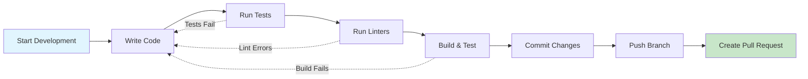
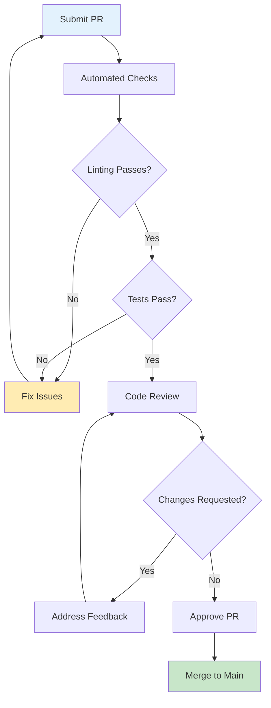

# Contributing Guidelines

Welcome to the OpenFrame CLI project! This guide outlines the development workflow, coding standards, and contribution process. Following these guidelines ensures a smooth collaboration experience and maintains code quality.

> **Prerequisites**: Complete [Environment Setup](../setup/environment.md) and [Local Development](../setup/local-development.md) before contributing.

## 🤝 Getting Started

### Community Resources

OpenFrame CLI is part of the larger Flamingo/OpenFrame ecosystem:

- **💬 Community Support**: [OpenMSP Slack](https://join.slack.com/t/openmsp/shared_invite/zt-36bl7mx0h-3~U2nFH6nqHqoTPXMaHEHA)
- **🌐 Platform**: [Flamingo](https://flamingo.run) | [OpenFrame](https://openframe.ai)
- **📖 Documentation**: [OpenMSP Resources](https://www.openmsp.ai/)

> **Important**: We use Slack for all support and discussions. GitHub Issues and GitHub Discussions are not actively monitored.

### Contribution Types

We welcome various types of contributions:

| Type | Description | Examples |
|------|-------------|----------|
| **🐛 Bug Fixes** | Fix existing issues or unexpected behavior | Error handling, edge cases, compatibility |
| **✨ Features** | Add new functionality or capabilities | New commands, providers, integrations |
| **📚 Documentation** | Improve or expand documentation | Tutorials, API docs, examples |
| **🧪 Testing** | Add or improve test coverage | Unit tests, integration tests, test utilities |
| **🔧 Infrastructure** | Improve build, CI/CD, or development tools | Scripts, workflows, tooling |

## 🔄 Development Workflow

### 1. Fork and Clone

```bash
# Fork the repository on GitHub first
# Then clone your fork
git clone https://github.com/YOUR-USERNAME/openframe-cli.git
cd openframe-cli

# Add upstream remote
git remote add upstream https://github.com/flamingo-stack/openframe-cli.git
git fetch upstream

# Verify remotes
git remote -v
```

### 2. Create Feature Branch

```bash
# Sync with upstream
git checkout main
git pull upstream main
git push origin main

# Create feature branch
git checkout -b feature/your-feature-name

# For different contribution types:
git checkout -b feature/add-new-provider      # New feature
git checkout -b bugfix/fix-cluster-creation   # Bug fix  
git checkout -b docs/improve-quickstart       # Documentation
git checkout -b test/add-integration-tests    # Testing
```

### 3. Development Cycle



### 4. Make Changes

```bash
# Make your changes following the coding standards below
# Run tests frequently during development
make test

# Run linters to catch issues early
make lint

# Build and test the binary
make build
./openframe --help
```

### 5. Commit Changes

Follow our commit message conventions:

```bash
# Add changes
git add .

# Commit with conventional commit format
git commit -m "feat: add new cluster provider for GKE"
git commit -m "fix: resolve cluster deletion race condition"
git commit -m "docs: update installation guide for Windows"
git commit -m "test: add integration tests for bootstrap command"
```

### 6. Push and Create PR

```bash
# Push your branch
git push origin feature/your-feature-name

# Create pull request on GitHub
# Fill out the PR template with:
# - Clear description of changes
# - Testing performed
# - Breaking changes (if any)
# - Screenshots (for UI changes)
```

## 📝 Coding Standards

### Go Code Style

#### General Principles

```go
// ✅ Good: Clear, descriptive naming
type ClusterService struct {
    provider ClusterProvider
    ui       UIService
    config   ConfigService
}

func (s *ClusterService) CreateCluster(name string, config *ClusterConfig) error {
    if err := s.validateClusterName(name); err != nil {
        return fmt.Errorf("invalid cluster name: %w", err)
    }
    // Implementation...
}

// ❌ Bad: Unclear, abbreviated naming
type CS struct {
    p Provider
    u UI
    c Config
}

func (cs *CS) Create(n string, cfg *CC) error {
    // Implementation...
}
```

#### Interface Design

```go
// ✅ Good: Small, focused interfaces
type ClusterProvider interface {
    Create(name string, config *ClusterConfig) error
    Delete(name string) error
    Status(name string) (*ClusterStatus, error)
}

type ClusterLister interface {
    List() ([]Cluster, error)
}

// ❌ Bad: Large, monolithic interfaces
type ClusterProvider interface {
    Create(name string, config *ClusterConfig) error
    Delete(name string) error
    Status(name string) (*ClusterStatus, error)
    List() ([]Cluster, error)
    Update(name string, config *ClusterConfig) error
    Scale(name string, nodeCount int) error
    // ... many more methods
}
```

#### Error Handling

```go
// ✅ Good: Wrap errors with context
func (s *ClusterService) CreateCluster(name string) error {
    if err := s.provider.Create(name); err != nil {
        return fmt.Errorf("failed to create cluster %s: %w", name, err)
    }
    return nil
}

// ✅ Good: Custom error types for domain logic
type ClusterNotFoundError struct {
    ClusterName string
}

func (e *ClusterNotFoundError) Error() string {
    return fmt.Sprintf("cluster %s not found", e.ClusterName)
}

// ❌ Bad: Generic error handling
func (s *ClusterService) CreateCluster(name string) error {
    err := s.provider.Create(name)
    return err  // Lost context
}
```

#### Function Design

```go
// ✅ Good: Pure functions with clear inputs/outputs
func ValidateClusterName(name string) error {
    if name == "" {
        return errors.New("cluster name cannot be empty")
    }
    if len(name) > 63 {
        return errors.New("cluster name too long")
    }
    return nil
}

// ✅ Good: Dependency injection
func NewClusterService(provider ClusterProvider, ui UIService) *ClusterService {
    return &ClusterService{
        provider: provider,
        ui:       ui,
    }
}

// ❌ Bad: Global state dependencies
var globalProvider ClusterProvider

func CreateCluster(name string) error {
    return globalProvider.Create(name)
}
```

### Package Organization

```go
// ✅ Good: Clear package structure
package cluster

// Public interfaces
type Service interface {
    Create(name string, config *ClusterConfig) error
}

type Provider interface {
    Create(name string, config *ClusterConfig) error
}

// Internal implementation
type service struct {
    provider Provider
}

func NewService(provider Provider) Service {
    return &service{provider: provider}
}
```

### Documentation Standards

```go
// ✅ Good: Complete godoc documentation
// ClusterService manages Kubernetes cluster lifecycle operations.
// It provides high-level cluster management capabilities including
// creation, deletion, and status monitoring.
type ClusterService struct {
    provider ClusterProvider
    ui       UIService
}

// CreateCluster creates a new Kubernetes cluster with the specified
// configuration. It validates the cluster name and configuration
// before delegating to the configured provider.
//
// Parameters:
//   - name: The cluster name (must be valid DNS name)
//   - config: Cluster configuration options
//
// Returns an error if the cluster name is invalid, the configuration
// is malformed, or the underlying provider fails.
func (s *ClusterService) CreateCluster(name string, config *ClusterConfig) error {
    // Implementation...
}
```

## 🧪 Testing Requirements

### Test Coverage

All contributions must include appropriate test coverage:

| Component | Required Tests | Coverage Target |
|-----------|----------------|-----------------|
| **New Features** | Unit + Integration | >85% |
| **Bug Fixes** | Regression tests | >80% |
| **Refactoring** | Maintain existing | No decrease |
| **Services** | Unit tests + mocks | >90% |

### Test Writing Standards

```go
// ✅ Good: Comprehensive table-driven tests
func TestClusterService_CreateCluster(t *testing.T) {
    tests := []struct {
        name        string
        clusterName string
        config      *ClusterConfig
        mockSetup   func(*MockProvider)
        wantErr     bool
        wantErrType error
    }{
        {
            name:        "successful creation",
            clusterName: "test-cluster",
            config:      &ClusterConfig{Nodes: 3},
            mockSetup: func(m *MockProvider) {
                m.On("Create", "test-cluster", mock.AnythingOfType("*ClusterConfig")).
                    Return(nil)
            },
            wantErr: false,
        },
        {
            name:        "invalid cluster name",
            clusterName: "",
            config:      &ClusterConfig{},
            mockSetup:   func(m *MockProvider) {},
            wantErr:     true,
            wantErrType: &ValidationError{},
        },
        {
            name:        "provider failure",
            clusterName: "test-cluster", 
            config:      &ClusterConfig{Nodes: 3},
            mockSetup: func(m *MockProvider) {
                m.On("Create", "test-cluster", mock.AnythingOfType("*ClusterConfig")).
                    Return(errors.New("provider error"))
            },
            wantErr:     true,
            wantErrType: &ProviderError{},
        },
    }

    for _, tt := range tests {
        t.Run(tt.name, func(t *testing.T) {
            // Test implementation with proper setup, execution, and assertions
            mockProvider := &MockProvider{}
            tt.mockSetup(mockProvider)
            
            service := NewClusterService(mockProvider, &MockUIService{})
            
            err := service.CreateCluster(tt.clusterName, tt.config)
            
            if tt.wantErr {
                require.Error(t, err)
                if tt.wantErrType != nil {
                    assert.IsType(t, tt.wantErrType, err)
                }
            } else {
                require.NoError(t, err)
            }
            
            mockProvider.AssertExpectations(t)
        })
    }
}
```

### Integration Test Requirements

```go
// Integration tests for new commands
func TestBootstrapCommand_Integration(t *testing.T) {
    if testing.Short() {
        t.Skip("Skipping integration test in short mode")
    }

    testEnv := testutil.NewTestEnvironment(t)
    defer testEnv.Cleanup()

    // Test real command execution
    result := testEnv.RunCLI("bootstrap", "test-cluster", "--deployment-mode=oss-tenant")
    
    assert.Equal(t, 0, result.ExitCode)
    assert.Contains(t, result.Output, "✅ Environment ready")
}
```

## 📋 Code Review Process

### Submitting Pull Requests

#### PR Title Format

Use conventional commit format for PR titles:

```text
feat: add support for GKE clusters
fix: resolve race condition in cluster deletion  
docs: update Windows installation guide
test: add integration tests for dev commands
chore: update Go dependencies to latest versions
```

#### PR Description Template

```markdown
## Description
Brief description of the changes and their purpose.

## Type of Change
- [ ] Bug fix (non-breaking change which fixes an issue)
- [ ] New feature (non-breaking change which adds functionality)
- [ ] Breaking change (fix or feature that would cause existing functionality to not work as expected)
- [ ] Documentation update
- [ ] Test improvements
- [ ] Refactoring/Code cleanup

## Testing
- [ ] Unit tests pass locally
- [ ] Integration tests pass locally
- [ ] Manual testing performed
- [ ] New tests added for changes

## Checklist
- [ ] Code follows project style guidelines
- [ ] Self-review of code completed
- [ ] Code is commented where necessary
- [ ] Documentation updated (if applicable)
- [ ] No breaking changes (or clearly marked)

## Screenshots (if applicable)
Add screenshots for UI changes or command output examples.

## Additional Notes
Any additional information, context, or considerations for reviewers.
```

### Review Criteria

Reviewers will evaluate:

| Aspect | Criteria |
|--------|----------|
| **Functionality** | Code works as intended, handles edge cases |
| **Design** | Follows architecture principles, good abstractions |
| **Readability** | Clear naming, appropriate comments, easy to understand |
| **Testing** | Adequate test coverage, good test quality |
| **Performance** | No unnecessary performance degradation |
| **Security** | No security vulnerabilities introduced |
| **Documentation** | Code is well-documented, user docs updated |

### Review Process Flow



## 🚀 Release Process

### Version Management

We follow [Semantic Versioning](https://semver.org/):

```text
MAJOR.MINOR.PATCH

MAJOR: Breaking changes (e.g., 1.0.0 → 2.0.0)
MINOR: New features (e.g., 1.0.0 → 1.1.0)  
PATCH: Bug fixes (e.g., 1.0.0 → 1.0.1)
```

### Branch Strategy

```mermaid
gitgraph
    commit id: "main"
    
    branch feature/new-provider
    commit id: "add provider"
    commit id: "add tests"
    
    checkout main
    merge feature/new-provider
    commit id: "merge feature"
    
    branch hotfix/critical-bug
    commit id: "fix bug"
    
    checkout main
    merge hotfix/critical-bug
    commit id: "hotfix merged"
    
    commit id: "tag v1.1.0"
```

### Contributing to Releases

```bash
# For feature releases
git checkout main
git pull upstream main
git checkout -b feature/my-feature
# Make changes, test, commit
git push origin feature/my-feature
# Create PR to main

# For hotfixes
git checkout main
git pull upstream main  
git checkout -b hotfix/critical-issue
# Make minimal fix, test, commit
git push origin hotfix/critical-issue
# Create PR to main with "hotfix:" label
```

## 📐 Architecture Decision Records

### When to Create an ADR

Create an Architecture Decision Record (ADR) for:
- Major architectural changes
- New provider integrations
- Breaking API changes
- Significant design decisions

### ADR Template

```markdown
# ADR-001: Add Support for Custom Cluster Providers

## Status
Proposed | Accepted | Rejected | Superseded

## Context
Describe the problem or opportunity that led to this decision.

## Decision
Describe the decision made and the reasoning behind it.

## Consequences
List the positive and negative consequences of this decision.

## Alternatives Considered
List other options that were considered and why they were not chosen.

## Implementation
Describe how this decision will be implemented.
```

## 🛠️ Development Tools

### Required Tools

| Tool | Purpose | Installation |
|------|---------|-------------|
| **golangci-lint** | Code linting | `go install github.com/golangci/golangci-lint/cmd/golangci-lint@latest` |
| **goimports** | Import formatting | `go install golang.org/x/tools/cmd/goimports@latest` |
| **mockery** | Mock generation | `go install github.com/vektra/mockery/v2@latest` |

### Pre-commit Setup

```bash
# Install pre-commit hooks
cat > .git/hooks/pre-commit << 'EOF'
#!/bin/bash
set -e

echo "Running pre-commit checks..."

# Format code
goimports -w .

# Run linter
golangci-lint run

# Run tests
go test -short ./...

echo "Pre-commit checks passed!"
EOF

chmod +x .git/hooks/pre-commit
```

### Useful Make Targets

```bash
# Development commands
make deps          # Download dependencies
make build         # Build binary
make test          # Run unit tests  
make test-integration # Run integration tests
make lint          # Run linters
make fmt           # Format code
make clean         # Clean build artifacts

# Quality checks
make coverage      # Generate coverage report
make security      # Run security scan
make benchmarks    # Run performance benchmarks
```

## 🤔 Getting Help

### Communication Channels

- **General Questions**: [OpenMSP Slack #general](https://join.slack.com/t/openmsp/shared_invite/zt-36bl7mx0h-3~U2nFH6nqHqoTPXMaHEHA)
- **Development Discussion**: [OpenMSP Slack #developers](https://join.slack.com/t/openmsp/shared_invite/zt-36bl7mx0h-3~U2nFH6nqHqoTPXMaHEHA)
- **Bug Reports**: [OpenMSP Slack #bugs](https://join.slack.com/t/openmsp/shared_invite/zt-36bl7mx0h-3~U2nFH6nqHqoTPXMaHEHA)
- **Feature Requests**: [OpenMSP Slack #feature-requests](https://join.slack.com/t/openmsp/shared_invite/zt-36bl7mx0h-3~U2nFH6nqHqoTPXMaHEHA)

### Mentorship and Support

New contributors can get help through:
- **Pair Programming Sessions**: Scheduled through Slack
- **Code Review Feedback**: Detailed feedback on PRs
- **Office Hours**: Weekly community sessions
- **Documentation**: Comprehensive guides and examples

### Contribution Recognition

We recognize contributors through:
- **Contributor List**: Recognition in project documentation
- **Community Highlights**: Featured contributions in community updates
- **Collaboration Opportunities**: Invitation to special projects and initiatives

## 📚 Additional Resources

### OpenFrame Ecosystem
- **[OpenFrame Documentation](https://openframe.ai)**
- **[Flamingo Platform](https://flamingo.run)**
- **[OpenMSP Community](https://www.openmsp.ai/)**

### Go Development
- **[Effective Go](https://golang.org/doc/effective_go.html)**
- **[Go Code Review Comments](https://github.com/golang/go/wiki/CodeReviewComments)**
- **[Go Best Practices](https://golang.org/doc/)**

### Testing and Quality
- **[Advanced Testing](https://golang.org/doc/tutorial/fuzz)**
- **[Testify Documentation](https://pkg.go.dev/github.com/stretchr/testify)**
- **[Clean Architecture](https://blog.cleancoder.com/uncle-bob/2012/08/13/the-clean-architecture.html)**

---

*Ready to contribute? Join our [Slack community](https://join.slack.com/t/openmsp/shared_invite/zt-36bl7mx0h-3~U2nFH6nqHqoTPXMaHEHA) and start collaborating with the OpenFrame team!*