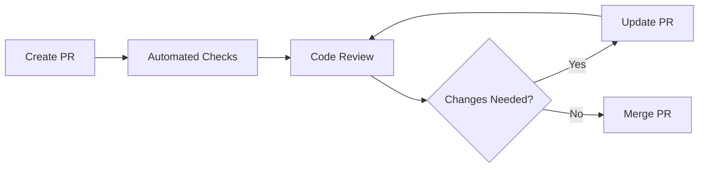
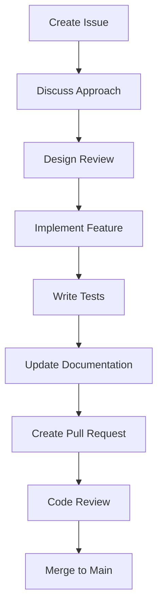

# Contributing Guidelines

Thank you for your interest in contributing to OpenFrame CLI! This document provides comprehensive guidelines for contributing code, documentation, and other improvements to the project.

## Getting Started

### Prerequisites for Contributors

Before you start contributing, ensure you have:

- **Development Environment**: [Set up your environment](../setup/environment.md) with Go 1.21+, Docker, and required tools
- **Local Setup**: [Clone and build the project](../setup/local-development.md) locally
- **Understanding**: Read the [Architecture Overview](../architecture/overview.md) to understand the system design

### First-Time Contributor Setup

```bash
# Fork the repository on GitHub first, then:
git clone https://github.com/YOUR_USERNAME/openframe-cli.git
cd openframe-cli

# Add upstream remote
git remote add upstream https://github.com/flamingo-stack/openframe-cli.git

# Install development dependencies
make setup-dev

# Verify everything works
make test build
```

## Code Style and Standards

### Go Code Standards

We follow standard Go conventions with some project-specific additions:

#### Code Formatting
```bash
# Format code before committing
make fmt

# This runs:
gofmt -s -w .
goimports -w .
```

#### Linting Requirements
```bash
# Run linters (required before PR)
make lint

# This includes:
# - golangci-lint with comprehensive rule set
# - go vet for suspicious constructs
# - gosec for security issues
# - staticcheck for static analysis
```

### Code Organization Patterns

#### Package Structure
```go
// Good: Clear package responsibility
package cluster

import (
    "context"
    "fmt"
    
    "github.com/flamingo-stack/openframe-cli/internal/shared/interfaces"
)

// Service represents the cluster management service
type Service struct {
    provider interfaces.ClusterProvider
    config   Config
}

// NewService creates a new cluster service
func NewService(provider interfaces.ClusterProvider, config Config) *Service {
    return &Service{
        provider: provider,
        config:   config,
    }
}
```

#### Interface Design
```go
// Good: Focused, testable interfaces
type ClusterProvider interface {
    Create(ctx context.Context, config ClusterConfig) error
    Delete(ctx context.Context, name string) error
    List(ctx context.Context) ([]Cluster, error)
    Status(ctx context.Context, name string) (ClusterStatus, error)
}

// Bad: Large, multi-purpose interfaces
type ClusterManager interface {
    Create(...) error
    Delete(...) error
    InstallCharts(...) error  // This belongs in ChartProvider
    SetupDevelopment(...) error  // This belongs in DevProvider
}
```

#### Error Handling
```go
// Good: Descriptive, actionable errors
func (s *Service) Create(ctx context.Context, config ClusterConfig) error {
    if err := s.validateConfig(config); err != nil {
        return fmt.Errorf("invalid cluster configuration: %w", err)
    }
    
    if err := s.provider.Create(ctx, config); err != nil {
        return fmt.Errorf("failed to create cluster %s: %w", config.Name, err)
    }
    
    return nil
}

// Bad: Generic, unhelpful errors
func (s *Service) Create(ctx context.Context, config ClusterConfig) error {
    if err := s.provider.Create(ctx, config); err != nil {
        return err  // No context about what failed
    }
    return nil
}
```

### Documentation Standards

#### Code Documentation
```go
// Package-level documentation
// Package cluster provides Kubernetes cluster lifecycle management
// functionality for OpenFrame CLI. It supports creating, deleting,
// and managing K3d clusters optimized for local development.
package cluster

// Function documentation with examples
// Create creates a new Kubernetes cluster with the specified configuration.
// It performs prerequisite checking, cluster creation, and post-setup validation.
//
// Example:
//   config := ClusterConfig{
//       Name:   "my-cluster",
//       Agents: 2,
//   }
//   err := service.Create(ctx, config)
//   if err != nil {
//       return fmt.Errorf("cluster creation failed: %w", err)
//   }
func (s *Service) Create(ctx context.Context, config ClusterConfig) error {
    // Implementation
}
```

#### README and Documentation
- Update relevant documentation when adding features
- Include examples and usage patterns
- Document breaking changes clearly
- Add troubleshooting information for complex features

## Git Workflow

### Branch Naming Convention

| Prefix | Purpose | Example |
|--------|---------|---------|
| `feature/` | New features | `feature/add-eks-provider` |
| `fix/` | Bug fixes | `fix/cluster-creation-timeout` |
| `docs/` | Documentation only | `docs/improve-setup-guide` |
| `refactor/` | Code refactoring | `refactor/cluster-service-interfaces` |
| `test/` | Test improvements | `test/add-integration-coverage` |
| `chore/` | Maintenance tasks | `chore/update-dependencies` |

### Commit Message Format

We use [Conventional Commits](https://www.conventionalcommits.org/) format:

```text
<type>[optional scope]: <description>

[optional body]

[optional footer(s)]
```

#### Commit Types

| Type | Purpose | Example |
|------|---------|---------|
| `feat` | New features | `feat(cluster): add EKS provider support` |
| `fix` | Bug fixes | `fix(bootstrap): resolve ArgoCD installation timeout` |
| `docs` | Documentation | `docs(setup): improve development environment guide` |
| `refactor` | Code refactoring | `refactor(chart): simplify Helm provider interface` |
| `test` | Tests | `test(cluster): add integration tests for K3d provider` |
| `chore` | Maintenance | `chore: update Go dependencies to latest versions` |

#### Good Commit Examples
```bash
# Feature addition
feat(dev): implement Telepresence intercept functionality

Add support for creating and managing Telepresence intercepts
for local development workflows. Includes:
- Interactive service selection
- Port forwarding configuration
- Connection status monitoring

Closes #123

# Bug fix
fix(cluster): prevent duplicate cluster name creation

Validate cluster names against existing clusters before creation
to prevent K3d conflicts and provide clear error messages.

Fixes #456

# Documentation
docs(contributing): add detailed testing guidelines

Expand testing section with examples, best practices, and
integration test setup instructions for new contributors.
```

### Pull Request Process

#### 1. Before Creating PR

```bash
# Ensure your branch is up to date
git fetch upstream
git rebase upstream/main

# Run full test suite
make test-all

# Verify linting and formatting
make lint fmt

# Build and test locally
make build
./bin/openframe --version
```

#### 2. PR Title and Description

**Title Format**: Use conventional commit format
```text
feat(cluster): add support for custom K3d registry mirrors
```

**Description Template**:
```markdown
## Summary
Brief description of the changes and motivation.

## Changes Made
- [ ] Specific change 1
- [ ] Specific change 2
- [ ] Specific change 3

## Testing
- [ ] Unit tests added/updated
- [ ] Integration tests added/updated
- [ ] Manual testing completed

## Documentation
- [ ] Code comments updated
- [ ] Documentation updated
- [ ] Examples added

## Breaking Changes
None / List any breaking changes

## Additional Notes
Any additional context or considerations
```

#### 3. PR Requirements

All PRs must pass these checks:

| Check | Requirement |
|-------|-------------|
| **Tests** | All tests pass, coverage maintained |
| **Linting** | No linting errors or warnings |
| **Build** | Clean build for all target platforms |
| **Documentation** | Updated for new features |
| **Security** | Security scan passes |
| **Review** | At least one maintainer approval |

#### 4. Review Process



**Review Criteria:**
- Code quality and adherence to guidelines
- Test coverage and quality
- Documentation completeness
- Security considerations
- Performance implications
- Backward compatibility

## Testing Requirements

### Test Coverage Standards

| Component | Minimum Coverage | Required Tests |
|-----------|------------------|----------------|
| **New Features** | 80% | Unit + Integration |
| **Bug Fixes** | Test for the bug + fix | Unit tests minimum |
| **Refactoring** | Maintain existing coverage | All existing tests pass |
| **Critical Paths** | 90% | Unit + Integration + E2E |

### Testing Checklist

Before submitting a PR, ensure:

```bash
# Run all test types
make test           # Unit tests
make test-integration # Integration tests
make test-e2e       # End-to-end tests (if applicable)

# Check coverage
make test-coverage
# Verify coverage meets requirements

# Test with race detection
go test -race ./...
```

#### Writing Good Tests

```go
// Good: Descriptive, comprehensive test
func TestClusterService_Create_WithValidConfig_ShouldCreateCluster(t *testing.T) {
    // Arrange
    ctrl := gomock.NewController(t)
    defer ctrl.Finish()
    
    mockProvider := mocks.NewMockClusterProvider(ctrl)
    mockProvider.EXPECT().
        Create(gomock.Any(), gomock.Any()).
        Return(nil)
    
    service := cluster.NewService(mockProvider, cluster.Config{})
    config := cluster.ClusterConfig{
        Name:   "test-cluster",
        Agents: 1,
    }
    
    // Act
    err := service.Create(context.Background(), config)
    
    // Assert
    assert.NoError(t, err)
}

// Include error cases
func TestClusterService_Create_WithInvalidConfig_ShouldReturnError(t *testing.T) {
    service := cluster.NewService(nil, cluster.Config{})
    
    err := service.Create(context.Background(), cluster.ClusterConfig{})
    
    assert.Error(t, err)
    assert.Contains(t, err.Error(), "invalid cluster configuration")
}
```

## Security Guidelines

### Security Checklist

- [ ] **Input Validation**: Validate all user inputs and external data
- [ ] **Credential Handling**: Never log or expose credentials
- [ ] **Command Injection**: Sanitize command arguments
- [ ] **Path Traversal**: Validate file paths
- [ ] **Dependency Security**: Keep dependencies updated

#### Secure Coding Patterns

```go
// Good: Input validation
func validateClusterName(name string) error {
    if name == "" {
        return errors.New("cluster name cannot be empty")
    }
    
    // Validate against injection patterns
    matched, _ := regexp.MatchString(`^[a-z0-9-]+$`, name)
    if !matched {
        return errors.New("cluster name must contain only lowercase letters, numbers, and hyphens")
    }
    
    return nil
}

// Good: Safe command execution
func (e *Executor) Execute(ctx context.Context, command string, args ...string) error {
    // Validate command is in allowed list
    if !e.isAllowedCommand(command) {
        return fmt.Errorf("command not allowed: %s", command)
    }
    
    cmd := exec.CommandContext(ctx, command, args...)
    // Set secure environment
    cmd.Env = e.getSecureEnvironment()
    
    return cmd.Run()
}

// Bad: Command injection vulnerability
func dangerousExecute(userInput string) error {
    cmd := exec.Command("sh", "-c", userInput) // DANGEROUS!
    return cmd.Run()
}
```

## Performance Guidelines

### Performance Considerations

#### Efficient Resource Usage
```go
// Good: Context with timeout
func (s *Service) CreateWithTimeout(name string) error {
    ctx, cancel := context.WithTimeout(context.Background(), 5*time.Minute)
    defer cancel()
    
    return s.Create(ctx, name)
}

// Good: Resource cleanup
func (s *Service) processWithCleanup() error {
    resource, err := s.acquireResource()
    if err != nil {
        return err
    }
    defer resource.Close() // Always cleanup
    
    return s.process(resource)
}
```

#### Concurrent Operations
```go
// Good: Bounded concurrency
func (s *Service) ProcessMultiple(items []Item) error {
    const maxConcurrency = 5
    semaphore := make(chan struct{}, maxConcurrency)
    
    var wg sync.WaitGroup
    errors := make(chan error, len(items))
    
    for _, item := range items {
        wg.Add(1)
        go func(item Item) {
            defer wg.Done()
            semaphore <- struct{}{} // Acquire
            defer func() { <-semaphore }() // Release
            
            if err := s.processItem(item); err != nil {
                errors <- err
            }
        }(item)
    }
    
    wg.Wait()
    close(errors)
    
    // Check for errors
    for err := range errors {
        if err != nil {
            return err
        }
    }
    
    return nil
}
```

## Release Process

### Versioning Strategy

We use [Semantic Versioning](https://semver.org/) (SemVer):

- **MAJOR**: Incompatible API changes
- **MINOR**: Backward-compatible functionality additions
- **PATCH**: Backward-compatible bug fixes

#### Version Bump Guidelines

| Change Type | Version Bump | Example |
|-------------|--------------|---------|
| Breaking CLI changes | Major | `v1.2.3 → v2.0.0` |
| New commands/features | Minor | `v1.2.3 → v1.3.0` |
| Bug fixes | Patch | `v1.2.3 → v1.2.4` |
| Documentation only | None | No version change |

### Release Checklist

#### Pre-Release
- [ ] All tests pass
- [ ] Documentation updated
- [ ] CHANGELOG.md updated
- [ ] Version bumped in relevant files
- [ ] Security scan passes
- [ ] Performance benchmarks stable

#### Release Process
```bash
# Create release branch
git checkout -b release/v1.3.0

# Update version
make update-version VERSION=v1.3.0

# Run full test suite
make test-all

# Create release PR
git commit -am "chore: bump version to v1.3.0"
git push origin release/v1.3.0

# After PR merge, create tag
git tag -a v1.3.0 -m "Release v1.3.0"
git push upstream v1.3.0
```

## Community Guidelines

### Code of Conduct

We follow the [Contributor Covenant Code of Conduct](https://www.contributor-covenant.org/). Please:

- Be respectful and inclusive
- Welcome newcomers and help them learn
- Focus on constructive feedback
- Assume good intentions

### Getting Help

| Resource | Purpose |
|----------|---------|
| **GitHub Issues** | Bug reports, feature requests |
| **GitHub Discussions** | General questions, ideas |
| **Pull Requests** | Code contributions |
| **Documentation** | Self-service help and guides |

### Communication Channels

- **GitHub Issues**: Technical problems and feature requests
- **Pull Request Comments**: Code review and discussion
- **Commit Messages**: Clear change documentation

## Review Checklist for Maintainers

### Code Review Checklist

- [ ] **Functionality**: Does the code work as intended?
- [ ] **Tests**: Are there appropriate tests with good coverage?
- [ ] **Documentation**: Is documentation updated and clear?
- [ ] **Code Quality**: Follows project standards and best practices?
- [ ] **Security**: No security vulnerabilities introduced?
- [ ] **Performance**: No significant performance regressions?
- [ ] **Compatibility**: Backward compatible unless breaking change is justified?

### Merge Criteria

All criteria must be met before merging:

1. ✅ All automated checks pass
2. ✅ At least one maintainer approval
3. ✅ No unresolved review comments
4. ✅ Documentation updated (if applicable)
5. ✅ Tests pass and coverage maintained
6. ✅ No merge conflicts

## Common Contribution Scenarios

### Adding a New Feature



### Fixing a Bug

1. **Reproduce the bug** locally
2. **Write a test** that demonstrates the bug
3. **Fix the bug** while ensuring the test passes
4. **Verify** the fix doesn't break existing functionality
5. **Submit PR** with test and fix

### Improving Documentation

1. **Identify** documentation gaps or errors
2. **Write clear, accurate content** with examples
3. **Test examples** to ensure they work
4. **Submit PR** with documentation changes only

## What's Next?

Ready to contribute? Here are your next steps:

1. **[Set up your environment](../setup/environment.md)** - Get development tools ready
2. **[Clone and build locally](../setup/local-development.md)** - Start with the codebase
3. **Find an issue** - Look for "good first issue" labels
4. **Join the community** - Engage with other contributors

> **💡 Remember**: Every contribution matters, whether it's code, documentation, bug reports, or helping other contributors. We appreciate all forms of participation in making OpenFrame CLI better!