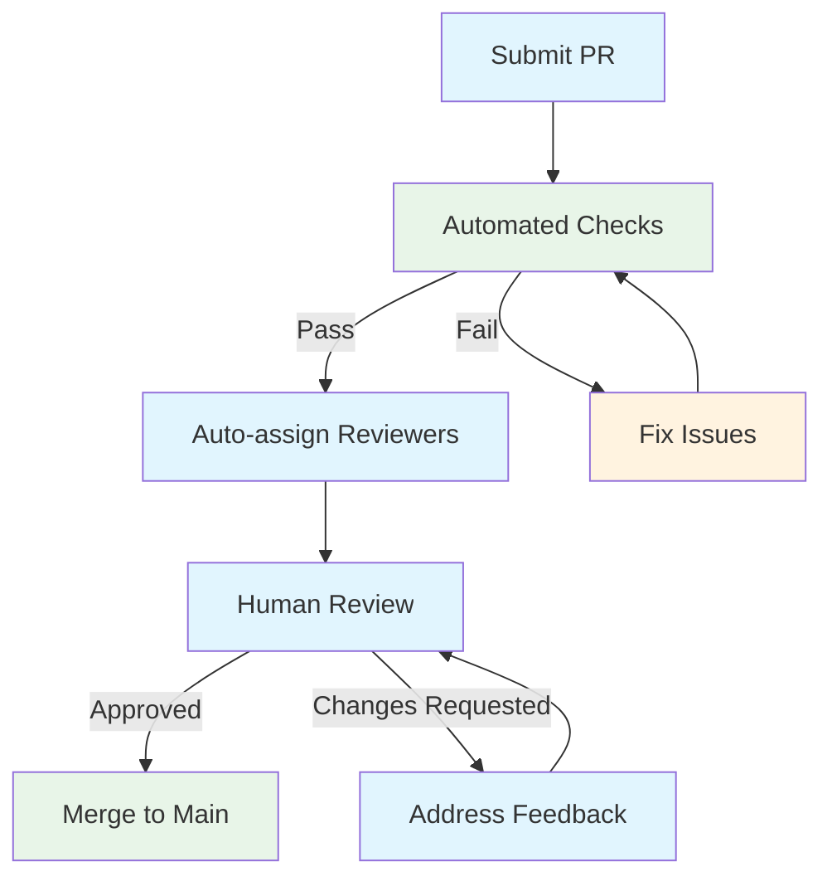

# Contributing Guidelines

Welcome to the OpenFrame CLI project! We're excited that you want to contribute. This guide will help you understand our development process, coding standards, and how to submit high-quality contributions that align with our project goals.

## 🤝 How to Contribute

### Types of Contributions We Welcome

| Contribution Type | Examples | Complexity | Getting Started |
|-------------------|----------|------------|-----------------|
| **🐛 Bug Fixes** | Command errors, edge cases, crashes | Low-Medium | Look for `good first issue` labels |
| **✨ Features** | New commands, integrations, deployment modes | Medium-High | Discuss in issues first |
| **📖 Documentation** | Guides, examples, API docs, typos | Low | Start with docs you struggled with |
| **🧪 Testing** | Unit tests, integration tests, test utilities | Medium | Check coverage gaps |
| **🔧 Tooling** | CI/CD improvements, build optimizations | Medium | Review existing workflows |
| **🎨 UX/UI** | CLI output, error messages, interactivity | Low-Medium | Use the tool and find friction |

### Contribution Workflow

```mermaid
flowchart LR
    Issue[Find/Create Issue] --> Discuss[Discuss Approach]
    Discuss --> Fork[Fork Repository]
    Fork --> Code[Write Code]
    Code --> Test[Test Changes]
    Test --> PR[Create Pull Request]
    PR --> Review[Code Review]
    Review --> Merge[Merge to Main]
    
    Review --> Code
    
    classDef start fill:#e8f5e8
    classDef process fill:#e1f5fe
    classDef review fill:#fff3e0
    classDef end fill:#f3e5f5
    
    class Issue,Fork start
    class Discuss,Code,Test,PR process  
    class Review review
    class Merge end
```

## 📋 Before You Start

### 1. **Check Existing Work**
```bash
# Search for existing issues
# Visit: https://github.com/flamingo-stack/openframe-cli/issues

# Check if someone is already working on it
# Look for "assigned" label or recent comments

# Review recent pull requests
# Visit: https://github.com/flamingo-stack/openframe-cli/pulls
```

### 2. **Set Up Development Environment**
Follow our [Development Environment Setup](../setup/environment.md) guide:

```bash
# Clone your fork
git clone https://github.com/YOUR_USERNAME/openframe-cli.git
cd openframe-cli

# Set up development tools
make install

# Run tests to ensure everything works
make test

# Build the project
make build
```

### 3. **Understand the Architecture**
Review our [Architecture Overview](../architecture/overview.md) to understand:
- How components interact
- Where your changes fit
- Existing patterns to follow

## 🎨 Code Style and Conventions

### Go Code Style

We follow standard Go conventions plus project-specific guidelines:

#### **File Naming**
```
✅ Good Examples:
- cluster_service.go     # Snake case for multi-word
- config.go             # Simple single word
- k3d_provider.go       # Abbreviations in lowercase

❌ Bad Examples:
- clusterService.go     # CamelCase
- k3dProvider.go        # Mixed case abbreviation
- cluster-service.go    # Kebab case
```

#### **Function and Variable Naming**
```go
// ✅ Good: Exported functions use PascalCase
func CreateCluster(config ClusterConfig) error

// ✅ Good: Private functions use camelCase  
func validateClusterName(name string) error

// ✅ Good: Descriptive variable names
clusterConfig := ClusterConfig{Name: "test-cluster"}
k3dClient := NewK3dClient()

// ❌ Bad: Abbreviations and unclear names
cfg := ClusterConfig{}
c := NewK3dClient()
```

#### **Package Structure**
```go
// ✅ Good: Clear package organization
package cluster

import (
    // Standard library first
    "context"
    "fmt"
    
    // Third-party packages
    "github.com/spf13/cobra"
    
    // Local packages last
    "github.com/flamingo-stack/openframe-cli/internal/shared/ui"
)
```

#### **Error Handling**
```go
// ✅ Good: Wrap errors with context
if err != nil {
    return fmt.Errorf("failed to create cluster %s: %w", clusterName, err)
}

// ✅ Good: Use custom error types for different categories
type ValidationError struct {
    Field   string
    Message string
}

func (e *ValidationError) Error() string {
    return fmt.Sprintf("validation failed for %s: %s", e.Field, e.Message)
}

// ❌ Bad: Generic error messages
if err != nil {
    return err  // No context
}
```

#### **Comments and Documentation**
```go
// ✅ Good: Package documentation
// Package cluster provides Kubernetes cluster management functionality.
// It supports creating, deleting, and monitoring K3d clusters for development.
package cluster

// ✅ Good: Function documentation with examples
// CreateCluster creates a new Kubernetes cluster using K3d.
// It validates the configuration, checks prerequisites, and handles cleanup on failure.
//
// Example:
//   config := ClusterConfig{Name: "dev-cluster", Nodes: 3}
//   err := service.CreateCluster(config)
//   if err != nil {
//       log.Fatal(err)
//   }
func CreateCluster(config ClusterConfig) error {
    // Implementation...
}

// ❌ Bad: Obvious or outdated comments
// This function creates a cluster
func CreateCluster(config ClusterConfig) error {
    // Implementation...
}
```

### Code Formatting

Use these tools to maintain consistent formatting:

```bash
# Format code with gofumpt (stricter than gofmt)
gofumpt -w .

# Organize imports
goimports -w .

# Run linter
golangci-lint run

# All-in-one formatting (recommended)
make fmt
```

### Configuration File Style

#### **YAML Files**
```yaml
# ✅ Good: Consistent indentation and structure
apiVersion: v1
kind: ConfigMap
metadata:
  name: openframe-config
  namespace: openframe
data:
  cluster:
    defaultNodes: "3"
    defaultMemory: "4gb"
  deployment:
    mode: "oss-tenant"
    verbose: "false"
```

## 🔄 Git Workflow

### Branch Naming

Use descriptive branch names that indicate the type and scope of changes:

```bash
# ✅ Good Examples:
git checkout -b feature/add-cloud-provider-support
git checkout -b fix/cluster-deletion-timeout
git checkout -b docs/improve-quickstart-guide  
git checkout -b refactor/simplify-error-handling
git checkout -b test/add-integration-tests

# ❌ Bad Examples:
git checkout -b fix           # Too generic
git checkout -b john-changes  # Personal name
git checkout -b temp         # Unclear purpose
```

### Commit Message Format

We follow the [Conventional Commits](https://www.conventionalcommits.org/) specification:

```bash
<type>[optional scope]: <description>

[optional body]

[optional footer(s)]
```

#### **Commit Types**
| Type | Purpose | Examples |
|------|---------|----------|
| **feat** | New features | `feat(cluster): add support for custom node images` |
| **fix** | Bug fixes | `fix(bootstrap): handle timeout during chart installation` |
| **docs** | Documentation | `docs(api): add examples for cluster configuration` |
| **refactor** | Code restructuring | `refactor(ui): extract common prompt logic` |
| **test** | Test additions/changes | `test(cluster): add integration tests for deletion` |
| **chore** | Maintenance tasks | `chore(deps): update k3d to v5.4.6` |
| **perf** | Performance improvements | `perf(cluster): optimize cluster listing query` |
| **ci** | CI/CD changes | `ci(github): add integration test workflow` |

#### **Good Commit Examples**
```bash
# ✅ Good: Clear, descriptive, follows format
feat(cluster): add support for custom node configurations

Adds ability to specify custom node configurations including:
- CPU and memory limits per node
- Custom labels and taints  
- Node-specific port mappings

Closes #123

# ✅ Good: Breaking change notation
feat(api)!: change cluster config structure

BREAKING CHANGE: ClusterConfig.Memory is now ClusterConfig.Resources.Memory
Migration guide: https://docs.openframe.io/migration/v2

# ✅ Good: Simple fix
fix(bootstrap): resolve timeout during ArgoCD installation
```

#### **Bad Commit Examples**
```bash
# ❌ Bad: Too vague
fix: stuff

# ❌ Bad: Multiple unrelated changes
feat: add logging and fix typos and update deps

# ❌ Bad: Not following conventional format
Added new cluster provider and fixed some bugs
```

## 🧪 Testing Requirements

### Test Coverage Requirements

All contributions must maintain or improve test coverage:

| Component | Required Coverage | How to Check |
|-----------|------------------|--------------|
| **New Features** | 90%+ | `go test -coverprofile=coverage.out ./path/to/new/code` |
| **Bug Fixes** | Must have test reproducing the bug | Add regression test |
| **Refactoring** | No coverage reduction | `make test-coverage` |

### Required Tests

#### **For New Features:**
```go
// 1. Unit tests for business logic
func TestNewFeature_Success(t *testing.T) {
    // Test happy path
}

func TestNewFeature_ErrorCases(t *testing.T) {
    // Test all error scenarios  
}

// 2. Integration tests for external interactions
func TestNewFeature_Integration(t *testing.T) {
    // Test with real dependencies
}

// 3. Example-based tests
func ExampleNewFeature() {
    // Demonstrable usage
    // Output: expected output
}
```

#### **For Bug Fixes:**
```go
// Regression test that fails before fix and passes after
func TestBugFix_ReproducesIssue(t *testing.T) {
    // Arrange: Set up conditions that caused the bug
    // Act: Perform the action that triggered the bug
    // Assert: Verify the fix works
}
```

### Test Execution

```bash
# Before submitting PR, run all tests
make test-all

# Check test coverage
make test-coverage

# Run linting
make lint

# Integration tests (requires Docker)
make test-integration
```

## 📝 Pull Request Process

### 1. **Create a Great PR Description**

Use this template:

```markdown
## Description
Brief description of what this PR does and why.

## Type of Change
- [ ] Bug fix (non-breaking change which fixes an issue)
- [ ] New feature (non-breaking change which adds functionality)  
- [ ] Breaking change (fix or feature that would cause existing functionality to not work as expected)
- [ ] Documentation update

## How Has This Been Tested?
- [ ] Unit tests pass
- [ ] Integration tests pass  
- [ ] Manual testing performed
- [ ] Tested on: [OS/Environment details]

## Testing Steps
1. Step one
2. Step two  
3. Expected result

## Checklist
- [ ] My code follows the style guidelines
- [ ] I have performed a self-review
- [ ] I have commented my code, particularly in hard-to-understand areas
- [ ] I have made corresponding changes to the documentation
- [ ] My changes generate no new warnings
- [ ] I have added tests that prove my fix is effective or that my feature works
- [ ] New and existing tests pass locally

## Screenshots (if applicable)

## Related Issues
Closes #123
Related to #456
```

### 2. **PR Size Guidelines**

| Size | Lines Changed | Recommendation |
|------|---------------|----------------|
| **Small** | < 100 lines | ✅ Ideal - easy to review |
| **Medium** | 100-300 lines | ✅ Good - still manageable |
| **Large** | 300-500 lines | ⚠️ Consider splitting |
| **XLarge** | > 500 lines | ❌ Please split into multiple PRs |

### 3. **Review Process**



#### **Automated Checks**
- ✅ All tests pass
- ✅ Linting passes
- ✅ Code coverage maintained
- ✅ No merge conflicts
- ✅ Commit messages follow conventions

#### **Human Review Criteria**
- **Code Quality**: Follows patterns and conventions
- **Architecture**: Fits well with existing design
- **Testing**: Adequate test coverage and quality
- **Documentation**: Code is well-commented and docs updated
- **Security**: No security vulnerabilities introduced
- **Performance**: No significant performance regressions

### 4. **Addressing Review Feedback**

```bash
# Make requested changes
git add .
git commit -m "fix(review): address feedback on error handling"

# Push to your branch (updates PR automatically)  
git push origin feature/your-branch-name

# If you need to update commit history
git rebase -i HEAD~3  # Interactive rebase
git push --force-with-lease origin feature/your-branch-name
```

## 🔍 Review Checklist

Use this checklist when reviewing code or preparing for review:

### **Code Quality**
- [ ] Code follows Go conventions and project style
- [ ] Functions are reasonably sized (< 50 lines typically)
- [ ] Variable and function names are descriptive
- [ ] Error handling is comprehensive and user-friendly
- [ ] No hardcoded values (use constants or configuration)
- [ ] Thread-safe code where concurrency is involved

### **Architecture & Design**
- [ ] Changes fit well with existing architecture
- [ ] Proper separation of concerns (CLI/Service/Infrastructure layers)
- [ ] Dependencies are injected, not hardcoded
- [ ] Interfaces are used where appropriate
- [ ] No circular dependencies

### **Testing**
- [ ] Unit tests cover new functionality
- [ ] Integration tests added for external interactions
- [ ] Edge cases and error scenarios tested
- [ ] Tests are deterministic (not flaky)
- [ ] Test names clearly describe what is being tested

### **Documentation**
- [ ] Public functions have proper Go doc comments
- [ ] Complex logic is explained with comments
- [ ] README or user docs updated if needed
- [ ] Examples provided for new features

### **Security & Performance**
- [ ] No secrets or sensitive data in code
- [ ] Input validation where required
- [ ] No obvious performance regressions
- [ ] Resource cleanup (defer statements for cleanup)

### **User Experience**
- [ ] Error messages are helpful and actionable
- [ ] CLI output is consistent with existing patterns
- [ ] Interactive prompts are clear
- [ ] --help text is accurate and helpful

## 🎯 Common Contribution Scenarios

### **Adding a New CLI Command**

1. **Create command file**: `cmd/yourcommand/yourcommand.go`
2. **Implement business logic**: `internal/yourcommand/services/`
3. **Add models**: `internal/yourcommand/models/`
4. **Write tests**: Unit and integration tests
5. **Update documentation**: Help text and user docs
6. **Add to main command**: Register in root command

### **Adding External Tool Integration**

1. **Create provider interface**: Define abstraction
2. **Implement provider**: Concrete implementation
3. **Add configuration**: Support for tool-specific settings
4. **Error handling**: Tool-specific error cases
5. **Integration tests**: Test with real tool
6. **Documentation**: Installation and usage instructions

### **Improving Error Messages**

1. **Identify error scenarios**: When do users get confused?
2. **Add context**: What was the user trying to do?
3. **Provide suggestions**: How can they fix it?
4. **Test error paths**: Ensure errors are actually helpful
5. **Update documentation**: Reflect improved error handling

## 🆘 Getting Help

### **Before Asking for Help**

1. **Check documentation**: [Architecture](../architecture/overview.md), [Setup](../setup/environment.md)
2. **Search issues**: Someone might have faced the same problem
3. **Review existing code**: See how similar features are implemented
4. **Run tests**: Ensure your environment is working

### **How to Ask for Help**

#### **Create a Good Issue**
```markdown
**What I'm trying to do:**
Brief description of your goal

**What I expected:**
What you thought would happen

**What actually happened:**
What actually occurred, including error messages

**Environment:**
- OS: macOS/Linux/Windows
- Go version: 1.21.3
- Docker version: 24.0.6
- OpenFrame CLI version: v1.0.0

**Steps to reproduce:**
1. Step one
2. Step two
3. Error occurs

**Additional context:**
Any other information that might be helpful
```

#### **Join Community Discussions**
- 💬 **Discord**: Real-time help and discussions
- 🐛 **GitHub Discussions**: Longer-form technical discussions  
- 📧 **Email**: For private or sensitive issues

---

> **🎯 Contributing Successfully**: The key to successful contributions is communication. When in doubt, ask questions early and often. We'd rather help you get on the right track than have you spend time on something that won't be accepted. Remember: every expert was once a beginner, and we're here to help you succeed!

## 🏆 Recognition

We value all contributions! Contributors are recognized through:
- **GitHub Contributors page**: Automatic recognition
- **Release notes**: Significant contributions mentioned
- **Community spotlight**: Featured in Discord and social media
- **Maintainer pathway**: Active contributors may be invited to become maintainers

Thank you for contributing to OpenFrame CLI! 🚀