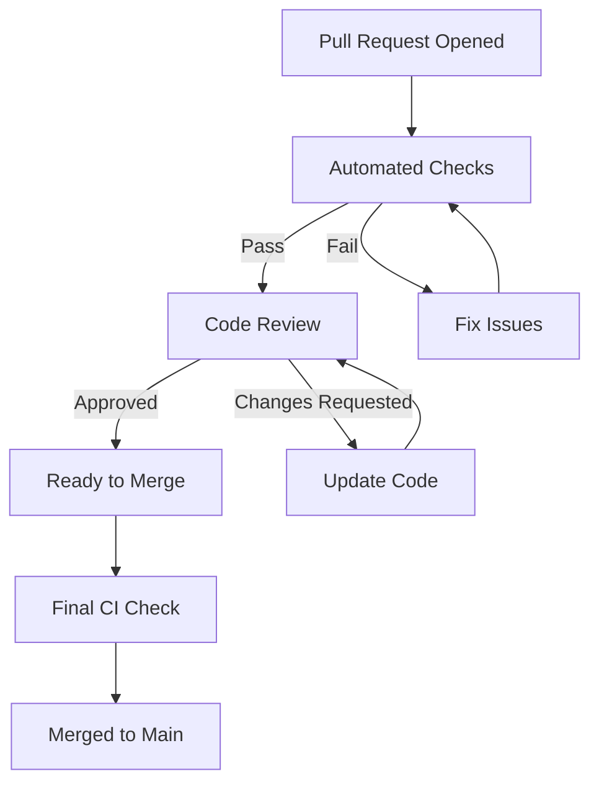

# Contributing Guidelines

Welcome to the OpenFrame CLI community! We're excited to have you contribute to making Kubernetes development more accessible and enjoyable. This guide will help you understand our development process, coding standards, and how to make successful contributions.

## Getting Started

### Prerequisites for Contributors
Before you start contributing, make sure you have:
- ✅ [Development environment set up](../setup/environment.md)
- ✅ [Local development working](../setup/local-development.md)
- ✅ Understanding of the [architecture](../architecture/overview.md)
- ✅ Familiarity with [testing practices](../testing/overview.md)

### Your First Contribution

#### 1. Find an Issue
Look for issues labeled with:
- 🟢 `good first issue` - Perfect for newcomers
- 🟡 `help wanted` - Community contributions welcome  
- 🔵 `documentation` - Improve docs and examples
- 🟣 `enhancement` - New features and improvements

#### 2. Set Up Your Workspace
```bash
# Fork the repository on GitHub, then:
git clone https://github.com/YOUR_USERNAME/openframe-cli.git
cd openframe-cli

# Add upstream remote
git remote add upstream https://github.com/flamingo-stack/openframe-cli.git

# Create feature branch
git checkout -b feature/your-feature-name

# Verify everything works
make test
```

#### 3. Make Your Changes
Follow the coding standards and patterns described in this guide.

#### 4. Submit Your Contribution
Create a Pull Request with a clear description of your changes.

## Development Workflow

### Branch Naming Convention

| Branch Type | Pattern | Example |
|-------------|---------|---------|
| **Feature** | `feature/description` | `feature/add-cluster-templates` |
| **Bug Fix** | `fix/description` | `fix/cluster-deletion-timeout` |
| **Documentation** | `docs/description` | `docs/update-installation-guide` |
| **Hotfix** | `hotfix/description` | `hotfix/security-vulnerability` |
| **Refactor** | `refactor/description` | `refactor/simplify-error-handling` |

### Commit Message Format

We follow the [Conventional Commits](https://conventionalcommits.org/) specification:

```
<type>[optional scope]: <description>

[optional body]

[optional footer(s)]
```

#### Commit Types
| Type | Purpose | Example |
|------|---------|---------|
| **feat** | New features | `feat(cluster): add cluster templates support` |
| **fix** | Bug fixes | `fix(chart): resolve ArgoCD installation timeout` |
| **docs** | Documentation | `docs(api): update cluster creation examples` |
| **style** | Code formatting | `style: fix gofmt issues in cluster service` |
| **refactor** | Code restructuring | `refactor(ui): simplify progress display logic` |
| **test** | Adding/modifying tests | `test(cluster): add integration tests for deletion` |
| **chore** | Maintenance tasks | `chore: update dependencies` |

#### Example Commit Messages
```bash
# Good commit messages
feat(dev): add Telepresence intercept support
fix(cluster): handle k3d cluster creation timeouts properly
docs(getting-started): add troubleshooting section
test(chart): add integration tests for ArgoCD installation

# Bad commit messages  
updated stuff
fixed bug
changes
misc updates
```

### Pull Request Process

#### 1. Pre-submission Checklist
Before opening a PR, ensure:

```bash
# Code quality checks
make lint                    # Code passes linting
make test                   # All tests pass
make integration-test       # Integration tests pass (if applicable)

# Documentation
# Update relevant docs if needed
# Add/update tests for new functionality
# Update CHANGELOG.md if significant change
```

#### 2. Pull Request Template
Use this template for your PR description:

```markdown
## Description
Brief description of what this PR does.

## Type of Change
- [ ] Bug fix (non-breaking change which fixes an issue)
- [ ] New feature (non-breaking change which adds functionality)
- [ ] Breaking change (fix or feature that would cause existing functionality to not work as expected)
- [ ] Documentation update
- [ ] Code refactoring
- [ ] Performance improvement

## Testing
- [ ] Unit tests pass
- [ ] Integration tests pass (if applicable)
- [ ] Manual testing completed
- [ ] Added new tests for new functionality

## Checklist
- [ ] My code follows the project's coding standards
- [ ] I have performed a self-review of my own code
- [ ] I have commented my code, particularly in hard-to-understand areas
- [ ] I have made corresponding changes to the documentation
- [ ] My changes generate no new warnings
- [ ] New and existing unit tests pass locally with my changes

## Related Issues
Fixes #(issue number)
```

#### 3. Review Process



**Review Criteria:**
- ✅ Code follows project conventions
- ✅ Adequate test coverage
- ✅ Documentation updated
- ✅ No breaking changes (unless intentional)
- ✅ Performance impact considered
- ✅ Security implications reviewed

## Coding Standards

### Go Code Style

We follow standard Go conventions with some OpenFrame-specific guidelines:

#### Package Structure
```go
// Good: Clear package purpose
package cluster

import (
    "context"
    "fmt"
    
    // Group imports logically
    "github.com/spf13/cobra"
    
    // Internal imports last
    "github.com/flamingo-stack/openframe-cli/internal/shared/errors"
    "github.com/flamingo-stack/openframe-cli/internal/shared/ui"
)
```

#### Function Design
```go
// Good: Clear function signature with proper error handling
func (s *ClusterService) CreateCluster(ctx context.Context, config *ClusterConfig) (*Cluster, error) {
    if err := s.validateConfig(config); err != nil {
        return nil, errors.NewValidationError("invalid cluster configuration", err)
    }
    
    s.ui.ShowProgress("Creating cluster", config.Name)
    
    cluster, err := s.provider.CreateCluster(ctx, config)
    if err != nil {
        return nil, errors.NewClusterError("failed to create cluster", err,
            errors.WithCluster(config.Name),
            errors.WithRetryable(true))
    }
    
    return cluster, nil
}
```

#### Error Handling
```go
// Good: Use structured errors with context
return errors.NewClusterError("cluster creation failed", err,
    errors.WithCluster(config.Name),
    errors.WithSuggestion("Check that Docker is running"),
    errors.WithDocLink("https://docs.openframe.dev/troubleshooting"))

// Bad: Generic errors
return fmt.Errorf("error: %v", err)
```

#### Interface Design
```go
// Good: Focused interfaces
type ClusterProvider interface {
    CreateCluster(ctx context.Context, config *ClusterConfig) (*Cluster, error)
    DeleteCluster(ctx context.Context, name string) error
    ListClusters(ctx context.Context) ([]*Cluster, error)
    GetClusterStatus(ctx context.Context, name string) (*ClusterStatus, error)
}

// Bad: Kitchen sink interface
type ClusterManager interface {
    CreateCluster(...) error
    DeleteCluster(...) error
    InstallArgoCD(...) error
    SetupTelespresence(...) error
    // ... too many responsibilities
}
```

### CLI Command Patterns

#### Command Structure
```go
// Good: Consistent command pattern
func getCreateCmd() *cobra.Command {
    var flags CreateFlags
    
    cmd := &cobra.Command{
        Use:   "create [cluster-name]",
        Short: "Create a new K3d cluster",
        Long:  createLongDescription,
        Args:  cobra.MaximumNArgs(1),
        PreRunE: func(cmd *cobra.Command, args []string) error {
            return prerequisites.CheckAndInstall(cmd.Context())
        },
        RunE: func(cmd *cobra.Command, args []string) error {
            config := buildConfigFromFlags(args, flags)
            service := services.NewClusterService()
            return service.CreateInteractively(cmd.Context(), config)
        },
    }
    
    addCreateFlags(cmd, &flags)
    return cmd
}
```

#### Flag Conventions
```go
// Good: Consistent flag naming and descriptions
func addCreateFlags(cmd *cobra.Command, flags *CreateFlags) {
    cmd.Flags().IntVarP(&flags.Nodes, "nodes", "n", 3, 
        "Number of worker nodes (1-10)")
    cmd.Flags().StringVar(&flags.APIPort, "api-port", "6443", 
        "Kubernetes API server port")
    cmd.Flags().BoolVar(&flags.DisableLoadBalancer, "disable-lb", false,
        "Disable integrated load balancer")
}
```

### User Experience Guidelines

#### Progress Feedback
```go
// Good: Clear progress indication
s.ui.ShowLogo()
s.ui.Info("Creating cluster: %s", config.Name)

progress := s.ui.NewProgressTracker("Cluster creation", 4)
progress.Start()

progress.Update(1, "Validating configuration")
// ... validation logic

progress.Update(2, "Starting k3d cluster")
// ... cluster creation

progress.Update(3, "Configuring kubectl context")
// ... kubectl setup

progress.Update(4, "Verifying cluster health")
// ... health check

progress.Complete("Cluster created successfully")
```

#### Error Messages
```go
// Good: Actionable error messages
return errors.NewPrerequisiteError("Docker not found",
    errors.WithSuggestion("Install Docker Desktop from https://docker.com"),
    errors.WithCommand("docker --version"),
    errors.WithDocLink("https://docs.openframe.dev/prerequisites"))

// Bad: Vague error messages
return errors.New("docker error")
```

## Testing Guidelines

### Test Coverage Requirements
| Component | Minimum Coverage | Target Coverage |
|-----------|-----------------|----------------|
| **Services** | 80% | 90% |
| **Providers** | 75% | 85% |
| **CLI Commands** | 60% | 75% |
| **Models/Types** | 85% | 95% |

### Unit Test Patterns
```go
// Good: Comprehensive test with clear structure
func TestClusterService_Create_Success(t *testing.T) {
    // Arrange
    ctx := context.Background()
    mockProvider := mocks.NewClusterProvider(t)
    mockUI := mocks.NewUIProvider(t)
    
    service := &ClusterService{
        provider: mockProvider,
        ui:       mockUI,
    }
    
    config := &ClusterConfig{Name: "test-cluster", Nodes: 1}
    expectedCluster := &Cluster{Name: "test-cluster", Status: "running"}
    
    // Setup expectations
    mockProvider.On("CreateCluster", ctx, config).Return(expectedCluster, nil)
    mockUI.On("ShowProgress", mock.Anything, mock.Anything)
    
    // Act
    cluster, err := service.CreateCluster(ctx, config)
    
    // Assert
    require.NoError(t, err)
    assert.Equal(t, expectedCluster, cluster)
    mockProvider.AssertExpectations(t)
    mockUI.AssertExpectations(t)
}
```

### Integration Test Patterns
```go
//go:build integration
// +build integration

func TestClusterLifecycleIntegration(t *testing.T) {
    if testing.Short() {
        t.Skip("Skipping integration test")
    }
    
    // Setup
    ctx, cancel := context.WithTimeout(context.Background(), 5*time.Minute)
    defer cancel()
    
    clusterName := testutil.GenerateTestClusterName()
    runner := testutil.NewCLIRunner(t)
    
    // Cleanup
    t.Cleanup(func() {
        runner.Run(ctx, "cluster", "delete", clusterName, "--force")
    })
    
    // Test full lifecycle
    t.Run("create cluster", func(t *testing.T) {
        output, err := runner.Run(ctx, "cluster", "create", clusterName, "--nodes", "1")
        require.NoError(t, err)
        assert.Contains(t, output, "successfully created")
        
        // Verify cluster exists
        testutil.AssertClusterExists(t, clusterName)
    })
    
    // Additional test steps...
}
```

## Documentation Standards

### Code Documentation
```go
// Good: Clear package documentation
// Package cluster provides Kubernetes cluster lifecycle management
// for local development environments using k3d.
//
// The cluster package supports:
//   - Creating and deleting k3d clusters
//   - Managing cluster lifecycle and status
//   - Configuring kubectl contexts
//   - Installing prerequisite tools
package cluster

// ClusterService manages the lifecycle of local Kubernetes clusters.
//
// It provides high-level operations for cluster management while
// abstracting the underlying k3d provider implementation.
type ClusterService struct {
    provider  ClusterProvider
    ui        ui.Provider
    validator ConfigValidator
}

// CreateCluster creates a new k3d cluster with the specified configuration.
//
// The cluster creation process:
//  1. Validates the provided configuration
//  2. Checks system prerequisites
//  3. Creates the k3d cluster
//  4. Configures kubectl context
//  5. Verifies cluster health
//
// Returns the created cluster information or an error if creation fails.
func (s *ClusterService) CreateCluster(ctx context.Context, config *ClusterConfig) (*Cluster, error) {
    // Implementation...
}
```

### README and Tutorial Updates
When adding new features, update relevant documentation:

```markdown
## New Feature Documentation Template

### Feature Name
Brief description of what the feature does and why it's useful.

#### Prerequisites
- List any specific requirements
- Tool versions needed
- Configuration requirements

#### Usage Example
```bash
# Basic usage
openframe command --flag value

# Advanced usage with options
openframe command --flag1 value1 --flag2 value2
```

#### Configuration
Describe configuration options and their effects.

#### Troubleshooting
Common issues and solutions.
```

## Release Process

### Version Management
We use [Semantic Versioning](https://semver.org/):
- **MAJOR**: Breaking changes
- **MINOR**: New features, backwards compatible
- **PATCH**: Bug fixes, backwards compatible

### Release Checklist
For maintainers preparing releases:

```bash
# 1. Update version
git checkout main
git pull upstream main

# 2. Update CHANGELOG.md
# Add new version section with changes

# 3. Tag release
git tag -a v1.2.3 -m "Release version 1.2.3"
git push upstream v1.2.3

# 4. CI/CD will automatically:
#    - Build binaries for all platforms
#    - Create GitHub release
#    - Update documentation
#    - Publish to package managers
```

## Community Guidelines

### Code of Conduct
- **Be respectful**: Treat all community members with respect
- **Be inclusive**: Welcome newcomers and diverse perspectives  
- **Be constructive**: Provide helpful feedback and suggestions
- **Be patient**: Remember everyone is learning

### Communication Channels
| Channel | Purpose | Response Time |
|---------|---------|---------------|
| **GitHub Issues** | Bug reports, feature requests | 24-48 hours |
| **GitHub Discussions** | Questions, ideas, showcases | 1-3 days |
| **Discord/Slack** | Real-time chat, quick questions | Varies |
| **Email** | Security issues, private matters | 24 hours |

### Getting Help
- 📖 **Documentation**: Check docs first for answers
- 🔍 **Search Issues**: Your question might already be answered
- 🆕 **Create Issue**: Use appropriate issue templates
- 💬 **Join Discussion**: Engage with the community
- 🚀 **Show Examples**: Include code/config when asking questions

## Recognition and Credits

### Contributor Recognition
Contributors are recognized through:
- **GitHub contributor graph**: Automatic recognition for commits
- **Release notes**: Significant contributors mentioned
- **Community spotlight**: Featured in newsletters/blogs
- **Maintainer nomination**: Outstanding contributors may be invited as maintainers

### Types of Contributions
We value all types of contributions:
- 🐛 **Bug fixes** - Improving stability and reliability
- ✨ **New features** - Expanding capabilities
- 📚 **Documentation** - Making the project accessible
- 🧪 **Testing** - Improving quality assurance
- 🎨 **UI/UX** - Enhancing user experience
- 🌍 **Translation** - Making it accessible globally
- 💡 **Ideas and feedback** - Shaping the project direction

## Advanced Contribution Topics

### Adding New External Tool Support
To add support for a new external tool:

1. **Create Provider Interface**
```go
// internal/mytool/providers/interfaces.go
type MyToolProvider interface {
    Install(ctx context.Context) error
    IsInstalled() bool
    Execute(ctx context.Context, args ...string) error
}
```

2. **Implement Provider**
```go
// internal/mytool/providers/mytool/provider.go
type Provider struct {
    executor executor.CommandExecutor
}

func (p *Provider) Install(ctx context.Context) error {
    // Implementation for installing the tool
}
```

3. **Add Prerequisites Check**
```go
// internal/mytool/prerequisites/mytool/checker.go
type Checker struct {
    provider MyToolProvider
}

func (c *Checker) Check() error {
    if !c.provider.IsInstalled() {
        return errors.NewPrerequisiteError("mytool not found")
    }
    return nil
}
```

4. **Create Command Integration**
```go
// cmd/mytool/mytool.go
func getMyToolCmd() *cobra.Command {
    return &cobra.Command{
        Use:   "mytool",
        Short: "Manage MyTool operations",
        PreRunE: func(cmd *cobra.Command, args []string) error {
            return prerequisites.CheckMyTool()
        },
    }
}
```

### Performance Considerations
When contributing performance-sensitive code:

```go
// Good: Efficient implementation
func (s *Service) ProcessLargeDataset(ctx context.Context, data []Item) error {
    // Use buffered channels for concurrency
    jobs := make(chan Item, 100)
    results := make(chan error, 100)
    
    // Start workers
    for i := 0; i < runtime.NumCPU(); i++ {
        go s.worker(ctx, jobs, results)
    }
    
    // Send jobs
    go func() {
        defer close(jobs)
        for _, item := range data {
            select {
            case jobs <- item:
            case <-ctx.Done():
                return
            }
        }
    }()
    
    // Collect results
    for i := 0; i < len(data); i++ {
        select {
        case err := <-results:
            if err != nil {
                return err
            }
        case <-ctx.Done():
            return ctx.Err()
        }
    }
    
    return nil
}
```

## Questions or Need Help?

- 💬 **Start a Discussion**: [GitHub Discussions](https://github.com/flamingo-stack/openframe-cli/discussions)
- 🐛 **Report a Bug**: [Create an Issue](https://github.com/flamingo-stack/openframe-cli/issues/new)
- ✨ **Request a Feature**: [Feature Request Template](https://github.com/flamingo-stack/openframe-cli/issues/new?template=feature_request.md)
- 📧 **Security Issues**: security@openframe.dev

---

**Thank you for contributing to OpenFrame CLI!** 🎉 Your contributions help make Kubernetes development more accessible to developers worldwide.

> **Pro Tip**: Start with documentation improvements or small bug fixes to get familiar with the codebase and contribution process. The maintainers are here to help guide you through your first contribution!