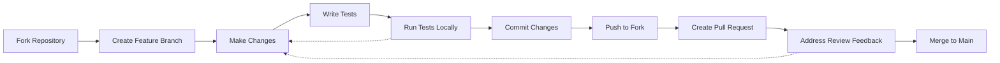
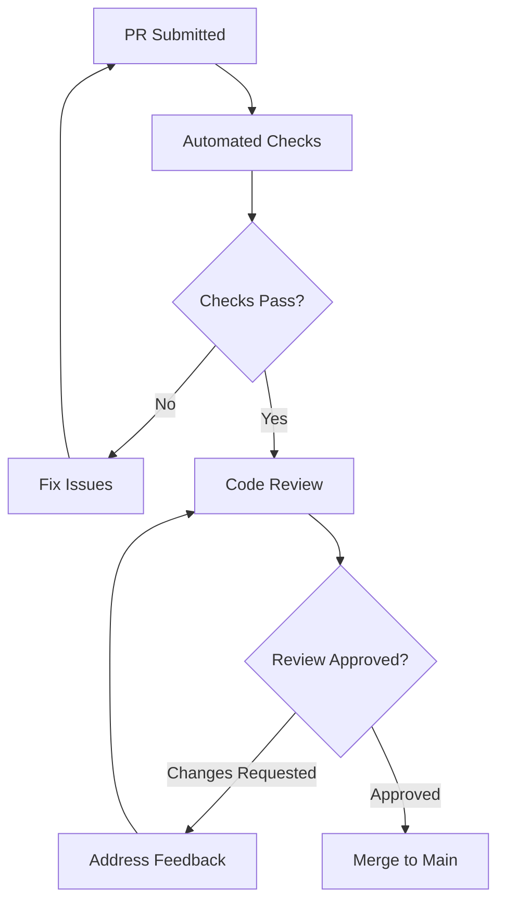

# Contributing Guidelines

Welcome to the OpenFrame CLI project! We're excited to have you contribute. This guide outlines our development practices, code standards, and contribution process to help ensure a smooth collaboration experience.

## Getting Started

### Before You Contribute

1. **Read the documentation** - Familiarize yourself with the project
2. **Set up your environment** - Follow [Environment Setup](../setup/environment.md)
3. **Build and test locally** - Complete [Local Development](../setup/local-development.md)
4. **Understand the architecture** - Review [Architecture Overview](../architecture/overview.md)

### Finding Ways to Contribute

| Contribution Type | Good For | Where to Look |
|-------------------|----------|---------------|
| **Bug Fixes** | First-time contributors | [GitHub Issues](https://github.com/flamingo-stack/openframe-cli/issues?q=is%3Aissue+is%3Aopen+label%3Abug) |
| **Documentation** | Writers, new users | [Documentation Issues](https://github.com/flamingo-stack/openframe-cli/issues?q=is%3Aissue+is%3Aopen+label%3Adocumentation) |
| **Features** | Experienced contributors | [Feature Requests](https://github.com/flamingo-stack/openframe-cli/issues?q=is%3Aissue+is%3Aopen+label%3Aenhancement) |
| **Tests** | Quality-focused developers | Areas with low coverage |

## Code Style and Conventions

### Go Code Standards

We follow standard Go conventions with some project-specific guidelines:

#### Formatting and Style

```bash
# Format all code before committing
go fmt ./...

# Run linting
golangci-lint run

# Check imports organization
goimports -w .
```

#### Naming Conventions

| Element | Convention | Example |
|---------|------------|---------|
| **Packages** | lowercase, single word | `cluster`, `bootstrap` |
| **Types** | PascalCase | `ClusterService`, `BootstrapConfig` |
| **Functions** | PascalCase (exported), camelCase (private) | `CreateCluster()`, `validateConfig()` |
| **Variables** | camelCase | `clusterName`, `configFile` |
| **Constants** | PascalCase or UPPER_CASE | `DefaultTimeout`, `MAX_RETRIES` |

#### Code Organization

```go
package cluster

import (
    // Standard library first
    "context"
    "fmt"
    "time"
    
    // Third-party packages
    "github.com/spf13/cobra"
    "github.com/sirupsen/logrus"
    
    // Internal packages last
    "github.com/flamingo-stack/openframe-cli/internal/cluster/models"
    "github.com/flamingo-stack/openframe-cli/internal/shared/errors"
)

// Constants at package level
const (
    DefaultClusterTimeout = 5 * time.Minute
    MaxRetryAttempts     = 3
)

// Types and interfaces
type ClusterService interface {
    CreateCluster(ctx context.Context, name string, config *ClusterConfig) error
    DeleteCluster(ctx context.Context, name string) error
}

// Implementation
type clusterService struct {
    k3dClient K3dClient
    logger    *logrus.Logger
}

// Constructor function
func NewClusterService(k3dClient K3dClient) ClusterService {
    return &clusterService{
        k3dClient: k3dClient,
        logger:    logrus.New(),
    }
}

// Methods organized by functionality
func (s *clusterService) CreateCluster(ctx context.Context, name string, config *ClusterConfig) error {
    // Implementation
}
```

### Error Handling

Follow consistent error handling patterns:

```go
// Wrap errors with context
func (s *clusterService) CreateCluster(ctx context.Context, name string, config *ClusterConfig) error {
    if err := s.validateConfig(config); err != nil {
        return fmt.Errorf("invalid cluster configuration: %w", err)
    }
    
    if err := s.k3dClient.CreateCluster(name, config); err != nil {
        return fmt.Errorf("failed to create cluster %s: %w", name, err)
    }
    
    return nil
}

// Use sentinel errors for known conditions
var (
    ErrClusterExists    = errors.New("cluster already exists")
    ErrClusterNotFound  = errors.New("cluster not found")
    ErrInvalidConfig    = errors.New("invalid configuration")
)
```

### Documentation Standards

#### Go Documentation

```go
// ClusterService manages the lifecycle of Kubernetes clusters using K3d.
// It provides methods for creating, deleting, and querying cluster status.
type ClusterService interface {
    // CreateCluster creates a new K3d cluster with the specified configuration.
    // It returns an error if the cluster already exists or creation fails.
    CreateCluster(ctx context.Context, name string, config *ClusterConfig) error
    
    // DeleteCluster removes an existing K3d cluster and cleans up resources.
    // It returns ErrClusterNotFound if the cluster doesn't exist.
    DeleteCluster(ctx context.Context, name string) error
}

// ClusterConfig defines the configuration options for creating a K3d cluster.
type ClusterConfig struct {
    // Nodes specifies the number of worker nodes (default: 1)
    Nodes int `yaml:"nodes" validate:"min=1,max=10"`
    
    // Ports defines port mappings in format "host:container" 
    Ports []string `yaml:"ports" validate:"dive,port_mapping"`
    
    // Registry enables the built-in container registry (default: false)
    Registry bool `yaml:"registry"`
}
```

#### Inline Comments

```go
func (s *clusterService) CreateCluster(ctx context.Context, name string, config *ClusterConfig) error {
    // Validate input parameters before proceeding
    if name == "" {
        return fmt.Errorf("cluster name cannot be empty")
    }
    
    // Check if cluster already exists to prevent conflicts
    if exists, err := s.clusterExists(name); err != nil {
        return fmt.Errorf("failed to check cluster existence: %w", err)
    } else if exists {
        return ErrClusterExists
    }
    
    // Generate K3d configuration from our config model
    k3dConfig := s.generateK3dConfig(config)
    
    // Create the cluster with timeout context
    ctx, cancel := context.WithTimeout(ctx, DefaultClusterTimeout)
    defer cancel()
    
    return s.k3dClient.CreateCluster(name, k3dConfig)
}
```

## Testing Requirements

### Test Coverage Standards

| Component | Minimum Coverage | Target Coverage |
|-----------|-----------------|-----------------|
| **Service Layer** | 80% | 90%+ |
| **CLI Commands** | 70% | 85% |
| **Utilities** | 90% | 95%+ |
| **Overall Project** | 75% | 85%+ |

### Required Tests for New Code

```go
// Unit tests (required)
func TestCreateCluster_Success(t *testing.T) {
    // Test happy path
}

func TestCreateCluster_ErrorHandling(t *testing.T) {
    // Test error conditions
}

// Integration tests (for service layer)
func TestCreateCluster_Integration(t *testing.T) {
    if testing.Short() {
        t.Skip("Skipping integration test")
    }
    // Test with real dependencies
}

// Table-driven tests for multiple scenarios
func TestValidateConfig(t *testing.T) {
    tests := []struct {
        name        string
        config      *ClusterConfig
        expectError bool
        errorMsg    string
    }{
        {
            name:        "valid config",
            config:      &ClusterConfig{Nodes: 1},
            expectError: false,
        },
        {
            name:        "invalid nodes",
            config:      &ClusterConfig{Nodes: 0},
            expectError: true,
            errorMsg:    "nodes must be greater than 0",
        },
    }
    
    for _, tt := range tests {
        t.Run(tt.name, func(t *testing.T) {
            err := validateConfig(tt.config)
            if tt.expectError {
                assert.Error(t, err)
                assert.Contains(t, err.Error(), tt.errorMsg)
            } else {
                assert.NoError(t, err)
            }
        })
    }
}
```

### Test Organization

```
pkg/
├── service.go
├── service_test.go           # Unit tests
├── service_integration_test.go  # Integration tests  
└── testdata/                 # Test fixtures
    ├── valid-config.yaml
    └── invalid-config.yaml
```

## Branch Naming and Git Workflow

### Branch Naming Convention

| Branch Type | Pattern | Example |
|-------------|---------|---------|
| **Feature** | `feature/description` | `feature/add-cluster-validation` |
| **Bug Fix** | `fix/description` | `fix/cluster-deletion-timeout` |
| **Documentation** | `docs/description` | `docs/update-api-reference` |
| **Chore** | `chore/description` | `chore/update-dependencies` |
| **Hotfix** | `hotfix/description` | `hotfix/security-vulnerability` |

### Git Workflow



### Git Workflow Steps

```bash
# 1. Fork and clone your fork
git clone https://github.com/YOUR_USERNAME/openframe-cli.git
cd openframe-cli

# 2. Add upstream remote
git remote add upstream https://github.com/flamingo-stack/openframe-cli.git

# 3. Create feature branch
git checkout -b feature/your-feature-name

# 4. Make changes and commit
git add .
git commit -m "feat: add cluster validation"

# 5. Keep branch updated
git fetch upstream
git rebase upstream/main

# 6. Push to your fork
git push origin feature/your-feature-name

# 7. Create pull request on GitHub
```

## Commit Message Format

We follow the [Conventional Commits](https://conventionalcommits.org/) specification:

### Commit Message Structure

```
<type>[optional scope]: <description>

[optional body]

[optional footer(s)]
```

### Commit Types

| Type | Usage | Example |
|------|-------|---------|
| **feat** | New feature | `feat(cluster): add cluster validation` |
| **fix** | Bug fix | `fix(bootstrap): handle ArgoCD timeout` |
| **docs** | Documentation | `docs: update installation guide` |
| **test** | Add/modify tests | `test(cluster): add integration tests` |
| **refactor** | Code refactoring | `refactor(ui): simplify prompt logic` |
| **chore** | Maintenance | `chore: update dependencies` |
| **ci** | CI/CD changes | `ci: add coverage reporting` |

### Commit Message Examples

```bash
# Good commit messages
git commit -m "feat(cluster): add support for custom registries"
git commit -m "fix(bootstrap): resolve ArgoCD installation timeout"
git commit -m "docs(api): update cluster management examples"
git commit -m "test(chart): add integration tests for helm operations"

# With body and footer
git commit -m "feat(cluster): add cluster validation

Add comprehensive validation for cluster configuration including:
- Node count validation (1-10 nodes)
- Port format validation
- Resource limit checks

Closes #123"
```

## Pull Request Process

### PR Checklist

Before submitting a pull request, ensure:

- [ ] **Code follows style guidelines** - Run `make lint` and `make format`
- [ ] **Tests pass** - Run `make test` locally
- [ ] **Tests added** - New functionality includes appropriate tests
- [ ] **Documentation updated** - API changes include doc updates
- [ ] **Commit messages follow convention** - Use conventional commit format
- [ ] **Branch is up to date** - Rebase on latest main branch

### PR Template

```markdown
## Description
Brief description of what this PR does.

## Type of Change
- [ ] Bug fix (non-breaking change)
- [ ] New feature (non-breaking change)  
- [ ] Breaking change (fix or feature that causes existing functionality to change)
- [ ] Documentation update

## Testing
- [ ] Unit tests pass (`make test`)
- [ ] Integration tests pass (`make test-integration`)
- [ ] Manual testing completed

## Screenshots (if applicable)
Add screenshots for UI changes.

## Checklist
- [ ] Code follows style guidelines
- [ ] Self-review completed
- [ ] Comments added for hard-to-understand areas
- [ ] Documentation updated
- [ ] No new warnings introduced
```

### Review Process



## Review Checklist

### For Code Reviewers

#### Code Quality

- [ ] **Code follows project conventions** and style guidelines
- [ ] **Error handling** is appropriate and consistent
- [ ] **Logic is clear** and well-commented where necessary
- [ ] **Performance impact** is considered for changes
- [ ] **Security considerations** are addressed

#### Testing

- [ ] **Tests cover new functionality** and edge cases
- [ ] **Tests are reliable** and not flaky
- [ ] **Test coverage** meets project standards
- [ ] **Integration tests** included for service layer changes

#### Documentation

- [ ] **API documentation** is updated for interface changes
- [ ] **README** and guides are updated for user-facing changes
- [ ] **Code comments** explain complex logic
- [ ] **Examples** are provided for new features

#### Architecture

- [ ] **Changes fit** the existing architecture
- [ ] **Dependencies** are appropriate and minimal
- [ ] **Interfaces** are well-designed and testable
- [ ] **Breaking changes** are documented and justified

### For Contributors

#### Before Review

```bash
# Run all checks locally
make lint
make test
make test-integration

# Check test coverage
go test -coverprofile=coverage.out ./...
go tool cover -func=coverage.out

# Verify build works
make build
./bin/openframe --version
```

#### Addressing Feedback

```bash
# Make requested changes
# Commit with descriptive messages
git add .
git commit -m "fix: address review feedback for error handling"

# Push updates
git push origin feature/your-feature-name

# PR will automatically update
```

## Documentation Requirements

### Code Documentation

```go
// Package cluster provides Kubernetes cluster lifecycle management.
//
// This package wraps K3d functionality to provide a consistent interface
// for creating, managing, and deleting local Kubernetes clusters.
package cluster

// ClusterService defines the interface for cluster operations.
type ClusterService interface {
    // CreateCluster creates a new K3d cluster with the specified configuration.
    // It validates the configuration and returns an error if creation fails.
    CreateCluster(ctx context.Context, name string, config *ClusterConfig) error
}
```

### API Documentation

Update API documentation for:
- New CLI commands and flags
- Configuration options
- Error messages and codes
- Usage examples

### User Documentation

Update user-facing documentation for:
- New features and workflows
- Breaking changes and migration guides
- Installation and setup procedures
- Troubleshooting guides

## Community Guidelines

### Code of Conduct

We are committed to providing a welcoming and inclusive environment. All contributors must adhere to our Code of Conduct:

- **Be respectful** and inclusive in all interactions
- **Be collaborative** and help others learn and contribute  
- **Be constructive** in feedback and discussions
- **Be mindful** of diverse perspectives and experiences

### Communication

| Channel | Purpose | Response Time |
|---------|---------|---------------|
| **GitHub Issues** | Bug reports, feature requests | 1-3 business days |
| **GitHub Discussions** | Questions, ideas, support | 1-2 business days |
| **Pull Requests** | Code review and discussion | 1-2 business days |

### Recognition

We recognize contributors through:
- **Contributor list** in README
- **Release notes** acknowledgments  
- **Annual contributor recognition**

## Getting Help

### Development Questions

1. **Check existing documentation** - Most questions are covered
2. **Search GitHub Issues** - Someone may have asked already
3. **Open a GitHub Discussion** - Ask the community
4. **Join community channels** - Real-time help and discussion

### Mentorship

New contributors can get help through:
- **Good first issue** labels for beginners
- **Mentorship program** for ongoing guidance
- **Code review feedback** for learning best practices

---

Thank you for contributing to OpenFrame CLI! Your efforts help make Kubernetes development more accessible and enjoyable for developers worldwide. 🚀

**Questions?** Don't hesitate to ask in GitHub Discussions or open an issue. We're here to help!