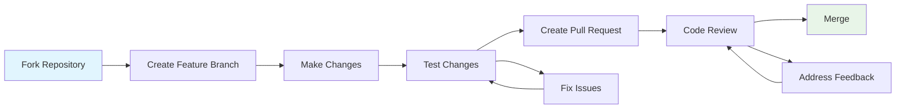

# Contributing Guidelines

Welcome to the OpenFrame CLI project! We appreciate your interest in contributing. This guide provides everything you need to know about contributing code, documentation, and improvements to the project.

## Getting Started

### Before You Begin

1. **Read the Code of Conduct**: Ensure you understand our community standards
2. **Check Existing Issues**: Look for existing issues or discussions about your idea
3. **Understand the Architecture**: Review the [Architecture Overview](../architecture/overview.md)
4. **Set Up Development Environment**: Follow the [Environment Setup](../setup/environment.md) guide

### Contribution Types

| Type | Description | Getting Started |
|------|-------------|-----------------|
| **Bug Fixes** | Fix reported issues or bugs | Check GitHub issues with `bug` label |
| **Features** | Add new functionality | Check issues with `enhancement` label |
| **Documentation** | Improve docs, add examples | Check issues with `documentation` label |
| **Testing** | Add test coverage, fix test issues | Review [Testing Overview](../testing/overview.md) |
| **Performance** | Optimize code, reduce resource usage | Look for `performance` labeled issues |
| **Refactoring** | Code cleanup, architectural improvements | Discuss in issues first |

## Development Workflow

### 1. Issue Tracking and Planning

#### Finding Work
```bash
# Good first issues for newcomers
https://github.com/flamingo-stack/openframe-cli/issues?q=is:issue+is:open+label:"good first issue"

# Help wanted issues
https://github.com/flamingo-stack/openframe-cli/issues?q=is:issue+is:open+label:"help wanted"

# Bug reports
https://github.com/flamingo-stack/openframe-cli/issues?q=is:issue+is:open+label:bug
```

#### Creating Issues
Use our issue templates for:
- 🐛 **Bug Report**: Reproducible issues with the CLI
- ✨ **Feature Request**: New functionality proposals
- 📚 **Documentation**: Documentation improvements
- 🔧 **Task**: Development tasks and improvements

### 2. Fork and Branch Strategy



#### Repository Setup
```bash
# Fork the repository on GitHub, then clone your fork
git clone https://github.com/YOUR_USERNAME/openframe-cli.git
cd openframe-cli

# Add upstream remote
git remote add upstream https://github.com/flamingo-stack/openframe-cli.git

# Verify remotes
git remote -v
```

#### Branch Naming Convention
```bash
# Feature branches
git checkout -b feature/cluster-resource-management
git checkout -b feature/argocd-app-sets

# Bug fix branches
git checkout -b fix/cluster-deletion-timeout
git checkout -b fix/helm-installation-error

# Documentation branches
git checkout -b docs/contributing-guide-update
git checkout -b docs/architecture-diagrams

# Task/improvement branches
git checkout -b task/refactor-provider-interfaces
git checkout -b task/improve-error-messages
```

### 3. Development Process

#### Development Standards
```bash
# Before starting development
git checkout main
git pull upstream main
git checkout -b feature/your-feature-name

# During development - run these frequently
make fmt      # Format code
make lint     # Check code quality  
make test     # Run tests
make build    # Verify build works

# Before committing
make check    # Run all quality checks
```

#### Code Quality Checklist

##### Before Each Commit
- [ ] Code is formatted with `gofumpt`
- [ ] No linting errors with `golangci-lint`
- [ ] All tests pass locally
- [ ] New code has appropriate test coverage
- [ ] Documentation is updated if needed

##### Before Pull Request
- [ ] All quality checks pass (`make check`)
- [ ] Integration tests pass (if applicable)
- [ ] Commit messages follow conventions
- [ ] PR description is complete
- [ ] Breaking changes are documented

## Code Style and Conventions

### Go Code Style

#### Package Organization
```go
// Package declaration with meaningful name
package cluster

// Import grouping: stdlib, external, internal
import (
    "context"
    "fmt"
    "time"

    "github.com/spf13/cobra"
    "github.com/stretchr/testify/assert"

    "github.com/flamingo-stack/openframe-cli/internal/shared/ui"
)
```

#### Function and Variable Naming
```go
// Functions: Use verb-noun pattern
func CreateCluster(config *ClusterConfig) (*Cluster, error)
func DeleteClusterByName(name string) error
func ValidateClusterConfig(config *ClusterConfig) error

// Variables: Descriptive and context-appropriate
var defaultClusterTimeout = 300 * time.Second
var kubernetesClient kubernetes.Interface

// Constants: Use grouped declarations
const (
    DefaultClusterMemory = "2Gi"
    DefaultClusterCPU    = "2"
    MaxClusterNameLength = 63
)
```

#### Error Handling
```go
// Custom error types for domain-specific errors
type ClusterNotFoundError struct {
    ClusterName string
}

func (e *ClusterNotFoundError) Error() string {
    return fmt.Sprintf("cluster '%s' not found", e.ClusterName)
}

// Error wrapping with context
func (s *Service) CreateCluster(config *ClusterConfig) (*Cluster, error) {
    if err := s.validateConfig(config); err != nil {
        return nil, fmt.Errorf("invalid cluster configuration: %w", err)
    }
    
    cluster, err := s.provider.CreateCluster(config)
    if err != nil {
        return nil, fmt.Errorf("failed to create cluster '%s': %w", config.Name, err)
    }
    
    return cluster, nil
}
```

#### Interface Design
```go
// Interfaces should be small and focused
type ClusterProvider interface {
    CreateCluster(config *ClusterConfig) (*Cluster, error)
    DeleteCluster(name string) error
    GetCluster(name string) (*Cluster, error)
    ListClusters() ([]*Cluster, error)
}

// Use interface composition for complex behaviors
type ClusterManager interface {
    ClusterProvider
    ClusterHealthChecker
}

type ClusterHealthChecker interface {
    CheckHealth(name string) (*HealthStatus, error)
}
```

### CLI Command Structure

#### Command Definition Pattern
```go
func GetClusterCreateCmd() *cobra.Command {
    var config ClusterConfig
    
    cmd := &cobra.Command{
        Use:   "create [cluster-name]",
        Short: "Create a new K3D cluster",
        Long: `Create a new K3D cluster with the specified configuration.
        
The cluster name must be unique and follow Kubernetes naming conventions.
Memory and CPU resources can be customized using flags.

Examples:
  # Create cluster with default settings
  openframe cluster create my-cluster
  
  # Create cluster with custom resources
  openframe cluster create my-cluster --memory=4Gi --cpus=4`,
        Args: cobra.MaximumNArgs(1),
        PreRunE: func(cmd *cobra.Command, args []string) error {
            return validateCreateArgs(args, &config)
        },
        RunE: func(cmd *cobra.Command, args []string) error {
            return executeCreate(cmd.Context(), &config)
        },
    }
    
    // Add flags with appropriate defaults and help text
    cmd.Flags().StringVar(&config.Memory, "memory", "2Gi", "Memory allocation for cluster")
    cmd.Flags().IntVar(&config.CPUs, "cpus", 2, "CPU allocation for cluster")
    cmd.Flags().StringSliceVar(&config.Ports, "ports", nil, "Ports to expose (format: local:cluster)")
    
    return cmd
}
```

#### Interactive UI Guidelines
```go
// Use pterm for consistent UI experience
func promptForClusterConfig() (*ClusterConfig, error) {
    config := &ClusterConfig{}
    
    // Use consistent prompt style
    name, err := pterm.DefaultInteractiveTextInput.
        WithDefaultText("my-cluster").
        Show("Cluster name")
    if err != nil {
        return nil, err
    }
    config.Name = name
    
    // Provide sensible options for selection
    memoryOptions := []string{"1Gi", "2Gi", "4Gi", "8Gi"}
    selectedMemory, err := pterm.DefaultInteractiveSelect.
        WithOptions(memoryOptions).
        WithDefaultOption("2Gi").
        Show("Memory allocation")
    if err != nil {
        return nil, err
    }
    config.Memory = selectedMemory
    
    return config, nil
}
```

### Testing Conventions

#### Test File Organization
```go
// File: internal/cluster/service_test.go
package cluster_test // Use _test package to avoid circular imports

import (
    "testing"
    
    "github.com/stretchr/testify/assert"
    "github.com/stretchr/testify/require"
    
    "github.com/flamingo-stack/openframe-cli/internal/cluster"
    "github.com/flamingo-stack/openframe-cli/tests/mocks"
)

func TestClusterService_CreateCluster(t *testing.T) {
    // Use table-driven tests for multiple scenarios
    tests := []struct {
        name        string
        setup       func(*mocks.ClusterProvider)
        config      *cluster.Config
        expectError bool
        expectName  string
    }{
        {
            name: "successful creation",
            setup: func(m *mocks.ClusterProvider) {
                m.On("CreateCluster", mock.Anything).Return(&cluster.Cluster{
                    Name: "test-cluster",
                }, nil)
            },
            config: &cluster.Config{Name: "test-cluster"},
            expectError: false,
            expectName: "test-cluster",
        },
    }
    
    for _, tt := range tests {
        t.Run(tt.name, func(t *testing.T) {
            // Arrange
            mockProvider := &mocks.ClusterProvider{}
            tt.setup(mockProvider)
            
            service := cluster.NewService(mockProvider, nil, nil)
            
            // Act
            result, err := service.CreateCluster(tt.config)
            
            // Assert
            if tt.expectError {
                assert.Error(t, err)
                assert.Nil(t, result)
            } else {
                require.NoError(t, err)
                assert.Equal(t, tt.expectName, result.Name)
            }
            
            mockProvider.AssertExpectations(t)
        })
    }
}
```

## Commit Message Convention

### Conventional Commits Format
```text
<type>[optional scope]: <description>

[optional body]

[optional footer(s)]
```

#### Commit Types
| Type | Description | Example |
|------|-------------|---------|
| `feat` | New feature | `feat(cluster): add memory allocation configuration` |
| `fix` | Bug fix | `fix(cluster): resolve deletion timeout issue` |
| `docs` | Documentation | `docs(contributing): add commit message guidelines` |
| `test` | Test changes | `test(cluster): add integration test for cluster lifecycle` |
| `refactor` | Code refactoring | `refactor(provider): simplify K3D provider interface` |
| `perf` | Performance improvement | `perf(cluster): optimize cluster status checks` |
| `chore` | Build/maintenance | `chore(deps): update cobra to v1.7.0` |

#### Examples
```bash
# Feature addition
git commit -m "feat(dev): add telepresence traffic interception"

# Bug fix with breaking change
git commit -m "fix(chart)!: change default ArgoCD namespace to argocd

BREAKING CHANGE: The default namespace for ArgoCD installation 
changed from 'argo' to 'argocd' to align with upstream defaults."

# Documentation improvement
git commit -m "docs(api): add examples for cluster configuration options"
```

## Pull Request Process

### PR Template and Requirements

#### PR Description Template
```markdown
## Description
Brief description of the changes and why they were made.

## Type of Change
- [ ] Bug fix (non-breaking change which fixes an issue)
- [ ] New feature (non-breaking change which adds functionality)
- [ ] Breaking change (fix or feature that would cause existing functionality to not work as expected)
- [ ] Documentation update

## Testing
- [ ] Unit tests pass locally
- [ ] Integration tests pass (if applicable)
- [ ] Manual testing completed

## Checklist
- [ ] Code follows project style guidelines
- [ ] Self-review completed
- [ ] Documentation updated (if needed)
- [ ] Tests added/updated
- [ ] Breaking changes documented
```

#### Required Checks
All PRs must pass:
- [ ] **Build**: Code compiles successfully
- [ ] **Tests**: All tests pass (unit + integration)
- [ ] **Lint**: No linting errors
- [ ] **Format**: Code is properly formatted
- [ ] **Security**: No security vulnerabilities detected

### Review Process

#### Code Review Checklist

##### For Authors
- [ ] PR description clearly explains the change
- [ ] Code is self-documenting or has appropriate comments
- [ ] Tests cover the new functionality
- [ ] Documentation is updated if needed
- [ ] Breaking changes are clearly marked
- [ ] Performance implications are considered

##### For Reviewers
- [ ] Code follows project conventions
- [ ] Logic is sound and efficient
- [ ] Error handling is appropriate
- [ ] Tests are comprehensive
- [ ] Security implications are considered
- [ ] Performance impact is acceptable

#### Review Guidelines

**For Authors:**
- Keep PRs focused and reasonably sized
- Respond to feedback promptly and constructively
- Be open to suggestions and improvements
- Update tests and documentation as needed

**For Reviewers:**
- Be constructive and specific in feedback
- Ask questions to understand the approach
- Suggest improvements rather than just pointing out issues
- Consider the overall architecture and design

### Merge Requirements

| Requirement | Details |
|-------------|---------|
| **Approvals** | At least 1 approval from maintainer |
| **Checks** | All CI checks must pass |
| **Conflicts** | No merge conflicts with main branch |
| **Documentation** | Updated if functionality changes |
| **Tests** | New code must have test coverage |

## Documentation Standards

### Documentation Types

| Type | Location | Purpose |
|------|----------|---------|
| **API Documentation** | Code comments | Document public interfaces |
| **User Guides** | `docs/getting-started/` | Help users accomplish tasks |
| **Developer Docs** | `docs/development/` | Guide contributors |
| **Reference Docs** | `docs/reference/` | Comprehensive API reference |

### Writing Guidelines

#### Style and Tone
- **Clear and Concise**: Use simple, direct language
- **User-Focused**: Write from the user's perspective
- **Example-Rich**: Include practical examples
- **Scannable**: Use headers, lists, and tables effectively

#### Documentation Review
- [ ] Content is accurate and up-to-date
- [ ] Examples work as written
- [ ] Links are functional
- [ ] Formatting follows project standards
- [ ] Screenshots are current (if applicable)

## Getting Help

### Community Support

| Need | Resource |
|------|----------|
| **General Questions** | GitHub Discussions |
| **Bug Reports** | GitHub Issues |
| **Feature Requests** | GitHub Issues |
| **Development Help** | Development Slack channel |
| **Documentation Issues** | GitHub Issues with `documentation` label |

### Maintainer Contact

For sensitive issues or architectural discussions:
- **Security Issues**: security@openframe.dev
- **Architectural Discussions**: Create an issue with `architecture` label
- **Contribution Questions**: Comment on relevant issues

## Recognition

We value all contributions to OpenFrame CLI! Contributors are recognized through:

- **Contributors List**: All contributors are listed in the project README
- **Release Notes**: Significant contributions are highlighted in release notes
- **Community Recognition**: Outstanding contributions are recognized in project communications

### Contribution Levels

| Level | Criteria | Recognition |
|-------|----------|-------------|
| **Contributor** | Any merged contribution | Listed in contributors |
| **Regular Contributor** | Multiple meaningful contributions | Special recognition in releases |
| **Maintainer** | Sustained contributions, community involvement | Commit access, decision-making role |

---

## Quick Reference

### Essential Commands
```bash
# Development workflow
git checkout -b feature/my-feature
make check          # Run all quality checks
git commit -m "feat(scope): description"
git push origin feature/my-feature

# Testing
make test           # Run unit tests
make test-coverage  # Run with coverage
make test-integration  # Run integration tests

# Code quality
make fmt           # Format code
make lint          # Check linting
make build         # Verify build
```

### Useful Links
- **[Issue Templates](https://github.com/flamingo-stack/openframe-cli/issues/new/choose)**
- **[Development Setup](../setup/environment.md)**
- **[Architecture Guide](../architecture/overview.md)**
- **[Testing Guide](../testing/overview.md)**

Thank you for contributing to OpenFrame CLI! 🚀 Your contributions help make Kubernetes development more accessible and enjoyable for everyone.