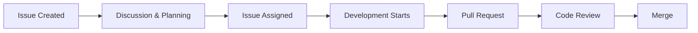
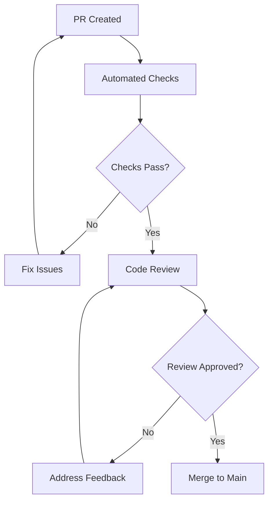

# Contributing Guidelines

Welcome to OpenFrame CLI! We're excited to have you contribute to making Kubernetes and OpenFrame environments more accessible and efficient. This guide outlines our development process, coding standards, and expectations for contributors.

## 🎯 Getting Started

### Before You Begin

1. **Read the Documentation**
   - [Architecture Overview](../architecture/overview.md) - Understand the system design
   - [Development Setup](../setup/environment.md) - Configure your environment
   - [Local Development](../setup/local-development.md) - Get the project running

2. **Set Up Your Environment**
   ```bash
   # Fork and clone the repository
   git clone https://github.com/YOUR-USERNAME/openframe-cli.git
   cd openframe-cli
   
   # Add upstream remote
   git remote add upstream https://github.com/flamingo-stack/openframe-cli.git
   
   # Install dependencies
   go mod download
   ```

3. **Verify Your Setup**
   ```bash
   # Build the project
   go build -o bin/openframe ./cmd/openframe
   
   # Run tests
   go test ./...
   
   # Run linter
   golangci-lint run
   ```

## 🔄 Development Process

### 1. Issue-Driven Development

All contributions should start with an issue:



**Types of Issues:**
- 🐛 **Bug Report**: Something isn't working correctly
- ✨ **Feature Request**: New functionality or enhancement
- 📚 **Documentation**: Improvements to docs
- 🧹 **Refactoring**: Code improvements without behavior changes
- 🔧 **Maintenance**: Dependencies, CI/CD, tooling

### 2. Branch Naming Convention

Create descriptive branch names that indicate the type and scope:

```bash
# Bug fixes
git checkout -b fix/cluster-creation-timeout
git checkout -b fix/argocd-installation-fails

# Features
git checkout -b feature/add-cluster-monitoring
git checkout -b feature/support-helm-charts-v2

# Documentation
git checkout -b docs/update-contributing-guide
git checkout -b docs/add-troubleshooting-section

# Refactoring
git checkout -b refactor/extract-cluster-service
git checkout -b refactor/improve-error-handling
```

### 3. Commit Message Format

We follow [Conventional Commits](https://www.conventionalcommits.org/) specification:

```bash
<type>[optional scope]: <description>

[optional body]

[optional footer(s)]
```

**Examples:**
```bash
feat(cluster): add support for custom K8s versions

- Added version validation in cluster configuration
- Updated K3d provider to support version selection
- Added tests for version compatibility

Closes #123

fix(bootstrap): resolve ArgoCD installation timeout

The ArgoCD Helm chart installation was timing out on slower systems.
Increased timeout from 5m to 10m and added progress indicators.

Fixes #456

docs(setup): update environment setup for macOS

- Added Homebrew installation instructions
- Fixed kubectl installation steps
- Added troubleshooting section for common issues

refactor(ui): extract common prompt functions

- Created shared prompt utilities in internal/shared/ui
- Reduced code duplication across commands
- Improved consistent error handling
```

**Commit Types:**
- `feat`: New feature
- `fix`: Bug fix
- `docs`: Documentation changes
- `style`: Code style changes (formatting, etc.)
- `refactor`: Code refactoring
- `test`: Adding or updating tests
- `chore`: Maintenance tasks
- `ci`: CI/CD changes

## 🎨 Code Style and Conventions

### Go Style Guidelines

We follow standard Go conventions with some project-specific additions:

#### 1. **Code Formatting**
```bash
# Use goimports for formatting and import management
goimports -w .

# Use gofmt for basic formatting
gofmt -w .
```

#### 2. **Naming Conventions**

```go
// Package names: lowercase, single word
package cluster

// Functions: camelCase starting with uppercase for exported
func CreateCluster(config ClusterConfig) error {}
func validateClusterName(name string) error {}

// Variables: camelCase
var clusterConfig ClusterConfig
var defaultTimeout = 5 * time.Minute

// Constants: camelCase with descriptive names
const (
    DefaultK8sVersion = "1.27.1"
    MaxClusterNodes   = 10
)

// Interfaces: noun or adjective ending in -er
type ClusterProvider interface {}
type ConfigValidator interface {}

// Structs: noun, PascalCase
type ClusterConfig struct {}
type DeploymentMode struct {}
```

#### 3. **Function Organization**

```go
// Order functions logically:
// 1. Constructor functions (New*)
// 2. Public methods (alphabetical)
// 3. Private methods (alphabetical)
// 4. Helper functions

func NewClusterService(provider K3dProvider) *ClusterService {
    return &ClusterService{provider: provider}
}

func (s *ClusterService) CreateCluster(config ClusterConfig) error {}
func (s *ClusterService) DeleteCluster(name string) error {}
func (s *ClusterService) ListClusters() ([]ClusterInfo, error) {}

func (s *ClusterService) validateConfig(config ClusterConfig) error {}
func (s *ClusterService) setupClusterNetwork(name string) error {}

func generateClusterName(prefix string) string {}
```

#### 4. **Error Handling**

```go
// Wrap errors with context
import "github.com/pkg/errors"

func (s *ClusterService) CreateCluster(config ClusterConfig) error {
    if err := s.validateConfig(config); err != nil {
        return errors.Wrap(err, "invalid cluster configuration")
    }
    
    if err := s.provider.CreateCluster(config.Name, config); err != nil {
        return errors.Wrapf(err, "failed to create cluster %s", config.Name)
    }
    
    return nil
}

// Use custom error types for specific cases
type ClusterNotFoundError struct {
    Name string
}

func (e ClusterNotFoundError) Error() string {
    return fmt.Sprintf("cluster %s not found", e.Name)
}
```

#### 5. **Interface Design**

```go
// Keep interfaces small and focused
type ClusterCreator interface {
    CreateCluster(config ClusterConfig) error
}

type ClusterDeleter interface {
    DeleteCluster(name string) error
}

// Compose interfaces when needed
type ClusterManager interface {
    ClusterCreator
    ClusterDeleter
    ListClusters() ([]ClusterInfo, error)
}
```

### Command Structure

Follow consistent patterns for CLI commands:

```go
func GetCommandName() *cobra.Command {
    cmd := &cobra.Command{
        Use:   "command-name [args]",
        Short: "Brief description (< 50 chars)",
        Long: `Detailed description with examples.
        
This command does X by doing Y. It supports the following options:
- Option A: Description
- Option B: Description

Examples:
  openframe command-name arg1 arg2
  openframe command-name --flag=value arg1
  openframe command-name --help`,
        Args:              cobra.ExactArgs(1),  // or cobra.MaximumNArgs(2), etc.
        ValidArgsFunction: validArgsFunc,       // For shell completion
        RunE: func(cmd *cobra.Command, args []string) error {
            return serviceName.NewService().Execute(cmd, args)
        },
    }
    
    // Add flags with validation
    cmd.Flags().StringP("flag-name", "f", "default", "Description")
    cmd.Flags().BoolP("verbose", "v", false, "Enable verbose output")
    
    // Mark required flags
    cmd.MarkFlagRequired("flag-name")
    
    return cmd
}
```

### Testing Patterns

Follow our testing conventions:

```go
func TestServiceName_MethodName(t *testing.T) {
    tests := []struct {
        name    string
        input   InputType
        setup   func(*mocks.MockDependency)
        want    ExpectedType
        wantErr bool
    }{
        {
            name:  "successful operation",
            input: validInput,
            setup: func(m *mocks.MockDependency) {
                m.On("Method", mock.Anything).Return(nil)
            },
            want:    expectedOutput,
            wantErr: false,
        },
        {
            name:  "operation fails",
            input: invalidInput,
            setup: func(m *mocks.MockDependency) {
                m.On("Method", mock.Anything).Return(errors.New("operation failed"))
            },
            wantErr: true,
        },
    }

    for _, tt := range tests {
        t.Run(tt.name, func(t *testing.T) {
            // Arrange
            mockDep := &mocks.MockDependency{}
            if tt.setup != nil {
                tt.setup(mockDep)
            }
            
            service := &ServiceName{dependency: mockDep}
            
            // Act
            got, err := service.Method(tt.input)
            
            // Assert
            if tt.wantErr {
                assert.Error(t, err)
            } else {
                assert.NoError(t, err)
                assert.Equal(t, tt.want, got)
            }
            
            mockDep.AssertExpectations(t)
        })
    }
}
```

## 📋 Pull Request Process

### 1. **Pre-Pull Request Checklist**

Before creating a pull request, ensure:

- [ ] Code follows style guidelines
- [ ] All tests pass (`go test ./...`)
- [ ] Linting passes (`golangci-lint run`)
- [ ] Code is properly formatted (`goimports -w .`)
- [ ] Documentation is updated if needed
- [ ] Commit messages follow conventional format
- [ ] Branch is up to date with main

```bash
# Pre-PR validation script
#!/bin/bash
echo "🔍 Running pre-PR checks..."

echo "📝 Formatting code..."
goimports -w .

echo "🔍 Running linter..."
golangci-lint run || exit 1

echo "🧪 Running tests..."
go test ./... || exit 1

echo "🔨 Building..."
go build -o bin/openframe ./cmd/openframe || exit 1

echo "✅ All checks passed!"
```

### 2. **Pull Request Template**

Use this template for your PRs:

```markdown
## Description

Brief description of what this PR does and why.

Fixes #(issue number)

## Type of Change

- [ ] Bug fix (non-breaking change which fixes an issue)
- [ ] New feature (non-breaking change which adds functionality)
- [ ] Breaking change (fix or feature that would cause existing functionality to not work as expected)
- [ ] Documentation update
- [ ] Refactoring (no functional changes)

## Testing

- [ ] Unit tests pass
- [ ] Integration tests pass (if applicable)
- [ ] Manual testing completed
- [ ] New tests added (if applicable)

## Manual Testing Steps

1. Step one
2. Step two
3. Expected result

## Screenshots/Examples (if applicable)

```

### 3. **Code Review Process**



**Review Criteria:**
- Code quality and readability
- Test coverage and quality
- Documentation completeness
- Performance considerations
- Security implications
- Breaking change assessment

## 🔍 Code Review Checklist

### For Authors

**Before Requesting Review:**
- [ ] Self-review your code
- [ ] Run all tests locally
- [ ] Check diff for unintended changes
- [ ] Verify commit messages
- [ ] Update documentation
- [ ] Add/update tests as needed

**Responding to Feedback:**
- [ ] Address all reviewer comments
- [ ] Ask questions if feedback is unclear
- [ ] Test changes after modifications
- [ ] Push updates in additional commits (don't force-push)

### For Reviewers

**Code Quality:**
- [ ] Code follows project conventions
- [ ] Functions are reasonably sized and focused
- [ ] Variable/function names are clear
- [ ] Comments explain "why" not "what"
- [ ] No obvious bugs or logical errors

**Testing:**
- [ ] Appropriate test coverage
- [ ] Tests are clear and maintainable
- [ ] Edge cases are covered
- [ ] No flaky or unreliable tests

**Architecture:**
- [ ] Changes fit the overall architecture
- [ ] No unnecessary coupling introduced
- [ ] Interfaces are used appropriately
- [ ] Error handling is consistent

**Documentation:**
- [ ] Public APIs are documented
- [ ] README updated if needed
- [ ] Examples are accurate
- [ ] Breaking changes are noted

## 🏗️ Development Standards

### Code Quality Metrics

| Metric | Target | Tool |
|--------|--------|------|
| **Test Coverage** | ≥85% | `go test -cover` |
| **Cyclomatic Complexity** | ≤10 | `gocyclo` |
| **Duplication** | Minimal | Manual review |
| **Linting Issues** | 0 | `golangci-lint` |
| **Security Issues** | 0 | `gosec` |

### Performance Guidelines

- **Command Execution**: Commands should complete in <30 seconds for normal operations
- **Memory Usage**: Avoid memory leaks; use profiling for resource-intensive operations
- **External Dependencies**: Cache results where appropriate; implement timeouts
- **Goroutine Management**: Always clean up goroutines; avoid goroutine leaks

### Security Guidelines

- **Input Validation**: Validate all user inputs
- **Secrets Management**: Never log sensitive information
- **File Permissions**: Use appropriate file permissions
- **Dependencies**: Keep dependencies up to date

## 🚀 Release Process

### Version Management

We use [Semantic Versioning](https://semver.org/):

- **MAJOR** (X.y.z): Breaking changes
- **MINOR** (x.Y.z): New features (backward compatible)
- **PATCH** (x.y.Z): Bug fixes (backward compatible)

### Release Branches

```bash
# Create release branch
git checkout -b release/v1.2.0

# Update version in files
# Update CHANGELOG.md
# Create release PR

# After merge, tag release
git tag v1.2.0
git push origin v1.2.0
```

## 💡 Best Practices

### DO ✅

- **Start small**: Make focused, incremental changes
- **Write tests first**: Follow TDD when possible
- **Document as you go**: Update docs with code changes
- **Ask questions**: Clarify requirements before implementing
- **Be responsive**: Address review feedback promptly
- **Keep learning**: Stay updated with Go and Kubernetes best practices

### DON'T ❌

- **Make large, unfocused PRs**: Keep changes atomic
- **Skip tests**: All code should have appropriate test coverage
- **Ignore linter warnings**: Fix all linting issues
- **Force-push after review**: Preserve review history
- **Break backward compatibility**: Without proper versioning
- **Add unnecessary dependencies**: Evaluate the cost/benefit

## 🤝 Community Guidelines

### Communication

- **Be respectful**: Treat all contributors with kindness and respect
- **Be constructive**: Provide helpful, actionable feedback
- **Be patient**: Remember that contributors have different experience levels
- **Be inclusive**: Welcome diverse perspectives and approaches

### Getting Help

- **GitHub Issues**: For bugs and feature requests
- **GitHub Discussions**: For questions and general discussion
- **Code Comments**: For clarification during review
- **Documentation**: Check existing docs first

## 📚 Resources

### Development Tools

- **[golangci-lint](https://github.com/golangci/golangci-lint)** - Comprehensive Go linter
- **[testify](https://github.com/stretchr/testify)** - Testing framework
- **[Air](https://github.com/cosmtrek/air)** - Live reloading for development
- **[Delve](https://github.com/go-delve/delve)** - Go debugger

### Learning Resources

- **[Effective Go](https://golang.org/doc/effective_go.html)** - Go programming guidelines
- **[Go Code Review Comments](https://github.com/golang/go/wiki/CodeReviewComments)** - Common code review feedback
- **[Cobra Documentation](https://github.com/spf13/cobra)** - CLI framework documentation
- **[Kubernetes API Documentation](https://kubernetes.io/docs/reference/)** - K8s API reference

## 🎉 Recognition

We appreciate all contributions! Contributors will be:

- **Listed in CONTRIBUTORS.md**
- **Mentioned in release notes** for significant contributions
- **Invited as collaborators** for ongoing contributors
- **Featured in community updates** for major features

---

**Thank you for contributing to OpenFrame CLI!** Your efforts help make Kubernetes and OpenFrame more accessible to developers worldwide.

For questions about these guidelines or the contribution process, please open an issue or discussion on GitHub.