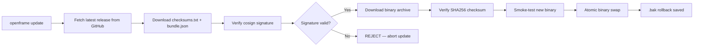

# Security Guidelines

This document describes the security patterns, practices, and mitigations built into the OpenFrame CLI, along with guidelines for contributors to maintain these standards.

---

## Authentication and Authorization

### Kubernetes Authentication

The CLI authenticates to Kubernetes clusters using standard kubeconfig files. The `internal/k8s` package handles context loading and `rest.Config` construction:

```go
// Contexts are loaded from the standard kubeconfig path (~/.kube/config)
// or from the KUBECONFIG environment variable.
// rest.Config is constructed per-operation, not stored globally.
```

**Guidelines:**
- Never hardcode kubeconfig paths — always resolve via `clientcmd.BuildConfigFromFlags`
- Use the `Accessor` type for cluster health checks rather than raw API calls
- Always pass `rest.Config` through function arguments, not global variables

### GitHub API Authentication

The self-update and download subsystems authenticate with GitHub using tokens:

| Variable | Priority | Description |
|---|---|---|
| `OPENFRAME_GITHUB_TOKEN` | High | OpenFrame-specific token (takes precedence) |
| `GITHUB_TOKEN` | Standard | Standard GitHub Actions token |

**Guidelines:**
- Never log tokens, even at debug level — they are registered with `redact.RegisterSecret()` at startup
- Always pass tokens through environment variables, never as command-line arguments (visible in `ps` output)

### ArgoCD Authentication

ArgoCD is managed via the native Kubernetes dynamic client (client-go) rather than the ArgoCD HTTP API. This means:
- No ArgoCD API tokens are ever stored or transmitted
- All operations go through Kubernetes RBAC via the kubeconfig credentials
- The CLI never calls ArgoCD's REST API directly

---

## Secret Redaction

All potentially sensitive values must be registered with the `redact` package before any logging or command execution:

```go
import "github.com/flamingo-stack/openframe-cli/internal/shared/redact"

// Register a secret for automatic scrubbing
redact.RegisterSecret(githubToken)
redact.RegisterSecret(registryPassword)

// All log output and command strings are automatically scrubbed
// redact.Redact("helm upgrade --set auth.token=mysecret")
// → "helm upgrade --set auth.token=***"
```

**Key behaviors:**
- Longer secrets are replaced before shorter ones to prevent partial unmasking
- URL-embedded credentials (`user:pass@host`) are scrubbed unconditionally without explicit registration
- The redaction is thread-safe via `sync.RWMutex`
- In tests, call `redact.ClearSecrets()` in teardown to prevent cross-test contamination

**Contribution rule:** Any value read from environment variables, configuration files, or user prompts that could be a credential **must** be passed through `redact.RegisterSecret()` before being used in any executor call or log statement.

---

## Input Validation and Sanitization

### Cluster Name Validation

Cluster names are validated against RFC1123 rules at the command boundary before reaching any shell-out:

```go
// Validation is enforced in cmd/bootstrap/bootstrap.go and cmd/cluster/create.go
// before any subprocess execution — prevents injection via cluster names
if err := clustermodels.ValidateClusterName(name); err != nil {
    return err
}
```

This ensures that a cluster name like `; rm -rf /` cannot reach the k3d subprocess.

### Helm Values Validation

The `openframe-helm-values.yaml` file is validated via a "preflight" check **before** cluster creation — the cheapest gate in the pipeline:

```go
// internal/chart/services/preflight.go
if err := services.ValidateHelmValuesFile(); err != nil {
    // Fails fast before any expensive cluster operations
    return err
}
```

**Guidelines:**
- All user-supplied YAML/flag values must be validated before being passed to external processes
- Use structured types with validation tags rather than raw string interpolation into shell commands
- Never construct shell commands via string concatenation — use argv arrays via the `CommandExecutor` interface

### Command Injection Prevention

The `CommandExecutor` interface uses `os/exec` with argv arrays (not shell invocation):

```go
// SAFE: argv array — no shell injection possible
result, err := exec.Execute(ctx, "k3d", "cluster", "list", "--output", "json")

// NEVER do this — shell injection risk:
// exec.Execute(ctx, "sh", "-c", "k3d cluster list --output " + userInput)
```

**Contribution rule:** Never pass user input to `sh -c` or any shell interpreter. Always use direct `os/exec` with separate argument lists.

---

## Self-Update Security

The self-update mechanism uses [Sigstore/cosign](https://docs.sigstore.dev/cosign/overview/) for supply chain security:



**Pinned identity checks:**
- OIDC Issuer: `https://token.actions.githubusercontent.com` (GitHub Actions only)
- SAN Regex: Matches only `flamingo-stack/openframe-cli`'s `release.yml` workflow on `main` or tag refs
- Signatures from any other repository, workflow, or issuer are **rejected**

**Emergency escape hatch** (for testing/development only — never in production):

```bash
export OPENFRAME_UPDATE_INSECURE_SKIP_VERIFY=1
```

> **Warning:** Setting `OPENFRAME_UPDATE_INSECURE_SKIP_VERIFY=1` disables all cryptographic verification. Only use this in isolated development environments.

---

## Binary Download Security

All binary downloads (k3d, mkcert, Helm) use pinned versions and SHA256 checksum verification:

```go
// internal/shared/download/pins.go
// Each tool has a pinned version and expected SHA256 checksum
// Downloads are rejected if the checksum doesn't match
```

**Guidelines:**
- Never download binaries without checksum verification
- Pin versions explicitly — never download "latest" without verification
- Use HTTPS for all downloads

---

## WSL Security Considerations

On Windows, the CLI forwards execution into WSL2:

```go
// Only forward if ShouldForward() returns true
// ShouldForward() returns false if:
// - running on Linux (prevents infinite recursion)
// - OPENFRAME_NO_WSL_FORWARD=1 is set
if wsllauncher.ShouldForward() {
    code, err := wsllauncher.Forward(version, os.Args[1:])
    os.Exit(code)
}
```

Environment variables `GITHUB_TOKEN` and `OPENFRAME_GITHUB_TOKEN` are forwarded into WSL via `WSLENV` — ensure these are not set to high-privilege tokens in shared environments.

---

## Environment Variables and Secrets Management

### Principles

1. **Never log secrets** — Register all credentials with `redact.RegisterSecret()` immediately on ingestion
2. **Never pass secrets as CLI flags** — Flags appear in process lists (`ps aux`). Use environment variables
3. **Never embed secrets in source code** — Use environment variables or external secret managers
4. **Rotate regularly** — GitHub tokens used for `OPENFRAME_GITHUB_TOKEN` should be scoped to the minimum required permissions

### Recommended Token Scopes

For `OPENFRAME_GITHUB_TOKEN` / `GITHUB_TOKEN`:

| Scope | Required? | Reason |
|---|---|---|
| `read:packages` | Optional | Accessing private container images |
| `repo` (public read) | No | Public repos are accessible without auth |
| No special scopes | Sufficient | For rate-limit bypass only (public repos) |

---

## Common Vulnerabilities and Mitigations

| Vulnerability | Mitigation |
|---|---|
| **Command injection** | `os/exec` with argv arrays; cluster name RFC1123 validation |
| **Secret leakage in logs** | `redact` package with automatic URL credential scrubbing |
| **Malicious update binary** | Cosign signature verification against pinned GitHub Actions identity |
| **Checksum bypass** | SHA256 verification before any binary execution |
| **Stale kubeconfig** | Context validated before use; `Accessor.Reachable()` check |
| **YAML injection** | Structured Helm values parsing, not raw string interpolation |
| **Token exposure in env** | Tokens forwarded via `WSLENV` mechanism, not command arguments |

---

## Security Testing

The `MockCommandExecutor` records all argv arrays for security assertions:

```go
mock := executor.MockCommandExecutor{}
// After execution:
calls := mock.RecordedCalls()
for _, call := range calls {
    // Assert no user input leaked into command args without validation
    assert.NotContains(t, call.Args, userInput)
}
```

**Security test checklist for new commands:**
- [ ] User-supplied cluster names are validated via `ValidateClusterName`
- [ ] Any new credential/token is registered with `redact.RegisterSecret()`
- [ ] External commands use argv arrays, not shell strings
- [ ] New YAML/JSON input is validated via structured types before use
- [ ] Sensitive flags are not printed in error messages

---

## Reporting Security Issues

Please report security vulnerabilities via the [OpenMSP Slack community](https://www.openmsp.ai/) using a direct message to the maintainers rather than public channels. Do not open public GitHub issues for security vulnerabilities.
