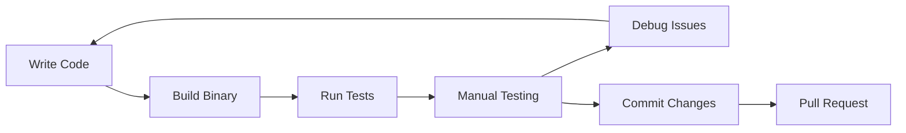

# Local Development Guide

This guide walks you through cloning, building, running, and debugging OpenFrame CLI locally. You'll learn the development workflow, testing practices, and debugging techniques.

## Prerequisites

Ensure you've completed the [Environment Setup](./environment.md) before proceeding with local development.

## Clone and Setup

### 1. Clone the Repository

```bash
# Clone the repository
git clone https://github.com/flamingo-stack/openframe-cli.git
cd openframe-cli

# Set up Git configuration
git config user.name "Your Name"
git config user.email "your.email@example.com"

# Create a feature branch
git checkout -b feature/your-feature-name
```

### 2. Initialize Dependencies

```bash
# Initialize Go modules
go mod download
go mod verify

# Install development tools
make install-tools

# Set up pre-commit hooks (optional)
pre-commit install
```

### 3. Verify Setup

```bash
# Run environment check
./scripts/check-dev-env.sh

# Verify build
make build

# Quick test
./bin/openframe --help
```

## Build Process

### Development Build

```bash
# Standard build
go build -o openframe ./cmd

# Development build with debugging symbols
go build -gcflags="all=-N -l" -o openframe ./cmd

# Build for specific platform
GOOS=linux GOARCH=amd64 go build -o openframe-linux ./cmd
GOOS=darwin GOARCH=amd64 go build -o openframe-darwin ./cmd
GOOS=windows GOARCH=amd64 go build -o openframe.exe ./cmd
```

### Using Makefile

```bash
# Build optimized binary
make build

# Build and install to GOPATH/bin
make install

# Clean build artifacts
make clean

# Development build with live reload
make dev
```

### Build Verification

```bash
# Check binary info
file ./bin/openframe
./bin/openframe version

# Test core commands
./bin/openframe cluster --help
./bin/openframe bootstrap --help
```

## Running Locally

### Basic Commands

```bash
# Run from source without building
go run ./cmd cluster --help

# Run built binary
./bin/openframe cluster create test-cluster

# Run with debugging enabled
OPENFRAME_DEBUG=true ./bin/openframe bootstrap test-cluster --verbose
```

### Development Workflow



### Hot Reload Development

For rapid development, use a file watcher:

```bash
# Install air for hot reloading
go install github.com/cosmtrek/air@latest

# Create .air.toml configuration
cat > .air.toml << EOF
root = "."
tmp_dir = "tmp"

[build]
  cmd = "go build -o ./tmp/openframe ./cmd"
  bin = "./tmp/openframe"
  full_bin = "./tmp/openframe cluster create dev-cluster --dry-run"
  include_ext = ["go", "tpl", "tmpl", "html"]
  exclude_dir = ["tmp", "vendor", "node_modules"]
  include_dir = []
  exclude_file = []
  log = "build-errors.log"
  delay = 1000

[color]
  main = "magenta"
  watcher = "cyan"
  build = "yellow"
  runner = "green"

[log]
  time = false

[misc]
  clean_on_exit = true
EOF

# Start hot reloading
air
```

## Testing Locally

### Unit Tests

```bash
# Run all tests
go test ./...

# Run tests with coverage
go test ./... -coverprofile=coverage.out
go tool cover -html=coverage.out -o coverage.html

# Run specific package tests
go test ./internal/cluster/...

# Run tests with verbose output
go test -v ./...

# Run tests matching pattern
go test -run TestClusterCreate ./internal/cluster/...
```

### Integration Tests

```bash
# Run integration tests (requires Docker)
go test -tags=integration ./...

# Run integration tests for specific package
go test -tags=integration ./internal/cluster/...

# Run integration tests with verbose output
go test -tags=integration -v ./...
```

### Testing with Different Configurations

```bash
# Test with different deployment modes
./bin/openframe bootstrap test1 --deployment-mode=oss-tenant --dry-run
./bin/openframe bootstrap test2 --deployment-mode=saas-tenant --dry-run

# Test non-interactive mode
./bin/openframe bootstrap test3 --non-interactive --deployment-mode=oss-tenant

# Test error conditions
./bin/openframe cluster create "" # Empty name
./bin/openframe cluster delete non-existent # Non-existent cluster
```

## Debug Configuration

### VS Code Debugging

#### Launch Configuration

Update `.vscode/launch.json` with comprehensive debug configurations:

```json
{
  "version": "0.2.0",
  "configurations": [
    {
      "name": "Debug Bootstrap",
      "type": "go",
      "request": "launch",
      "mode": "auto",
      "program": "${workspaceFolder}/cmd",
      "args": ["bootstrap", "debug-cluster", "--deployment-mode=oss-tenant", "--verbose"],
      "env": {
        "OPENFRAME_DEBUG": "true",
        "OPENFRAME_LOG_LEVEL": "debug"
      },
      "console": "integratedTerminal",
      "stopOnEntry": false,
      "cwd": "${workspaceFolder}"
    },
    {
      "name": "Debug Cluster Create",
      "type": "go",
      "request": "launch",
      "mode": "auto",
      "program": "${workspaceFolder}/cmd",
      "args": ["cluster", "create", "debug-cluster", "--verbose"],
      "env": {
        "OPENFRAME_DEBUG": "true"
      },
      "console": "integratedTerminal"
    },
    {
      "name": "Debug Chart Install",
      "type": "go",
      "request": "launch",
      "mode": "auto",
      "program": "${workspaceFolder}/cmd",
      "args": ["chart", "install", "debug-cluster", "--verbose"],
      "env": {
        "OPENFRAME_DEBUG": "true"
      },
      "console": "integratedTerminal"
    },
    {
      "name": "Debug Tests",
      "type": "go",
      "request": "launch",
      "mode": "test",
      "program": "${workspaceFolder}/internal/cluster",
      "args": ["-test.v", "-test.run", "TestClusterCreate"],
      "console": "integratedTerminal"
    },
    {
      "name": "Attach to Process",
      "type": "go",
      "request": "attach",
      "mode": "local",
      "processId": 0
    }
  ]
}
```

#### Debugging Steps

1. **Set Breakpoints**: Click in the gutter next to line numbers
2. **Start Debug Session**: Press F5 or select debug configuration
3. **Step Through Code**: Use F10 (step over), F11 (step into), F12 (step out)
4. **Inspect Variables**: Hover over variables or use the Variables panel
5. **Debug Console**: Execute Go expressions during debugging

### Command Line Debugging

#### Using Delve (dlv)

```bash
# Install Delve debugger
go install github.com/go-delve/delve/cmd/dlv@latest

# Debug a specific command
dlv debug ./cmd -- bootstrap debug-cluster --deployment-mode=oss-tenant

# Debug tests
dlv test ./internal/cluster -- -test.run TestClusterCreate

# Debug with breakpoints
dlv debug ./cmd
(dlv) break main.main
(dlv) continue
```

#### Debug with Environment Variables

```bash
# Enable detailed logging
export OPENFRAME_DEBUG=true
export OPENFRAME_LOG_LEVEL=debug
export OPENFRAME_TRACE_REQUESTS=true

# Run with debugging
./bin/openframe cluster create debug-cluster --verbose
```

### GoLand/IntelliJ Debugging

1. **Create Run Configuration**: Run → Edit Configurations
2. **Set Program Arguments**: Add command line arguments
3. **Set Environment Variables**: Configure debugging variables
4. **Set Breakpoints**: Click in gutter or Ctrl+F8
5. **Start Debugging**: Click debug icon or Shift+F9

## Development Commands

### Quick Development Tasks

```bash
# Format code
make format
gofmt -w .
goimports -w .

# Lint code
make lint
golangci-lint run

# Check for security issues
gosec ./...

# Check for outdated dependencies
go list -u -m all

# Update dependencies
go get -u ./...
go mod tidy
```

### Testing Commands

```bash
# Run tests with race detection
go test -race ./...

# Run benchmarks
go test -bench=. ./...

# Test coverage by package
go test ./internal/cluster -coverprofile=cluster.out
go tool cover -func=cluster.out

# Generate test mocks (if using gomock)
mockgen -source=internal/cluster/interfaces.go -destination=internal/cluster/mocks/mock.go
```

### Development Utilities

```bash
# Generate Go documentation locally
godoc -http=:6060
# Open http://localhost:6060 in browser

# Profile CPU usage
go test -cpuprofile=cpu.prof ./internal/cluster
go tool pprof cpu.prof

# Profile memory usage
go test -memprofile=mem.prof ./internal/cluster
go tool pprof mem.prof

# Check Go module dependencies
go mod graph | grep openframe
```

## Local Testing Workflows

### Cluster Lifecycle Testing

```bash
# Test complete cluster lifecycle
./bin/openframe cluster create test-cluster --verbose
./bin/openframe cluster status test-cluster
./bin/openframe cluster list
kubectl get nodes
./bin/openframe cluster delete test-cluster
./bin/openframe cluster cleanup
```

### Bootstrap Testing

```bash
# Test bootstrap with different modes
./bin/openframe bootstrap test-oss --deployment-mode=oss-tenant --verbose
./bin/openframe bootstrap test-saas --deployment-mode=saas-tenant --verbose

# Test non-interactive mode
./bin/openframe bootstrap test-ci --deployment-mode=oss-tenant --non-interactive

# Clean up test clusters
./bin/openframe cluster delete test-oss
./bin/openframe cluster delete test-saas
./bin/openframe cluster delete test-ci
```

### Chart Installation Testing

```bash
# Create cluster first
./bin/openframe cluster create chart-test

# Test chart installation
./bin/openframe chart install chart-test --verbose

# Verify ArgoCD installation
kubectl get pods -n argocd
kubectl get applications -n argocd

# Clean up
./bin/openframe cluster delete chart-test
```

## Watch Mode Development

### File Watching Script

Create `scripts/dev-watch.sh`:

```bash
#!/bin/bash
set -e

echo "🔧 Starting OpenFrame CLI development watch mode..."

# Function to rebuild and test
rebuild() {
    echo "🔨 Rebuilding..."
    if go build -o bin/openframe ./cmd; then
        echo "✅ Build successful"
        
        # Run basic validation
        if ./bin/openframe --help > /dev/null 2>&1; then
            echo "✅ Basic validation passed"
        else
            echo "❌ Basic validation failed"
        fi
        
        # Run unit tests
        if go test ./... -short; then
            echo "✅ Tests passed"
        else
            echo "❌ Tests failed"
        fi
    else
        echo "❌ Build failed"
    fi
    echo ""
}

# Initial build
rebuild

# Watch for changes
if command -v fswatch &> /dev/null; then
    fswatch -o . --exclude="\.git" --exclude="bin/" --exclude="tmp/" | while read; do
        rebuild
    done
else
    echo "Install fswatch for automatic rebuilding: brew install fswatch"
fi
```

### Auto-testing Script

Create `scripts/auto-test.sh`:

```bash
#!/bin/bash
set -e

# Continuous testing script
while true; do
    echo "Running tests..."
    go test ./... -short
    echo "Tests complete. Waiting for file changes..."
    
    # Wait for Go file changes
    inotifywait -qq -r -e modify --include='\.go$' .
done
```

## Performance Optimization

### Build Optimization

```bash
# Optimized build for production
go build -ldflags="-s -w" -o openframe-optimized ./cmd

# Build with version information
VERSION=$(git describe --tags --always)
COMMIT=$(git rev-parse HEAD)
DATE=$(date -u +%Y-%m-%dT%H:%M:%SZ)

go build -ldflags="-s -w -X main.version=$VERSION -X main.commit=$COMMIT -X main.date=$DATE" -o openframe ./cmd
```

### Profile-Guided Optimization

```bash
# Generate CPU profile
go test -cpuprofile=cpu.prof ./...

# Build with PGO (Go 1.21+)
go build -pgo=cpu.prof -o openframe-pgo ./cmd
```

## Troubleshooting Development Issues

### Common Build Issues

#### Missing Dependencies
```bash
# Clean and rebuild modules
go clean -modcache
go mod download
go mod verify
```

#### Build Cache Issues
```bash
# Clean build cache
go clean -cache
go clean -testcache
```

### Common Runtime Issues

#### Docker Connection Issues
```bash
# Check Docker daemon
docker info

# Check Docker socket permissions
ls -la /var/run/docker.sock
sudo chmod 666 /var/run/docker.sock  # Temporary fix
```

#### K3d Issues
```bash
# Check K3d version compatibility
k3d --version

# List and clean existing clusters
k3d cluster list
k3d cluster delete --all
```

#### Kubernetes Context Issues
```bash
# Check current context
kubectl config current-context

# List all contexts
kubectl config get-contexts

# Reset context if needed
kubectl config use-context k3d-test-cluster
```

## Next Steps

With local development set up:

1. **[Architecture Overview](../architecture/overview.md)** - Understand the codebase structure
2. **[Testing Overview](../testing/overview.md)** - Learn testing practices
3. **[Contributing Guidelines](../contributing/guidelines.md)** - Prepare for contributions

## Development Checklist

Before making changes, ensure:

- [ ] Environment is properly configured
- [ ] Code builds successfully (`make build`)
- [ ] Tests pass (`make test`)
- [ ] Code is formatted (`make format`)
- [ ] Linting passes (`make lint`)
- [ ] Manual testing completed
- [ ] Documentation updated if needed

---

> **💡 Pro Tip**: Use the watch mode and hot reloading during development for immediate feedback. Set up debugging breakpoints early to understand code flow and data structures.

You're now ready for productive OpenFrame CLI development! The debugging and testing setup will help you contribute effectively to the project.