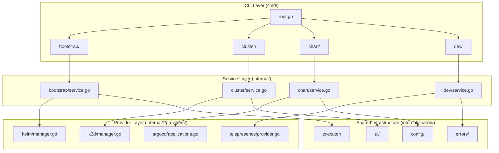
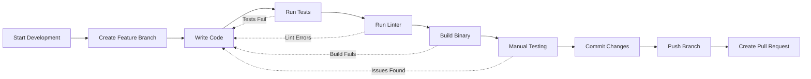

# Local Development Guide

This guide walks you through setting up OpenFrame CLI for local development, including cloning the repository, building from source, running locally, and using hot reload for efficient development cycles.

> **Prerequisites**: Complete [Environment Setup](environment.md) before proceeding.

## 🎯 Overview

Local development allows you to:
- Build and run OpenFrame CLI from source
- Test changes immediately without releases
- Debug issues with full source access
- Contribute features and bug fixes
- Understand the codebase through hands-on exploration

## 📥 Repository Setup

### Clone the Repository

```bash
# Clone the main repository
git clone https://github.com/flamingo-stack/openframe-cli.git
cd openframe-cli

# Set up upstream remote for contributions
git remote add upstream https://github.com/flamingo-stack/openframe-cli.git
git fetch upstream

# Verify remotes
git remote -v
```

### Explore the Project Structure

```text
openframe-cli/
├── cmd/                    # Command definitions (Cobra)
│   ├── bootstrap/          # Bootstrap command
│   ├── cluster/           # Cluster management commands
│   ├── chart/             # Chart management commands
│   ├── dev/               # Development commands
│   └── root.go            # Root command definition
├── internal/              # Internal packages (not importable)
│   ├── bootstrap/         # Bootstrap service logic
│   ├── cluster/           # Cluster management services
│   ├── chart/             # Chart management services  
│   ├── dev/               # Development services
│   └── shared/            # Shared utilities and infrastructure
├── tests/                 # Test files and utilities
│   ├── integration/       # Integration tests
│   ├── mocks/             # Test mocks
│   └── testutil/          # Test utilities
├── docs/                  # Documentation
├── scripts/               # Build and automation scripts
├── main.go                # Application entry point
├── go.mod                 # Go module definition
├── go.sum                 # Go module checksums
├── Makefile              # Build automation
└── README.md             # Project overview
```

### Understand the Architecture



## 🔨 Building from Source

### Initial Setup

```bash
# Navigate to project directory
cd openframe-cli

# Download dependencies
go mod download

# Verify everything is working
go mod tidy
go mod verify
```

### Build Commands

```bash
# Basic build
go build -o openframe main.go

# Build with version information
VERSION=$(git describe --tags --always)
COMMIT=$(git rev-parse --short HEAD)
DATE=$(date -u +"%Y-%m-%dT%H:%M:%SZ")

go build -ldflags "-X main.Version=$VERSION -X main.Commit=$COMMIT -X main.Date=$DATE" -o openframe main.go

# Build using Makefile (recommended)
make build

# Cross-platform builds
GOOS=linux GOARCH=amd64 go build -o openframe-linux main.go
GOOS=darwin GOARCH=amd64 go build -o openframe-macos main.go
GOOS=windows GOARCH=amd64 go build -o openframe.exe main.go
```

### Verify Build

```bash
# Test the binary
./openframe --version
./openframe --help

# Test basic functionality
./openframe cluster --help
./openframe bootstrap --help
```

## 🚀 Running Locally

### Basic Local Execution

```bash
# Run directly with go run
go run main.go --help
go run main.go cluster list
go run main.go bootstrap --dry-run

# Run compiled binary
./openframe cluster create test-cluster --verbose
./openframe dev intercept
```

### Development with Hot Reload

For rapid development, use `air` for automatic rebuilds:

```bash
# Install air
go install github.com/cosmtrek/air@latest

# Create air configuration
cat > .air.toml << EOF
root = "."
testdata_dir = "testdata"
tmp_dir = "tmp"

[build]
  args_bin = ["--help"]
  bin = "./tmp/openframe"
  cmd = "go build -o ./tmp/openframe main.go"
  delay = 1000
  exclude_dir = ["assets", "tmp", "vendor", "testdata", "docs"]
  exclude_file = []
  exclude_regex = ["_test.go"]
  exclude_unchanged = false
  follow_symlink = false
  full_bin = ""
  include_dir = []
  include_ext = ["go", "tpl", "tmpl", "html"]
  kill_delay = "0s"
  log = "build-errors.log"
  send_interrupt = false
  stop_on_root = false

[color]
  app = ""
  build = "yellow"
  main = "magenta"
  runner = "green"
  watcher = "cyan"

[log]
  time = false

[misc]
  clean_on_exit = false

[screen]
  clear_on_rebuild = false
EOF

# Start hot reload development
air
```

### Development Environment Variables

```bash
# Create development environment
cat > .env.dev << EOF
OPENFRAME_LOG_LEVEL=debug
OPENFRAME_DEV_MODE=true
OPENFRAME_CONFIG_DIR=./.openframe-dev
KUBECONFIG=~/.kube/config
DOCKER_HOST=unix:///var/run/docker.sock
EOF

# Source development environment
export $(cat .env.dev | xargs)

# Run with development settings
go run main.go bootstrap my-dev-cluster --verbose
```

## 🔧 Development Workflow

### Feature Development Cycle



### Daily Development Commands

```bash
# 1. Start development session
git checkout main
git pull upstream main
git checkout -b feature/my-new-feature

# 2. Development cycle
make deps          # Update dependencies
make lint          # Check code quality
make test          # Run tests
make build         # Build binary
./openframe --help # Test manually

# 3. Continuous development
# Edit code...
go run main.go cluster create test --dry-run
# Edit more code...
make test
# Repeat...

# 4. Pre-commit validation
make all           # Run all checks
git add .
git commit -m "feat: add new cluster provider"
git push origin feature/my-new-feature
```

### Testing Local Changes

#### Unit Testing

```bash
# Run all tests
make test

# Run specific package tests
go test ./internal/cluster/...
go test ./cmd/bootstrap/...

# Run tests with coverage
make coverage
open coverage.html

# Run tests with race detection
go test -race ./...

# Verbose test output
go test -v ./internal/cluster/service_test.go
```

#### Integration Testing

```bash
# Set up test environment
export OPENFRAME_TEST_MODE=true
k3d cluster create openframe-test --agents 2

# Run integration tests
go test -tags=integration ./tests/integration/...

# Clean up
k3d cluster delete openframe-test
```

#### Manual Testing

```bash
# Test cluster operations
./openframe cluster create test-manual --verbose
./openframe cluster status test-manual
./openframe cluster delete test-manual

# Test bootstrap process
./openframe bootstrap test-bootstrap --deployment-mode oss-tenant --verbose
./openframe cluster cleanup test-bootstrap

# Test development features
./openframe dev scaffold test-app
./openframe dev intercept
```

## 🐛 Debugging

### IDE Debugging

#### VS Code Debugging

1. **Set breakpoints** in your source code
2. **Use debug configurations** from `.vscode/launch.json`
3. **Start debugging** with F5 or from Debug panel

#### GoLand Debugging

1. **Create run configuration** for `main.go`
2. **Set breakpoints** in source code
3. **Debug** with the debugger panel

### Command Line Debugging

```bash
# Build with debug info
go build -gcflags="all=-N -l" -o openframe-debug main.go

# Run with Delve debugger
dlv exec ./openframe-debug -- cluster create test --verbose

# Debug specific test
dlv test ./internal/cluster -- -test.run TestClusterCreate
```

### Debugging Tips

```bash
# Enable verbose logging
export OPENFRAME_LOG_LEVEL=debug
go run main.go bootstrap test-cluster --verbose

# Debug with dry-run mode
go run main.go cluster create test --dry-run --verbose

# Add debug prints in code
import "log"
log.Printf("Debug: variable value = %v", myVariable)

# Use debugger-friendly build
go build -gcflags="all=-N -l" main.go
```

## 🧪 Testing Changes

### Local Testing Strategy

1. **Unit Tests**: Test individual functions and methods
2. **Integration Tests**: Test complete workflows  
3. **Manual Testing**: Test real-world scenarios
4. **Performance Testing**: Validate performance characteristics

### Test Scenarios

```bash
# Test cluster lifecycle
./openframe cluster create test-lifecycle
./openframe cluster status test-lifecycle
./openframe chart install --cluster test-lifecycle
./openframe cluster delete test-lifecycle

# Test bootstrap with different modes
./openframe bootstrap test-oss --deployment-mode oss-tenant
./openframe bootstrap test-saas --deployment-mode saas-tenant

# Test development workflows
./openframe dev scaffold test-app
cd test-app
./openframe dev intercept
```

### Validation Checklist

- [ ] **Build Success**: `make build` completes without errors
- [ ] **Tests Pass**: `make test` runs successfully
- [ ] **Linting Clean**: `make lint` shows no issues
- [ ] **Manual Testing**: Core workflows function correctly
- [ ] **Performance**: Commands complete in reasonable time
- [ ] **Documentation**: Changes are documented appropriately

## 🔄 Development Best Practices

### Code Organization

```bash
# Follow package structure
internal/
├── cluster/           # Cluster domain
│   ├── service.go    # Main service interface
│   ├── models/       # Domain models
│   ├── providers/    # External integrations  
│   └── ui/           # User interface components
├── shared/           # Shared utilities
│   ├── executor/     # Command execution
│   ├── ui/          # Common UI components
│   └── config/      # Configuration management
```

### Error Handling

```go
// Follow consistent error handling patterns
func (s *ClusterService) CreateCluster(name string) error {
    if err := s.validateName(name); err != nil {
        return fmt.Errorf("invalid cluster name: %w", err)
    }
    
    if err := s.provider.Create(name); err != nil {
        return fmt.Errorf("failed to create cluster %s: %w", name, err)
    }
    
    return nil
}
```

### Testing Patterns

```go
// Use table-driven tests
func TestClusterService_CreateCluster(t *testing.T) {
    tests := []struct {
        name        string
        clusterName string
        wantErr     bool
    }{
        {"valid name", "test-cluster", false},
        {"empty name", "", true},
        {"invalid chars", "test_cluster", true},
    }
    
    for _, tt := range tests {
        t.Run(tt.name, func(t *testing.T) {
            // Test implementation
        })
    }
}
```

## 🚀 Advanced Development

### Custom Build Scripts

```bash
# Create custom build script
cat > scripts/build.sh << 'EOF'
#!/bin/bash
set -e

VERSION=${1:-"dev"}
COMMIT=$(git rev-parse --short HEAD)
DATE=$(date -u +"%Y-%m-%dT%H:%M:%SZ")

echo "Building OpenFrame CLI v$VERSION ($COMMIT)"

go build \
  -ldflags "-X main.Version=$VERSION -X main.Commit=$COMMIT -X main.Date=$DATE" \
  -o dist/openframe \
  main.go

echo "Build complete: dist/openframe"
EOF

chmod +x scripts/build.sh
./scripts/build.sh v1.0.0
```

### Development Docker Environment

```dockerfile
# Dockerfile.dev
FROM golang:1.21-alpine AS builder

WORKDIR /app
COPY go.mod go.sum ./
RUN go mod download

COPY . .
RUN go build -o openframe main.go

FROM alpine:latest
RUN apk add --no-cache ca-certificates docker kubectl helm git
WORKDIR /root/
COPY --from=builder /app/openframe .
CMD ["./openframe"]
```

```bash
# Build development image
docker build -f Dockerfile.dev -t openframe:dev .

# Run in container
docker run -it --rm \
  -v /var/run/docker.sock:/var/run/docker.sock \
  -v ~/.kube:/root/.kube \
  openframe:dev bootstrap test-container
```

## 🔍 Troubleshooting

### Common Development Issues

| Issue | Symptom | Solution |
|-------|---------|----------|
| **Import errors** | `package not found` | Run `go mod tidy && go mod download` |
| **Build failures** | Compilation errors | Check Go version, verify dependencies |
| **Test failures** | Tests fail locally | Ensure test environment is clean |
| **Permission errors** | Docker/kubectl access denied | Check user permissions and groups |

### Debugging Build Issues

```bash
# Clean build environment
go clean -cache -modcache -testcache
rm -f openframe

# Rebuild from scratch
go mod download
go mod verify
make build

# Check for dependency issues
go mod graph | grep -E "(duplicate|conflict)"
```

## 📚 Next Steps

Now that you have local development set up:

1. **[Architecture Overview](../architecture/overview.md)** - Understand the codebase structure
2. **[Testing Overview](../testing/overview.md)** - Learn the testing strategies
3. **[Contributing Guidelines](../contributing/guidelines.md)** - Prepare to contribute

---

*Ready to understand how OpenFrame CLI works under the hood? Let's explore the [architecture overview](../architecture/overview.md)!*