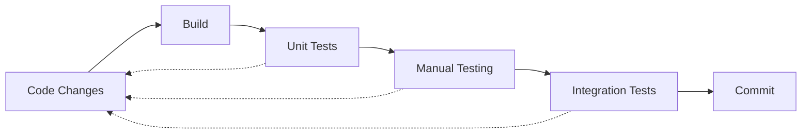

# Local Development Guide

This guide walks you through cloning, building, and running OpenFrame CLI locally for development and testing. Perfect for contributors and developers who want to modify or extend OpenFrame CLI.

## Clone and Setup

### Clone the Repository

```bash
# Clone the main repository
git clone https://github.com/flamingo-stack/openframe-cli.git
cd openframe-cli

# Check project structure
ls -la
# Expected: cmd/, internal/, docs/, go.mod, Makefile, etc.

# Verify you're on the main branch
git branch -a
git status
```

### Initialize Development Environment

```bash
# Download Go dependencies
go mod download

# Verify dependencies
go mod verify

# Check Go module status
go mod tidy
```

### Project Structure Overview

```
openframe-cli/
├── cmd/                    # Command definitions (CLI entry points)
│   ├── bootstrap/          # Bootstrap command implementation  
│   ├── cluster/            # Cluster management commands
│   ├── chart/              # Chart installation commands
│   └── dev/                # Development workflow commands
├── internal/               # Internal packages (business logic)
│   ├── bootstrap/          # Bootstrap service
│   ├── cluster/            # Cluster management services
│   ├── chart/              # Chart installation services
│   ├── dev/                # Development tools integration
│   └── shared/             # Shared utilities and components
├── docs/                   # Documentation (what you're reading!)
├── scripts/                # Build and automation scripts
├── tests/                  # Integration and end-to-end tests
├── go.mod                  # Go module definition
├── go.sum                  # Go module checksums
├── Makefile               # Build automation
└── main.go                # Application entry point
```

## Building the Project

### Using Make (Recommended)

The project uses Make for build automation:

```bash
# Build for your current platform
make build

# Build for all platforms
make build-all

# Build with debug information
make build-debug

# Clean build artifacts
make clean
```

### Manual Build Commands

If Make is not available, use Go directly:

```bash
# Build for current platform
go build -o bin/openframe ./

# Build with version information
go build -ldflags "-X main.version=dev-$(git rev-parse --short HEAD)" -o bin/openframe ./

# Cross-compile for different platforms
GOOS=linux GOARCH=amd64 go build -o bin/openframe-linux-amd64 ./
GOOS=darwin GOARCH=amd64 go build -o bin/openframe-darwin-amd64 ./
GOOS=darwin GOARCH=arm64 go build -o bin/openframe-darwin-arm64 ./
GOOS=windows GOARCH=amd64 go build -o bin/openframe-windows-amd64.exe ./
```

### Build Verification

```bash
# Check the built binary
ls -la bin/
file bin/openframe  # Check binary type

# Test basic functionality
./bin/openframe --version
./bin/openframe --help

# Verify command structure
./bin/openframe cluster --help
./bin/openframe bootstrap --help
```

## Running Locally

### Basic Local Execution

```bash
# Run OpenFrame CLI from source
go run . --help

# Run specific commands
go run . cluster list
go run . cluster create --help

# Run with debug logging
OPENFRAME_LOG_LEVEL=debug go run . cluster list
```

### Using the Built Binary

```bash
# Run built binary
./bin/openframe --help

# Test cluster commands (dry run)
./bin/openframe cluster list

# Test with verbose output
./bin/openframe cluster list --verbose
```

### Development Mode Features

Enable development mode for additional debugging:

```bash
# Set development environment variables
export OPENFRAME_DEV_MODE=true
export OPENFRAME_LOG_LEVEL=debug

# Run with development features enabled
./bin/openframe bootstrap --verbose
```

## Hot Reload Development

### Using Air for Hot Reload

Install Air for automatic rebuilds during development:

```bash
# Install Air
go install github.com/air-verse/air@latest

# Create Air configuration
cat > .air.toml << 'EOF'
root = "."
testdata_dir = "testdata"
tmp_dir = "tmp"

[build]
  args_bin = ["cluster", "list"]
  bin = "./tmp/main"
  cmd = "go build -o ./tmp/main ."
  delay = 1000
  exclude_dir = ["assets", "tmp", "vendor", "testdata", "bin"]
  exclude_file = []
  exclude_regex = ["_test.go"]
  exclude_unchanged = false
  follow_symlink = false
  full_bin = ""
  include_dir = []
  include_ext = ["go", "tpl", "tmpl", "html"]
  kill_delay = "0s"
  log = "build-errors.log"
  send_interrupt = false
  stop_on_root = false

[color]
  app = ""
  build = "yellow"
  main = "magenta"
  runner = "green"
  watcher = "cyan"

[log]
  time = false

[misc]
  clean_on_exit = false

[screen]
  clear_on_rebuild = false
EOF

# Run with hot reload
air
```

### Alternative: Simple Watch Script

Create a simple watch script for rebuilds:

```bash
#!/bin/bash
# save as scripts/watch.sh

echo "Watching for changes..."

while inotifywait -e modify,create,delete -r . --exclude '(\.git|bin|tmp)'; do
    echo "Changes detected, rebuilding..."
    make build
    echo "Build complete. Testing..."
    ./bin/openframe --version
    echo "Ready for testing."
done
```

## Debug Configuration

### VS Code Debugging

Use the debug configuration from the [Environment Setup](./environment.md) guide:

```bash
# Set breakpoints in VS Code
# Press F5 to start debugging
# Use debug console to inspect variables
```

### Command-Line Debugging with Delve

```bash
# Install Delve debugger
go install github.com/go-delve/delve/cmd/dlv@latest

# Debug specific command
dlv debug -- cluster create debug-test

# Debug with arguments
dlv debug -- bootstrap --deployment-mode=oss-tenant --verbose

# Delve commands:
# (dlv) break main.main
# (dlv) continue
# (dlv) step
# (dlv) print <variable>
# (dlv) quit
```

### Debug Environment Variables

```bash
# Enable comprehensive debug output
export OPENFRAME_LOG_LEVEL=debug
export OPENFRAME_DEV_MODE=true
export GODEBUG=gctrace=1        # GC tracing
export GOTRACEBACK=all          # Full stack traces

# Run with debug output
./bin/openframe cluster create test --verbose
```

## Testing During Development

### Unit Tests

```bash
# Run all unit tests
go test ./...

# Run tests with verbose output
go test -v ./...

# Run tests for specific package
go test ./cmd/cluster/...
go test ./internal/bootstrap/...

# Run tests with coverage
go test -cover ./...
go test -coverprofile=coverage.out ./...
go tool cover -html=coverage.out  # View coverage in browser
```

### Integration Tests

```bash
# Run integration tests (requires Docker)
make test-integration

# Run specific integration test
go test -tags=integration ./tests/integration/...

# Skip integration tests during unit testing
go test -short ./...
```

### Manual Testing Workflows

```bash
# Test cluster lifecycle
./bin/openframe cluster create test-local
./bin/openframe cluster status test-local
./bin/openframe cluster list
./bin/openframe cluster delete test-local

# Test bootstrap workflow
./bin/openframe bootstrap test-bootstrap --deployment-mode=oss-tenant
./bin/openframe cluster delete test-bootstrap

# Test chart installation
./bin/openframe cluster create chart-test
./bin/openframe chart install chart-test
./bin/openframe cluster delete chart-test
```

## Development Workflow

### Typical Development Cycle



### Development Commands

```bash
# 1. Make changes to code
vim cmd/cluster/create.go

# 2. Build and test
make build
make test

# 3. Manual testing
./bin/openframe cluster create manual-test
./bin/openframe cluster delete manual-test

# 4. Run linting
make lint

# 5. Commit changes
git add .
git commit -m "feature: improve cluster creation UX"
```

### Debugging Common Development Issues

#### Build Failures

```bash
# Clear build cache
go clean -cache

# Update dependencies
go mod tidy
go mod download

# Check for syntax errors
go fmt ./...
go vet ./...
```

#### Import Path Issues

```bash
# Verify module name in go.mod
cat go.mod | grep module

# Check import statements match module structure
grep -r "github.com/flamingo-stack/openframe-cli" .
```

#### Runtime Issues

```bash
# Use debug mode
OPENFRAME_LOG_LEVEL=debug ./bin/openframe cluster create debug-test

# Check for race conditions
go run -race . cluster create race-test

# Memory profiling
go build -ldflags "-X main.memProfile=true" .
./openframe cluster create profile-test
# Analyze profile.mem file
```

## Working with External Dependencies

### K3d Integration

```bash
# Test K3d integration locally
k3d cluster create dev-test
export KUBECONFIG=$(k3d kubeconfig write dev-test)

# Test OpenFrame with existing cluster
./bin/openframe chart install dev-test

# Cleanup
k3d cluster delete dev-test
```

### ArgoCD Integration

```bash
# Test ArgoCD installation
./bin/openframe cluster create argocd-test
./bin/openframe chart install argocd-test

# Access ArgoCD
kubectl port-forward -n argocd svc/argocd-server 8080:80 &

# Test ArgoCD API
curl -k https://localhost:8080/api/v1/applications

# Cleanup
kill %1  # Stop port-forward
./bin/openframe cluster delete argocd-test
```

## Performance Optimization

### Build Optimization

```bash
# Build with optimizations
go build -ldflags "-s -w" -o bin/openframe-optimized ./

# Compare binary sizes
ls -lh bin/openframe*

# Profile build times
time make build
```

### Runtime Performance

```bash
# CPU profiling
go build -ldflags "-X main.cpuProfile=true" .
./openframe cluster create profile-test
# Analyze cpu.pprof file

# Memory usage
./bin/openframe cluster create memory-test
# Monitor with: ps aux | grep openframe
```

## Next Steps

After setting up local development:

1. **[Review Architecture Overview](../architecture/overview.md)** to understand the codebase structure
2. **[Read Testing Guide](../testing/overview.md)** to learn about test patterns and coverage
3. **[Check Contributing Guidelines](../contributing/guidelines.md)** before submitting pull requests

## Troubleshooting

### Common Issues and Solutions

| Issue | Solution |
|-------|----------|
| **Build fails with "module not found"** | Run `go mod tidy && go mod download` |
| **Binary doesn't run** | Check file permissions: `chmod +x bin/openframe` |
| **Tests fail in CI but pass locally** | Check Go version consistency, run `go mod tidy` |
| **K3d tests fail** | Ensure Docker is running: `docker ps` |

### Getting Help

- **Check the logs**: Use `--verbose` flag for detailed output
- **Search existing issues**: Look for similar problems on GitHub
- **Ask the community**: Open a discussion for development questions

---

You're now ready to develop and test OpenFrame CLI locally! Happy coding! 🚀